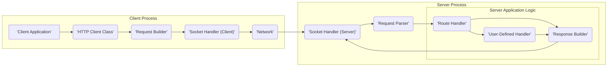

# Project Design Document: cpp-httplib

**Version:** 1.1
**Date:** October 26, 2023
**Author:** AI Software Architect

## 1. Introduction

This document provides a detailed architectural design of the `cpp-httplib` project, a header-only C++ library for creating HTTP clients and servers. This document aims to provide a comprehensive understanding of the library's structure, components, and data flow, which will serve as the basis for subsequent threat modeling activities. This revision includes clarifications and more detail to better facilitate the threat modeling process.

## 2. Project Overview

`cpp-httplib` is a lightweight, cross-platform C++ library that simplifies the process of building HTTP clients and servers. Its header-only nature eliminates the need for separate compilation or linking, making integration into existing C++ projects straightforward. The library supports a range of HTTP functionalities, including:

*   Support for standard HTTP methods: GET, POST, PUT, DELETE, OPTIONS, PATCH, HEAD, CONNECT, TRACE.
*   Comprehensive request and response header manipulation capabilities.
*   Flexible request and response body handling, including streaming.
*   Secure communication via SSL/TLS, leveraging either OpenSSL or mbedTLS.
*   Implementation of basic authentication schemes.
*   Mechanisms for handling file uploads and downloads efficiently.
*   Support for persistent connections (keep-alive) to improve performance.
*   Dual functionality, enabling the creation of both HTTP clients and servers within the same library.

## 3. Architectural Design

The library is designed with a clear separation of concerns, particularly between client and server functionalities. The core of the library manages the fundamental aspects of the HTTP protocol, such as parsing and message construction.

### 3.1. High-Level Architecture Diagram

### 3.2. Component Description

*   **'Client Application':** The user's C++ application code that utilizes the `cpp-httplib` library to initiate and manage HTTP requests.
*   **'HTTP Client Class':** Provides the primary programmatic interface for making HTTP requests. It encapsulates the logic for request construction, sending, and response reception. This class handles connection management and basic error handling for client operations.
*   **'Request Builder':**  A component responsible for constructing well-formed HTTP request messages. This includes setting the HTTP method, target URI, headers, and request body. It might offer methods for setting common headers and handling different body types (e.g., form data, JSON).
*   **'Socket Handler (Client)':** Manages the underlying network socket for client-side communication. This component handles establishing connections to remote servers, sending request data, receiving response data, and closing connections. It may also implement logic for connection pooling and keep-alive management.
*   **'Network':** Represents the underlying network infrastructure over which HTTP communication occurs. This is an external entity from the library's perspective.
*   **'Socket Handler (Server)':** Manages the underlying network socket for server-side communication. This component listens for incoming connection requests, accepts new connections, and manages the communication lifecycle for each connected client.
*   **'Request Parser':**  Responsible for parsing raw HTTP request messages received from the network into a structured format that can be easily processed by the server application. This includes extracting the HTTP method, URI, headers, and body. Robust error handling and security checks are crucial in this component.
*   **'Route Handler':**  A central component in the server that maps incoming requests to specific handler functions based on the request method and the requested URI path. This component typically uses a routing table or similar mechanism to perform the mapping.
*   **'User-Defined Handler':** Represents the application-specific logic that is executed when a matching route is found. This is where the core business logic of the server resides (not part of `cpp-httplib` itself, but the code that *uses* `cpp-httplib`).
*   **'Response Builder':**  Responsible for constructing well-formed HTTP response messages. This includes setting the HTTP status code, response headers, and response body. It may offer methods for setting common headers and handling different body types.

### 3.3. Data Flow

#### 3.3.1. Client Request Flow

1. The **'Client Application'** initiates an HTTP request by invoking methods on the **'HTTP Client Class'**, specifying the target URL, HTTP method, headers, and body (if any).
2. The **'HTTP Client Class'** utilizes the **'Request Builder'** to construct the complete HTTP request message according to the HTTP protocol specification.
3. The **'HTTP Client Class'** interacts with the **'Socket Handler (Client)'** to establish a network connection with the target server (if a connection doesn't already exist or if keep-alive is not used).
4. The **'Socket Handler (Client)'** transmits the constructed request message over the **'Network'** to the server.
5. The remote server receives the request.
6. The **'Socket Handler (Client)'** listens for and receives the HTTP response message from the **'Network'**.
7. The **'HTTP Client Class'** parses the received response message and returns the response data (status code, headers, body) to the **'Client Application'**.

#### 3.3.2. Server Request Flow

1. The **'Socket Handler (Server)'** listens for incoming connection requests on a configured network port.
2. Upon receiving a connection request, the **'Socket Handler (Server)'** accepts the connection, establishing a dedicated communication channel with the client.
3. The **'Socket Handler (Server)'** receives the raw HTTP request message from the **'Network'**.
4. The **'Request Parser'** processes the incoming byte stream, extracting the HTTP method, URI, headers, and body of the request.
5. The **'Route Handler'** examines the request method and URI and matches it against the registered routes.
6. If a matching route is found, the **'Route Handler'** invokes the corresponding **'User-Defined Handler'**.
7. The **'User-Defined Handler'** processes the request and generates a response.
8. The **'Response Builder'** constructs the HTTP response message based on the output of the **'User-Defined Handler'**, setting the status code, headers, and body.
9. The **'Socket Handler (Server)'** transmits the constructed response message over the **'Network'** back to the client.

## 4. Security Considerations (Detailed)

This section expands on the initial security considerations, providing more specific examples and potential threats.

*   **Input Validation Vulnerabilities:**
    *   The **'Request Parser'** is a critical point for security. Insufficient validation of request headers (e.g., `Content-Length`, `Host`, custom headers) can lead to buffer overflows, header injection attacks, or denial-of-service. For example, excessively long headers could exhaust server resources.
    *   Improper validation of the request URI in the **'Request Parser'** or **'Route Handler'** can lead to path traversal vulnerabilities, allowing attackers to access unauthorized files or directories on the server.
    *   Lack of validation of the request method could allow unexpected or malicious actions if the server doesn't strictly control which methods are allowed for specific resources.
*   **Buffer Overflow Risks:**
    *   The **'Request Parser'** and **'Response Builder'** must be carefully implemented to prevent buffer overflows when handling variable-length data like headers and bodies. Using fixed-size buffers without proper bounds checking is a common source of vulnerabilities.
*   **Denial of Service (DoS) Attacks:**
    *   The **'Socket Handler (Server)'** needs to be resilient against DoS attacks. This includes handling a large number of concurrent connections gracefully, potentially using techniques like connection limiting or rate limiting.
    *   Large request bodies or headers, if not properly handled, can consume excessive server resources (memory, CPU), leading to resource exhaustion. Configuration options to limit request sizes are important.
    *   Slowloris attacks, which involve sending partial requests to keep connections open indefinitely, should be considered. Timeouts and connection limits can help mitigate this.
*   **SSL/TLS Security:**
    *   The security of SSL/TLS communication depends heavily on the underlying OpenSSL or mbedTLS library. Vulnerabilities in these libraries could directly impact the security of `cpp-httplib`.
    *   Improper configuration of SSL/TLS, such as using weak ciphers or failing to validate server certificates (in client mode), can weaken or negate the security provided by TLS.
*   **Path Traversal Exploits:**
    *   If the server functionality includes serving static files, the **'Route Handler'** and the file access logic within the **'User-Defined Handler'** must be carefully designed to prevent path traversal attacks (e.g., using `../` in the requested path).
*   **HTTP Method Tampering:**
    *   The **'Route Handler'** should enforce strict control over which HTTP methods are allowed for specific resources. Allowing unintended methods could lead to unexpected data modification or deletion.
*   **Error Handling and Information Disclosure:**
    *   Verbose error messages generated by the **'Request Parser'** or **'User-Defined Handler'**, if not properly handled, could leak sensitive information about the server's internal workings or data structures to attackers.
*   **Timing Attacks (Less Likely in Core Library, More in User Logic):**
    *   While less likely within the core `cpp-httplib` library itself, timing attacks could be a concern in the **'User-Defined Handler'** if it performs security-sensitive operations like password comparison.

## 5. Dependencies

`cpp-httplib` has optional dependencies for enabling secure communication:

*   **OpenSSL:** A robust and widely used open-source cryptography library providing comprehensive SSL/TLS implementation. Using OpenSSL requires linking against the OpenSSL libraries during compilation.
*   **mbedTLS:** A lightweight and embeddable TLS library, suitable for resource-constrained environments. Similar to OpenSSL, linking against the mbedTLS libraries is necessary when using this option.

The choice of dependency impacts the security profile. OpenSSL, while feature-rich, has a larger codebase and a history of security vulnerabilities. mbedTLS is designed with security and a smaller footprint in mind. The specific versions of these libraries used are also critical for security.

## 6. Deployment

`cpp-httplib`, being a header-only library, simplifies deployment:

*   **Inclusion:** The primary deployment step involves including the `cpp-httplib` header files within the project's source code.
*   **Compilation:** The project is then compiled using a standard C++ compiler.
*   **Linking (for SSL/TLS):** If SSL/TLS support is required, the project needs to be linked against the chosen SSL/TLS library (OpenSSL or mbedTLS). This involves configuring the linker to find the appropriate library files.

The library can be deployed in various contexts:

*   **Standalone Client Applications:**  Applications solely focused on making HTTP requests.
*   **Embedded Client Functionality:** Integrating HTTP client capabilities into larger applications.
*   **Standalone Server Applications:** Applications designed to handle incoming HTTP requests.
*   **Embedded Server Functionality:** Integrating HTTP server capabilities into other applications or systems.

Configuration options within the user's code (using `cpp-httplib`'s API) can significantly impact security. For example, setting appropriate timeouts, configuring SSL/TLS options, and implementing proper authentication and authorization mechanisms are crucial.

## 7. Future Considerations

*   **Enhanced WebSockets Support:**  Expanding support for WebSockets with features like subprotocol negotiation and more robust frame handling.
*   **HTTP/2 Implementation:**  Adding support for the HTTP/2 protocol to improve performance and efficiency through features like header compression and multiplexing. This would introduce new security considerations related to HTTP/2.
*   **Improved Logging and Error Reporting:**  Providing more detailed and configurable logging capabilities to aid in debugging, security monitoring, and incident response.
*   **Granular Configuration Options:**  Offering more fine-grained control over parameters such as connection timeouts, buffer sizes, header limits, and allowed HTTP methods to enhance both flexibility and security hardening.
*   **Consideration of Security Headers:**  Potentially adding built-in support or easier ways to set common security headers (e.g., `Content-Security-Policy`, `Strict-Transport-Security`, `X-Frame-Options`).

This revised document provides a more detailed and nuanced understanding of the `cpp-httplib` project's architecture, emphasizing aspects relevant to security. This information will be valuable for conducting a comprehensive threat model and identifying potential vulnerabilities.
