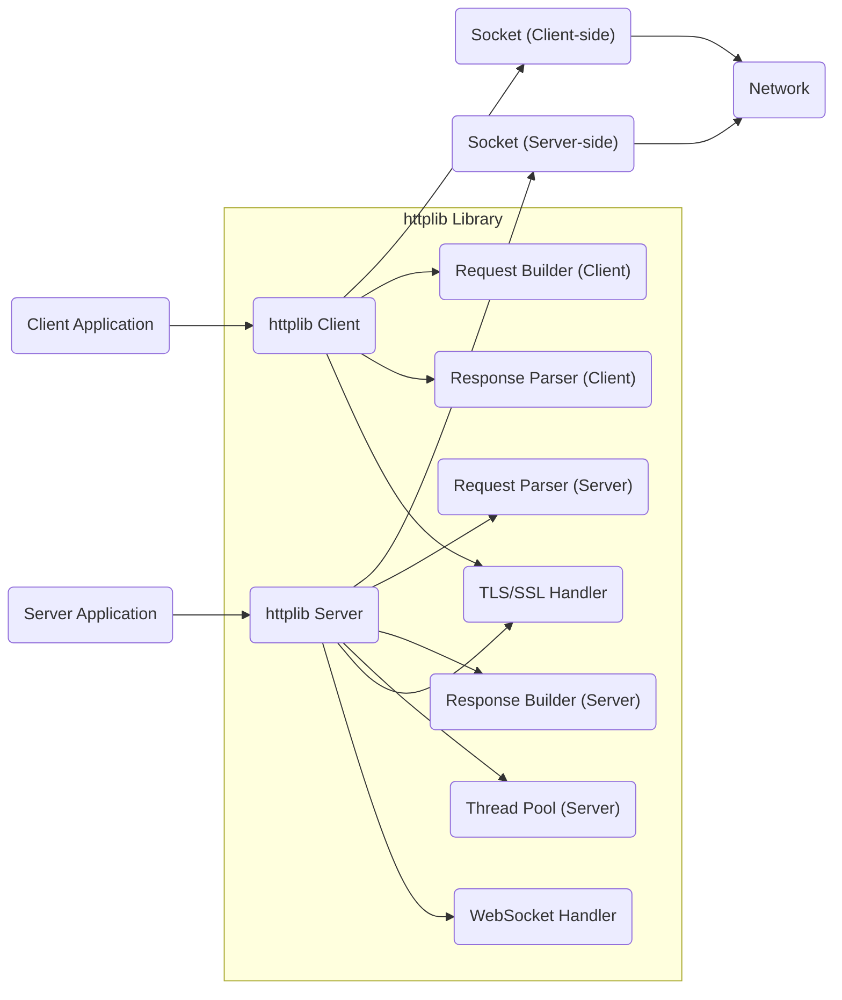
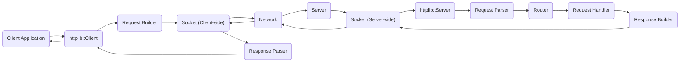
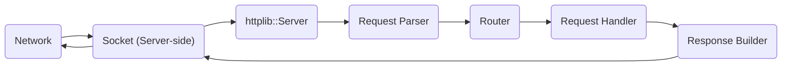

# Project Design Document: cpp-httplib

**Version:** 1.1
**Date:** October 26, 2023
**Author:** AI Software Architecture Expert

## 1. Introduction

This document provides an enhanced design overview of the `cpp-httplib` project, a versatile C++ header-only library for implementing HTTP clients and servers. This detailed description will serve as a strong basis for subsequent threat modeling activities, offering a clear understanding of the library's architecture and functionalities.

### 1.1. Purpose

The primary purpose of this document is to offer a well-defined and easily understandable description of the `cpp-httplib` library's design. This clarity is crucial for all stakeholders, particularly security analysts, to effectively grasp the system's architecture and pinpoint potential security weaknesses during the threat modeling process.

### 1.2. Scope

This document comprehensively covers the core functionalities offered by the `cpp-httplib` library, including:

*   Implementation of HTTP client capabilities.
*   Implementation of HTTP server capabilities.
*   Handling of HTTP requests and responses.
*   Management of network sockets.
*   Support for TLS/SSL encryption for secure communication (if enabled during compilation).
*   Basic authentication mechanisms for securing server endpoints.
*   Handling of multipart form data commonly used in file uploads.
*   Support for establishing and managing WebSocket connections for real-time communication.

This document specifically excludes:

*   In-depth examination of the implementation details within the header files themselves.
*   Detailed analysis of external dependencies beyond a general listing.
*   Performance evaluations, benchmarks, or optimization strategies employed by the library.

### 1.3. Goals

The key objectives of this design document are to:

*   Articulate the architectural design of `cpp-httplib` in a clear and concise manner.
*   Identify the fundamental components of the library and describe their interactions.
*   Illustrate the flow of data within the library during request and response processing.
*   Establish a solid foundation for understanding the inherent security posture of the library.

## 2. System Overview

`cpp-httplib` is designed as a header-only C++ library, providing the necessary tools and abstractions for building both HTTP clients and servers. Its architecture prioritizes ease of integration and straightforward usage within existing C++ projects.

### 2.1. High-Level Architecture

The library's functionality can be broadly divided into client-side operations for initiating requests and server-side operations for handling incoming requests. Certain underlying components are shared between these two modes of operation.

### 2.2. Key Concepts

*   **Client:** An entity responsible for initiating communication with a server by sending HTTP requests.
*   **Server:** An entity that listens for incoming HTTP requests and processes them to generate and send back HTTP responses.
*   **Request:** An HTTP message sent by a client to a server, containing information about the desired action.
*   **Response:** An HTTP message sent by a server back to a client, containing the result of the request processing.
*   **Socket:** A fundamental network communication endpoint that enables data exchange.
*   **Thread Pool:** (Server-side) A mechanism for managing a pool of threads to handle multiple concurrent client requests efficiently.
*   **TLS/SSL:**  Cryptographic protocols that provide secure communication channels over HTTPS by encrypting data in transit.
*   **WebSocket:** A communication protocol providing full-duplex communication channels over a single TCP connection.

## 3. Component Details

This section provides a more detailed look at the key components within the `cpp-httplib` library and their respective responsibilities.

### 3.1. Client Components

*   **`httplib::Client`:** This is the primary class used to create and send HTTP requests. It manages the underlying network connection to the server and orchestrates the request/response lifecycle.
    *   Responsibilities:
        *   Establishing and maintaining network connections with HTTP servers.
        *   Constructing well-formed HTTP request messages.
        *   Transmitting HTTP requests to the target server.
        *   Receiving and parsing the incoming HTTP responses.
        *   Handling potential network timeouts and connection errors.
        *   Supporting various standard HTTP methods (GET, POST, PUT, DELETE, etc.).
        *   Enabling secure communication over HTTPS through integration with TLS/SSL.
*   **Request Builder:** Internal logic responsible for the construction of HTTP request messages.
    *   Responsibilities:
        *   Formatting the initial HTTP request line, including the method, URI, and protocol version.
        *   Adding necessary and user-defined headers to the request.
        *   Encoding the request body appropriately (e.g., for POST requests with form data or JSON).
*   **Response Parser:** Internal logic dedicated to parsing the HTTP response received from the server.
    *   Responsibilities:
        *   Parsing the HTTP status line to determine the outcome of the request.
        *   Extracting relevant headers from the response message.
        *   Reading and making available the response body content.

### 3.2. Server Components

*   **`httplib::Server`:** This is the central class for creating and running an HTTP server. It listens for incoming network connections and dispatches requests to the appropriate handlers.
    *   Responsibilities:
        *   Listening for incoming network connections on a specified port.
        *   Accepting new client connections.
        *   Receiving and parsing incoming HTTP request messages.
        *   Routing incoming requests to the correct registered handler function.
        *   Constructing and sending back HTTP response messages.
        *   Managing the server's lifecycle, including starting and stopping the listening process.
        *   Supporting secure HTTPS connections through TLS/SSL integration.
*   **Request Parser:** Internal logic responsible for dissecting the incoming HTTP request from a client.
    *   Responsibilities:
        *   Parsing the HTTP request line to identify the method, requested path, and protocol.
        *   Extracting headers from the request message.
        *   Reading and making available the request body content.
*   **Response Builder:** Internal logic dedicated to constructing HTTP response messages to be sent back to clients.
    *   Responsibilities:
        *   Setting the appropriate HTTP status code to indicate the result of the request.
        *   Adding necessary and user-defined headers to the response.
        *   Setting the content of the response body.
*   **Request Handlers:** User-defined functions or lambda expressions that are registered with the server to handle specific request paths and HTTP methods.
    *   Responsibilities:
        *   Processing incoming HTTP requests.
        *   Generating the appropriate HTTP response based on the request.
*   **Router:** An internal component that maps incoming request paths to their corresponding registered request handlers.
    *   Responsibilities:
        *   Matching the requested path against the registered routes.
        *   Extracting path parameters from the request URL if defined in the route.
*   **Thread Pool:** (Optional, configurable) A mechanism to manage a pool of threads for handling concurrent client requests.
    *   Responsibilities:
        *   Improving the server's ability to handle multiple requests simultaneously.
        *   Managing the creation and destruction of threads within the pool.
*   **WebSocket Handler:** Components responsible for managing WebSocket connections and the exchange of data.
    *   Responsibilities:
        *   Handling the initial WebSocket handshake process.
        *   Sending and receiving WebSocket frames.

### 3.3. Shared Components

*   **Socket Management:** Handles the low-level network socket operations for both client and server functionalities.
    *   Responsibilities:
        *   Creating and managing network socket connections.
        *   Sending and receiving raw data over the established socket connections.
        *   Handling potential socket-related errors.
*   **TLS/SSL Handler:** Provides the necessary functionality for establishing secure communication channels using TLS/SSL.
    *   Responsibilities:
        *   Establishing secure TLS/SSL connections with clients or servers.
        *   Encrypting outgoing data and decrypting incoming data.
        *   Managing certificate verification and handling (if applicable).
*   **Header Parsing/Generation:** Utility functions for parsing and generating HTTP headers.
    *   Responsibilities:
        *   Parsing header key-value pairs from raw HTTP messages.
        *   Formatting headers correctly for inclusion in HTTP requests and responses.

## 4. Data Flow

This section illustrates the typical flow of data during client and server interactions using `cpp-httplib`.

### 4.1. Client Request Flow

**Steps:**

1. The client application initiates an HTTP request by interacting with the `httplib::Client` object.
2. The `Request Builder` component constructs the complete HTTP request message.
3. The constructed request is sent across the network using the client-side socket.
4. The server receives the incoming request on its designated socket.
5. The `httplib::Server` component receives the raw data stream.
6. The `Request Parser` analyzes the incoming data to extract the HTTP request details.
7. The `Router` component determines the appropriate `Request Handler` based on the request path and method.
8. The designated `Request Handler` processes the request and generates the corresponding response.
9. The `Response Builder` component constructs the HTTP response message.
10. The response is sent back over the network through the server-side socket.
11. The client receives the response on its socket.
12. The `Response Parser` analyzes the received response data.
13. The parsed response is then returned to the client application.

### 4.2. Server Request Flow

This flow describes the process from the server's perspective when handling an incoming client request.

**Steps:**

1. The server continuously listens for incoming connection requests on its socket.
2. A client sends an HTTP request over the network.
3. The server receives the incoming request on its socket.
4. The `httplib::Server` component receives the raw data.
5. The `Request Parser` analyzes the incoming data to extract the HTTP request details.
6. The `Router` component determines the appropriate `Request Handler` for the request.
7. The designated `Request Handler` processes the request and generates the corresponding response.
8. The `Response Builder` component constructs the HTTP response message.
9. The response is sent back to the client over the network via the server-side socket.

## 5. Security Considerations

This section highlights key security considerations relevant to the design and usage of `cpp-httplib`. These points will be crucial for a more in-depth threat modeling exercise.

*   **TLS/SSL Configuration and Implementation:** The security of HTTPS connections heavily relies on the correct configuration and robust implementation of the underlying TLS/SSL library. Misconfigurations or vulnerabilities in the TLS/SSL implementation can lead to compromised secure communication. Ensure proper certificate validation and cipher suite selection.
*   **Input Validation and Sanitization:**  The library and applications using it must rigorously validate and sanitize all incoming data (headers, body, URLs, parameters) to prevent various injection attacks such as header injection, cross-site scripting (XSS), and command injection.
*   **Denial of Service (DoS) Resilience:** The server implementation needs to be designed to withstand DoS attacks. This includes implementing appropriate timeouts, rate limiting, and resource limits to prevent malicious actors from overwhelming the server.
*   **Memory Management and Buffer Overflows:**  Careful memory management is crucial to prevent buffer overflows when parsing requests, generating responses, and handling data. Secure coding practices should be followed to mitigate these risks.
*   **Cross-Site Scripting (XSS) Prevention:** When the server generates dynamic HTML content based on user input, proper output encoding and escaping are essential to prevent XSS vulnerabilities that could allow attackers to inject malicious scripts into web pages.
*   **Authentication and Authorization Mechanisms:** While the library provides basic authentication, applications should carefully consider the strength and security of these mechanisms. For more sensitive applications, consider implementing more robust authorization schemes and potentially integrating with established identity providers.
*   **WebSocket Security Considerations:**  Properly validating the WebSocket handshake and all incoming and outgoing WebSocket frames is crucial to prevent vulnerabilities specific to WebSocket communication, such as injection attacks or framing exploits.
*   **Dependency Management and Security:** The security of `cpp-httplib` can be indirectly affected by the security of its dependencies, particularly the underlying socket implementation and the TLS/SSL library. Regularly updating dependencies and being aware of potential vulnerabilities in them is important.

## 6. Dependencies

`cpp-httplib` is designed to be a header-only library, minimizing the need for external dependencies. However, it inherently relies on certain standard C++ library features and may optionally utilize external libraries for extended functionality.

*   **Standard C++ Library:** The library heavily depends on the standard C++ library for core functionalities such as string manipulation (`<string>`), input/output operations (`<iostream>`), containers (`<vector>`, `<map>`), and threading support (`<thread>`, `<mutex>`).
*   **Operating System APIs for Networking:**  Low-level socket operations are inherently dependent on the networking APIs provided by the underlying operating system (e.g., POSIX sockets on Linux/macOS, Winsock on Windows).
*   **External TLS/SSL Library (Optional):** For enabling HTTPS support, `cpp-httplib` typically integrates with a system-installed TLS/SSL library. Common choices include OpenSSL, LibreSSL, or platform-specific solutions. The specific library used is often determined during the compilation process.

## 7. Deployment Considerations

The deployment strategy for `cpp-httplib` varies depending on whether it's being used to create a client or a server application.

*   **Client Implementation:** When used as a client, the `httplib::Client` class is directly integrated into the C++ application's codebase. Deployment simply involves compiling the application and ensuring the `cpp-httplib` header files are accessible during compilation. No separate deployment steps for the library itself are required.
*   **Server Implementation:** When used to build an HTTP server, the application utilizing the `httplib::Server` class needs to be compiled and deployed. If HTTPS is enabled, the necessary TLS/SSL certificates and keys must be provisioned and accessible to the server application at runtime. The deployment process will depend on the specific environment and can range from simple executable deployment to containerized deployments using Docker or similar technologies.

## 8. Future Considerations

This section outlines potential future enhancements and features that could be considered for `cpp-httplib`.

*   **Enhanced Error Handling and Reporting:** Implementing more detailed and informative error reporting mechanisms to aid in debugging and troubleshooting.
*   **Support for HTTP/2 Protocol:** Adding support for the HTTP/2 protocol to improve performance and efficiency.
*   **Advanced Authentication and Authorization:**  Integrating support for more sophisticated authentication protocols like OAuth 2.0 and offering more flexible authorization mechanisms.
*   **Improved WebSocket Functionality:** Expanding WebSocket support with features like compression and extensions.
*   **Asynchronous Operations:** Introducing asynchronous request/response handling to improve performance and responsiveness, especially for long-running operations.

This improved design document provides a more comprehensive and detailed overview of the `cpp-httplib` library. It aims to offer a clearer understanding of its architecture and functionalities, serving as a valuable resource for threat modeling and further development efforts.
