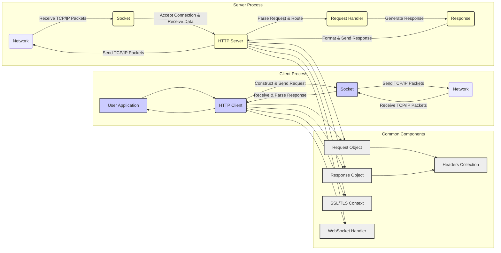

# Project Design Document: cpp-httplib

**Document Version:** 1.1
**Date:** October 26, 2023
**Prepared By:** Gemini (AI Language Model)

## 1. Introduction

This document provides an enhanced and more detailed design overview of the `cpp-httplib` project, a C++ header-only library for creating HTTP clients and servers. This document is intended to serve as a robust foundation for future threat modeling activities, offering a comprehensive understanding of the library's internal workings and potential attack surfaces. It outlines the key components, their interactions with greater granularity, and the detailed data flow within the library.

## 2. Project Overview

`cpp-httplib` is a lightweight, cross-platform C++ library designed to simplify the development of HTTP-based applications. Its header-only nature facilitates easy integration into existing projects. The library provides both client and server functionalities within a single header file. This document targets developers and security analysts who need a deep understanding of the library's architecture for development, security analysis, and threat modeling.

**Key Features:**

*   Supports HTTP/1.1 protocol.
*   Provides HTTPS (TLS/SSL) support for secure communication.
*   Offers both client and server implementations within the same library.
*   Supports common HTTP methods: GET, POST, PUT, DELETE, PATCH, OPTIONS, HEAD.
*   Enables manipulation of request and response headers.
*   Facilitates handling of request and response bodies.
*   Includes functionality for file uploads and downloads.
*   Implements basic authentication mechanisms.
*   Supports keep-alive connections for persistent connections.
*   Provides WebSocket support for real-time bidirectional communication.
*   Allows customization of socket options for fine-grained control.
*   Being a header-only library, it simplifies the integration process.

## 3. Architectural Design

The library employs a modular design, clearly separating client and server functionalities while leveraging shared utility components. This separation allows for focused development and easier understanding of each role.

### 3.1. Core Components

*   **HTTP Client:**  Responsible for initiating and sending HTTP requests to a server. It manages connection establishment, request formatting, sending data, receiving responses, and handling connection closure.
*   **HTTP Server:**  Responsible for listening for incoming HTTP requests on a specified port. It handles connection acceptance, request parsing, routing requests to appropriate handlers, generating responses, and sending data back to the client.
*   **Request:** Represents either an incoming HTTP request (on the server-side) or an outgoing HTTP request (on the client-side). It encapsulates details such as the HTTP method, request path, headers, and the request body.
*   **Response:** Represents either an outgoing HTTP response (on the server-side) or an incoming HTTP response (on the client-side). It encapsulates details such as the HTTP status code, response headers, and the response body.
*   **Headers:** A container for storing HTTP headers as key-value pairs. It provides methods for adding, retrieving, and manipulating header information.
*   **Socket:** An abstraction layer over the underlying network socket API. It handles the low-level details of network communication, including establishing connections, sending and receiving data.
*   **SSL/TLS Context:** Manages the configuration and state for establishing secure TLS/SSL connections. This includes certificate handling, cipher suite selection, and handshake management.
*   **WebSocket:** Handles the establishment and management of WebSocket connections. It provides functionality for sending and receiving WebSocket frames and managing the WebSocket handshake.
*   **Request Handler (Server-side):** A user-defined function or lambda expression that is invoked by the `HTTP Server` to process incoming requests. It receives a `Request` object and is responsible for generating a `Response` object.
*   **Content Reader/Writer:**  Handles the reading and writing of request and response bodies. This includes support for different content encodings, such as chunked transfer encoding.
*   **Connection Manager (Server-side):** Manages active client connections to the server, potentially handling keep-alive logic and connection limits.

### 3.2. Component Interactions

**Detailed Interaction Flow:**

*   **Client-side Request Initiation:**
    *   The "User Application" initiates an HTTP request by calling methods on the "HTTP Client" object, specifying the target URL, HTTP method, headers, and body.
    *   The "HTTP Client" constructs a "Request Object" containing the provided information.
    *   The "HTTP Client" interacts with the "Socket" to establish a network connection with the server. For HTTPS, the "SSL/TLS Context" is used to establish a secure connection.
    *   The "Request Object" is serialized into an HTTP request message (including headers and body).
    *   The serialized request is sent over the "Socket" to the "Network".

*   **Server-side Request Processing:**
    *   The "Network" delivers incoming TCP/IP packets to the "Socket" in the server process.
    *   The "HTTP Server" listens on the "Socket" for incoming connections.
    *   Upon accepting a connection, the "HTTP Server" receives the incoming data stream.
    *   The "HTTP Server" parses the raw data stream to construct a "Request Object", extracting headers, body, and other relevant information.
    *   The "HTTP Server" uses the request path to route the "Request Object" to the appropriate "Request Handler".
    *   The "Request Handler" processes the "Request Object" and generates a "Response Object".

*   **Server-side Response Generation:**
    *   The "Request Handler" creates a "Response Object", setting the status code, headers, and body.
    *   The "HTTP Server" receives the "Response Object".
    *   The "HTTP Server" serializes the "Response Object" into an HTTP response message.
    *   The serialized response is sent back to the client over the "Socket" and the "Network".

*   **Client-side Response Handling:**
    *   The "Network" delivers the response data to the "Socket" in the client process.
    *   The "HTTP Client" receives the response data from the "Socket".
    *   The "HTTP Client" parses the raw response data to construct a "Response Object", extracting the status code, headers, and body.
    *   The "Response Object" is then returned to the "User Application".

*   **WebSocket Communication:**
    *   For WebSocket connections, the "HTTP Client" or "HTTP Server" uses the "WebSocket Handler" to manage the WebSocket handshake process.
    *   Once the connection is established, the "WebSocket Handler" is responsible for framing and un-framing WebSocket messages sent and received over the "Socket".

### 3.3. Data Flow

**Client Request Data Flow:**

*   User application provides request parameters (URL, method, headers, body data).
*   "HTTP Client" creates a "Request Object" and populates it with the parameters.
*   Headers and body data are formatted according to HTTP specifications.
*   Data is passed to the "Socket" for transmission.
*   If HTTPS, data is encrypted by the "SSL/TLS Context" before being sent through the "Socket".

**Server Request Data Flow:**

*   Raw byte stream arrives at the "Socket" from the network.
*   If HTTPS, the "SSL/TLS Context" decrypts the incoming data.
*   "HTTP Server" parses the byte stream to extract headers and body, constructing the "Request Object".
*   The "Request Object" is passed to the appropriate "Request Handler".

**Server Response Data Flow:**

*   "Request Handler" generates the "Response Object" (status code, headers, body data).
*   "HTTP Server" formats the response data according to HTTP specifications.
*   Data is passed to the "Socket" for transmission.
*   If HTTPS, data is encrypted by the "SSL/TLS Context" before being sent through the "Socket".

**Client Response Data Flow:**

*   Raw byte stream arrives at the "Socket" from the network.
*   If HTTPS, the "SSL/TLS Context" decrypts the incoming data.
*   "HTTP Client" parses the byte stream to extract the status code, headers, and body, constructing the "Response Object".
*   The "Response Object" is returned to the user application.

## 4. Security Considerations (Detailed)

This section provides a more detailed breakdown of potential security considerations, categorized for clarity.

*   **Input Validation Vulnerabilities:**
    *   **Header Injection:** Malicious actors could inject arbitrary headers by manipulating input fields, potentially leading to HTTP response splitting or other attacks.
    *   **Path Traversal:** Improper validation of request paths could allow attackers to access files or directories outside the intended scope.
    *   **Request Smuggling:** Discrepancies in how the server and intermediary proxies parse HTTP requests can lead to request smuggling vulnerabilities.
    *   **Denial of Service (DoS) via Malformed Input:** Sending excessively large headers, bodies, or specially crafted requests can consume server resources and lead to DoS.

*   **Network Security Vulnerabilities:**
    *   **Man-in-the-Middle (MITM) Attacks:** Without proper TLS/SSL configuration, communication can be intercepted and manipulated.
    *   **Insecure TLS Configuration:** Using weak or outdated TLS versions or cipher suites can leave connections vulnerable.
    *   **Lack of Certificate Validation:** Improper validation of server certificates on the client-side can lead to connections with malicious servers.

*   **Memory Management Vulnerabilities:**
    *   **Buffer Overflows:** Incorrect handling of data sizes when reading or writing request/response bodies or headers can lead to buffer overflows.
    *   **Integer Overflows:** Potential vulnerabilities when calculating buffer sizes or lengths, leading to unexpected behavior or crashes.

*   **WebSocket Security Vulnerabilities:**
    *   **Cross-Site WebSocket Hijacking (CSWSH):** Attackers can trick a user's browser into initiating a WebSocket connection to a malicious server.
    *   **Message Injection:** Vulnerabilities in handling WebSocket frames could allow attackers to inject malicious messages.

*   **Denial of Service (DoS) Attacks:**
    *   **Slowloris Attacks:** Exploiting keep-alive connections to exhaust server resources by sending incomplete requests slowly.
    *   **SYN Flood Attacks:** While primarily a lower-level network attack, the library's socket handling could be indirectly affected.
    *   **Resource Exhaustion:** Sending a large number of legitimate or slightly malformed requests to overwhelm the server.

*   **Authentication and Authorization Vulnerabilities:**
    *   **Insecure Basic Authentication:** If used over non-HTTPS connections, credentials can be easily intercepted.
    *   **Lack of Proper Authorization:** Insufficient checks to ensure users have the necessary permissions to access resources.

*   **Error Handling and Information Disclosure:**
    *   **Verbose Error Messages:** Exposing sensitive information (e.g., internal paths, software versions) in error messages.

*   **Dependency Vulnerabilities:**
    *   While header-only, the underlying SSL/TLS library (e.g., OpenSSL) can have vulnerabilities that need to be addressed by keeping the dependency updated.

## 5. Deployment Considerations

Deploying applications using `cpp-httplib` involves several considerations:

*   **Compilation:**  Simply include the `httplib.h` header file in your C++ project. Ensure the compiler supports the C++ standard used by the library.
*   **Dependencies:** For HTTPS support, ensure a compatible SSL/TLS library (like OpenSSL, mbedTLS, or LibreSSL) is installed and linked with your application during the build process.
*   **Platform Compatibility:** While designed for cross-platform compatibility, be aware of potential minor differences in socket implementations across different operating systems.
*   **Resource Management:**  Carefully consider resource limits (memory, file descriptors, threads) when deploying server applications, especially under high load. Configure appropriate timeouts and connection limits.
*   **Security Best Practices:**
    *   **Enable HTTPS:** Always use HTTPS for sensitive communications.
    *   **Keep Dependencies Updated:** Regularly update the underlying SSL/TLS library to patch security vulnerabilities.
    *   **Implement Proper Input Validation:** Sanitize and validate all user inputs.
    *   **Secure Coding Practices:** Follow secure coding guidelines to prevent common vulnerabilities.
    *   **Regular Security Audits:** Conduct periodic security assessments and penetration testing.
*   **Monitoring and Logging:** Implement robust logging mechanisms to track requests, responses, and potential errors for debugging and security monitoring.

## 6. Future Considerations

*   **HTTP/3 (QUIC) Support:**  Exploring the possibility of adding support for the newer HTTP/3 protocol based on QUIC.
*   **More Advanced Authentication and Authorization:** Implementing support for more sophisticated authentication mechanisms like OAuth 2.0 and fine-grained authorization controls.
*   **Improved Error Handling and Logging:** Enhancing error reporting and providing more configurable logging options.
*   **Asynchronous Operations (Beyond Existing Non-blocking Sockets):**  Potentially exploring more advanced asynchronous programming models for improved performance and scalability.
*   **Connection Pooling Enhancements:**  Improving connection reuse and management for client-side operations.
*   **Built-in Rate Limiting/Throttling (Server-side):**  Adding features to protect server resources from abuse.
*   **Improved Testing and Fuzzing:**  Expanding the test suite and incorporating fuzzing techniques to identify potential vulnerabilities.

This enhanced design document provides a more comprehensive understanding of the `cpp-httplib` library's architecture and security considerations, serving as a valuable resource for threat modeling and secure development practices.