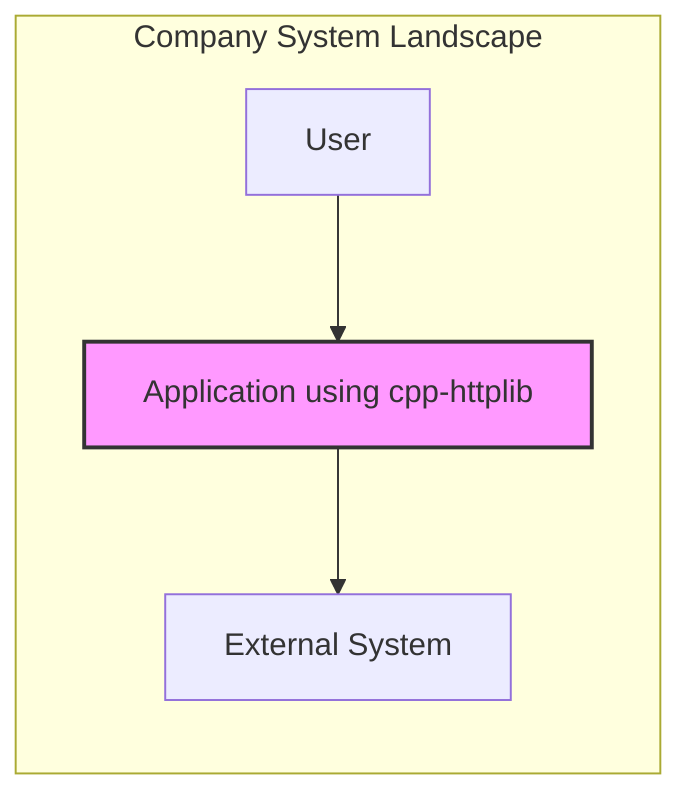
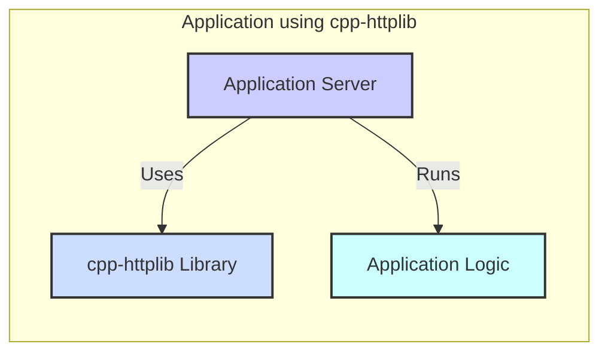
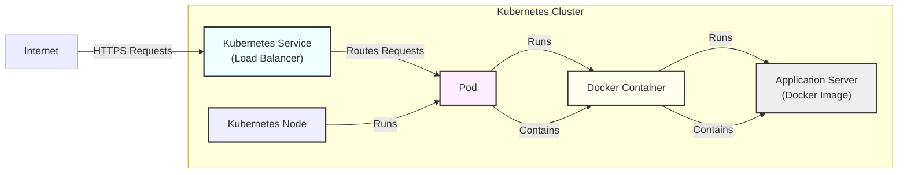

# BUSINESS POSTURE

- Business Priorities and Goals:
  - Priority: Rapid Application Development
  - Priority: Performance and Efficiency
  - Priority: Cost-Effectiveness (using a header-only library simplifies deployment and reduces dependencies)
  - Goal: To quickly build and deploy applications that require HTTP/HTTPS server or client functionalities.
  - Goal: To leverage a lightweight and efficient HTTP library to minimize resource consumption and maximize application performance.
- Business Risks:
  - Risk: Security vulnerabilities in the cpp-httplib library could be exploited in applications using it, leading to data breaches or service disruption.
  - Risk: Lack of comprehensive security testing and formal security audits for a community-driven header-only library might introduce undetected vulnerabilities.
  - Risk: Potential for misconfiguration or misuse of the library by developers, leading to security weaknesses in the applications built upon it.
  - Risk: Dependency on an open-source project with community-based support might lead to delays in security patch availability or lack of guaranteed long-term maintenance.

# SECURITY POSTURE

- Existing Security Controls:
  - security control: Code Review - The library is open-source and benefits from community code review, increasing the likelihood of identifying and addressing potential vulnerabilities. (Implemented by: Community, GitHub repository history)
  - security control: Unit Testing - The repository includes unit tests, which help ensure the library functions as expected and can catch some types of bugs, including security-relevant ones. (Implemented by: Repository's 'test' directory and CI workflows)
  - security control: Usage of Standard C++ Libraries - The library relies on standard C++ libraries, which are generally well-vetted and less prone to common vulnerabilities compared to custom implementations. (Implemented by: Library's code base)
  - accepted risk: Limited Formal Security Audits - As a community-driven open-source project, cpp-httplib likely lacks formal, in-depth security audits conducted by dedicated security firms.
  - accepted risk: Dependency on Community for Security Patches - Security vulnerabilities are addressed by community contributions, which might lead to variable patch release timelines compared to commercially supported libraries.

- Recommended Security Controls:
  - security control: Dependency Scanning - Implement automated dependency scanning on the project using cpp-httplib to identify known vulnerabilities in the library or its transitive dependencies (if any, although header-only libraries minimize this).
  - security control: Static Application Security Testing (SAST) - Integrate SAST tools into the development pipeline to automatically analyze the application code that uses cpp-httplib for potential security flaws and misconfigurations.
  - security control: Dynamic Application Security Testing (DAST) - Perform DAST on applications built with cpp-httplib to identify runtime vulnerabilities and assess the overall security posture of deployed applications.
  - security control: Security Training for Developers - Provide security training to developers using cpp-httplib, focusing on secure coding practices for web applications and common pitfalls when using HTTP libraries.
  - security control: Penetration Testing - Conduct regular penetration testing of applications utilizing cpp-httplib to simulate real-world attacks and identify exploitable vulnerabilities.

- Security Requirements:
  - Authentication:
    - Requirement: Applications using cpp-httplib must implement their own authentication mechanisms as the library itself does not provide built-in authentication features.
    - Requirement: Authentication mechanisms should be robust and appropriate for the sensitivity of the application and data being protected (e.g., OAuth 2.0, JWT, API keys).
  - Authorization:
    - Requirement: Applications must implement authorization controls to ensure that authenticated users only have access to the resources and functionalities they are permitted to access.
    - Requirement: Authorization should be enforced at the application level, considering the specific business logic and data access requirements.
  - Input Validation:
    - Requirement: Applications must perform thorough input validation on all data received via HTTP requests handled by cpp-httplib to prevent injection attacks (e.g., SQL injection, command injection, cross-site scripting).
    - Requirement: Input validation should be applied on both the client and server sides, and should include checks for data type, format, length, and allowed values.
  - Cryptography:
    - Requirement: When using HTTPS, applications must ensure proper TLS configuration, including strong cipher suites, up-to-date TLS versions, and valid SSL/TLS certificates.
    - Requirement: For sensitive data transmitted over HTTP/HTTPS, consider implementing application-level encryption in addition to TLS to provide end-to-end protection.
    - Requirement: Securely manage cryptographic keys and certificates used for HTTPS and application-level encryption, following best practices for key generation, storage, and rotation.

# DESIGN

## C4 CONTEXT

- Context Diagram Elements:
  - Element:
    - Name: Application using cpp-httplib
    - Type: Software System
    - Description: The application being developed that utilizes the cpp-httplib library to provide HTTP/HTTPS server or client functionality. This application is the focus of this design document.
    - Responsibilities:
      - Provide specific business functionalities to users.
      - Handle user requests and interact with external systems as needed.
      - Implement application-level security controls.
    - Security controls:
      - security control: Authentication and Authorization - Implement user authentication and authorization to control access to application features and data. (Implemented by: Application code)
      - security control: Input Validation - Validate all user inputs to prevent injection attacks and ensure data integrity. (Implemented by: Application code)
      - security control: Session Management - Securely manage user sessions to maintain user context and prevent unauthorized access. (Implemented by: Application code)
      - security control: Error Handling and Logging - Implement secure error handling and logging to prevent information leakage and aid in security monitoring. (Implemented by: Application code)
  - Element:
    - Name: User
    - Type: Person
    - Description: End-users who interact with the application to utilize its functionalities. Users can be internal or external depending on the application's purpose.
    - Responsibilities:
      - Authenticate to access the application (if required).
      - Interact with the application to perform desired tasks.
    - Security controls:
      - security control: Strong Passwords - Users are expected to use strong and unique passwords if password-based authentication is used. (Implemented by: User education and password policy)
      - security control: Multi-Factor Authentication (MFA) - Encourage or enforce MFA for enhanced account security. (Implemented by: Application's authentication system)
  - Element:
    - Name: External System
    - Type: Software System
    - Description: External systems that the application might interact with. These could be databases, third-party APIs, other internal services, etc.
    - Responsibilities:
      - Provide data or services to the application.
      - Receive requests and data from the application.
    - Security controls:
      - security control: API Authentication - Implement secure authentication mechanisms for API interactions (e.g., API keys, OAuth 2.0). (Implemented by: External System and Application code)
      - security control: Input Validation - External systems should also validate inputs received from the application. (Implemented by: External System)
      - security control: Network Security - Secure network communication channels between the application and external systems (e.g., TLS encryption). (Implemented by: Network infrastructure and system configurations)

## C4 CONTAINER

- Container Diagram Elements:
  - Element:
    - Name: Application Server
    - Type: Web Server Container
    - Description: The container responsible for running the application logic and handling HTTP/HTTPS requests. This could be a process or a set of processes.
    - Responsibilities:
      - Accept incoming HTTP/HTTPS requests.
      - Route requests to the application logic.
      - Serve responses back to users or external systems.
      - Manage network connections.
    - Security controls:
      - security control: Web Server Hardening - Configure the application server with security best practices, such as disabling unnecessary features, setting appropriate timeouts, and limiting resource consumption. (Implemented by: Server configuration)
      - security control: TLS Configuration - Properly configure TLS for HTTPS connections, including strong cipher suites and certificate management. (Implemented by: Server configuration)
      - security control: Rate Limiting - Implement rate limiting to protect against denial-of-service attacks. (Implemented by: Server or application logic)
  - Element:
    - Name: cpp-httplib Library
    - Type: Library
    - Description: The cpp-httplib header-only library integrated into the application server. It provides the core HTTP/HTTPS server and client functionalities.
    - Responsibilities:
      - Handle low-level HTTP/HTTPS protocol processing.
      - Parse HTTP requests and generate HTTP responses.
      - Manage sockets and network communication.
    - Security controls:
      - security control: Secure Coding Practices in Library - Rely on the secure coding practices employed by the cpp-httplib library developers and community. (Implemented by: Library codebase)
      - security control: Library Updates - Monitor for updates to the cpp-httplib library and update to newer versions to benefit from bug fixes and security patches. (Implemented by: Application dependency management)
  - Element:
    - Name: Application Logic
    - Type: Application Component
    - Description: The custom code that implements the specific business logic of the application. It runs within the application server container and utilizes the cpp-httplib library.
    - Responsibilities:
      - Implement business functionalities.
      - Process user requests and data.
      - Interact with databases or external systems.
      - Enforce application-level security controls (authentication, authorization, input validation).
    - Security controls:
      - security control: Secure Application Code - Develop application logic following secure coding principles to prevent vulnerabilities like injection flaws, business logic errors, and insecure data handling. (Implemented by: Application development team)
      - security control: Input Validation and Sanitization - Implement robust input validation and output sanitization within the application logic. (Implemented by: Application code)
      - security control: Authorization Enforcement - Enforce authorization rules within the application logic to control access to functionalities and data. (Implemented by: Application code)

## DEPLOYMENT

- Deployment Options:
  - Option 1: Bare Metal Deployment - Deploying the application directly on physical servers.
  - Option 2: Virtual Machine Deployment - Deploying the application within virtual machines on a hypervisor.
  - Option 3: Containerized Deployment - Deploying the application within containers orchestrated by a container platform like Kubernetes or Docker Swarm.
  - Option 4: Serverless Deployment - Deploying the application as serverless functions in a cloud environment.

- Selected Deployment Architecture: Containerized Deployment (using Docker and Kubernetes)

- Deployment Diagram Elements:
  - Element:
    - Name: Kubernetes Cluster
    - Type: Container Orchestration Platform
    - Description: A Kubernetes cluster provides the infrastructure for deploying, managing, and scaling containerized applications.
    - Responsibilities:
      - Orchestrate container deployment and management.
      - Provide load balancing and service discovery.
      - Manage scaling and resource allocation.
      - Ensure high availability and fault tolerance.
    - Security controls:
      - security control: Kubernetes Security Hardening - Implement Kubernetes security best practices, including network policies, RBAC, pod security policies/admission controllers, and regular security audits. (Implemented by: Kubernetes cluster configuration and administration)
      - security control: Container Image Security Scanning - Scan Docker images for vulnerabilities before deployment. (Implemented by: CI/CD pipeline and container registry)
  - Element:
    - Name: Kubernetes Node
    - Type: Compute Instance
    - Description: Worker nodes in the Kubernetes cluster that run pods and containers.
    - Responsibilities:
      - Provide compute resources for running containers.
      - Run the Kubernetes kubelet agent.
    - Security controls:
      - security control: Operating System Hardening - Harden the operating system of Kubernetes nodes, including patching, access control, and security configurations. (Implemented by: Infrastructure management)
      - security control: Node Security Monitoring - Monitor nodes for security events and intrusions. (Implemented by: Security monitoring tools)
  - Element:
    - Name: Pod
    - Type: Kubernetes Pod
    - Description: The smallest deployable unit in Kubernetes, representing a group of one or more containers.
    - Responsibilities:
      - Provide a shared network namespace and storage volumes for containers within the pod.
      - Ensure co-location and shared lifecycle of containers within the pod.
    - Security controls:
      - security control: Pod Security Context - Define security context for pods to enforce security settings like user and group IDs, capabilities, and SELinux options. (Implemented by: Kubernetes pod configuration)
      - security control: Network Policies - Implement network policies to control network traffic between pods and namespaces. (Implemented by: Kubernetes network policy configuration)
  - Element:
    - Name: Docker Container
    - Type: Container Runtime
    - Description: A Docker container running the application server and the application logic.
    - Responsibilities:
      - Run the application server process.
      - Isolate the application environment.
    - Security controls:
      - security control: Minimal Container Image - Create minimal container images containing only necessary components to reduce the attack surface. (Implemented by: Docker image build process)
      - security control: Container Runtime Security - Utilize secure container runtime configurations and security features. (Implemented by: Container runtime configuration)
  - Element:
    - Name: Application Server (Docker Image)
    - Type: Docker Image
    - Description: A Docker image containing the application server, application logic, and the cpp-httplib library.
    - Responsibilities:
      - Package the application and its dependencies.
      - Serve as the deployment artifact.
    - Security controls:
      - security control: Image Vulnerability Scanning - Scan Docker images for vulnerabilities before pushing to the registry and deployment. (Implemented by: CI/CD pipeline and container registry)
      - security control: Image Signing - Sign Docker images to ensure image integrity and authenticity. (Implemented by: CI/CD pipeline and container registry)
  - Element:
    - Name: Kubernetes Service (Load Balancer)
    - Type: Kubernetes Service
    - Description: A Kubernetes service of type LoadBalancer that exposes the application to the internet and distributes traffic across pods.
    - Responsibilities:
      - Expose the application to external networks.
      - Load balance traffic across application instances.
    - Security controls:
      - security control: Load Balancer Security - Configure load balancer security settings, such as TLS termination, access control lists, and DDoS protection. (Implemented by: Cloud provider or load balancer configuration)
      - security control: Firewall - Implement firewalls to restrict network access to the Kubernetes service and nodes. (Implemented by: Network infrastructure)
  - Element:
    - Name: Internet
    - Type: External Network
    - Description: The public internet from which users access the application.
    - Responsibilities:
      - Provide network connectivity for users to access the application.
    - Security controls:
      - security control: DDoS Protection - Implement DDoS protection measures to mitigate denial-of-service attacks from the internet. (Implemented by: Cloud provider or network infrastructure)

## BUILD

```mermaid
graph LR
    developer["Developer"] --> code_commit["Code Commit\n(GitHub)"]
    code_commit --> github_actions["GitHub Actions\n(CI/CD Pipeline)"]
    github_actions --> build_stage["Build Stage\n(Compilation, Unit Tests)"]
    build_stage --> security_checks["Security Checks\n(SAST, Dependency Scan)"]
    security_checks --> container_build["Container Image Build"]
    container_build --> container_registry["Container Registry\n(e.g., Docker Hub, AWS ECR)"]
    container_registry --> deployment["Deployment\n(Kubernetes)"]

    style github_actions fill:#aaf,stroke:#333,stroke-width:2px
    style container_registry fill:#afa,stroke:#333,stroke-width:2px
```

- Build Process Elements:
  - Element:
    - Name: Developer
    - Type: Software Engineer
    - Description: A software developer who writes and modifies the application code, including the integration of the cpp-httplib library.
    - Responsibilities:
      - Write secure and functional code.
      - Commit code changes to the source code repository.
      - Participate in code reviews.
    - Security controls:
      - security control: Secure Coding Training - Developers should receive training on secure coding practices. (Implemented by: Company training programs)
      - security control: Code Review - Code changes should be reviewed by other developers to identify potential security flaws and bugs. (Implemented by: Development process)
      - security control: IDE Security Plugins - Developers can use IDE plugins for static analysis and vulnerability detection during development. (Implemented by: Developer tooling)
  - Element:
    - Name: Code Commit (GitHub)
    - Type: Version Control System
    - Description: GitHub repository used for version control and collaboration on the application codebase.
    - Responsibilities:
      - Store and manage source code.
      - Track code changes and history.
      - Facilitate collaboration among developers.
    - Security controls:
      - security control: Access Control - Implement access control to restrict who can commit code to the repository. (Implemented by: GitHub repository settings)
      - security control: Branch Protection - Use branch protection rules to enforce code review and prevent direct commits to protected branches. (Implemented by: GitHub repository settings)
      - security control: Audit Logging - GitHub audit logs track activities within the repository, including code changes. (Implemented by: GitHub platform)
  - Element:
    - Name: GitHub Actions (CI/CD Pipeline)
    - Type: CI/CD Platform
    - Description: GitHub Actions is used to automate the build, test, and deployment pipeline for the application.
    - Responsibilities:
      - Automate the build process.
      - Run unit tests and integration tests.
      - Perform security checks.
      - Build and push container images.
      - Deploy the application to target environments.
    - Security controls:
      - security control: CI/CD Pipeline Security - Secure the CI/CD pipeline itself to prevent tampering and unauthorized access. (Implemented by: GitHub Actions configuration and access control)
      - security control: Secrets Management - Securely manage secrets (API keys, credentials) used in the CI/CD pipeline. (Implemented by: GitHub Actions secrets management)
  - Element:
    - Name: Build Stage (Compilation, Unit Tests)
    - Type: Build Process Stage
    - Description: This stage compiles the application code, including the cpp-httplib library, and runs unit tests to ensure code functionality.
    - Responsibilities:
      - Compile source code into executable artifacts.
      - Execute unit tests to verify code correctness.
    - Security controls:
      - security control: Secure Build Environment - Use a secure and hardened build environment to prevent build-time attacks. (Implemented by: CI/CD pipeline configuration)
      - security control: Dependency Management - Use a dependency management tool to manage and track dependencies, ensuring known vulnerable dependencies are not used. (Implemented by: Build tools and dependency management configuration)
  - Element:
    - Name: Security Checks (SAST, Dependency Scan)
    - Type: Security Testing Stage
    - Description: This stage integrates security testing tools into the CI/CD pipeline to automatically identify security vulnerabilities.
    - Responsibilities:
      - Perform Static Application Security Testing (SAST) to analyze source code for vulnerabilities.
      - Perform Dependency Scanning to identify known vulnerabilities in dependencies, including cpp-httplib and its dependencies (if any).
    - Security controls:
      - security control: SAST Tool Integration - Integrate SAST tools into the CI/CD pipeline and configure them to run automatically on code changes. (Implemented by: CI/CD pipeline configuration and SAST tool setup)
      - security control: Dependency Scanning Tool Integration - Integrate dependency scanning tools into the CI/CD pipeline and configure them to run automatically on code changes and dependency updates. (Implemented by: CI/CD pipeline configuration and dependency scanning tool setup)
      - security control: Vulnerability Reporting and Remediation - Implement a process for reporting and remediating vulnerabilities identified by security checks. (Implemented by: Security and development workflows)
  - Element:
    - Name: Container Image Build
    - Type: Build Process Stage
    - Description: This stage builds the Docker container image for the application, including the compiled application artifacts and necessary dependencies.
    - Responsibilities:
      - Create a Docker image based on a Dockerfile.
      - Include application artifacts and dependencies in the image.
    - Security controls:
      - security control: Minimal Image Construction - Build minimal container images to reduce the attack surface. (Implemented by: Dockerfile best practices)
      - security control: Base Image Security - Use secure and updated base images for container builds. (Implemented by: Dockerfile configuration and base image selection)
  - Element:
    - Name: Container Registry (e.g., Docker Hub, AWS ECR)
    - Type: Container Image Registry
    - Description: A container registry is used to store and manage Docker images.
    - Responsibilities:
      - Store and manage Docker images.
      - Provide access control for images.
      - Distribute images to deployment environments.
    - Security controls:
      - security control: Access Control - Implement access control to restrict who can push and pull images from the registry. (Implemented by: Container registry access control settings)
      - security control: Image Scanning in Registry - Configure the container registry to automatically scan images for vulnerabilities upon push. (Implemented by: Container registry security features)
      - security control: Image Signing and Verification - Sign container images and verify signatures during deployment to ensure image integrity and authenticity. (Implemented by: Container registry and deployment pipeline)
  - Element:
    - Name: Deployment (Kubernetes)
    - Type: Deployment Stage
    - Description: This stage deploys the containerized application to the Kubernetes cluster.
    - Responsibilities:
      - Deploy application containers to the Kubernetes cluster.
      - Manage application updates and rollouts.
    - Security controls:
      - security control: Secure Deployment Process - Ensure the deployment process itself is secure and authorized. (Implemented by: Deployment pipeline access control and automation)
      - security control: Infrastructure as Code (IaC) Security - Secure the Infrastructure as Code used to define and deploy the Kubernetes infrastructure and application. (Implemented by: IaC security best practices and version control)

# RISK ASSESSMENT

- Critical Business Processes:
  - Depends heavily on the application built using cpp-httplib. Examples include:
    - Processing e-commerce transactions.
    - Providing API access to critical services.
    - Managing user accounts and personal data.
    - Serving content to end-users.
  - The criticality is determined by the impact of service disruption or data breach on the business.
- Data Sensitivity:
  - Data sensitivity depends on the application. Examples include:
    - Personally Identifiable Information (PII) - User names, addresses, emails, phone numbers.
    - Financial Data - Credit card details, bank account information, transaction history.
    - Authentication Credentials - Passwords, API keys, tokens.
    - Business Confidential Data - Trade secrets, internal documents, strategic plans.
  - Sensitivity levels should be classified (e.g., Public, Internal, Confidential, Highly Confidential) to guide security controls.

# QUESTIONS & ASSUMPTIONS

- Questions:
  - What type of application will be built using cpp-httplib (e.g., web server, API gateway, client application)?
  - What are the expected performance and scalability requirements for the application?
  - What are the specific compliance requirements (e.g., GDPR, HIPAA, PCI DSS)?
  - What is the company's risk appetite regarding open-source library usage and security?
  - What is the team's experience with secure software development practices and cloud deployments?
- Assumptions:
  - Assumption: The application being built is a web application requiring HTTP/HTTPS server functionality.
  - Assumption: Security is a significant concern for the application and the business.
  - Assumption: The application will be deployed in a cloud environment using containers and Kubernetes.
  - Assumption: The development team has some familiarity with CI/CD practices and security testing tools.
  - Assumption: The company is willing to invest in security controls to mitigate identified risks.