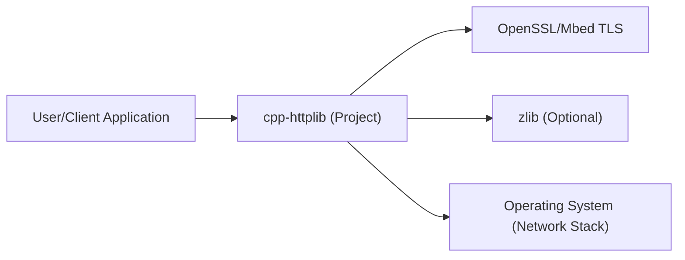
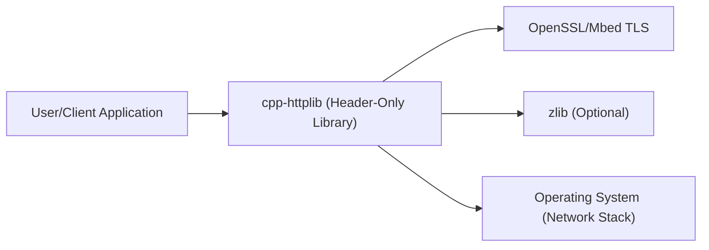
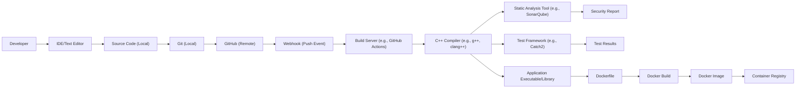

# BUSINESS POSTURE

Business Priorities and Goals:

*   Provide a lightweight, easy-to-use, cross-platform C++ library for creating HTTP/HTTPS clients and servers.
*   Minimize external dependencies to simplify integration and deployment.
*   Offer a header-only library for ease of inclusion in other projects.
*   Maintain high performance and efficiency.
*   Support a wide range of C++ standards (C++11 and later).
*   Provide good documentation and examples.

Most Important Business Risks:

*   Security vulnerabilities in the library could expose applications using it to attacks (e.g., remote code execution, denial of service, data breaches).
*   Poor performance or scalability could limit the library's usefulness in demanding applications.
*   Lack of cross-platform compatibility could restrict adoption.
*   Difficult integration or a steep learning curve could deter developers.
*   Lack of maintenance or updates could lead to compatibility issues or unaddressed security vulnerabilities over time.

# SECURITY POSTURE

Existing Security Controls:

*   security control: The library uses `std::mutex` for thread safety in critical sections (e.g., managing shared resources). Implemented in httplib.h.
*   security control: Basic input validation is performed on headers and other parameters. Implemented in httplib.h.
*   security control: Support for OpenSSL and Mbed TLS for HTTPS, allowing for secure communication. Implemented in httplib.h.
*   security control: Some checks for common error conditions (e.g., invalid port numbers, connection failures). Implemented in httplib.h.
*   security control: Support for different HTTP methods (GET, POST, PUT, DELETE, etc.) to allow for building RESTful APIs. Implemented in httplib.h.

Accepted Risks:

*   accepted risk: The library relies on the user to properly configure and manage SSL/TLS certificates and settings when using HTTPS.
*   accepted risk: The library does not implement advanced security features like authentication or authorization mechanisms, leaving this responsibility to the user.
*   accepted risk: The library's simplicity may come at the cost of some advanced security features found in more complex libraries.
*   accepted risk: The library does not implement any specific protection against common web vulnerabilities like XSS, CSRF, or SQL injection. It is the responsibility of the user to implement these protections in their application logic.

Recommended Security Controls:

*   security control: Integrate with a static analysis tool to identify potential vulnerabilities during development.
*   security control: Implement fuzz testing to discover unexpected behavior and potential vulnerabilities.
*   security control: Provide clear documentation and examples on how to securely configure and use the library, especially for HTTPS.
*   security control: Consider adding support for common security headers (e.g., Content Security Policy, Strict Transport Security).
*   security control: Regularly review and update dependencies (if any) to address known vulnerabilities.

Security Requirements:

*   Authentication: The library itself does not handle authentication. Users must implement their own authentication mechanisms (e.g., Basic Auth, API keys, OAuth 2.0) if required.
*   Authorization: The library does not provide built-in authorization mechanisms. Users are responsible for implementing authorization logic within their applications.
*   Input Validation: The library performs some basic input validation, but users should implement comprehensive input validation and sanitization to prevent injection attacks and other vulnerabilities.
*   Cryptography: For HTTPS, the library relies on external libraries (OpenSSL or Mbed TLS). Users should ensure they are using secure configurations and up-to-date versions of these libraries. The library should also provide options for configuring cipher suites and TLS versions.

# DESIGN

## C4 CONTEXT

Element Descriptions:

*   Element:
    *   Name: User/Client Application
    *   Type: External System (User Application)
    *   Description: Any application that utilizes the cpp-httplib library to make HTTP requests or act as an HTTP server.
    *   Responsibilities: Initiating HTTP requests, handling responses, implementing application-specific logic, managing security credentials, and providing user interface.
    *   Security controls: Implements authentication, authorization, input validation, and output encoding as needed. Handles sensitive data securely.

*   Element:
    *   Name: cpp-httplib (Project)
    *   Type: Project
    *   Description: The core library providing HTTP/HTTPS client and server functionality.
    *   Responsibilities: Handling HTTP request/response parsing, managing connections, providing an API for users, and interacting with underlying libraries for SSL/TLS and compression.
    *   Security controls: Basic input validation, thread safety using mutexes, and reliance on OpenSSL/Mbed TLS for secure communication.

*   Element:
    *   Name: OpenSSL/Mbed TLS
    *   Type: External Library
    *   Description: Libraries providing cryptographic functions and SSL/TLS support for secure communication.
    *   Responsibilities: Handling encryption, decryption, certificate validation, and secure key exchange.
    *   Security controls: Implements cryptographic algorithms and protocols, manages certificates, and provides secure communication channels.

*   Element:
    *   Name: zlib (Optional)
    *   Type: External Library
    *   Description: A compression library used for handling compressed HTTP content (e.g., gzip).
    *   Responsibilities: Compressing and decompressing data streams.
    *   Security controls: None directly related to security, but vulnerabilities in zlib could potentially lead to denial-of-service or other issues.

*   Element:
    *   Name: Operating System (Network Stack)
    *   Type: External System
    *   Description: The underlying operating system's network stack, providing low-level network communication capabilities.
    *   Responsibilities: Handling TCP/IP connections, routing, and network interface management.
    *   Security controls: OS-level security features like firewalls, network segmentation, and security updates.

## C4 CONTAINER

Since cpp-httplib is a header-only library, the container diagram is essentially the same as the context diagram. The "containers" in this case are conceptual rather than physical deployment units.

Element Descriptions:

The element descriptions are identical to those in the C4 Context diagram, as the conceptual components remain the same. The key difference is the understanding that "cpp-httplib" is not a deployed container but rather a library integrated directly into the "User/Client Application" at compile time.

## DEPLOYMENT

cpp-httplib, being a header-only library, doesn't have a traditional deployment process in the sense of deploying a server or application. Its "deployment" is its inclusion in another project's build process. However, we can describe the deployment of an application *using* cpp-httplib.

Possible Deployment Solutions:

1.  Standalone Executable: The user application, with cpp-httplib included, is compiled into a single executable and deployed directly to a server.
2.  Containerized Application (Docker): The user application is packaged into a Docker container, along with any necessary dependencies, and deployed to a container orchestration platform (e.g., Kubernetes, Docker Swarm).
3.  Cloud Function (AWS Lambda, Azure Functions, Google Cloud Functions): The user application (or a part of it) is deployed as a serverless function.

Chosen Solution (for detailed description): Containerized Application (Docker)

```mermaid
graph LR
    Developer["Developer"] --> SourceCode["Source Code (GitHub)"]
    SourceCode --> BuildServer["Build Server (e.g., Jenkins, GitHub Actions)"]
    BuildServer --> DockerImage["Docker Image"]
    DockerImage --> ContainerRegistry["Container Registry (e.g., Docker Hub, ECR)"]
    ContainerRegistry --> Orchestrator["Container Orchestrator (e.g., Kubernetes)"]
    Orchestrator --> Server["Server (VM or Physical)"]
    Server --> OS["Operating System"]
    OS --> Network["Network"]
    Network --> User["User"]

```

Element Descriptions:

*   Element:
    *   Name: Developer
    *   Type: Person
    *   Description: The developer writing and maintaining the application code.
    *   Responsibilities: Writing code, committing changes, and initiating builds.
    *   Security controls: Uses secure coding practices, manages credentials securely, and follows secure development lifecycle principles.

*   Element:
    *   Name: Source Code (GitHub)
    *   Type: Source Code Repository
    *   Description: The repository containing the application's source code, including the cpp-httplib header files.
    *   Responsibilities: Version control, code review, and collaboration.
    *   Security controls: Access control, branch protection, and code review policies.

*   Element:
    *   Name: Build Server (e.g., Jenkins, GitHub Actions)
    *   Type: CI/CD System
    *   Description: The server responsible for building the Docker image.
    *   Responsibilities: Compiling code, running tests, building the Docker image, and pushing it to the container registry.
    *   Security controls: Secure access control, build environment isolation, and vulnerability scanning of dependencies.

*   Element:
    *   Name: Docker Image
    *   Type: Container Image
    *   Description: The packaged application, including cpp-httplib and all dependencies.
    *   Responsibilities: Providing a consistent and isolated runtime environment for the application.
    *   Security controls: Minimal base image, regular security updates, and vulnerability scanning.

*   Element:
    *   Name: Container Registry (e.g., Docker Hub, ECR)
    *   Type: Image Repository
    *   Description: The registry storing the Docker image.
    *   Responsibilities: Storing and distributing Docker images.
    *   Security controls: Access control, image signing, and vulnerability scanning.

*   Element:
    *   Name: Container Orchestrator (e.g., Kubernetes)
    *   Type: Orchestration Platform
    *   Description: The platform managing the deployment and scaling of the application containers.
    *   Responsibilities: Scheduling containers, managing resources, and ensuring high availability.
    *   Security controls: Network policies, role-based access control (RBAC), and secrets management.

*   Element:
    *   Name: Server (VM or Physical)
    *   Type: Compute Resource
    *   Description: The physical or virtual server running the container orchestrator and the application containers.
    *   Responsibilities: Providing compute resources for the application.
    *   Security controls: OS hardening, firewall configuration, and intrusion detection/prevention systems.

*   Element:
    *   Name: Operating System
    *   Type: Operating System
    *   Description: OS of the Server.
    *   Responsibilities: Providing base for all operations.
    *   Security controls: Regular security updates and patches.

*   Element:
    *   Name: Network
    *   Type: Network
    *   Description: Network that connects Server with User.
    *   Responsibilities: Providing communication channel.
    *   Security controls: Firewalls, network segmentation, and intrusion detection/prevention systems.

*   Element:
    *   Name: User
    *   Type: Person
    *   Description: The end-user accessing the application.
    *   Responsibilities: Using the application.
    *   Security controls: None directly managed by the deployment process, but users should follow good security practices (e.g., strong passwords, secure browsing).

## BUILD

Build Process Description:

1.  **Development:** The developer writes code using an IDE or text editor and manages the source code locally.
2.  **Local Version Control:** Changes are tracked using Git locally.
3.  **Remote Repository:** Code is pushed to a remote repository (e.g., GitHub).
4.  **Build Trigger:** A push event triggers a webhook, notifying the build server.
5.  **Build Server:** The build server (e.g., GitHub Actions) checks out the code.
6.  **Compilation:** The C++ compiler (e.g., g++, clang++) compiles the code, including the cpp-httplib header files.
7.  **Static Analysis:** A static analysis tool (e.g., SonarQube) analyzes the code for potential vulnerabilities and code quality issues. A security report is generated.
8.  **Testing:** A test framework (e.g., Catch2) runs unit tests and other tests. Test results are generated.
9.  **Application Artifact:** The compiler produces the application executable or library.
10. **Containerization (if applicable):** A Dockerfile is used to build a Docker image containing the application and its dependencies.
11. **Image Push:** The Docker image is pushed to a container registry.

Security Controls in Build Process:

*   security control: **Secure Coding Practices:** Developers follow secure coding guidelines to minimize vulnerabilities.
*   security control: **Code Review:** Code changes are reviewed by other developers to identify potential issues.
*   security control: **Static Analysis:** Automated static analysis tools scan the code for vulnerabilities.
*   security control: **Dependency Management:** Dependencies are carefully managed and scanned for known vulnerabilities.
*   security control: **Test-Driven Development:** Unit tests and other tests help ensure code correctness and prevent regressions.
*   security control: **Build Environment Security:** The build server environment is secured to prevent unauthorized access and tampering.
*   security control: **Image Scanning:** Docker images are scanned for vulnerabilities before being pushed to the registry.
*   security control: **Signed Commits:** Developers sign their Git commits to ensure authenticity.

# RISK ASSESSMENT

Critical Business Processes:

*   Providing reliable and efficient HTTP/HTTPS communication for user applications.
*   Maintaining the reputation and trustworthiness of the library.
*   Ensuring the security of applications that use the library.

Data to Protect and Sensitivity:

*   **Source Code:** The library's source code itself is not highly sensitive, as it is open source. However, protecting it from unauthorized modification is important to maintain integrity. Sensitivity: Low.
*   **User Application Data (handled by applications *using* the library):** This is the most critical data. The sensitivity depends entirely on the specific application. cpp-httplib itself does not directly handle this data, but vulnerabilities in the library could lead to its exposure. Sensitivity: Variable (potentially High). Examples include:
    *   User credentials (usernames, passwords, API keys)
    *   Personal data (names, addresses, email addresses)
    *   Financial data (credit card numbers, bank account details)
    *   Session tokens
    *   Any other data transmitted or received by the application using cpp-httplib.
*   **Build Artifacts (Docker Images, etc.):** These artifacts should be protected from unauthorized access and modification. Sensitivity: Medium.

# QUESTIONS & ASSUMPTIONS

Questions:

*   Are there any specific compliance requirements (e.g., PCI DSS, HIPAA) that applications using this library typically need to meet?
*   What is the expected level of security expertise of the developers who will be using this library?
*   What are the most common use cases for this library (e.g., building microservices, creating simple web servers, making API calls)?
*   Are there any plans to add support for more advanced security features in the future (e.g., built-in authentication/authorization)?
*   What is the process for reporting and addressing security vulnerabilities discovered in the library?

Assumptions:

*   BUSINESS POSTURE: The primary goal is to provide a simple, easy-to-use, and performant HTTP library. Security is important, but not at the expense of simplicity and ease of use.
*   SECURITY POSTURE: Users of the library have a basic understanding of security concepts and are responsible for implementing appropriate security measures in their applications. The library provides basic security features, but relies on external libraries (OpenSSL/Mbed TLS) for secure communication.
*   DESIGN: The library is designed to be header-only, minimizing dependencies and simplifying integration. The deployment process focuses on the applications *using* the library, rather than the library itself. The build process includes basic security checks, but more comprehensive security testing may be the responsibility of the user.