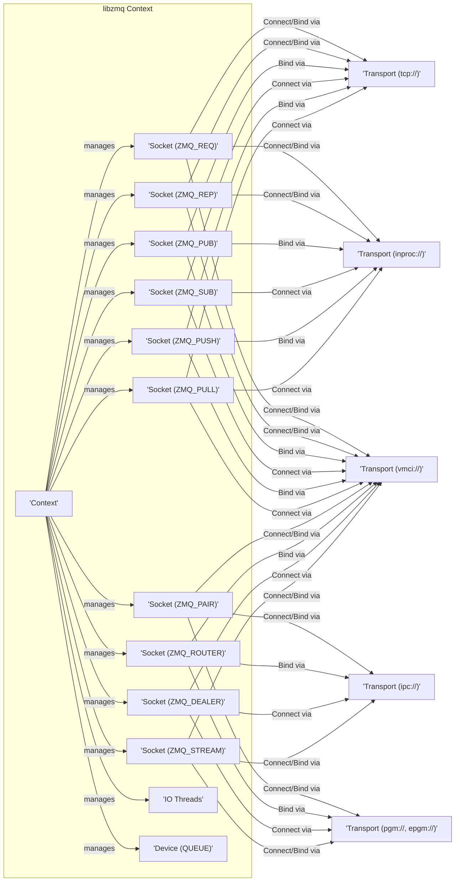
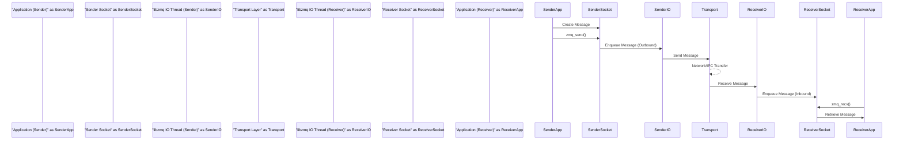

## Project Design Document: libzmq

**1. Introduction**

*   **Purpose:** This document provides a comprehensive architectural blueprint of the `libzmq` library, a high-performance asynchronous messaging framework. Its primary goal is to serve as a detailed reference for subsequent threat modeling exercises, enabling a thorough security analysis of the library and its potential vulnerabilities.
*   **Scope:** This document focuses on the core architectural concepts, fundamental components, and the flow of data within `libzmq`. It details the key abstractions and their interactions, providing a solid understanding of the library's internal workings. The scope intentionally excludes in-depth explanations of every specific transport protocol implementation or the intricacies of individual language bindings.
*   **Audience:** This document is primarily intended for security engineers, software developers, and system architects who require a deep understanding of `libzmq`'s architecture for security assessments, vulnerability identification, and threat mitigation planning.

**2. Overview of libzmq**

*   `libzmq` (ZeroMQ or ØMQ) is a versatile, high-performance asynchronous messaging library designed to simplify the development of concurrent and distributed applications.
*   It offers an abstraction layer over various underlying transport protocols, allowing developers to focus on messaging patterns rather than low-level network details.
*   `libzmq` implements common messaging patterns like publish/subscribe, request/reply, and push/pull, enabling flexible communication architectures.
*   The library emphasizes ease of use and high performance, facilitating the creation of scalable and resilient messaging systems.
*   Key characteristics include:
    *   **Connectionless Sockets:**  Sockets can send and receive messages without establishing persistent connections in the traditional sense.
    *   **Multiple Transport Protocol Support:**  Supports a variety of transport mechanisms, including TCP, IPC, in-process communication, and multicast.
    *   **Asynchronous I/O:**  Enables non-blocking operations, improving application responsiveness and concurrency.
    *   **Message Filtering and Routing:**  Provides mechanisms for filtering messages based on content and routing them to appropriate recipients.
    *   **Built-in Messaging Patterns:**  Offers pre-defined patterns that simplify common communication scenarios.

**3. Architectural Components**

*   **Context:** The fundamental building block of `libzmq`. A context represents an independent I/O processing environment. All sockets created within the same context share the same I/O threads. Applications can utilize multiple contexts for isolation or concurrency management.
*   **Sockets:** The communication endpoints in `libzmq`. Sockets are typed according to the messaging pattern they implement.
    *   `ZMQ_REQ` ("Request"): Used by a client to send a request to a service. It expects to receive exactly one reply for each request.
    *   `ZMQ_REP` ("Reply"): Used by a service to receive requests and send replies. It must receive a request before sending a reply.
    *   `ZMQ_PUB` ("Publish"): Used to broadcast messages to multiple subscribers. Publishers do not know which subscribers are connected.
    *   `ZMQ_SUB` ("Subscribe"): Used to receive messages published on a specific topic. Subscribers must explicitly subscribe to topics of interest.
    *   `ZMQ_PUSH` ("Push"): Used to distribute messages to connected "pull" sockets in a load-balanced fashion (fair-queuing).
    *   `ZMQ_PULL` ("Pull"): Used to receive messages pushed from connected "push" sockets.
    *   `ZMQ_PAIR` ("Exclusive Pair"): Establishes a one-to-one, exclusive communication channel between two connected sockets.
    *   `ZMQ_ROUTER` ("Dealer Router"): Used for advanced request-reply patterns, allowing routing of replies back to the correct requesting client based on message identity.
    *   `ZMQ_DEALER` ("Dealer"): Used for advanced request-reply patterns, automatically adding an identity to outgoing messages for routing purposes.
    *   `ZMQ_STREAM` ("Stream"): Provides a raw stream of unordered messages, offering lower-level control over communication.
*   **Transports:** The underlying mechanisms used to transmit data between sockets.
    *   `tcp://` ("TCP"): Transmission Control Protocol over IP networks, enabling communication across network boundaries.
    *   `ipc://` ("IPC"): Inter-Process Communication using Unix domain sockets, facilitating communication between processes on the same machine.
    *   `inproc://` ("In-Process"):  Communication within the same process, offering the lowest overhead.
    *   `pgm://`, `epgm://` ("PGM/EPGM"): Pragmatic General Multicast (reliable multicast protocols).
    *   `vmci://` ("VMCI"): VMware Communication Interface, optimized for communication between virtual machines.
*   **IO Threads:** Internal threads managed by the `zmq_ctx_t` context. These threads are responsible for handling asynchronous I/O operations on the sockets within that context. The number of IO threads is configurable and impacts the concurrency and throughput of the library.
*   **Message Envelopes:** Messages in `libzmq` can consist of one or more parts (frames). This structure allows for more complex message structures.
    *   **Identity:**  An optional identifier attached to a message, particularly relevant for routing in socket types like `ROUTER`.
    *   **Content:** The actual data payload of the message frame.
    *   **More Flag:** A flag indicating whether there are additional message parts (frames) following the current one.
*   **Device:** Specialised, built-in message forwarding utilities that sit between sockets.
    *   `QUEUE` ("Queue Device"): An intermediary that connects a frontend socket to a backend socket, providing message buffering and load balancing.

**4. Data Flow**

The flow of data within `libzmq` involves a series of steps, which vary depending on the chosen messaging pattern and transport protocol. The following describes a general data flow for sending and receiving messages:

*   **Message Construction:** The sending application creates a message. This message can consist of one or more frames, allowing for structured data.
*   **Send Operation Invocation:** The application calls a `zmq_send` function on a specific socket, providing the message data and flags (e.g., non-blocking).
*   **Message Enqueueing (Outbound):** The `libzmq` library enqueues the message in the outgoing queue associated with the sending socket.
*   **IO Thread Processing (Send):** An available IO thread within the context picks up messages from the socket's outbound queue.
*   **Transport Layer Handling (Send):** The IO thread utilizes the configured transport protocol to transmit the message to the intended recipient(s). This involves transport-specific operations (e.g., TCP socket writes, IPC channel writes).
*   **Reception at Destination:** The receiving `libzmq` instance receives the message via the appropriate transport protocol.
*   **IO Thread Processing (Receive):** An IO thread on the receiving side processes the incoming message.
*   **Message Enqueueing (Inbound):** The received message is enqueued in the inbound queue of the destination socket. For certain socket types (e.g., `SUB`), message filtering based on subscriptions occurs at this stage. For others like `ROUTER`, routing decisions based on message identity are made.
*   **Receive Operation Invocation:** The receiving application calls a `zmq_recv` function on its socket.
*   **Message Retrieval:** The `zmq_recv` function retrieves the message from the socket's inbound queue and makes it available to the application.

**5. Security Considerations**

*   **Message Content Validation:** `libzmq` itself performs minimal validation on the content of messages. Applications using `libzmq` are responsible for implementing robust input validation to prevent vulnerabilities like injection attacks (e.g., command injection, SQL injection if message content is used in database queries) or buffer overflows.
*   **Access Control and Authentication:** `libzmq` does not provide built-in mechanisms for authenticating communicating peers or controlling access to sockets. Applications requiring these features must implement them at a higher level, potentially using:
    *   Transport-level security (e.g., TLS for `tcp://` using `zmq_curve_server` and `zmq_curve_client`).
    *   Application-level authentication schemes embedded within messages.
    *   Operating system-level permissions for `ipc://` sockets.
*   **Transport Security Vulnerabilities:** The security of the communication channel is directly dependent on the chosen transport protocol.
    *   `tcp://`: Without TLS, communication is susceptible to eavesdropping (man-in-the-middle attacks) and tampering.
    *   `ipc://`: Security relies on the underlying file system permissions. Misconfigured permissions can lead to unauthorized access.
    *   `inproc://`: Generally considered secure as communication is confined within the same process boundary. However, vulnerabilities in the process itself could expose communication.
    *   `pgm://`, `epgm://`: Security depends on the network infrastructure and configuration. These are inherently less secure in open networks.
*   **Resource Exhaustion and Denial of Service (DoS):** Applications are vulnerable to resource exhaustion attacks if malicious actors send a large volume of messages. This can overwhelm receiving applications and lead to denial of service. Mitigation strategies include:
    *   Setting appropriate socket options like `ZMQ_RCVBUF` (receive buffer size) and `ZMQ_SNDBUF` (send buffer size).
    *   Implementing rate limiting or flow control mechanisms at the application level.
    *   Using filtering capabilities of `SUB` sockets to discard unwanted messages.
*   **Message Confidentiality and Integrity:** `libzmq` does not inherently encrypt message data or provide message integrity checks. Applications requiring these security features must implement them explicitly, for example, by:
    *   Encrypting messages before sending and decrypting them after receiving.
    *   Using message authentication codes (MACs) or digital signatures to ensure integrity.
*   **Dependency Vulnerabilities:**  The security of `libzmq` can be affected by vulnerabilities in its underlying dependencies (e.g., system libraries). Keeping `libzmq` and its dependencies up-to-date is crucial.
*   **Socket Option Misconfiguration:** Incorrectly configured socket options can introduce security vulnerabilities. For example, disabling security features or setting overly permissive options.

**6. Assumptions and Constraints**

*   It is assumed that the reader has a foundational understanding of networking principles and message queuing concepts.
*   This document primarily focuses on the core `libzmq` library implementation and does not delve into the specifics of individual language bindings or external libraries that might interact with it.
*   The subsequent threat modeling process will be based on the architectural details outlined in this document.
*   The responsibility for implementing specific security measures and best practices lies with the applications that utilize `libzmq`.

**7. Future Considerations**

*   Detailed analysis of the security implications of different `libzmq` socket options and their default values.
*   Investigation of potential vulnerabilities related to specific messaging patterns and their implementations within `libzmq`.
*   Assessment of the security challenges and best practices for deploying `libzmq` in distributed and cloud environments.
*   Exploration of advanced security features that could be integrated into `libzmq` in the future, such as built-in encryption or authentication mechanisms.
*   Analysis of the security impact of different threading models and concurrency patterns used with `libzmq`.
