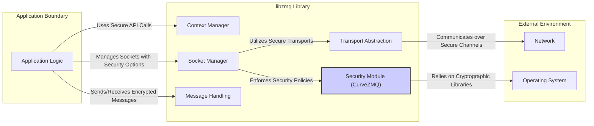

# Project Design Document: libzmq

**Version:** 1.1
**Date:** October 26, 2023
**Author:** AI Software Architect

## 1. Introduction

This document provides an enhanced and detailed design overview of the `libzmq` library, a high-performance asynchronous messaging library, as represented by the project hosted at [https://github.com/zeromq/libzmq](https://github.com/zeromq/libzmq). This document is specifically tailored to facilitate comprehensive threat modeling activities by clearly outlining the architecture, components, data flows, and security considerations of `libzmq`.

## 2. Goals and Objectives

The primary goal of this document is to provide a robust architectural understanding of `libzmq` specifically for security analysis and threat modeling. This document aims to:

*   Clearly identify all core components of `libzmq` and detail their interactions, highlighting potential attack surfaces.
*   Thoroughly describe the various messaging patterns supported by the library, including their inherent security characteristics and potential vulnerabilities.
*   Precisely outline the data flow through the library during message transmission and reception, pinpointing stages where security controls are applied or are lacking.
*   Explicitly highlight key security features, configuration options, and potential security weaknesses within the design.
*   Provide clear and accurate visual representations of the architecture and data flow to aid in understanding potential threat vectors.

## 3. System Overview

`libzmq` is a lightweight yet powerful messaging library designed for building scalable and concurrent applications. It abstracts away the complexities of underlying transport protocols, allowing developers to focus on application logic while providing robust asynchronous communication capabilities. The library's core strength lies in its flexible messaging patterns and transport independence.

Key characteristics of `libzmq` relevant to security analysis include:

*   **Asynchronous, Non-Blocking Operations:** While improving performance, this can introduce complexities in managing state and potential race conditions if not handled carefully.
*   **Diverse Messaging Patterns:** Each pattern has unique security implications regarding message visibility, delivery guarantees, and potential for abuse.
*   **Transport Flexibility:** The choice of transport significantly impacts the available security mechanisms and the attack surface.
*   **Optional Security Features:**  Security features like CurveZMQ are opt-in, requiring explicit configuration and potentially leaving deployments vulnerable if not enabled.
*   **Decentralized Nature:**  `libzmq` facilitates peer-to-peer communication, which can complicate security policy enforcement and auditing.

## 4. Key Components

The following are the core components of the `libzmq` library, described with a focus on their relevance to security:

*   **Context (`zmq_ctx_t`):**
    *   The global environment for `libzmq` operations within a process.
    *   Manages resources like I/O threads and file descriptors, which could be targets for resource exhaustion attacks.
    *   Configuration options related to thread affinity and maximum sockets can impact performance and potentially security.
*   **Socket (`zmq_socket_t`):**
    *   The primary interface for sending and receiving messages.
    *   The type of socket (e.g., `ZMQ_PUB`, `ZMQ_SUB`) dictates its communication behavior and security implications. For example, `ZMQ_SUB` without proper filtering can be susceptible to receiving unwanted or malicious messages.
    *   Socket options control various aspects of behavior, including security settings for specific transports (e.g., TCP keep-alive).
*   **Message (`zmq_msg_t`):**
    *   The container for data exchanged between sockets.
    *   Lack of inherent size limits could lead to memory exhaustion if not handled by the application.
    *   Message metadata is minimal, potentially limiting the ability to track message origin or integrity without application-level additions.
*   **I/O Thread:**
    *   Internal threads responsible for handling network operations.
    *   Vulnerabilities within these threads could compromise the entire `libzmq` instance.
    *   The number of I/O threads can impact performance and resource consumption.
*   **Transport:**
    *   The underlying protocol used for communication. Each transport has its own security characteristics:
        *   **TCP:** Susceptible to network attacks like eavesdropping and man-in-the-middle if not secured with TLS.
        *   **IPC (Unix Domain Sockets):** Security relies on file system permissions. Misconfigured permissions can lead to unauthorized access.
        *   **Inproc (In-Process):** Generally considered secure within the process boundary but vulnerabilities in message handling could still be exploited.
        *   **Multicast (PGM/EPGM):** Inherently lacks confidentiality and integrity guarantees without additional security measures.
*   **Security Layer (CurveZMQ):**
    *   Provides end-to-end encryption and authentication using the Curve25519 elliptic curve algorithm.
    *   Relies on proper key generation, distribution, and storage. Compromised keys can lead to complete security breakdown.
    *   Configuration is crucial; incorrect configuration can lead to communication failures or weakened security.
*   **Device (`zmq_proxy`, `zmq_stream`):**
    *   Specialized socket types that can introduce additional attack vectors if not configured securely. For example, an open `zmq_proxy` could be abused to forward malicious traffic.
*   **Error Handling:**
    *   While providing error information, overly verbose error messages could potentially leak sensitive information.
    *   Insufficient error handling could mask security issues or make debugging vulnerabilities more difficult.

## 5. Data Flow

Understanding the data flow is crucial for identifying potential interception or manipulation points. The typical data flow within `libzmq` involves:

1. The sending **Application** creates a **Message**.
2. The application sends the **Message** through a **Socket**.
3. The **Socket** enqueues the message for sending.
4. The **I/O Thread** associated with the **Context** picks up the message.
5. If **CurveZMQ** is enabled, the message is encrypted using the configured keys.
6. The message is transmitted over the selected **Transport**.
7. On the receiving end, the **Transport** receives the message.
8. The receiving **I/O Thread** processes the incoming message.
9. If **CurveZMQ** is enabled, the message is decrypted.
10. The message is placed in the receive queue of the destination **Socket**.
11. The receiving **Application** retrieves the **Message** from the **Socket**.

```mermaid
graph LR
    subgraph "Sending Application Process"
        SA["Sending Application"]
        SM["Send Message Call"]
        SMSG["Sending Message Object"]
    end
    subgraph "libzmq Sender"
        SS["Sending Socket"]
        SSQ["Send Queue"]
        SIOT["Sender I/O Thread"]
        SENC["CurveZMQ Encryption (Optional)"]
        ST["Transport (e.g., TCP)"]
    end
    subgraph "Network"
        NW["Network Medium"]
    end
    subgraph "libzmq Receiver"
        RT["Transport (e.g., TCP)"]
        RIOT["Receiver I/O Thread"]
        RDEC["CurveZMQ Decryption (Optional)"]
        RSQ["Receive Queue"]
        RS["Receiving Socket"]
    end
    subgraph "Receiving Application Process"
        RA["Receiving Application"]
        RM["Receive Message Call"]
        RMSG["Receiving Message Object"]
    end

    SA -- "Creates" --> SMSG
    SA -- "Calls zmq_send" --> SM
    SM -- "Passes Message" --> SS
    SS -- "Enqueues" --> SSQ
    SSQ -- "Handles" --> SIOT
    SIOT -- "Encrypts" --> SENC
    SENC -- "Transmits over" --> ST
    ST -- "Travels through" --> NW
    NW -- "Arrives via" --> RT
    RT -- "Handles" --> RIOT
    RIOT -- "Decrypts" --> RDEC
    RDEC -- "Enqueues" --> RSQ
    RSQ -- "Delivers to" --> RS
    RS -- "Notifies" --> RA
    RA -- "Calls zmq_recv" --> RM
    RM -- "Receives" --> RMSG

    style SA fill:#f9f,stroke:#333,stroke-width:2px
    style RA fill:#ccf,stroke:#333,stroke-width:2px
```

## 6. Messaging Patterns and Security Implications

Each messaging pattern in `libzmq` has distinct security implications:

*   **Request-Reply (REQ/REP):**
    *   **Implication:**  Ensures a response for every request, but a malicious responder could send unexpected or harmful data. Spoofing requests is possible if not authenticated.
    *   **Threats:** Replay attacks, denial of service by not responding, injection of malicious data in replies.
*   **Publish-Subscribe (PUB/SUB):**
    *   **Implication:**  Publishers are anonymous, making it difficult to verify the source of messages. Subscribers receive all messages matching their filters, potentially leading to information overload or exposure to unwanted content.
    *   **Threats:** Message injection by unauthorized publishers, information disclosure to unintended subscribers if filtering is insufficient.
*   **Pipeline (PUSH/PULL):**
    *   **Implication:**  Unidirectional flow with load balancing. Security concerns are similar to PUB/SUB regarding the trustworthiness of senders.
    *   **Threats:**  Injection of malicious tasks or data by unauthorized pushers.
*   **Exclusive Pair (PAIR):**
    *   **Implication:**  Simple, direct connection. Security relies heavily on the security of the two endpoints.
    *   **Threats:**  If one endpoint is compromised, the communication is compromised.
*   **Dealer-Router (DEALER/ROUTER):**
    *   **Implication:**  More complex routing with identity management. Misconfiguration of routing can lead to messages being delivered to unintended recipients.
    *   **Threats:**  Message misrouting, impersonation if identities are not properly managed.

## 7. Security Considerations (Detailed)

This section expands on potential security vulnerabilities and best practices:

*   **Transport Layer Security:**
    *   **TCP:** Always consider using TLS/SSL (`zmq_tcp_connect()` with appropriate options) for TCP transports in untrusted networks to ensure confidentiality and integrity.
    *   **IPC:** Secure file system permissions are critical for IPC transports. Restrict access to the socket file to authorized users.
    *   **Multicast:**  Avoid using multicast for sensitive data without strong encryption as it lacks inherent security.
*   **CurveZMQ Best Practices:**
    *   **Key Management:** Implement a secure key generation, distribution, and storage mechanism. Avoid hardcoding keys.
    *   **Authentication:**  Leverage CurveZMQ's authentication to verify the identity of communicating peers.
    *   **Authorization:** CurveZMQ provides authentication but not authorization. Implement application-level authorization to control access to specific resources or actions.
*   **Input Validation:**
    *   Always validate data received from `libzmq` sockets to prevent injection attacks or unexpected behavior. This includes checking message size, format, and content.
*   **Resource Management:**
    *   Implement safeguards against resource exhaustion attacks, such as limiting the number of connections, message queue sizes, and message sizes.
*   **Denial of Service (DoS) Prevention:**
    *   Implement rate limiting on message processing to prevent malicious actors from overwhelming the application.
    *   Be mindful of the potential for amplification attacks in certain messaging patterns.
*   **Buffer Overflows:**
    *   While `libzmq` handles memory management internally, be cautious when copying data from received messages into fixed-size buffers in your application code.
*   **Configuration Security:**
    *   Review and secure all `libzmq` configuration options. Avoid insecure defaults.
    *   Be cautious when binding sockets to wildcard addresses (`0.0.0.0`) in production environments.
*   **Dependency Management:**
    *   Keep `libzmq` and its dependencies up-to-date to patch known security vulnerabilities.
*   **Error Handling and Logging:**
    *   Implement robust error handling but avoid logging sensitive information in error messages.
    *   Use logging to monitor for suspicious activity.

## 8. Deployment Considerations and Security Implications

The deployment environment significantly impacts the security posture of `libzmq`:

*   **Public Networks:**  Requires strong encryption (TLS/SSL or CurveZMQ) and authentication for all communication.
*   **Private Networks:** While less exposed, still requires careful consideration of internal threats and may benefit from encryption for sensitive data.
*   **Cloud Environments:**  Leverage cloud provider security features (e.g., VPCs, security groups) in addition to `libzmq`'s security mechanisms.
*   **Containerized Environments:** Secure container images and network policies are crucial.
*   **Embedded Systems:** Resource constraints may limit the feasibility of certain security features. Careful trade-offs may be necessary.

## 9. Future Considerations

Future security enhancements in `libzmq` could include:

*   **Standardized Authentication and Authorization Frameworks:**  Moving beyond basic key-based authentication.
*   **Built-in Rate Limiting and DoS Protection Mechanisms:**  Reducing the burden on application developers.
*   **Improved Auditing and Logging Capabilities:**  Facilitating security monitoring and incident response.
*   **Formal Security Audits:**  Regularly assessing the codebase for potential vulnerabilities.

## 10. Diagrams

### 10.1. High-Level Architecture with Security Focus

### 10.2. Detailed Message Flow with Security Checks

```mermaid
graph LR
    subgraph "Sender"
        SA["Sending Application"]
        SM["Send Call"]
        SMSG["Message"]
    end
    subgraph "libzmq Send Path"
        SS["Send Socket"]
        SQ["Send Queue"]
        SIOT["I/O Thread"]
        SAuth["Authentication Check"]
        SEnc["Encryption"]
        ST["Transport Send"]
    end
    subgraph "Network"
        NW["Network"]
    end
    subgraph "libzmq Receive Path"
        RT["Transport Receive"]
        RIOT["I/O Thread"]
        RAuth["Authentication Check"]
        RDec["Decryption"]
        RQ["Receive Queue"]
        RS["Receive Socket"]
    end
    subgraph "Receiver"
        RA["Receiving Application"]
        RM["Receive Call"]
        RMSG["Message"]
    end

    SA -- "Sends" --> SMSG
    SM -- "Passes to" --> SS
    SS -- "Enqueues" --> SQ
    SQ -- "Handles" --> SIOT
    SIOT -- "Performs" --> SAuth
    SAuth -- "Encrypts" --> SEnc
    SEnc -- "Sends via" --> ST
    ST -- "Travels through" --> NW
    NW -- "Arrives at" --> RT
    RT -- "Handles" --> RIOT
    RIOT -- "Performs" --> RAuth
    RAuth -- "Decrypts" --> RDec
    RDec -- "Enqueues" --> RQ
    RQ -- "Delivers to" --> RS
    RS -- "Notifies" --> RA
    RM -- "Receives" --> RMSG

    style SAuth fill:#ccf,stroke:#333,stroke-width:2px
    style SEnc fill:#ccf,stroke:#333,stroke-width:2px
    style RAuth fill:#ccf,stroke:#333,stroke-width:2px
    style RDec fill:#ccf,stroke:#333,stroke-width:2px
```

This improved design document provides a more in-depth analysis of `libzmq` with a strong focus on security considerations. This detailed information will be invaluable for conducting thorough and effective threat modeling exercises.