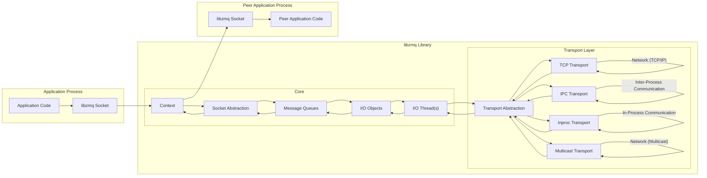

Okay, here's an improved version of the project design document for `libzmq`, incorporating more detail and focusing on aspects relevant for threat modeling.

```markdown
## Project Design Document: libzmq Messaging Library

**Document Version:** 1.1
**Date:** October 26, 2023
**Author:** Gemini (AI Expert in Software, Cloud, and Cybersecurity Architecture)

---

### 1. Introduction

This document provides a detailed design overview of the `libzmq` (ZeroMQ) messaging library, an open-source, high-performance asynchronous messaging library. This document is intended to serve as a foundation for subsequent threat modeling activities. It outlines the system architecture, key components, data flows, and technologies involved in `libzmq`.  This document aims to provide a clear and comprehensive understanding of `libzmq`'s internal workings and external interfaces from a security perspective, focusing on aspects relevant to potential vulnerabilities and attack vectors.

### 2. Goals and Objectives

The primary goals of this design document are:

* **Detailed System Description:** To provide a comprehensive and detailed description of the `libzmq` library's architecture, components, and functionalities, with a focus on security-relevant aspects.
* **Foundation for Threat Modeling:** To create a clear and structured document that can be readily used as input for threat modeling exercises, identifying potential security vulnerabilities, attack surfaces, and risks.
* **Improved Understanding:** To enhance understanding of `libzmq`'s internal workings for developers, security analysts, and anyone interested in its architecture and security posture.
* **Communication Tool:** To serve as a communication tool for discussing the design and security aspects of `libzmq` among different stakeholders, facilitating security reviews and discussions.

### 3. Target Audience

This document is intended for the following audiences:

* **Security Architects and Engineers:**  To understand the architecture for threat modeling, vulnerability assessment, and security analysis.
* **Software Developers:** To gain a deeper understanding of `libzmq`'s internal design and how to use it securely in their applications, considering potential security pitfalls.
* **System Administrators:** To understand the deployment and operational aspects of applications using `libzmq` and the security implications of different transport choices and configurations.
* **Project Stakeholders:** To provide a high-level overview of the system's design and security considerations, ensuring security is addressed throughout the project lifecycle.

### 4. System Architecture Overview

`libzmq` is designed as a lightweight, embedded networking library that acts as a concurrency framework. It provides message-based communication patterns over various transports. The core architectural principles are:

* **Sockets as Abstraction:**  `libzmq` abstracts network communication through sockets, but these are not traditional operating system sockets. They are higher-level abstractions representing messaging endpoints with specific communication patterns.
* **Asynchronous Operations:**  All operations are designed to be non-blocking, enabling high concurrency and performance. This asynchronicity is crucial for handling multiple connections and messages efficiently.
* **Message-Oriented:** Communication is based on discrete messages, not byte streams. This simplifies application development and allows for structured data exchange.
* **Transport Agnostic:**  Supports various transports like TCP, IPC, inproc, and multicast, allowing flexibility in deployment environments and communication needs. Each transport has different security characteristics.
* **Brokerless Architecture:**  Typically operates without a central message broker, enabling direct peer-to-peer communication and reducing single points of failure. However, this also means security responsibilities are distributed across communicating peers.

The high-level architecture can be visualized as follows:



### 5. Detailed Component Description

#### 5.1. Context

* **Role:** The `zmq_ctx_t` (Context) is the core container in `libzmq`. It represents an I/O processing context, similar to a thread pool or an event loop. All sockets are created within a context.
* **Functionality:**
    * **Resource Management:** Manages I/O threads, file descriptors, and memory allocations for all sockets within it.
    * **Concurrency Control:** Provides the foundation for concurrency by managing I/O threads that handle socket operations asynchronously.
    * **Socket Factory:**  Used to create and manage `zmq_socket_t` instances.
* **Security Implications:**
    * **Resource Limits:**  Contexts can be configured with limits on resources (e.g., number of I/O threads). Improperly configured contexts could lead to resource exhaustion attacks if an attacker can create excessive sockets or trigger resource-intensive operations.
    * **Isolation:** Contexts provide a degree of isolation between different parts of an application or different applications using `libzmq`. However, this isolation is within the same process unless process-level isolation is also enforced by the OS.
    * **Context Termination:**  Forcibly terminating a context might lead to data loss or unexpected behavior if not handled gracefully by the application.

#### 5.2. Sockets

* **Role:** `zmq_socket_t` (Socket) is the abstraction for communication endpoints.  Sockets are typed based on communication patterns (e.g., PUB, SUB, REQ, REP, PUSH, PULL, PAIR).
* **Functionality:**
    * **Message Send/Receive:** Provides APIs (`zmq_send`, `zmq_recv`) for sending and receiving messages.
    * **Communication Patterns:** Enforces specific messaging patterns (request-reply, publish-subscribe, etc.) based on the socket type.
    * **Socket Options:** Configurable via `zmq_setsockopt` and `zmq_getsockopt` to control socket behavior, including timeouts, buffering, and transport-specific settings.
    * **Binding and Connecting:** Sockets can be bound to an address (for accepting connections) or connected to an address (for initiating connections).
* **Socket Types and Security Considerations:**
    * **PUB/SUB:**  Publisher sockets broadcast messages to all subscribers. Subscribers receive all messages (or filtered messages if subscriptions are used).  *Security*: No built-in access control. Any subscriber can receive all published messages.  Potential for information disclosure if sensitive data is published without proper authorization mechanisms at the application level.
    * **REQ/REP:** Request-reply pattern. Request sockets send requests and expect a single reply. Reply sockets receive requests and send replies. *Security*:  Basic request-response integrity. However, no authentication or authorization at the `libzmq` level. Vulnerable to request forgery or replay attacks if application-level security is not implemented.
    * **PUSH/PULL:** Push sockets send messages downstream to connected pull sockets in a load-balanced manner. *Security*:  Unidirectional flow. No inherent security mechanisms.
    * **PAIR:**  One-to-one, exclusive communication between two connected sockets. *Security*:  Point-to-point, but no built-in security.
    * **DEALER/ROUTER:**  Advanced request-reply patterns, allowing for more complex routing and load balancing. *Security*:  More complex routing can introduce vulnerabilities if routing logic is flawed or if message headers are not handled securely.
* **Security Implications (General Sockets):**
    * **Socket Options:**  Incorrectly setting socket options can lead to vulnerabilities. For example, disabling flow control might lead to buffer overflows or DoS.
    * **Unauthenticated Communication:** By default, `libzmq` does not provide authentication or encryption. Applications must implement these features at a higher level or use transport-level security (like CurveZMQ for TCP, if configured and used).
    * **Address Binding/Connection:** Binding to wildcard addresses (e.g., `tcp://*:5555`) can expose services to unintended networks. Connecting to untrusted endpoints can expose the application to malicious peers.
    * **Message Handling:**  Sockets receive raw messages. Applications are responsible for message parsing, validation, and deserialization. Vulnerabilities in message handling logic can be exploited.

#### 5.3. Transports

* **Role:**  Transport layers handle the actual transmission of messages over different communication mediums.
* **Types and Security Characteristics:**
    * **TCP (Transmission Control Protocol):** Communication over IP networks. *Security*:  Inherits TCP/IP security concerns. Vulnerable to network sniffing, man-in-the-middle attacks if not encrypted. `libzmq` supports CurveZMQ for encryption over TCP, providing strong authentication and encryption.
    * **IPC (Inter-Process Communication):** Communication between processes on the same machine using Unix domain sockets or Windows named pipes. *Security*:  Relies on operating system file permissions for access control. If IPC paths are predictable or permissions are misconfigured, unauthorized processes might be able to eavesdrop or inject messages.
    * **Inproc (In-Process Communication):**  Communication between threads within the same process. *Security*:  Fastest transport, but offers no security boundary beyond process isolation. Vulnerable if threads within the process are compromised.
    * **Multicast (UDP Multicast):**  One-to-many communication over a network using UDP multicast. *Security*:  UDP is connectionless and unreliable. Multicast adds complexity in terms of network configuration and potential for message loss or duplication. No inherent security, and multicast traffic can be easily intercepted on the network.
* **Security Implications (Transports):**
    * **Transport Choice:** Selecting the appropriate transport is crucial for security. Inproc is suitable for internal components, while TCP or IPC might be needed for external communication, each with different security considerations.
    * **Configuration:**  Transport configuration (e.g., TCP port, IPC path, multicast address) needs to be carefully managed to avoid unintended exposure or access.
    * **Encryption (TCP):**  For TCP, enabling and properly configuring CurveZMQ is essential for secure communication over untrusted networks.  Lack of encryption exposes data in transit.
    * **Permissions (IPC):**  IPC paths and file permissions must be set correctly to restrict access to authorized processes only.

#### 5.4. I/O Threads

* **Role:**  I/O threads are background threads managed by the `zmq_context_t`. They handle asynchronous I/O operations for sockets, such as sending and receiving messages, and managing network connections.
* **Functionality:**
    * **Asynchronous I/O:**  Perform non-blocking system calls for network operations, preventing the main application thread from blocking.
    * **Event Handling:**  Monitor sockets for events (readiness to send/receive, connection status) and trigger callbacks or notifications.
    * **Message Dispatching:**  Move messages between sockets and message queues.
* **Security Implications:**
    * **Resource Exhaustion:**  If an attacker can flood the system with connection requests or messages, I/O threads might become overloaded, leading to denial of service.
    * **Thread Safety:**  `libzmq` is designed to be thread-safe internally. However, vulnerabilities in thread synchronization or data sharing within I/O threads could potentially lead to race conditions or other concurrency-related issues.
    * **Privilege Escalation (Less likely, but consider):**  If I/O threads operate with elevated privileges (which is generally not the case for `libzmq` itself, but could be in specific application contexts), vulnerabilities in these threads could be exploited for privilege escalation.

#### 5.5. Message Queues

* **Role:**  Message queues are internal data structures used to buffer messages between different components of `libzmq`, such as between sockets and I/O threads, or between transport layers and sockets.
* **Functionality:**
    * **Buffering:**  Temporarily store messages when send/receive operations cannot be completed immediately (e.g., due to network congestion or slow consumers).
    * **Flow Control:**  Help manage message flow and prevent overwhelming consumers or network links.
    * **Message Ordering (in some patterns):**  Maintain message order for certain socket types (e.g., REQ/REP).
* **Security Implications:**
    * **Denial of Service (DoS):**  If message queues are unbounded or excessively large, an attacker could flood the system with messages, filling up queues and causing memory exhaustion or performance degradation (queue exhaustion DoS).
    * **Message Injection (If queues are externally accessible - unlikely in standard `libzmq` usage):** In highly unusual scenarios where internal queues are somehow exposed (which is not typical and would be a significant design flaw in an application using `libzmq`), an attacker might attempt to inject malicious messages directly into the queues.
    * **Data Loss:**  Queue overflows or improper queue management could lead to message loss, which might have security implications in certain applications.

### 6. Data Flow Description

The typical message flow in `libzmq` can be described as follows:

1. **Application Send:** The application calls `zmq_send` on a socket.
2. **Socket Processing:** The socket abstraction within `libzmq` performs initial message processing (e.g., message framing, routing decisions based on socket type).
3. **Message Queuing:** The message is placed into an internal message queue associated with the socket or the I/O thread responsible for that socket.
4. **I/O Thread Handling:** An I/O thread picks up the message from the queue.
5. **Transport Layer Interaction:** The I/O thread interacts with the appropriate transport layer (TCP, IPC, etc.) to transmit the message over the network or inter-process communication channel.
6. **Network/IPC Transmission:** The message is transmitted over the chosen medium to the peer.
7. **Peer Reception:** On the receiving side, the transport layer receives the message.
8. **I/O Thread Reception:** An I/O thread on the receiving peer's side receives the message from the transport layer.
9. **Message Queuing (Receive Side):** The received message is placed into a message queue associated with the receiving socket.
10. **Socket Delivery:** The socket abstraction delivers the message to the application when the application calls `zmq_recv`.
11. **Application Receive:** The application receives the message via `zmq_recv`.

**Message Structure:** `libzmq` messages are typically composed of frames. A message can consist of one or more frames.  The first frame might contain routing information or metadata, and subsequent frames contain the actual payload. Applications are responsible for defining and interpreting the message structure and encoding within the frames.

**Routing and Filtering (PUB/SUB):** In PUB/SUB patterns, publishers send messages without knowing specific subscribers. Subscribers can use subscriptions to filter messages based on a prefix. Routing and filtering are handled within the `libzmq` library based on socket types and subscriptions.

**Error Handling:** `libzmq` provides error codes for various operations. Applications should check return values of `zmq_send`, `zmq_recv`, and other functions to handle errors gracefully. Unhandled errors can lead to unexpected behavior or security vulnerabilities.

### 7. Security Considerations Summary

* **Lack of Built-in Security:** Core `libzmq` provides minimal built-in security features like authentication or encryption. Security is primarily the responsibility of the application developer.
* **Transport Security:**  Security posture heavily depends on the chosen transport. TCP requires encryption (e.g., CurveZMQ) for secure communication over networks. IPC relies on OS permissions. Inproc offers no network security. Multicast is inherently insecure.
* **Input Validation:** Applications must validate all incoming messages to prevent injection attacks, buffer overflows, or other vulnerabilities arising from malformed messages.
* **Resource Management:**  Properly configure context and socket options to limit resource consumption and prevent DoS attacks. Monitor resource usage and implement appropriate rate limiting or throttling at the application level if needed.
* **Access Control:** Implement application-level authentication and authorization mechanisms to control access to messaging endpoints and message content, especially in PUB/SUB scenarios.
* **Secure Configuration:**  Avoid binding to wildcard addresses, use strong encryption for TCP when communicating over networks, and set appropriate permissions for IPC.
* **Logging and Auditing:** Implement logging of security-relevant events (connection attempts, message exchanges, errors) at the application level to facilitate security monitoring and incident response.

### 8. Deployment Considerations

* **Environment:** Deployment environment (local machine, trusted network, untrusted network, cloud environment) dictates the appropriate transport and security measures.
* **Transport Selection:**
    * **Inproc:** For internal communication within a process, minimal security concerns within the process boundary.
    * **IPC:** For communication between processes on the same machine, ensure proper file system permissions.
    * **TCP:** For communication over networks, mandatory to use encryption (CurveZMQ) for untrusted networks. Consider network segmentation and firewalls to limit exposure.
    * **Multicast:**  Use with caution, primarily for discovery or non-critical data due to inherent insecurity and unreliability. Network configuration is critical.
* **Configuration Management:**  Securely manage `libzmq` configuration parameters, especially transport addresses, socket options, and security settings (if using CurveZMQ).
* **Monitoring:** Monitor application logs and system resources to detect potential security incidents or performance issues related to `libzmq` usage.

### 9. Conclusion

This design document provides a detailed overview of the `libzmq` messaging library, focusing on architectural components, data flows, and security considerations. It serves as a crucial input for threat modeling activities. By understanding the internal workings and potential security implications of `libzmq`, security analysts and developers can effectively identify and mitigate potential vulnerabilities in applications that rely on this powerful messaging library.  The next step is to use this document to perform a structured threat modeling exercise, such as STRIDE, to identify specific threats and develop appropriate security controls.