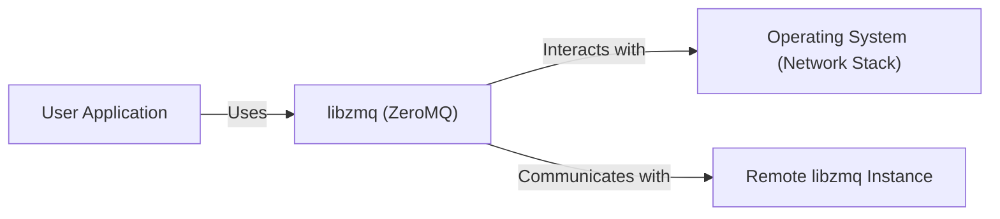
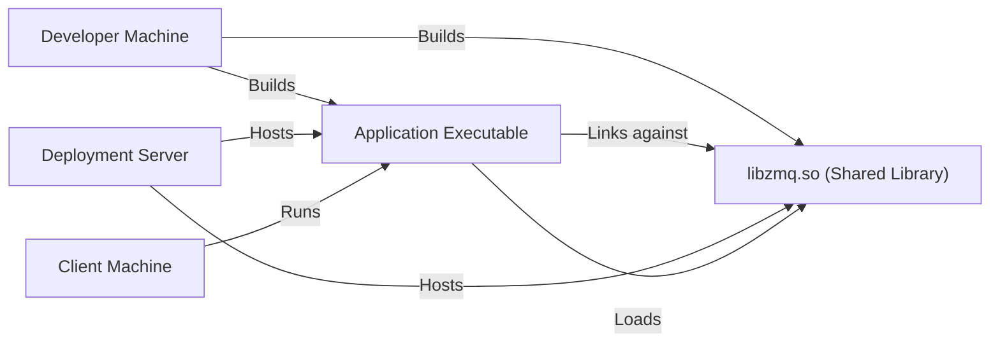
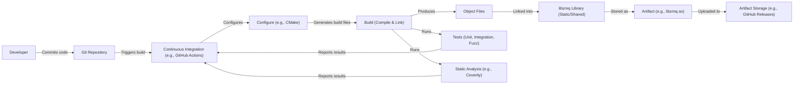

# BUSINESS POSTURE

Business Priorities and Goals:

*   Provide a high-performance, asynchronous messaging library.
*   Offer a flexible and versatile messaging system that supports various messaging patterns (e.g., PUB-SUB, REQ-REP, PUSH-PULL).
*   Ensure cross-platform compatibility and support multiple programming languages.
*   Maintain a stable and reliable core library.
*   Foster a vibrant open-source community and encourage contributions.
*   Minimize external dependencies to reduce complexity and potential vulnerabilities.
*   Provide comprehensive documentation and examples.

Most Important Business Risks:

*   Security vulnerabilities in the library that could lead to remote code execution, denial of service, or information disclosure.
*   Instability or performance issues that could disrupt applications relying on the library.
*   Lack of adoption due to complexity or poor documentation.
*   Inability to keep up with evolving messaging needs and technologies.
*   Loss of community support or key contributors.
*   Supply chain attacks targeting the library or its dependencies.

# SECURITY POSTURE

Existing Security Controls:

*   security control: Code reviews: The GitHub repository indicates a collaborative development process with pull requests, suggesting code reviews are performed.
*   security control: Community involvement: An active open-source community can help identify and address security issues.
*   security control: Fuzz testing: The project mentions fuzzing, which is a technique for finding vulnerabilities by providing invalid or unexpected inputs.
*   security control: Static analysis: The project uses static analysis tools to identify potential security vulnerabilities.
*   security control: AddressSanitizer (ASan): ASan is used to detect memory errors.
*   security control: Continuous Integration (CI): CI pipelines are used to automate testing and building.

Accepted Risks:

*   accepted risk: The library's core functionality relies on low-level networking and memory management, which inherently carries some risk.
*   accepted risk: The library supports a wide range of platforms and configurations, increasing the attack surface.
*   accepted risk: The library is written in C++, which is known for potential memory safety issues if not handled carefully.

Recommended Security Controls:

*   security control: Implement a comprehensive security policy and vulnerability disclosure program.
*   security control: Regularly conduct security audits and penetration testing.
*   security control: Integrate Software Composition Analysis (SCA) to track and manage dependencies and their vulnerabilities.
*   security control: Use a memory-safe language (e.g., Rust) for security-critical components, if feasible.
*   security control: Implement sandboxing or containerization to isolate the library from the host system.
*   security control: Provide clear security guidelines and best practices for users of the library.

Security Requirements:

*   Authentication:
    *   The library itself does not handle application-level authentication. It's the responsibility of applications using libzmq to implement appropriate authentication mechanisms. However, libzmq does support CURVE security, based on CurveZMQ protocol.
*   Authorization:
    *   Similar to authentication, libzmq does not implement application-level authorization. Applications must manage their own authorization logic.
*   Input Validation:
    *   The library should validate inputs to its API to prevent buffer overflows, format string vulnerabilities, and other common issues. Fuzz testing is crucial here.
    *   Applications using libzmq must also perform their own input validation on messages received from the network.
*   Cryptography:
    *   The library should use strong, well-vetted cryptographic algorithms for any security-sensitive operations (e.g., encryption, authentication with CURVE).
    *   The library supports encryption and authentication using the CURVE security mechanism (CurveZMQ protocol). This should be clearly documented and recommended for secure communication.
    *   Key management is a critical aspect of cryptography. The library should provide secure mechanisms for generating, storing, and exchanging keys, or clearly document how users should handle key management.

# DESIGN

## C4 CONTEXT

Element Descriptions:

*   Element:
    *   Name: User Application
    *   Type: Software System
    *   Description: An application that utilizes libzmq for messaging.
    *   Responsibilities: Sending and receiving messages, handling application logic.
    *   Security controls: Application-level security controls (authentication, authorization, input validation), secure coding practices.

*   Element:
    *   Name: libzmq (ZeroMQ)
    *   Type: Library
    *   Description: The ZeroMQ core library.
    *   Responsibilities: Providing a messaging API, managing sockets, handling message queuing and routing.
    *   Security controls: Input validation, fuzz testing, static analysis, ASan, CURVE security mechanism.

*   Element:
    *   Name: Operating System (Network Stack)
    *   Type: Operating System
    *   Description: The underlying operating system and its network stack.
    *   Responsibilities: Providing network sockets, managing network connections.
    *   Security controls: OS-level security controls (firewalls, network segmentation), regular security updates.

*   Element:
    *   Name: Remote libzmq Instance
    *   Type: Library
    *   Description: Another instance of libzmq running on a different machine.
    *   Responsibilities: Same as the local libzmq instance.
    *   Security controls: Same as the local libzmq instance.

## C4 CONTAINER

Since libzmq is a library, the container diagram is essentially an extension of the context diagram. The "containers" in this case are conceptual components within the library.

```mermaid
graph LR
    User["User Application"] -- Uses --> API["API (Public Interface)"]
    API -- Calls --> Core["Core Messaging Logic"]
    Core -- Interacts with --> Socket["Socket Management"]
    Socket -- Uses --> Network["Network I/O"]
    Network -- Communicates with --> RemoteNetwork["Remote Network I/O"]
    RemoteNetwork -- Interacts with --> RemoteSocket["Remote Socket Management"]
    RemoteSocket -- Uses --> RemoteCore["Remote Core Messaging Logic"]
    RemoteCore -- Calls --> RemoteAPI["Remote API (Public Interface)"]
    RemoteAPI -- Uses --> RemoteUser["Remote User Application"]

```

Element Descriptions:

*   Element:
    *   Name: User Application
    *   Type: Software System
    *   Description: An application that utilizes libzmq for messaging.
    *   Responsibilities: Sending and receiving messages, handling application logic.
    *   Security controls: Application-level security controls, secure coding practices.

*   Element:
    *   Name: API (Public Interface)
    *   Type: API
    *   Description: The public API exposed by libzmq.
    *   Responsibilities: Providing functions for creating sockets, sending and receiving messages, configuring options.
    *   Security controls: Input validation, clear documentation.

*   Element:
    *   Name: Core Messaging Logic
    *   Type: Component
    *   Description: The core logic for message queuing, routing, and handling different messaging patterns.
    *   Responsibilities: Implementing the ZeroMQ protocol, managing message queues, routing messages between sockets.
    *   Security controls: Careful memory management, robust error handling, adherence to the ZeroMQ protocol specification.

*   Element:
    *   Name: Socket Management
    *   Type: Component
    *   Description: Manages the lifecycle of ZeroMQ sockets.
    *   Responsibilities: Creating, binding, connecting, and closing sockets.
    *   Security controls: Resource management, proper handling of socket errors.

*   Element:
    *   Name: Network I/O
    *   Type: Component
    *   Description: Handles the actual sending and receiving of data over the network.
    *   Responsibilities: Interacting with the operating system's network stack, managing network connections.
    *   Security controls: Secure use of network APIs, protection against network-based attacks.

*   Element:
    *   Name: Remote Network I/O, Remote Socket Management, Remote Core Messaging Logic, Remote API (Public Interface), Remote User Application
    *   Type: Component, Component, Component, API, Software System
    *   Description: Corresponding components on the remote side of a ZeroMQ connection.
    *   Responsibilities: Mirror the responsibilities of their local counterparts.
    *   Security controls: Mirror the security controls of their local counterparts.

## DEPLOYMENT

libzmq is a library, so deployment typically involves linking it into an application.  There are several deployment scenarios:

1.  **Static Linking:** The libzmq code is compiled directly into the application executable.
2.  **Dynamic Linking:** The application links against a shared library (e.g., .so, .dll) at runtime.
3.  **Embedded Systems:** libzmq can be cross-compiled and deployed on embedded devices.
4.  **Containers:** Applications using libzmq can be deployed within containers (e.g., Docker).

We'll describe dynamic linking on a Linux system, as it's a common scenario.

Element Descriptions:

*   Element:
    *   Name: Developer Machine
    *   Type: Infrastructure Node
    *   Description: The machine where the application and libzmq are built.
    *   Responsibilities: Compiling code, running tests, creating build artifacts.
    *   Security controls: Secure development environment, access controls, regular security updates.

*   Element:
    *   Name: Application Executable
    *   Type: Software Artifact
    *   Description: The compiled application that uses libzmq.
    *   Responsibilities: Performing the application's specific tasks.
    *   Security controls: Secure coding practices, vulnerability scanning.

*   Element:
    *   Name: libzmq.so (Shared Library)
    *   Type: Software Artifact
    *   Description: The dynamically linked libzmq library.
    *   Responsibilities: Providing ZeroMQ functionality to the application.
    *   Security controls: Built with security flags, regularly updated.

*   Element:
    *   Name: Deployment Server
    *   Type: Infrastructure Node
    *   Description: The server where the application and libzmq are deployed.
    *   Responsibilities: Hosting the application and shared library.
    *   Security controls: Server hardening, firewalls, intrusion detection systems, regular security updates.

*   Element:
    *   Name: Client Machine
    *   Type: Infrastructure Node
    *   Description: A machine running the application that uses libzmq.
    *   Responsibilities: Executing the application.
    *   Security controls: Client-side security controls, regular security updates.

## BUILD

The build process for libzmq typically involves the following steps:

1.  **Developer:** A developer writes code and commits it to the Git repository.
2.  **Continuous Integration (CI):** A CI system (e.g., GitHub Actions, Travis CI) triggers a build on each commit.
3.  **Configuration:** The build system configures the build environment (e.g., using CMake).
4.  **Compilation:** The source code is compiled into object files.
5.  **Linking:** The object files are linked together to create the libzmq library (either static or shared).
6.  **Testing:** Automated tests (unit tests, integration tests, fuzz tests) are run.
7.  **Static Analysis:** Static analysis tools (e.g., Coverity, clang-tidy) are run to identify potential code quality and security issues.
8.  **Artifact Creation:** The build artifacts (e.g., libzmq.so, libzmq.a) are created.
9.  **Artifact Storage:** The build artifacts may be stored in a repository (e.g., GitHub Releases, a package manager repository).

Security Controls in the Build Process:

*   security control: **Continuous Integration (CI):** Automates the build and testing process, ensuring consistency and repeatability.
*   security control: **Static Analysis:** Identifies potential vulnerabilities early in the development lifecycle.
*   security control: **Fuzz Testing:** Helps discover vulnerabilities by providing invalid or unexpected inputs.
*   security control: **Dependency Management:** Tracking and managing dependencies to identify and mitigate known vulnerabilities.  (This should be improved with SCA).
*   security control: **Secure Build Environment:** The CI environment should be secured to prevent unauthorized access and tampering.
*   security control: **Code Signing:**  Signing the build artifacts can help ensure their integrity and authenticity (though not explicitly mentioned in the provided information, it's a recommended practice).

# RISK ASSESSMENT

Critical Business Processes to Protect:

*   Reliable and efficient message delivery between application components.
*   The integrity and confidentiality of messages (if encryption is used).
*   The availability of the messaging system.

Data to Protect and Sensitivity:

*   The content of messages: Sensitivity depends on the application using libzmq. Messages could contain sensitive data (e.g., personal information, financial data, trade secrets) or non-sensitive data.
*   Metadata about messages (e.g., source, destination, timing): Could be sensitive in some contexts, potentially revealing information about communication patterns.
*   Configuration data for libzmq: Could contain sensitive information like keys or credentials if not managed securely.

# QUESTIONS & ASSUMPTIONS

Questions:

*   What specific threat actors are most relevant to applications using libzmq (e.g., script kiddies, organized crime, nation-states)? This will influence the level of security required.
*   What are the specific regulatory requirements or compliance standards that apply to applications using libzmq?
*   What is the expected lifespan of applications using libzmq? This will impact the importance of long-term maintainability and security updates.
*   Are there any specific performance requirements or constraints for libzmq?
*   What level of expertise can be assumed for users of libzmq? This will influence the design of the API and documentation.
*   What are the specific deployment environments for applications using libzmq (e.g., cloud, on-premise, embedded systems)?
*   What is the process for handling security vulnerabilities discovered in libzmq?
*   Is there a formal security policy or vulnerability disclosure program in place?

Assumptions:

*   BUSINESS POSTURE: The primary goal is to provide a high-performance, reliable messaging library. Security is a high priority, but performance and usability cannot be sacrificed excessively.
*   SECURITY POSTURE: The development team is security-conscious and follows secure coding practices. The open-source nature of the project provides some level of security through community review.
*   DESIGN: The library is designed to be flexible and adaptable to various use cases. The core design is relatively stable, but new features and improvements are added regularly. The CURVE security mechanism is the preferred method for secure communication.