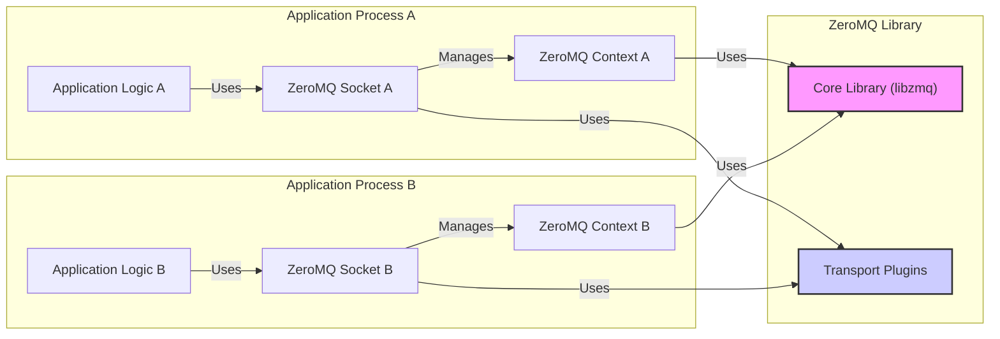

# Project Design Document: ZeroMQ (zeromq4-x)

**Version:** 1.1
**Date:** October 26, 2023
**Author:** AI Software Architect

## 1. Introduction

This document provides a detailed design overview of the ZeroMQ library (specifically the `zeromq4-x` branch). It is intended to serve as a foundation for threat modeling, offering a clear understanding of the system's components, interactions, and data flow. ZeroMQ is a high-performance, asynchronous messaging library for building distributed or concurrent applications. It implements message queues without requiring a central message broker.

## 2. Goals and Objectives

ZeroMQ aims to provide:

*   **High-Performance Messaging:** Low latency and high throughput.
*   **Scalable Communication:** Support for numerous concurrent connections and messages.
*   **Flexible Messaging Patterns:** Adaptable to various application communication needs.
*   **Easy Embedding:** Simple integration into existing applications.
*   **Transport Independence:** Support for multiple underlying communication protocols.

## 3. System Architecture

ZeroMQ employs a layered architecture, presenting a socket-like API for messaging.

### 3.1. High-Level Architecture Diagram

### 3.2. Key Components

*   **Core Library (libzmq):** Manages contexts, sockets, message framing, routing, and concurrency.
*   **Context:**  An I/O object managing threads and resources for ZeroMQ operations within a process. Applications create one or more contexts.
*   **Socket:** The interface for sending and receiving messages, implementing specific messaging patterns. Sockets connect to endpoints.
*   **Transport Plugins:** Implement communication over protocols like TCP, IPC, and others.
*   **Message:** The basic unit of communication, composed of one or more frames.
*   **Endpoint:** A string defining the transport protocol and address (e.g., `tcp://127.0.0.1:5555`).

### 3.3. Messaging Patterns

ZeroMQ supports several messaging patterns:

*   **Request-Reply (REQ/REP):** Synchronous request and response.
*   **Publish-Subscribe (PUB/SUB):** One-to-many message distribution based on topics.
*   **Pipeline (PUSH/PULL):** Unidirectional, load-balanced data distribution.
*   **Exclusive Pair (PAIR):** Connection between exactly two sockets.
*   **Dealer-Router (DEALER/ROUTER):** Asynchronous request-reply with advanced routing.

## 4. Component Details

### 4.1. Core Library (libzmq)

*   **Responsibilities:**
    *   Context management and resource allocation.
    *   Core messaging logic, including framing and routing.
    *   Socket API implementation.
    *   Concurrency and threading management.
    *   Loading and interacting with transport plugins.
*   **Internal Structure:**
    *   **IO Threads:** Handle network operations within a context.
    *   **Socket Engine:** Manages socket state and message queues.
    *   **Message Buffers:** Allocates and manages memory for messages.

### 4.2. Context

*   **Responsibilities:**
    *   Provides an isolated environment for ZeroMQ operations.
    *   Manages the lifecycle of associated sockets.
    *   Controls the number of I/O threads.
*   **Security Considerations:**
    *   Offers process-level isolation for ZeroMQ resources.

### 4.3. Socket

*   **Responsibilities:**
    *   API for sending and receiving messages.
    *   Implementation of specific messaging pattern logic.
    *   Connection management.
    *   Message queuing and flow control.
*   **Types:** `ZMQ_REQ`, `ZMQ_REP`, `ZMQ_PUB`, `ZMQ_SUB`, `ZMQ_PUSH`, `ZMQ_PULL`, `ZMQ_PAIR`, `ZMQ_DEALER`, `ZMQ_ROUTER`, etc.
*   **Security Considerations:**
    *   Socket options impact security (e.g., timeouts, encryption).
    *   The chosen socket type influences the communication model and potential vulnerabilities.

### 4.4. Transport Plugins

*   **Responsibilities:**
    *   Low-level communication protocol implementation.
    *   Connection establishment and management.
    *   Message serialization and deserialization.
*   **Examples:** `tcp`, `ipc`, `inproc`, `pgm`, `epgm`, `ws`, `wss`.
*   **Security Considerations:**
    *   Each transport has its own security characteristics and vulnerabilities.
    *   Some transports offer encryption (e.g., `wss`, `tcp` with `ZMQ_CURVE`).

### 4.5. Message

*   **Structure:** One or more frames of contiguous bytes.
*   **Management:** Memory allocation and deallocation handled by ZeroMQ.
*   **Security Considerations:**
    *   Message content requires protection (confidentiality, integrity).

## 5. Data Flow

The process of sending a message involves these steps:

```mermaid
graph LR
    subgraph "Sender Application"
        SA["Sender Socket"]
        MA["Message to Send"]
    end
    subgraph "ZeroMQ Library (Sender)"
        SF["Socket Framework"]
        MF["Message Framing"]
        TP["Transport Plugin (e.g., TCP)"]
    end
    subgraph "Network/IPC"
        NW["Network Medium"]
    end
    subgraph "ZeroMQ Library (Receiver)"
        TR["Transport Plugin (e.g., TCP)"]
        MU["Message Unframing"]
        SR["Socket Framework"]
    end
    subgraph "Receiver Application"
        SB["Receiver Socket"]
        MR["Received Message"]
    end

    MA -- "Send" --> SA
    SA -- "Handles" --> SF
    SF -- "Frames" --> MF
    MF -- "Uses" --> TP
    TP -- "Send over Transport" --> NW
    NW -- "Receive over Transport" --> TR
    TR -- "Unframes" --> MU
    MU -- "Handles" --> SR
    SR -- "Receives" --> SB
    SB -- "Delivers" --> MR
```

1. The sender application creates a message.
2. The message is passed to the sender socket.
3. The socket framework processes the message based on the socket type.
4. Message framing adds metadata.
5. The message is passed to the transport plugin.
6. The transport plugin serializes and sends the message.
7. The message travels through the network medium.
8. The receiver's transport plugin receives the message.
9. Message unframing extracts the original message.
10. The message is passed to the receiver's socket framework.
11. The receiver socket makes the message available to the application.
12. The receiver application receives the message.

## 6. Security Considerations

This section details potential security concerns:

*   **Transport Security:**
    *   **Eavesdropping:** Plain TCP or IPC are susceptible to interception. Mitigation: Use encrypted transports like `ZMQ_CURVE` over TCP or `wss`.
    *   **Man-in-the-Middle (MITM):** Attackers can intercept and manipulate messages. Mitigation: Employ strong authentication and encryption mechanisms provided by transports or application-level security.
    *   **Transport-Specific Vulnerabilities:** Each protocol has potential weaknesses. Mitigation: Stay updated on known vulnerabilities and use secure configurations.
*   **Authentication and Authorization:**
    *   ZeroMQ lacks built-in authentication. Mitigation: Implement application-level authentication or utilize transport-level security features like `ZMQ_CURVE`.
    *   Authorization needs to be implemented by the application. Mitigation: Design access control mechanisms based on message content or connection identity.
*   **Message Integrity:**
    *   Messages can be tampered with in transit. Mitigation: Implement message signing (e.g., using HMAC) or use secure transports.
*   **Denial of Service (DoS):**
    *   **Resource Exhaustion:** Flooding endpoints can overwhelm receivers or the ZeroMQ library. Mitigation: Implement rate limiting, message filtering, and resource management within the application.
    *   **Connection Exhaustion:** Opening excessive connections can deplete resources. Mitigation: Limit connection rates and implement connection management strategies.
*   **Configuration Security:**
    *   Insecure socket options or transport settings can introduce vulnerabilities. Mitigation: Follow security best practices for configuring sockets and transports. Regularly review configurations.
*   **Code Injection:**
    *   Unsanitized message content can lead to vulnerabilities. Mitigation: Implement robust input validation and sanitization on received messages.
*   **Dependency Vulnerabilities:**
    *   Vulnerabilities in underlying libraries can impact ZeroMQ. Mitigation: Keep ZeroMQ and its dependencies updated with security patches.
*   **Access Control (IPC):**
    *   Inadequate file system permissions for IPC sockets can allow unauthorized access. Mitigation: Set restrictive permissions on IPC socket files.
*   **Multicast Security (PGM/EPGM):**
    *   Challenges in securing group membership and message confidentiality. Mitigation: Use appropriate encryption and authentication mechanisms for multicast groups if supported by the transport.

## 7. Deployment Considerations

ZeroMQ is commonly deployed in:

*   **Distributed Systems:** Connecting services across networks.
*   **Microservices Architectures:** Enabling inter-service communication.
*   **High-Performance Computing:** Facilitating data exchange between processes.
*   **Real-time Data Streaming:** Distributing data to multiple consumers.
*   **Embedded Systems:** Enabling communication within devices.

## 8. Technologies Used

*   **Primary Language:** C++
*   **Transport Protocols:** TCP, IPC, inproc, PGM, EPGM, WebSocket
*   **Supported OS:** Linux, macOS, Windows, and others
*   **Build Tool:** CMake

## 9. Future Considerations

*   **Enhanced Built-in Security:**  Exploring native authentication and encryption options within ZeroMQ.
*   **Security Best Practices Documentation:**  Providing more comprehensive guidelines for secure ZeroMQ application development.
*   **Integration with Security Standards:**  Aligning with industry-standard security protocols and frameworks.

This revised design document offers a more detailed and actionable overview of ZeroMQ, specifically focusing on aspects relevant to threat modeling. It provides a solid foundation for identifying potential security risks and planning mitigation strategies.
