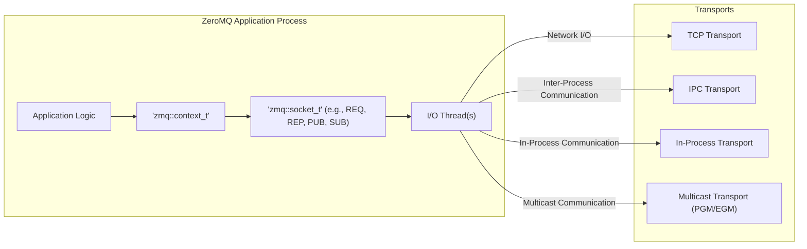
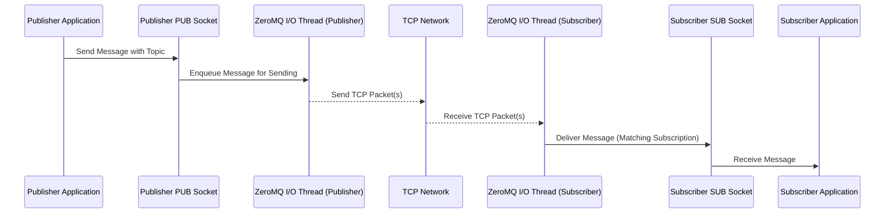

# Project Design Document: ZeroMQ 4.x

**Version:** 1.1
**Date:** October 26, 2023
**Author:** AI Software Architect

## 1. Introduction

This document provides a detailed architectural design of the ZeroMQ 4.x library. It aims to capture the key components, their interactions, and the overall system structure. This document will serve as a foundation for subsequent threat modeling activities.

ZeroMQ (also known as ØMQ, 0MQ, or zmq) is a high-performance asynchronous messaging library, aimed at use in distributed or concurrent applications. It provides a message queue abstraction, but unlike traditional message-oriented middleware, a ZeroMQ system can operate without a dedicated message broker. The library facilitates message transport across various protocols such as TCP, in-process (within a thread), inter-process (between processes on the same machine), and multicast.

## 2. Goals and Objectives

*   Provide a clear and comprehensive overview of the ZeroMQ 4.x architecture, suitable for security analysis.
*   Identify key components and their specific responsibilities within the messaging framework.
*   Describe the detailed data flow and interactions between components during message transmission and reception.
*   Highlight security-relevant aspects of the design, focusing on potential vulnerabilities and attack surfaces.
*   Serve as a robust basis for threat modeling and security analysis, enabling the identification of potential risks.

## 3. Target Audience

*   Security engineers and architects responsible for performing threat modeling and security assessments of systems using ZeroMQ.
*   Software developers working with or integrating the ZeroMQ library into their applications.
*   System architects designing distributed systems and considering ZeroMQ as a communication mechanism.

## 4. System Architecture

ZeroMQ's architecture revolves around the concept of **sockets**, which act as endpoints for asynchronous message passing. These sockets are interconnected via various **transports**. The library abstracts away the complexities of connection management, message routing, and reliable delivery (depending on the chosen pattern and transport).

**Key Architectural Elements:**

*   **Context (`zmq::context_t`):**  Represents the runtime environment for ZeroMQ within a process. It is a container for sockets and manages the underlying I/O threads and resources. Typically, an application creates a single context.
*   **Sockets (`zmq::socket_t`):** The core abstraction for sending and receiving messages. ZeroMQ offers various socket types, each implementing a specific messaging pattern that dictates how messages are exchanged.
    *   Examples: `REQ` (Request), `REP` (Reply), `PUB` (Publish), `SUB` (Subscribe), `PUSH`, `PULL`, `ROUTER`, `DEALER`, `PAIR`.
*   **I/O Threads:** Background threads managed by the context. These threads handle the non-blocking I/O operations for the sockets, allowing the application's main thread to remain responsive. The number of I/O threads is configurable.
*   **Transports:** The underlying communication protocols used to transmit messages between sockets. ZeroMQ supports several transports, allowing flexibility in deployment:
    *   **TCP:** Communication over a network using the Transmission Control Protocol, enabling communication between different machines.
    *   **IPC:** Inter-Process Communication using operating system mechanisms like Unix domain sockets or Windows named pipes, for communication between processes on the same machine.
    *   **In-Process:**  Direct communication between threads within the same process, offering the lowest overhead.
    *   **Multicast (PGM/EGM):**  One-to-many communication over a local network, suitable for scenarios like broadcasting data.
*   **Messaging Patterns:**  Predefined communication paradigms enforced by the different socket types. These patterns simplify the development of common messaging scenarios:
    *   **Request-Reply (REQ/REP):** A synchronous, connection-oriented pattern where a `REQ` socket sends a request and blocks until it receives a reply from a connected `REP` socket.
    *   **Publish-Subscribe (PUB/SUB):** A one-to-many pattern where `PUB` sockets broadcast messages, and `SUB` sockets receive messages based on topic subscriptions.
    *   **Pipeline (PUSH/PULL):** A unidirectional, asynchronous pattern for distributing tasks to workers (`PUSH`) or collecting results (`PULL`).
    *   **Exclusive Pair (PAIR):**  Connects exactly two sockets for exclusive communication.
    *   **Router-Dealer (ROUTER/DEALER):** Advanced patterns providing more control over message routing, load balancing, and asynchronous communication.

## 5. Key Components and their Responsibilities

*   **`zmq::context_t`:**
    *   **Lifecycle Management:**  Manages the creation, initialization, and termination of ZeroMQ resources within a process.
    *   **I/O Thread Management:** Creates and manages the pool of I/O threads responsible for handling network operations.
    *   **Socket Factory:** Provides the interface for creating different types of `zmq::socket_t` instances.
    *   **Resource Allocation:**  Handles the allocation and deallocation of underlying system resources used by sockets.
*   **`zmq::socket_t`:**
    *   **Message Handling:** Provides methods for sending (`send()`) and receiving (`recv()`) messages.
    *   **Pattern Enforcement:** Implements the specific rules and semantics of the chosen messaging pattern.
    *   **Connection Management:**  Handles the establishment and termination of connections with other sockets, depending on the transport and pattern.
    *   **Configuration Options:** Offers various options to configure socket behavior, such as timeouts, linger periods, and buffer sizes.
    *   **Message Buffering:**  Manages internal message queues for sending and receiving, influencing flow control.
*   **I/O Threads:**
    *   **Non-blocking I/O:**  Perform asynchronous network operations, preventing blocking of the application's main thread.
    *   **Transport Abstraction:**  Interact with the underlying transport implementations to send and receive data.
    *   **Connection Monitoring:**  Maintain the state of connections and handle connection errors.
    *   **Message Routing (Internal):**  Handle the internal routing of messages between sockets within the same context.
*   **Transport Implementations (e.g., `tcp_transport.cpp`, `ipc_transport.cpp`):**
    *   **Protocol Implementation:** Implement the specific details of the chosen communication protocol (TCP, IPC, etc.).
    *   **Data Serialization/Deserialization:** Handle the conversion of ZeroMQ messages into the format required by the underlying transport.
    *   **Error Handling (Transport Level):** Manage transport-specific errors and connection issues.
    *   **Security (Transport Specific):**  May implement transport-level security mechanisms if available (e.g., TCP with TLS).
*   **Message Class (`zmq::message_t`):**
    *   **Data Container:**  Holds the actual payload of the message being transmitted.
    *   **Metadata (Optional):** Can store additional metadata associated with the message, such as routing information in advanced patterns.
    *   **Memory Management:**  Provides mechanisms for managing the memory associated with the message payload.
*   **Device Implementations (e.g., `forwarder_device.cpp`, `queue_device.cpp`):**
    *   **Message Intermediation:** Act as intermediaries for routing and processing messages between sets of sockets.
    *   **Pattern Transformation:** Can potentially transform messages or adapt messaging patterns.
    *   **Buffering and Queuing:** Provide buffering capabilities for decoupling message producers and consumers.

## 6. Data Flow

The data flow in ZeroMQ involves messages being passed between application threads through ZeroMQ sockets, utilizing the underlying transport mechanisms.

**Example: Publish-Subscribe (PUB/SUB) over TCP**

**General Data Flow Steps:**

1. The sending application calls the `send()` method on a ZeroMQ socket, providing the message payload.
2. The socket adds the message to its internal outgoing queue.
3. An I/O thread associated with the context picks up messages from the socket's outgoing queue.
4. The I/O thread utilizes the appropriate transport implementation to serialize the message and transmit it over the network or inter-process communication channel.
5. On the receiving end, an I/O thread receives the data from the transport.
6. The I/O thread deserializes the data into a ZeroMQ message and delivers it to the appropriate receiving socket based on the messaging pattern and any routing information.
7. The receiving application calls the `recv()` method on the socket to retrieve the message from its internal incoming queue.

## 7. Security Considerations

ZeroMQ, by design, prioritizes performance and flexibility over built-in security features. Security is largely the responsibility of the application developer.

*   **Authentication and Authorization:** ZeroMQ lacks native mechanisms for authenticating connecting peers or authorizing message exchange. Applications must implement their own authentication and authorization schemes if required.
    *   **Threat:** Unauthorized entities could connect and exchange messages, potentially leading to data breaches or manipulation.
    *   **Mitigation:** Implement application-level authentication (e.g., using shared secrets, certificates) and authorization checks before processing messages.
*   **Data Confidentiality (Encryption):** Messages transmitted over the network (e.g., TCP) are not encrypted by default.
    *   **Threat:** Sensitive data transmitted over the network can be intercepted and read by eavesdroppers.
    *   **Mitigation:** Utilize transport-level security like TLS/SSL for TCP connections or implement application-level encryption of message payloads.
*   **Data Integrity:** ZeroMQ relies on the underlying transport protocols for data integrity. While TCP provides reliable delivery and checksums, other transports might have different guarantees.
    *   **Threat:** Messages could be corrupted or tampered with during transmission.
    *   **Mitigation:** For transports without inherent integrity checks, consider adding message digests or signatures at the application level.
*   **Denial of Service (DoS):** Applications using ZeroMQ can be vulnerable to DoS attacks if not designed carefully.
    *   **Threat:** Malicious actors could flood a receiver with messages, overwhelming its resources (CPU, memory, network bandwidth).
    *   **Mitigation:** Implement rate limiting on message reception, validate message sizes and content, and use appropriate socket options (e.g., receive timeouts).
*   **Transport Security Vulnerabilities:** The security of the communication channel is dependent on the chosen transport.
    *   **TCP:** Vulnerable to eavesdropping and man-in-the-middle attacks if not secured with TLS.
    *   **IPC:** Security relies on file system permissions. Incorrect permissions can allow unauthorized access.
    *   **Multicast:**  Inherently less secure as messages are broadcast. Requires careful consideration of network segmentation and potential for eavesdropping.
    *   **In-Process:** Generally considered secure within the process boundary but vulnerabilities in the process itself could expose communication.
*   **Input Validation:** Applications must rigorously validate data received through ZeroMQ sockets.
    *   **Threat:** Maliciously crafted messages could exploit vulnerabilities in the receiving application, leading to buffer overflows, injection attacks, or other security issues.
    *   **Mitigation:** Implement strict input validation and sanitization on all received messages.
*   **Resource Exhaustion:** Improper handling of ZeroMQ resources (contexts, sockets) can lead to resource exhaustion.
    *   **Threat:**  Failure to properly close sockets or contexts can lead to leaks of file descriptors or other system resources, potentially causing application instability or failure.
    *   **Mitigation:** Ensure proper resource management, using RAII (Resource Acquisition Is Initialization) principles or explicit cleanup mechanisms.

## 8. Deployment Considerations

ZeroMQ is typically deployed as a library embedded within applications, enabling direct communication between application instances without a central broker.

*   **Embedded Library Model:** Applications link directly to the ZeroMQ library, making it a lightweight and efficient communication mechanism.
*   **Decentralized Communication:** Facilitates peer-to-peer or distributed architectures where applications communicate directly.
*   **Flexible Transport Selection:** The choice of transport (TCP, IPC, inproc, multicast) depends on the deployment environment and communication requirements.
    *   **TCP:** For communication across a network.
    *   **IPC:** For efficient communication between processes on the same machine.
    *   **In-Process:** For low-latency communication between threads within the same process.
    *   **Multicast:** For broadcasting messages to multiple recipients on a local network.
*   **Scalability:** Supports horizontal scalability by adding more application instances, distributing the communication load.
*   **Language Agnostic Communication:**  With bindings available for numerous programming languages, ZeroMQ enables communication between applications written in different languages.

## 9. Future Considerations

*   **Standardized Security Patterns:** Explore and document recommended security patterns and best practices for common ZeroMQ use cases.
*   **Enhanced Error Reporting and Debugging:** Improve the clarity and detail of error messages to aid in debugging and troubleshooting.
*   **Performance Monitoring and Tuning Tools:** Develop or integrate with tools for monitoring ZeroMQ performance and identifying potential bottlenecks.
*   **Formal Security Audits:** Conduct regular security audits of the ZeroMQ library codebase to identify and address potential vulnerabilities.

This document provides a comprehensive architectural overview of ZeroMQ 4.x, emphasizing aspects relevant to security considerations and threat modeling. It serves as a valuable resource for understanding the system's components, data flow, and potential security implications.