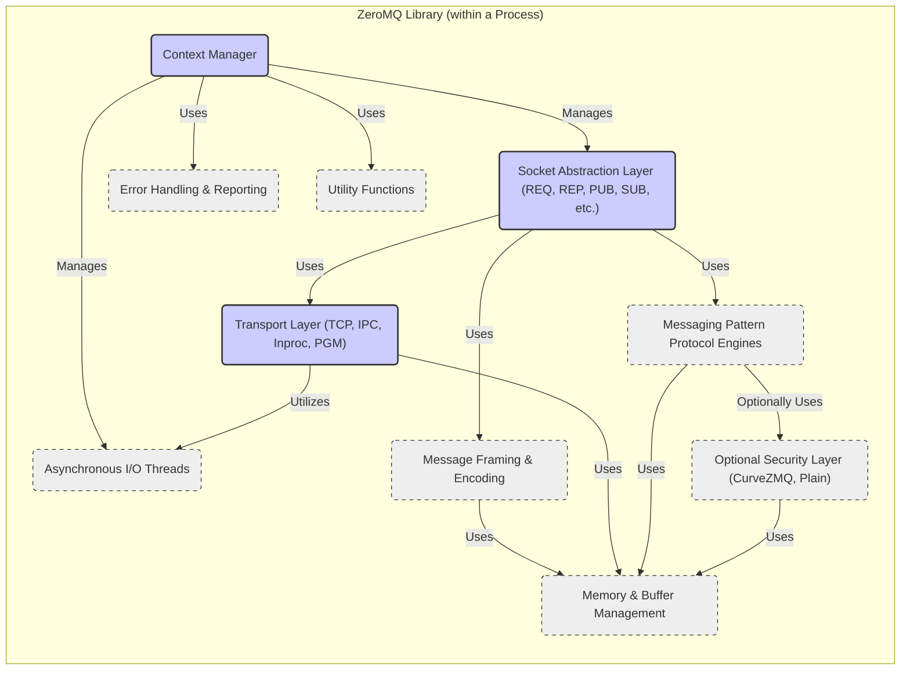
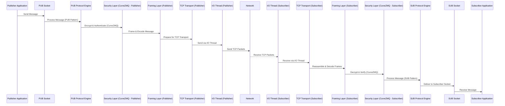
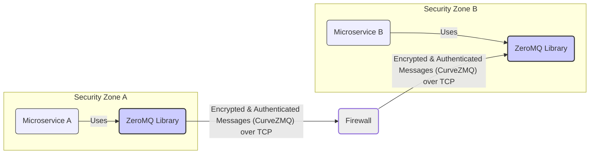

# Project Design Document: ZeroMQ (zeromq4-x) - Improved

**Version:** 1.1
**Date:** October 26, 2023
**Author:** AI Software Architecture Expert

## 1. Introduction

This document provides an enhanced design overview of the ZeroMQ (specifically focusing on the `zeromq4-x` branch) messaging library. It is designed to be a robust foundation for subsequent threat modeling activities. Building upon the initial version, this document offers greater clarity, detail, and a stronger focus on security considerations. It outlines the system architecture, key components, data flow, and security aspects relevant to ZeroMQ, aiming to facilitate a comprehensive threat analysis.

ZeroMQ is a high-performance asynchronous messaging library intended for distributed and concurrent applications. Unlike traditional message brokers, ZeroMQ often operates brokerless, embedding directly within applications to provide socket-based communication. This abstraction simplifies network programming and concurrency management.

This document delves into the core architecture of ZeroMQ as implemented in the `zeromq4-x` branch, providing a detailed understanding of its potential attack surfaces and security vulnerabilities, crucial for effective threat modeling.

## 2. Goals and Objectives

The core design goals of ZeroMQ are:

* **Extreme Performance:** Minimize latency and maximize message throughput for demanding applications.
* **Horizontal Scalability:**  Support scaling to a large number of interconnected nodes and message exchanges.
* **Flexible Messaging Patterns:** Offer a diverse set of patterns (Request-Reply, Publish-Subscribe, etc.) to accommodate various application communication needs.
* **Built-in Concurrency:**  Enable efficient handling of concurrent message processing through asynchronous operations and I/O threading.
* **Brokerless Option (for many patterns):**  Simplify deployments and eliminate single points of failure by enabling direct peer-to-peer communication.
* **Embeddable Library:**  Designed for seamless integration into applications as a lightweight library, minimizing deployment complexity.
* **Cross-Language Compatibility:** Provide bindings for a wide range of programming languages, promoting interoperability.

The objectives of this design document, specifically for threat modeling, are:

* **Clearly and comprehensively define the architecture of ZeroMQ `zeromq4-x`.**
* **Precisely identify key components, their functionalities, and interactions.**
* **Detailed description of data flow within a ZeroMQ system, highlighting critical paths.**
* **In-depth analysis of security considerations, explicitly linking design elements to potential threats.**
* **Provide a practical and actionable basis for identifying and analyzing potential attack vectors and vulnerabilities.**

## 3. System Architecture

ZeroMQ's architecture revolves around three fundamental concepts: **contexts**, **sockets**, and **messaging patterns**. It operates as an abstraction layer above transport protocols like TCP, IPC, and inproc, offering a simplified API for message-based communication.

### 3.1. High-Level Architecture

At the highest level, ZeroMQ facilitates communication between applications (or application components) using sockets. Applications instantiate sockets within a ZeroMQ **context** and establish connections using chosen **messaging patterns** and **transport protocols**.

```mermaid
graph LR
    subgraph "Application A Process"
        A_Context("Context A")
        A_Socket("Socket A")
    end
    subgraph "Application B Process"
        B_Context("Context B")
        B_Socket("Socket B")
    end

    A_Context -- "Manages Sockets" --> A_Socket
    B_Context -- "Manages Sockets" --> B_Socket
    A_Socket -- "Messages (e.g., REQ/REP, PUB/SUB)" --> B_Socket
    linkStyle 2,3 stroke-width:2px;
    classDef contextFill fill:#f9f,stroke:#333,stroke-width:2px
    class A_Context,B_Context contextFill
```

**Explanation:**

* **Application Processes:** Represent independent operating system processes or distinct components within a larger application that require inter-communication.
* **Context:** A ZeroMQ context is a process-local container for managing sockets and I/O threads. It provides the runtime environment for ZeroMQ operations within a process.  Resource management and lifecycle control of ZeroMQ entities are handled by the context.
* **Sockets:**  Represent the communication endpoints. Applications create sockets within a context and configure them with a specific messaging pattern (e.g., Request-Reply) and transport protocol (e.g., TCP). Sockets are the primary interface for sending and receiving messages.
* **Messages:** The fundamental units of data exchanged between applications via ZeroMQ sockets. Messages are typically byte arrays and can represent various data structures depending on the application's needs.

### 3.2. Component-Level Architecture (Detailed)

Internally, the ZeroMQ library is composed of several interacting components that enable efficient and reliable message passing. This detailed view is crucial for understanding potential attack surfaces.



**Detailed Component Descriptions:**

* **Context Manager:**  The central control point within a ZeroMQ library instance. It initializes and manages all other components, including sockets, I/O threads, and memory allocation. It's responsible for the overall lifecycle of ZeroMQ within a process.
* **Socket Abstraction Layer:** Provides the user-facing API for creating and interacting with sockets. This layer abstracts away the complexities of underlying protocols and patterns, offering a consistent interface for different socket types (REQ, REP, PUB, SUB, etc.). It handles socket options, state management, and message routing to the appropriate protocol engine.
* **Transport Layer:**  Handles the implementation of different transport protocols. It encapsulates the logic for sending and receiving data over TCP, IPC, Inproc, and PGM/EPGM.  This layer is responsible for connection management, addressing, and protocol-specific details.
* **Asynchronous I/O Threads:**  A pool of background threads managed by the context. These threads perform non-blocking I/O operations, allowing sockets to send and receive messages concurrently without blocking the main application thread. This is crucial for ZeroMQ's high performance and responsiveness.
* **Messaging Pattern Protocol Engines:** Implement the specific logic for each messaging pattern (REQ/REP, PUB/SUB, etc.). These engines enforce the rules of the pattern, manage message queues, handle routing decisions, and ensure correct message delivery semantics according to the chosen pattern. For example, the REQ/REP engine ensures request-reply pairs are matched, while the PUB/SUB engine handles message distribution to subscribers.
* **Optional Security Layer:** Provides security features such as encryption and authentication. In `zeromq4-x`, CurveZMQ is the primary security layer, offering end-to-end encryption based on CurveCP.  A "Plain" option (no security) is also available. This layer is responsible for cryptographic operations, key management (if applicable), and secure channel establishment.
* **Message Framing & Encoding:**  Handles the process of framing messages for transmission over the wire and encoding/decoding messages. Framing ensures message boundaries are correctly identified, especially over stream-oriented transports like TCP. Encoding might involve serialization or other data transformations.
* **Memory & Buffer Management:**  Manages memory allocation and deallocation for messages, internal data structures, and buffers. Efficient buffer management is critical for performance and preventing memory leaks or vulnerabilities.
* **Error Handling & Reporting:**  Provides mechanisms for detecting, handling, and reporting errors within the ZeroMQ library. This includes error codes, exceptions, and logging. Robust error handling is essential for stability and security.
* **Utility Functions:**  A collection of internal helper functions for various tasks, such as string manipulation, data structure management, and platform-specific operations.

## 4. Data Flow (Detailed)

The data flow in ZeroMQ involves a series of steps as messages traverse from a sending application to a receiving application. Understanding this flow is vital for identifying potential points of interception or manipulation.

**Detailed Data Flow (Example: PUB/SUB pattern over TCP with CurveZMQ security):**

1. **Application Message Creation (Publisher):** The publishing application creates a message (e.g., sensor data, event notification).
2. **Socket Send Operation (Publisher):** The application calls the `zmq_send` function on a PUB socket to transmit the message.
3. **Socket Abstraction Layer (Publisher):** The PUB socket's abstraction layer receives the message and determines the appropriate protocol engine and transport.
4. **PUB Protocol Engine Processing:** The PUB protocol engine prepares the message for distribution to subscribers. This might involve adding metadata or routing information.
5. **Security Layer Encryption (Publisher - if CurveZMQ enabled):** If CurveZMQ is enabled, the security layer encrypts the message payload and adds authentication tags.
6. **Framing Layer Encoding (Publisher):** The framing layer encodes the message into a wire-format, adding frame delimiters and potentially applying compression.
7. **Transport Layer Transmission (Publisher - TCP):** The TCP transport layer takes the framed and potentially encrypted message and prepares it for transmission over a TCP connection. This involves segmenting the message into TCP packets and handling TCP connection details.
8. **I/O Thread Send Operation (Publisher):** An I/O thread associated with the context handles the actual sending of TCP packets over the network interface.
9. **Network Transit:** TCP packets travel across the network to the subscriber.
10. **I/O Thread Receive Operation (Subscriber):** An I/O thread on the subscriber side receives incoming TCP packets from the network.
11. **Transport Layer Reception (Subscriber - TCP):** The TCP transport layer on the subscriber reassembles TCP packets into the original framed message.
12. **Framing Layer Decoding (Subscriber):** The framing layer decodes the received message, removing frame delimiters and potentially decompressing the data.
13. **Security Layer Decryption & Authentication (Subscriber - if CurveZMQ enabled):** If CurveZMQ is enabled, the security layer decrypts the message payload and verifies the authentication tags to ensure message integrity and authenticity.
14. **SUB Protocol Engine Processing:** The SUB protocol engine receives the decrypted message and routes it to the appropriate subscriber sockets based on subscriptions (if any).
15. **Socket Abstraction Layer (Subscriber):** The SUB socket's abstraction layer delivers the message to the receiving application.
16. **Socket Receive Operation (Subscriber):** The subscribing application calls `zmq_recv` on the SUB socket to retrieve the received message.
17. **Application Message Consumption (Subscriber):** The subscribing application processes the received message.

**Detailed Data Flow Diagram (PUB/SUB over TCP with CurveZMQ):**



## 5. Key Components and Technologies (Reiterated for Clarity)

* **Core Language (Implementation):** C++ (performance-critical core).
* **Language Bindings:** Extensive bindings for C, Python, Java, Go, .NET, Ruby, Node.js, and many more, enabling broad language support.
* **Transport Protocols:**
    * **TCP:** Reliable, connection-oriented transport for network communication.
    * **IPC:** Inter-Process Communication (Unix domain sockets, named pipes) for local communication within a machine.
    * **Inproc:** Highly efficient in-process communication for threads within the same process.
    * **PGM/EPGM:** Pragmatic General Multicast/Efficient PGM for multicast messaging (less reliable, security considerations).
* **Messaging Patterns (Examples):**
    * **Request-Reply (REQ/REP):** Synchronous request-response, request socket sends, reply socket receives.
    * **Publish-Subscribe (PUB/SUB):** One-to-many distribution, publisher sends, subscribers receive based on topic filters.
    * **Push-Pull (PUSH/PULL):** Load distribution, push socket sends, pull socket receives in a load-balanced manner.
    * **Router-Dealer (ROUTER/DEALER):** Advanced routing and load balancing, router acts as a frontend, dealer as a backend.
* **Security Mechanism:** **CurveZMQ:**  End-to-end encryption and authentication based on CurveCP, using elliptic-curve cryptography.  Provides confidentiality, integrity, and authentication.
* **Asynchronous I/O Model:**  Non-blocking socket operations and I/O threads for high concurrency and responsiveness.
* **Multi-threading:**  Utilizes I/O threads to offload network operations from the main application thread, improving performance.

## 6. Security Considerations (In-Depth for Threat Modeling)

This section expands on the initial security considerations, providing a more detailed analysis relevant for threat modeling.

* **Confidentiality Breaches:**
    * **Threat:** Eavesdropping on network traffic. Unencrypted TCP communication is vulnerable to packet sniffing, exposing message content.
    * **Mitigation:** **Mandatory use of CurveZMQ for all communication over untrusted networks.** Ensure CurveZMQ is correctly configured and enabled.
    * **Threat:**  Compromise of application memory. If sensitive data resides in memory accessible to an attacker (e.g., through memory dumps or exploits), confidentiality can be breached even with encryption in transit.
    * **Mitigation:** Implement secure coding practices to minimize sensitive data in memory, use memory protection mechanisms, and consider memory encryption at rest if applicable.

* **Integrity Violations:**
    * **Threat:** Message tampering in transit (Man-in-the-Middle attacks). Without integrity checks, attackers could modify messages without detection.
    * **Mitigation:** **CurveZMQ provides message integrity through cryptographic signatures.** Ensure CurveZMQ is enabled and properly configured.
    * **Threat:** Data corruption due to software bugs or hardware failures.
    * **Mitigation:** Implement data validation and checksumming at the application level for critical data. Use reliable hardware and software components.

* **Authentication Failures:**
    * **Threat:** Impersonation of legitimate communication partners. Without authentication, an attacker could send messages pretending to be a trusted source or intercept and modify messages.
    * **Mitigation:** **CurveZMQ provides mutual authentication.** Utilize CurveZMQ's authentication features to verify the identity of communicating peers. Implement application-level authentication if needed for finer-grained access control.

* **Authorization Bypass:**
    * **Threat:** Unauthorized access to resources or operations. ZeroMQ itself does not enforce authorization. Applications must implement their own authorization mechanisms.
    * **Mitigation:** Design and implement application-level authorization controls based on message content, sender identity (if authenticated), or other relevant factors. Integrate with existing authorization frameworks if applicable.

* **Denial of Service (DoS) Attacks (Detailed):**
    * **Resource Exhaustion (Message Flooding):**
        * **Threat:** An attacker floods a ZeroMQ endpoint with a high volume of messages, overwhelming processing capacity (CPU, memory, I/O) and causing service disruption.
        * **Mitigation:** Implement rate limiting at the application level or using network firewalls. Use message queuing and backpressure mechanisms to handle bursts of traffic gracefully. Monitor resource usage and set alerts for abnormal activity.
    * **Socket Exhaustion:**
        * **Threat:** An attacker attempts to create a large number of connections or sockets, exhausting server resources (file descriptors, memory) and preventing legitimate connections.
        * **Mitigation:** Limit the maximum number of connections or sockets allowed per client or in total. Implement connection throttling and resource quotas.
    * **Protocol Exploits:**
        * **Threat:** Exploiting vulnerabilities in the ZeroMQ protocol implementation or underlying transport protocols to cause crashes, resource exhaustion, or other DoS conditions.
        * **Mitigation:** Keep ZeroMQ library and underlying system components up-to-date with security patches. Conduct regular security audits and penetration testing to identify and address vulnerabilities. Use robust input validation and error handling to prevent unexpected behavior.

* **Injection Attacks (Application Level):**
    * **Threat:** If message content is not properly validated and sanitized by the *application*, injection attacks (e.g., command injection, SQL injection, message injection) might be possible. ZeroMQ itself does not prevent application-level injection vulnerabilities.
    * **Mitigation:** Implement robust input validation and sanitization for all received messages at the application level. Follow secure coding practices to prevent injection vulnerabilities.

* **Man-in-the-Middle (MitM) Attacks (Without Security):**
    * **Threat:**  Without encryption and authentication, communication over networks is highly vulnerable to MitM attacks. Attackers can intercept, eavesdrop on, and potentially modify messages.
    * **Mitigation:** **Mandatory use of CurveZMQ for all communication over untrusted networks.**  Properly configure and deploy CurveZMQ to establish secure channels.

* **Vulnerabilities in Dependencies (Indirect Risks):**
    * **Threat:** ZeroMQ relies on underlying libraries (e.g., OpenSSL if CurveZMQ is used, system libraries for networking). Vulnerabilities in these dependencies could indirectly affect ZeroMQ's security.
    * **Mitigation:** Regularly update ZeroMQ and all its dependencies to the latest versions with security patches. Monitor security advisories for ZeroMQ and its dependencies.

* **Configuration Errors (Human Factor):**
    * **Threat:** Misconfiguration of ZeroMQ sockets, contexts, or security settings can introduce security weaknesses. For example, disabling CurveZMQ unintentionally or using weak security settings.
    * **Mitigation:**  Provide clear and secure configuration guidelines. Implement configuration validation and auditing. Use infrastructure-as-code and configuration management tools to ensure consistent and secure configurations.

**Specific Security Focus for `zeromq4-x` Threat Modeling:**

* **CurveZMQ Implementation Review:**  Thoroughly review the CurveZMQ implementation in `zeromq4-x` for potential vulnerabilities, cryptographic weaknesses, or implementation flaws. Focus on key exchange, encryption/decryption routines, and authentication mechanisms.
* **Memory Safety in C++ Code:**  Conduct static and dynamic analysis of the C++ codebase to identify potential memory safety vulnerabilities (buffer overflows, use-after-free, etc.). Pay close attention to buffer handling, message parsing, and resource management code.
* **PGM/EPGM Transport Security (If Used):**  If PGM/EPGM multicast transports are used, explicitly analyze the security risks associated with these transports (lack of inherent confidentiality and integrity).  Recommend against using PGM/EPGM for security-sensitive applications.
* **Input Validation within Protocol Engines:**  Examine the protocol engine implementations for each messaging pattern to ensure robust input validation and prevent unexpected behavior due to malformed or malicious messages.

## 7. Deployment Model (Security Perspective)

ZeroMQ's embedded deployment model has security implications. Since it's a library, security is heavily dependent on how applications integrate and configure it.

**Deployment Scenarios & Security Considerations:**

* **Microservices Architecture (Secure Inter-Service Communication):**
    * **Security:**  Crucial to secure communication between microservices, especially if they are deployed in different security zones or across networks.
    * **Recommendation:** **Mandatory use of CurveZMQ for inter-service communication.** Implement mutual authentication between services. Consider network segmentation and firewalls to further isolate services.
* **Distributed Systems (Edge Computing, IoT):**
    * **Security:** Devices at the edge or in IoT environments may be physically insecure and exposed to tampering. Communication channels may be untrusted.
    * **Recommendation:** **Strongly recommend CurveZMQ for all communication.** Implement device authentication and authorization. Consider secure boot and device hardening measures.
* **Real-time Data Processing (High-Throughput Security):**
    * **Security:**  Balancing security with performance is critical in real-time systems.
    * **Recommendation:**  Optimize CurveZMQ configuration for performance while maintaining adequate security. Consider hardware acceleration for cryptographic operations if needed.
* **Embedded Systems (Resource Constraints):**
    * **Security:**  Resource-constrained embedded systems may have limitations on cryptographic algorithm complexity and key storage.
    * **Recommendation:**  Choose efficient cryptographic algorithms within CurveZMQ. Securely store cryptographic keys (e.g., using secure elements or trusted execution environments).

**Deployment Diagram (Microservices with Security Zones and ZeroMQ/CurveZMQ):**



## 8. Threat Modeling Focus & Actionable Steps

This design document is specifically created to facilitate threat modeling of systems using ZeroMQ `zeromq4-x`.  The following aspects are most relevant for threat modeling exercises:

* **Detailed Component Architecture (Section 3.2):**  Provides a breakdown of ZeroMQ's internal components, highlighting potential attack surfaces within the library itself.
* **Detailed Data Flow (Section 4):**  Maps out the message flow, identifying points where messages could be intercepted, modified, or injected.
* **In-Depth Security Considerations (Section 6):**  Provides a structured analysis of potential threats, vulnerabilities, and mitigations, categorized by security principles (Confidentiality, Integrity, Availability, Authentication, Authorization).
* **Deployment Model & Security (Section 7):**  Highlights security considerations specific to different deployment scenarios, emphasizing the importance of secure configuration and integration.

**Actionable Steps for Threat Modeling:**

1. **Use this document as a reference during threat modeling sessions.**
2. **For each component in Section 3.2, brainstorm potential threats and vulnerabilities.** Consider STRIDE or other threat modeling methodologies.
3. **Trace data flow paths (Section 4) and identify potential interception or manipulation points.**
4. **Utilize the security considerations in Section 6 as a checklist of potential threats and mitigations.**
5. **Analyze the specific deployment scenario (Section 7) and tailor threat models accordingly.**
6. **Focus on `zeromq4-x` specific security aspects (CurveZMQ implementation, memory safety, PGM/EPGM usage).**
7. **Develop mitigation strategies for identified threats and prioritize them based on risk.**

This improved design document aims to be a more effective and actionable resource for security professionals and developers conducting threat modeling for projects utilizing ZeroMQ `zeromq4-x`. It provides a deeper understanding of the library's architecture and security considerations, enabling a more comprehensive and targeted threat analysis.