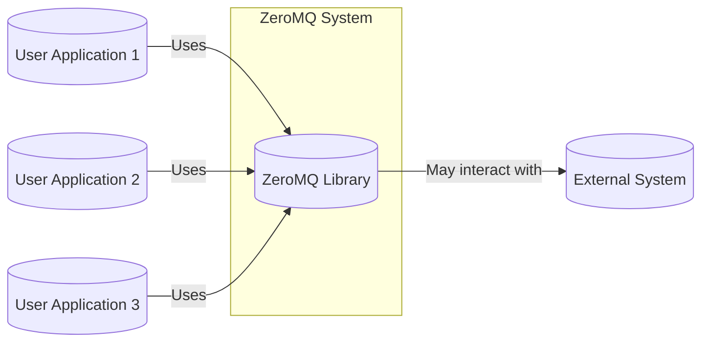
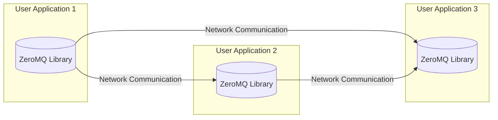
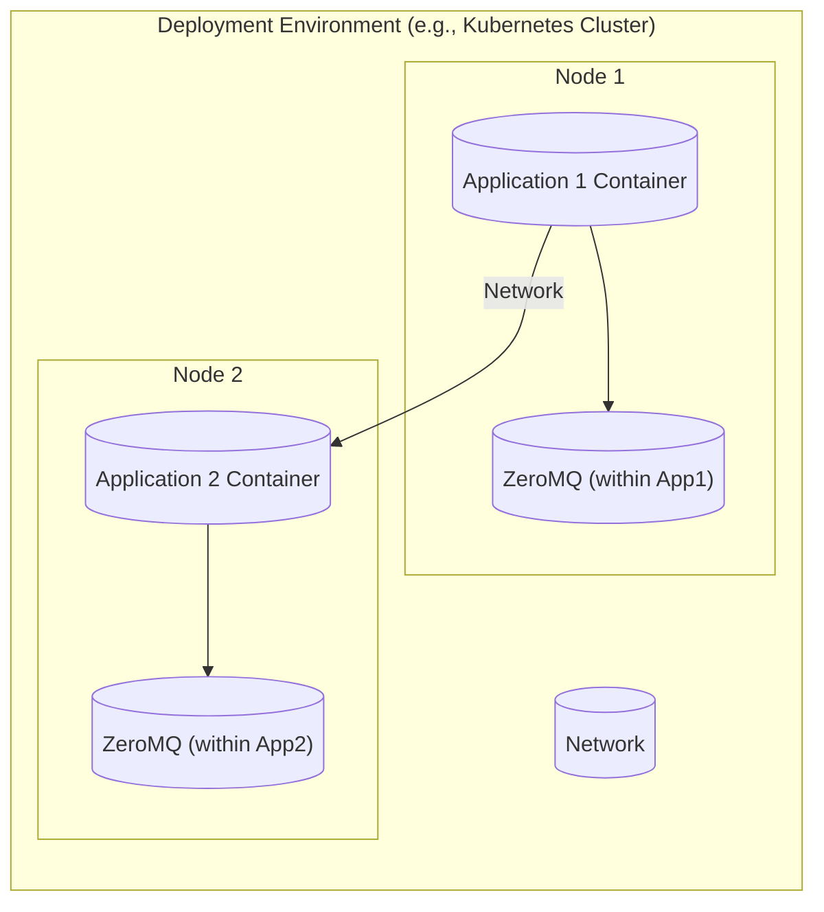
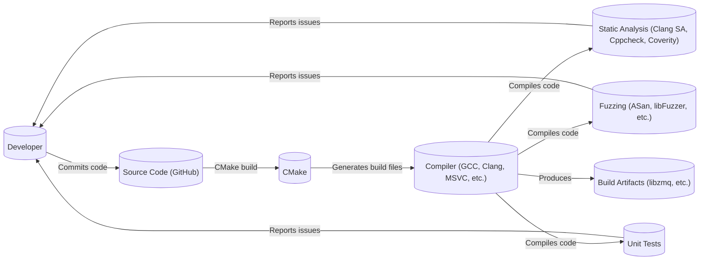

# BUSINESS POSTURE

ZeroMQ (ØMQ) is a high-performance asynchronous messaging library, aimed at use in distributed or concurrent applications. It provides a message queue, but unlike message-oriented middleware, a ZeroMQ system can run without a dedicated message broker. The library is designed to be as small, simple, and fast as possible.

Business Priorities and Goals:

*   Provide a high-performance, scalable, and reliable messaging library.
*   Minimize latency and maximize throughput for message delivery.
*   Offer a simple and easy-to-use API for developers.
*   Support a wide range of messaging patterns (e.g., PUB-SUB, REQ-REP, PUSH-PULL).
*   Maintain cross-platform compatibility.
*   Ensure the long-term maintainability and stability of the library.
*   Foster a vibrant community around the project.

Business Risks:

*   Security vulnerabilities in the library could lead to data breaches, denial-of-service attacks, or other malicious exploits in applications using ZeroMQ.
*   Performance bottlenecks or instability in the library could negatively impact the performance and reliability of applications relying on it.
*   Lack of adoption or a decline in community interest could lead to the project becoming obsolete.
*   Inadequate documentation or support could hinder developer adoption and usage.
*   Compatibility issues with different operating systems or programming languages could limit the library's reach.

# SECURITY POSTURE

Existing Security Controls:

*   security control: The project uses fuzzing (AddressSanitizer, LeakSanitizer, MemorySanitizer, UndefinedBehaviorSanitizer, libFuzzer) to identify potential security vulnerabilities. Described in `fuzzing/README.md`.
*   security control: The project uses static analysis tools (Clang Static Analyzer, Cppcheck, Coverity Scan) to identify potential security vulnerabilities. Described in `build-aux/scan-build`.
*   security control: The project has coding style guidelines and uses linters to enforce them, reducing the likelihood of common coding errors. Described in `CONTRIBUTING.md`.
*   security control: The project uses encrypted communication (CurveZMQ) for secure message exchange. Described in `src/curve*.hpp` and `src/curve*.cpp`.
*   security control: The project provides authentication mechanisms (CurveZMQ, GSSAPI). Described in `src/mechanism.hpp` and related files.
*   security control: The project has a documented security policy and vulnerability reporting process. Described in `SECURITY.md`.

Accepted Risks:

*   accepted risk: The library itself does not handle all aspects of application-level security. Developers are responsible for implementing appropriate security measures in their applications that use ZeroMQ.
*   accepted risk: While CurveZMQ provides encryption and authentication, it relies on the correct configuration and key management by the user. Misconfiguration can lead to security vulnerabilities.
*   accepted risk: The GSSAPI mechanism depends on the underlying GSSAPI implementation and its configuration, which may have its own security considerations and potential vulnerabilities.

Recommended Security Controls:

*   security control: Implement regular dynamic security testing (DAST) to complement the existing fuzzing efforts.
*   security control: Integrate a Software Composition Analysis (SCA) tool to identify and manage vulnerabilities in third-party dependencies.
*   security control: Conduct periodic security code reviews, focusing on critical components and security-sensitive areas.
*   security control: Provide more comprehensive security documentation and best practices guides for developers using ZeroMQ.

Security Requirements:

*   Authentication:
    *   The library MUST support strong authentication mechanisms to verify the identity of connecting clients and servers.
    *   The library SHOULD support pluggable authentication mechanisms to allow for integration with different authentication systems.
    *   The default authentication mechanism (NULL) MUST be clearly documented as insecure and suitable only for trusted environments.
*   Authorization:
    *   The library SHOULD provide mechanisms for controlling access to resources (e.g., topics, queues) based on the authenticated identity.
    *   Access control policies SHOULD be configurable and granular.
*   Input Validation:
    *   The library MUST validate all inputs received from the network or user applications to prevent injection attacks and other vulnerabilities.
    *   Validation SHOULD include checks for data type, length, format, and allowed values.
*   Cryptography:
    *   The library MUST use strong, well-vetted cryptographic algorithms and protocols for encryption and authentication (e.g., CurveZMQ).
    *   Key management MUST be secure and follow best practices.
    *   The library SHOULD provide options for configuring cryptographic parameters (e.g., cipher suites, key lengths).

# DESIGN

## C4 CONTEXT

Element Descriptions:

*   Element:
    *   Name: User Application 1
    *   Type: User Application
    *   Description: An application developed by a user that utilizes the ZeroMQ library for messaging.
    *   Responsibilities: Sending and/or receiving messages via ZeroMQ sockets. Implementing application-specific logic.
    *   Security controls: Application-level security controls (authentication, authorization, input validation, etc.) are the responsibility of the application developer.

*   Element:
    *   Name: User Application 2
    *   Type: User Application
    *   Description: Another application developed by a user, potentially with a different role or purpose than User Application 1.
    *   Responsibilities: Sending and/or receiving messages via ZeroMQ sockets. Implementing application-specific logic.
    *   Security controls: Application-level security controls are the responsibility of the application developer.

*   Element:
    *   Name: User Application 3
    *   Type: User Application
    *   Description: Yet another application, potentially on a different machine or network.
    *   Responsibilities: Sending and/or receiving messages via ZeroMQ sockets. Implementing application-specific logic.
    *   Security controls: Application-level security controls are the responsibility of the application developer.

*   Element:
    *   Name: ZeroMQ Library
    *   Type: Library
    *   Description: The core ZeroMQ library, providing the messaging functionality.
    *   Responsibilities: Providing an API for creating sockets, sending and receiving messages, managing connections, and handling errors. Implementing various messaging patterns.
    *   Security controls: CurveZMQ encryption, GSSAPI authentication, fuzzing, static analysis, coding style guidelines.

*   Element:
    *   Name: External System
    *   Type: External System
    *   Description: An external system that a ZeroMQ application might interact with, such as a database, a web service, or another messaging system. This is optional and depends on the specific application.
    *   Responsibilities: Varies depending on the specific external system.
    *   Security controls: Depends on the specific external system. ZeroMQ applications should use secure communication channels and protocols when interacting with external systems.

## C4 CONTAINER

Since ZeroMQ is a library, the container diagram is essentially an extension of the context diagram. The "containers" are the user applications that embed the ZeroMQ library.

Element Descriptions:

*   Element:
    *   Name: ZeroMQ Library (within User Application 1)
    *   Type: Library
    *   Description: An instance of the ZeroMQ library linked into User Application 1.
    *   Responsibilities: Providing messaging functionality to User Application 1.
    *   Security controls: CurveZMQ encryption, GSSAPI authentication, fuzzing, static analysis, coding style guidelines.

*   Element:
    *   Name: ZeroMQ Library (within User Application 2)
    *   Type: Library
    *   Description: An instance of the ZeroMQ library linked into User Application 2.
    *   Responsibilities: Providing messaging functionality to User Application 2.
    *   Security controls: CurveZMQ encryption, GSSAPI authentication, fuzzing, static analysis, coding style guidelines.

*   Element:
    *   Name: ZeroMQ Library (within User Application 3)
    *   Type: Library
    *   Description: An instance of the ZeroMQ library linked into User Application 3.
    *   Responsibilities: Providing messaging functionality to User Application 3.
    *   Security controls: CurveZMQ encryption, GSSAPI authentication, fuzzing, static analysis, coding style guidelines.

## DEPLOYMENT

ZeroMQ is a library, and its deployment is tied to the deployment of the applications that use it. There isn't a single "ZeroMQ deployment" in the traditional sense. However, we can describe how applications using ZeroMQ might be deployed.

Possible Deployment Solutions:

1.  Statically linked library: The ZeroMQ library is compiled and linked directly into the application executable.
2.  Dynamically linked library: The ZeroMQ library is compiled as a shared library (e.g., .so, .dll) and loaded by the application at runtime.
3.  Containerized deployment: The application and the ZeroMQ library (either statically or dynamically linked) are packaged within a container (e.g., Docker).
4.  Cloud deployment: The application (and ZeroMQ) are deployed to a cloud platform (e.g., AWS, Azure, GCP) using virtual machines, containers, or serverless functions.

Chosen Deployment Solution (Example: Containerized Deployment):

Element Descriptions:

*   Element:
    *   Name: Node 1
    *   Type: Physical or Virtual Machine
    *   Description: A compute node within the deployment environment.
    *   Responsibilities: Running containers.
    *   Security controls: Operating system security, network security, container runtime security.

*   Element:
    *   Name: Application 1 Container
    *   Type: Container
    *   Description: A container running Application 1, which includes the ZeroMQ library.
    *   Responsibilities: Running Application 1 and utilizing ZeroMQ for messaging.
    *   Security controls: Container image security, application-level security controls.

*   Element:
    *   Name: ZeroMQ (within App1)
    *   Type: Library
    *   Description: The ZeroMQ library instance within Application 1's container.
    *   Responsibilities: Providing messaging functionality to Application 1.
    *   Security controls: CurveZMQ encryption, GSSAPI authentication.

*   Element:
    *   Name: Node 2
    *   Type: Physical or Virtual Machine
    *   Description: Another compute node.
    *   Responsibilities: Running containers.
    *   Security controls: Operating system security, network security, container runtime security.

*   Element:
    *   Name: Application 2 Container
    *   Type: Container
    *   Description: A container running Application 2, which includes the ZeroMQ library.
    *   Responsibilities: Running Application 2 and utilizing ZeroMQ for messaging.
    *   Security controls: Container image security, application-level security controls.

*   Element:
    *   Name: ZeroMQ (within App2)
    *   Type: Library
    *   Description: The ZeroMQ library instance within Application 2's container.
    *   Responsibilities: Providing messaging functionality to Application 2.
    *   Security controls: CurveZMQ encryption, GSSAPI authentication.

*   Element:
    *   Name: Network
    *   Type: Network
    *   Description: The network connecting the nodes and containers.
    *   Responsibilities: Facilitating communication between containers.
    *   Security controls: Network segmentation, firewalls, encryption in transit (if applicable).

## BUILD

The ZeroMQ build process uses CMake as its build system and supports various compilers and platforms. The build process includes steps for static analysis, fuzzing, and testing.

Build Process Security Controls:

*   security control: Static Analysis: The build process incorporates static analysis tools (Clang Static Analyzer, Cppcheck, Coverity Scan) to identify potential code quality and security issues.
*   security control: Fuzzing: Fuzzing is used to test the library with a wide range of inputs, helping to discover vulnerabilities that might be missed by traditional testing.
*   security control: Unit Tests: Comprehensive unit tests are run to ensure the correctness and stability of the library.
*   security control: Compiler Warnings: The build process is configured to treat compiler warnings as errors, ensuring that potential issues are addressed.
*   security control: Continuous Integration: The project uses continuous integration (GitHub Actions, Travis CI, AppVeyor) to automatically build and test the code on every commit, ensuring that changes do not introduce regressions or security vulnerabilities.

# RISK ASSESSMENT

Critical Business Processes:

*   Reliable message delivery between applications.
*   High-performance and low-latency communication.
*   Scalability to handle a large number of connections and messages.

Data Sensitivity:

*   The ZeroMQ library itself does not handle persistent data storage. However, the messages it transmits may contain sensitive data, depending on the application using it.
*   Data sensitivity levels will vary greatly depending on the specific use case. Examples include:
    *   Plaintext messages: Low sensitivity (unless the content itself is sensitive).
    *   Encrypted messages (CurveZMQ): Higher sensitivity, as the confidentiality of the data depends on the security of the encryption keys.
    *   Personally Identifiable Information (PII): High sensitivity, requiring strict protection under regulations like GDPR.
    *   Financial transactions: High sensitivity, requiring strong security and auditability.
    *   Control messages for critical infrastructure: Very high sensitivity, requiring the highest levels of security and reliability.

# QUESTIONS & ASSUMPTIONS

Questions:

*   Are there any specific compliance requirements (e.g., GDPR, HIPAA, PCI DSS) that apply to applications using ZeroMQ in particular use cases?
*   What are the expected message sizes and volumes for typical applications using ZeroMQ?
*   What are the specific threat models for the most common use cases of ZeroMQ?
*   What level of support is provided for integrating ZeroMQ with existing security infrastructure (e.g., SIEM systems, intrusion detection systems)?

Assumptions:

*   BUSINESS POSTURE: It is assumed that users of the ZeroMQ library are responsible for implementing appropriate security measures within their own applications.
*   SECURITY POSTURE: It is assumed that the default NULL authentication mechanism is only used in trusted environments.
*   DESIGN: It is assumed that applications using ZeroMQ will be designed and deployed in a secure manner, following best practices for network security and application security.
*   DESIGN: It is assumed that users will properly configure and manage encryption keys when using CurveZMQ.