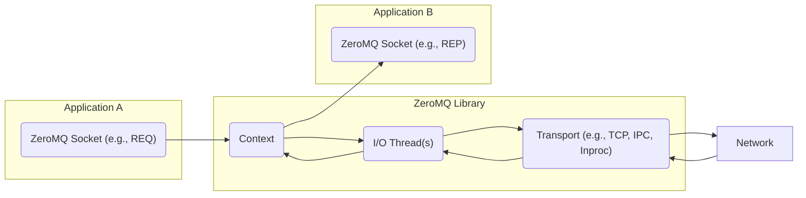
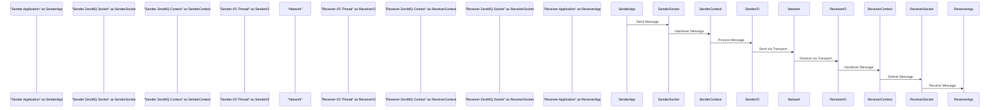

# Project Design Document: ZeroMQ (zeromq4-x) - Improved

## 1. Introduction

This document provides an enhanced architectural overview of the ZeroMQ (zeromq4-x) library, focusing on clarity and detail to facilitate effective threat modeling. ZeroMQ is a high-performance asynchronous messaging library designed for use in distributed and concurrent applications. Unlike traditional message-oriented middleware, ZeroMQ operates without a dedicated message broker, allowing for more flexible and scalable architectures. This document outlines the core components, communication patterns, data flow, and crucial security considerations.

## 2. Goals

*   Provide a clear and comprehensive description of ZeroMQ's architectural components and their functions.
*   Detail the various communication patterns supported by ZeroMQ, including their specific use cases and characteristics.
*   Illustrate the message flow within a ZeroMQ system, highlighting key stages and interactions.
*   Thoroughly identify and discuss security considerations relevant to the design and deployment of ZeroMQ-based applications.
*   Serve as a robust foundation for subsequent threat modeling activities, enabling the identification of potential vulnerabilities and attack vectors.

## 3. Non-Goals

*   Detailed code-level analysis or explanation of the internal implementation of the ZeroMQ library.
*   Specific instructions or configurations for particular programming language bindings.
*   Performance benchmarks, optimization techniques, or detailed resource utilization metrics.
*   Prescriptive deployment architectures or infrastructure specifications.

## 4. High-Level Architecture

ZeroMQ functions as an embedded library within applications, offering a socket-like API that abstracts the underlying transport mechanisms. Applications create and configure ZeroMQ sockets to facilitate message exchange.

*   **Application:** The software application utilizing the ZeroMQ library for sending and receiving messages.
*   **ZeroMQ Socket:** The primary abstraction provided by the library. Different socket types dictate the communication pattern (e.g., `REQ`, `REP`, `PUB`, `SUB`, `PUSH`, `PULL`).
*   **Context:** A container managing ZeroMQ sockets within a process, responsible for I/O thread management and resource allocation.
*   **I/O Thread(s):** Background threads managed by the ZeroMQ context, handling asynchronous network communication.
*   **Transport:** The underlying communication protocol employed by ZeroMQ (e.g., TCP, IPC, inproc).
*   **Network:** Represents the physical or logical network infrastructure connecting the communicating applications.

## 5. Component Details

### 5.1. ZeroMQ Context

*   Manages the lifecycle of all ZeroMQ sockets created within a single process.
*   Provides thread safety for socket operations, ensuring concurrent access is handled correctly.
*   Responsible for initializing and managing the underlying I/O threads and other internal resources required by ZeroMQ.
*   Typically, an application instantiates a single context to manage all its ZeroMQ activities.

### 5.2. ZeroMQ Sockets

*   The core interface for sending and receiving messages, abstracting away transport complexities.
*   Support a variety of messaging patterns, each with distinct characteristics and use cases:

    *   **Request-Reply (REQ-REP):** A synchronous, connection-oriented pattern where a request socket sends a message and waits for a reply from a reply socket.
    *   **Publish-Subscribe (PUB-SUB):** A one-to-many distribution pattern where publishers send messages to subscribers who have subscribed to specific topics.
    *   **Pipeline (PUSH-PULL):** A unidirectional, asynchronous pattern for distributing tasks to workers (PUSH) or collecting results (PULL).
    *   **Exclusive Pair (PAIR):** Connects exactly two sockets, suitable for inter-thread or inter-process communication where only two entities need to communicate.
    *   **Dealer-Router (DEALER-ROUTER):** An advanced pattern for building complex request-reply topologies with load balancing and asynchronous capabilities.
    *   **Respondent-Listener (RESPONDENT-LISTENER):** Another advanced pattern for service-oriented architectures, offering more control over connection management.

*   Sockets are bound to or connected to specific endpoints (addresses) using a chosen transport protocol.

### 5.3. Transports

*   Define the underlying communication mechanism used by ZeroMQ.

| Transport   | Description                                                                 | Use Cases                                                                 | Security Considerations                                                                 |
| :---------- | :-------------------------------------------------------------------------- | :------------------------------------------------------------------------ | :-------------------------------------------------------------------------------------- |
| **TCP**     | Communication over a network using the Transmission Control Protocol.       | Communication between applications on different machines.                 | Can be secured with TLS/SSL for encryption and authentication.                         |
| **IPC**     | Inter-process communication on the same machine using the file system.      | Communication between processes on the same host.                         | Relies on file system permissions for security.                                         |
| **Inproc**  | Intra-process communication within the same process (using memory).         | Communication between threads within the same application.                | Generally considered secure as it operates within the process memory space.             |
| **WebSocket** | Communication over the WebSocket protocol, typically for web browsers.     | Real-time communication with web clients.                                 | Security depends on the underlying WebSocket implementation and potential TLS usage. |
| **UDP**     | Communication over a network using the User Datagram Protocol (connectionless). | Scenarios where low latency is prioritized over guaranteed delivery.       | Inherently less reliable and secure; requires application-level security measures.     |
| **Pgm/Epgm**| Reliable multicast transport.                                               | Efficient distribution of data to multiple recipients on a local network. | Security considerations depend on the network infrastructure and potential encryption. |

### 5.4. Messages

*   The fundamental unit of data exchanged between ZeroMQ sockets.
*   Composed of one or more frames.
*   Each frame is a contiguous block of bytes.
*   Multi-part messages can be constructed by sending multiple frames sequentially.

### 5.5. I/O Threads

*   Background threads managed by the ZeroMQ context.
*   Handle non-blocking I/O operations for sockets, allowing applications to remain responsive.
*   Improve performance by offloading network communication tasks from the main application thread.

## 6. Data Flow

The typical data flow in a ZeroMQ system involves the following sequence of actions:

1. **Message Creation:** The sending application constructs a message, which may consist of one or more frames.
2. **Socket Send Operation:** The sending application invokes a send function on its ZeroMQ socket, passing the message.
3. **Context Handling (Sender):** The socket forwards the message to the associated ZeroMQ context for processing.
4. **I/O Thread Processing (Sender):** An I/O thread managed by the context takes the message and prepares it for transmission based on the socket type and transport.
5. **Transport Layer Transmission:** The I/O thread utilizes the configured transport protocol to send the message over the network or local system.
6. **Network Transmission:** The message is transmitted across the network (for TCP, UDP, WebSocket) or through the operating system's IPC mechanisms.
7. **Receiving Transport Layer:** The receiving application's ZeroMQ library receives the message via the appropriate transport protocol.
8. **I/O Thread Processing (Receiver):** An I/O thread on the receiving side processes the incoming message.
9. **Context Handling (Receiver):** The I/O thread passes the received message to the receiving socket's context.
10. **Socket Receive Operation:** The receiving application calls a receive function on its ZeroMQ socket to retrieve the delivered message.

## 7. Security Considerations

ZeroMQ itself provides minimal built-in security features. Security is primarily the responsibility of the application developer and often requires implementing security measures at the application level or leveraging external security protocols.

*   **Authentication:** ZeroMQ does not inherently authenticate connecting peers. Applications requiring authentication must implement their own mechanisms.
    *   Consider using libraries like libsodium for secure key exchange and authentication protocols.
    *   For TCP transports, leveraging TLS/SSL can provide mutual authentication.
*   **Authorization:** ZeroMQ lacks built-in authorization controls. Applications must implement logic to manage access to resources and messages based on identity or roles.
*   **Encryption:** Message content is transmitted in plaintext by default.
    *   Employ TLS/SSL for TCP connections to encrypt communication channels.
    *   Implement application-level encryption using cryptographic libraries to protect message content regardless of the transport.
*   **Transport Security:** The security posture is heavily influenced by the chosen transport protocol.
    *   TCP can be secured with TLS/SSL, providing encryption and authentication.
    *   IPC security relies on the underlying file system permissions, which should be carefully managed.
    *   Inproc communication is generally considered secure as it operates within the process's memory space.
*   **Input Validation:** Applications must rigorously validate all messages received from ZeroMQ sockets to prevent vulnerabilities such as injection attacks, buffer overflows, or other forms of malicious input exploitation.
*   **Resource Management:** Proper management of ZeroMQ resources (contexts, sockets, connections) is crucial to prevent resource exhaustion and denial-of-service attacks. Implement appropriate limits and error handling.
*   **Denial of Service (DoS) Resilience:** Applications should be designed to withstand DoS attacks, such as message floods. Implement rate limiting, message queuing strategies, and connection management policies.
*   **Dependency Management:** Regularly update the ZeroMQ library and its dependencies to patch known security vulnerabilities. Employ secure dependency management practices.
*   **Configuration Security:** Securely configure ZeroMQ options and transport settings. Avoid insecure configurations that could expose vulnerabilities.
*   **Physical Security (for IPC):** For IPC transports, the security of communication is directly tied to the physical security of the host machine and the permissions set on the IPC file.

## 8. Deployment Considerations

*   ZeroMQ is typically deployed as a library embedded within application processes, enabling direct communication between applications.
*   The brokerless nature of ZeroMQ simplifies deployment architectures and reduces the need for centralized infrastructure.
*   The selection of the appropriate transport protocol depends on the specific deployment environment, network topology, and security requirements.
*   When using TCP, consider network segmentation, firewall rules, and the use of TLS/SSL for secure communication over networks.
*   For communication between processes on the same machine, IPC offers a performant and often simpler alternative to network-based transports.

## 9. Future Considerations

*   Exploring potential integration of standardized security protocols or extensions directly within the ZeroMQ library.
*   Developing comprehensive guidelines and best practices for building secure applications using ZeroMQ.
*   Enhancing integration with security auditing and monitoring tools to provide better visibility into ZeroMQ-based communication.

This improved document provides a more detailed and structured overview of the ZeroMQ architecture, serving as a valuable resource for threat modeling and security analysis. By understanding the components, communication patterns, data flow, and security considerations outlined here, developers and security professionals can better identify and mitigate potential risks associated with ZeroMQ deployments.
