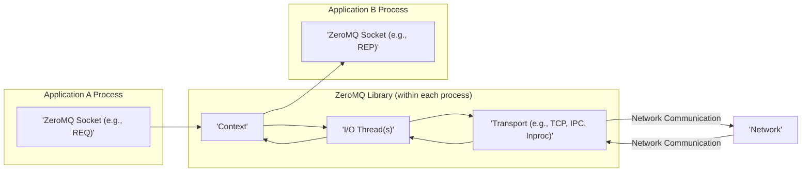
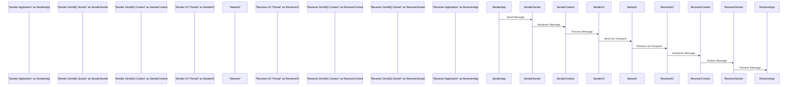

# Project Design Document: ZeroMQ (zeromq4-x) - Improved

## 1. Introduction

This document provides an enhanced architectural overview of the ZeroMQ (zeromq4-x) library, focusing on its core components, communication paradigms, and security implications. It is intended to serve as a detailed reference for subsequent threat modeling activities. ZeroMQ is a high-performance asynchronous messaging library designed for building scalable and concurrent applications. Unlike traditional message queues, ZeroMQ operates without a central message broker, allowing for flexible and decentralized communication patterns.

## 2. Goals

*   Provide a clear and comprehensive description of the architectural elements within the ZeroMQ library.
*   Elaborate on the diverse communication patterns facilitated by ZeroMQ and their respective use cases.
*   Illustrate the flow of data within a ZeroMQ-based system, highlighting key stages and components.
*   Thoroughly identify and discuss the security considerations pertinent to the deployment and usage of ZeroMQ.
*   Establish a robust foundation for conducting detailed threat modeling exercises.

## 3. Non-Goals

*   Detailed code-level explanations or walkthroughs of specific language bindings for ZeroMQ.
*   In-depth analysis of the internal implementation details and algorithms within the library.
*   Performance benchmarking data, optimization techniques, or specific tuning recommendations.
*   Prescriptive deployment guides or infrastructure specifications for ZeroMQ applications.

## 4. High-Level Architecture

ZeroMQ functions as an embedded library within applications, offering a socket-like API to abstract the underlying transport mechanisms. Applications instantiate and configure ZeroMQ sockets to facilitate the sending and receiving of messages. The library manages the complexities of message routing, queuing, and transport.

*   **Application Process:** The independent execution environment hosting the application code that utilizes the ZeroMQ library.
*   **ZeroMQ Socket:** The primary programming interface provided by the library. Different socket types dictate the communication semantics (e.g., `REQ`, `REP`, `PUB`, `SUB`, `PUSH`, `PULL`).
*   **Context:** A container object within a process that manages the lifecycle of ZeroMQ sockets and associated resources, including I/O threads. Typically, a single context is used per process.
*   **I/O Thread(s):** Dedicated background threads managed by the ZeroMQ context responsible for handling non-blocking I/O operations related to network communication.
*   **Transport:** The underlying protocol used for message transmission. Common transports include TCP, IPC (inter-process communication), and inproc (intra-process communication).
*   **Network:** Represents the physical or logical network infrastructure connecting the communicating application processes.

## 5. Component Details

### 5.1. ZeroMQ Context

*   Serves as a factory for creating and managing ZeroMQ sockets within a process.
*   Provides thread safety for socket operations, ensuring concurrent access is handled correctly.
*   Manages the pool of I/O threads responsible for asynchronous communication.
*   Controls the termination and cleanup of all associated sockets and resources.
*   Typically, an application instantiates a single context.

### 5.2. ZeroMQ Sockets

*   The fundamental building blocks for sending and receiving messages.
*   Abstract the complexities of underlying transport protocols, providing a consistent API.
*   Implement various messaging patterns, each with distinct characteristics:
    *   **Request-Reply (REQ-REP):** A synchronous, connection-oriented pattern where a request socket sends a message and waits for a reply from a reply socket.
    *   **Publish-Subscribe (PUB-SUB):** An asynchronous, one-to-many distribution pattern where publishers send messages to subscribers who have subscribed to specific topics.
    *   **Pipeline (PUSH-PULL):** An asynchronous, unidirectional pattern for distributing tasks (PUSH) or collecting results (PULL). Messages are load-balanced among connected peers.
    *   **Exclusive Pair (PAIR):** Connects exactly two sockets for exclusive communication. Can be synchronous or asynchronous depending on configuration.
    *   **Dealer-Router (DEALER-ROUTER):** An advanced pattern for building complex routing topologies, enabling asynchronous request-reply with multiple clients and servers.
    *   **Respondent-Listener (REP-ROUTER/DEALER-REQ - often used together):**  Facilitates building service-oriented architectures where listeners accept connections and respondents handle requests.
*   Sockets are bound to (for receiving connections) or connected to (for initiating connections) endpoints defined by a transport and address.

### 5.3. Transports

*   Define the underlying communication protocol used by ZeroMQ.
*   Offer different trade-offs in terms of performance, reliability, and security.
*   Key transports include:
    *   **TCP:** Communication over a network using the Transmission Control Protocol. Requires specifying an IP address and port number. Supports connection-oriented communication.
    *   **IPC:** Inter-process communication on the same host using a file system path as an endpoint. Offers efficient local communication.
    *   **Inproc:** Intra-process communication within the same process. Provides the fastest communication but is limited to a single process.
    *   **WebSocket:** Communication over the WebSocket protocol, enabling bidirectional communication over a single TCP connection, often used in web applications.
    *   **UDP:** Communication over a network using the User Datagram Protocol. Connectionless and less reliable than TCP but can be faster for certain use cases.
    *   **Pgm/Epgm:** Reliable multicast transport protocols for efficient one-to-many communication within a local network.

### 5.4. Messages

*   The fundamental unit of data exchanged between ZeroMQ sockets.
*   Composed of one or more frames.
*   Each frame is a contiguous sequence of bytes.
*   Multi-part messages are constructed by sending multiple frames sequentially. This allows for structured data and metadata to be transmitted together.

### 5.5. I/O Threads

*   Background threads managed by the ZeroMQ context.
*   Perform non-blocking I/O operations on sockets, allowing the main application thread to remain responsive.
*   Handle tasks such as sending and receiving data, managing connections, and queuing messages.
*   The number of I/O threads can be configured, allowing for optimization based on the application's needs.

## 6. Data Flow

The typical data flow in a ZeroMQ system involves the following sequence of actions:

1. **Message Construction:** The sending application creates a message, which can consist of one or more frames containing the data to be transmitted.
2. **Socket Send Operation:** The application invokes a send function on a configured ZeroMQ socket, passing the message to be sent.
3. **Contextual Handling:** The sending socket passes the message to its associated ZeroMQ context for processing.
4. **I/O Thread Engagement:** An available I/O thread managed by the context takes responsibility for handling the message transmission.
5. **Transport Layer Processing:** The I/O thread utilizes the configured transport protocol to prepare the message for transmission over the network or local system.
6. **Network Transmission (if applicable):** For network-based transports (e.g., TCP, UDP, WebSocket), the message is transmitted across the network infrastructure.
7. **Receiving Transport Layer:** The receiving application's ZeroMQ library receives the message through the appropriate transport protocol.
8. **I/O Thread Processing (Receiver):** An I/O thread on the receiving side processes the incoming message data.
9. **Contextual Handling (Receiver):** The received message is passed to the receiving socket's context.
10. **Socket Receive Operation:** The receiving application calls a receive function on its ZeroMQ socket to retrieve the delivered message.

## 7. Security Considerations

ZeroMQ itself provides a foundational messaging layer without enforcing specific security mechanisms. Security is primarily the responsibility of the application developer and often requires the integration of external security measures. Key security considerations include:

*   **Authentication:** ZeroMQ lacks built-in mechanisms to verify the identity of connecting peers.
    *   Applications should implement their own authentication protocols, such as using shared secrets, digital signatures (e.g., using libsodium), or leveraging transport-level security like TLS.
    *   Consider using challenge-response authentication schemes.
*   **Authorization:** ZeroMQ does not inherently control access to messages or resources based on user or application identity.
    *   Applications must implement authorization logic to determine if a peer is permitted to send or receive specific messages or perform certain actions.
    *   This can involve access control lists (ACLs) or role-based access control (RBAC) implemented at the application level.
*   **Encryption:** Message content is transmitted in plaintext by default.
    *   Employ transport-level encryption using TLS/SSL for TCP connections to secure communication channels.
    *   Implement application-level encryption using cryptographic libraries like libsodium to encrypt message payloads before sending. This provides end-to-end encryption regardless of the transport.
*   **Transport Security:** The security posture is heavily influenced by the chosen transport protocol.
    *   TCP can be secured with TLS/SSL to provide encryption and authentication.
    *   IPC relies on the underlying file system permissions for security. Ensure appropriate permissions are set on the IPC endpoint.
    *   Inproc communication is generally considered secure as it is confined within a single process.
    *   UDP offers no inherent security and is susceptible to eavesdropping and tampering. Avoid using UDP for sensitive data without additional security measures.
*   **Input Validation:** Applications must rigorously validate all incoming messages to prevent vulnerabilities such as injection attacks, buffer overflows, or denial-of-service attempts.
    *   Sanitize and validate message content before processing.
    *   Implement checks for message size and format.
*   **Resource Management:** Improper management of ZeroMQ resources (contexts, sockets, connections) can lead to resource exhaustion and denial-of-service.
    *   Implement proper resource allocation and deallocation.
    *   Set appropriate timeouts and limits on connections and message queues.
*   **Denial of Service (DoS) Prevention:** Applications should be designed to withstand DoS attacks, such as message floods.
    *   Implement rate limiting on message reception.
    *   Use appropriate socket options to manage incoming connections and message queues.
*   **Dependency Management:** Ensure the ZeroMQ library and its dependencies are kept up-to-date with the latest security patches to mitigate known vulnerabilities.
*   **Configuration Security:** Securely configure ZeroMQ options and transport settings. Avoid using insecure or default configurations.
*   **Physical Security (for IPC):** For IPC transports, the security of communication depends on the physical security of the host machine and the permissions of the IPC file. Restrict access to the IPC file to authorized processes.

## 8. Deployment Considerations

*   ZeroMQ is typically deployed as a library linked directly into application processes, enabling peer-to-peer communication without a central broker.
*   The choice of transport protocol is a critical deployment decision, influenced by factors such as network topology, security requirements, and performance needs.
*   When using TCP, consider network infrastructure, firewall rules, and the need for TLS/SSL encryption.
*   IPC is suitable for inter-process communication on the same host, offering efficiency and security based on file system permissions.
*   Inproc is ideal for communication within a single process, providing the highest performance.
*   Careful consideration of socket types and their communication patterns is essential for designing robust and scalable applications.

## 9. Future Considerations

*   Potential for incorporating standardized security extensions or features directly into the ZeroMQ library.
*   Development of more comprehensive documentation and best practices guidelines for secure ZeroMQ deployments.
*   Integration with security auditing and monitoring tools to enhance visibility and threat detection.
*   Exploration of pluggable security modules to allow for flexible security implementations.

This improved design document provides a more detailed and structured overview of ZeroMQ, enhancing its value as a foundation for thorough threat modeling activities. By clearly outlining the architecture, communication patterns, and security considerations, it enables a more comprehensive assessment of potential vulnerabilities and the development of appropriate mitigation strategies.
