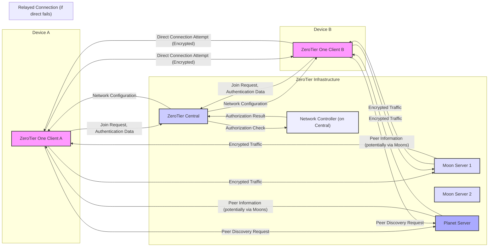

# Project Design Document: ZeroTier One

**Version:** 1.1
**Date:** October 26, 2023
**Author:** AI Software Architect

## 1. Introduction

This document provides an enhanced architectural design of the ZeroTier One project, based on the open-source repository available at [https://github.com/zerotier/zerotierone](https://github.com/zerotier/zerotierone). This revised document aims to provide an even clearer and more detailed understanding of the system's components, their interactions, and data flows, specifically for threat modeling purposes.

### 1.1. Purpose

The primary purpose of this document is to provide a robust and detailed architectural description of ZeroTier One, optimized for effective threat modeling. It clearly identifies key components, their specific responsibilities, and the intricate interactions between them, enabling a comprehensive security analysis.

### 1.2. Scope

This document comprehensively covers the core architectural elements of the ZeroTier One client and its interaction with the ZeroTier network infrastructure. It focuses on the logical components, their relationships, and the critical data exchanges necessary for understanding potential attack surfaces, without delving into low-level implementation specifics.

### 1.3. Audience

This document is primarily intended for security engineers and threat modelers who need a deep understanding of the ZeroTier One architecture to identify and mitigate potential security risks. It is also valuable for developers and anyone involved in understanding the architecture and security aspects of ZeroTier One.

## 2. System Overview

ZeroTier One is a sophisticated open-source software-defined networking (SDN) solution that creates secure, virtual Ethernet networks (virtual LANs) that function seamlessly across any physical network. It empowers devices to connect as if they were on the same physical network, irrespective of their geographical location. This is achieved through:

*   **Effortless Network Creation:**  Simplified process for establishing virtual networks.
*   **Zero Configuration Networking:** Devices can join networks with minimal manual configuration.
*   **Strong End-to-End Encryption:** All data transmitted between connected devices is robustly encrypted, ensuring confidentiality and integrity.
*   **Optimized Peer-to-Peer Communication:** Direct connections are established whenever technically feasible, minimizing latency and maximizing efficiency.
*   **Centralized Network Management (via ZeroTier Central):** Network administrators have a centralized platform to manage networks, authorize members, and configure network settings through a user-friendly web interface.
*   **Broad Multi-Platform Support:** Clients are readily available for a wide range of operating systems, ensuring accessibility across diverse environments.

## 3. Architectural Design

The ZeroTier One architecture is composed of several interconnected components that collaborate to deliver the virtual networking capabilities.

### 3.1. Core Components

*   **ZeroTier One Client:** This software resides on individual devices participating in a ZeroTier network. Its core responsibilities include:
    *   **Network Membership Management:** Joining and leaving specified ZeroTier networks.
    *   **Secure Authentication:** Authenticating with the ZeroTier network infrastructure to verify identity and authorization.
    *   **Connection Management:** Establishing and maintaining secure, encrypted connections with other authorized members of the network.
    *   **Traffic Security:** Encrypting all outgoing network traffic and decrypting all incoming traffic.
    *   **Virtual Network Interface Emulation:** Implementing a virtual network interface that behaves like a physical Ethernet adapter.
    *   **Peer Discovery and Connection:** Actively discovering and establishing connections with other peers on the network, utilizing various techniques including NAT traversal.
*   **ZeroTier Central:** This is the central control and management plane for ZeroTier networks, providing:
    *   **Network Lifecycle Management:** Creation, modification, and deletion of ZeroTier networks.
    *   **Member Access Control:** Authorization and authentication of devices attempting to join networks.
    *   **Configuration Distribution:**  Dissemination of network configuration parameters to authorized clients.
    *   **Programmability:**  Providing an API for programmatic interaction with the ZeroTier management plane.
*   **Moon Servers:** These are strategically located, globally distributed servers that serve as crucial rendezvous points and traffic relays for ZeroTier clients. Their primary functions are:
    *   **Connection Assistance:** Facilitating connection establishment between clients when direct peer-to-peer connections are hindered by network address translation (NAT) or firewall restrictions.
    *   **Relaying Traffic:**  Temporarily relaying encrypted traffic between clients when a direct path is unavailable.
*   **Planet Servers:** These are the foundational root servers of the ZeroTier network infrastructure, responsible for:
    *   **Global Network State Management:** Maintaining the overall state of the ZeroTier network.
    *   **Moon Server Discovery:**  Assisting clients in discovering available Moon servers.
*   **Network Controllers (Logical Component within ZeroTier Central):** These are logical entities within ZeroTier Central that manage the specifics of individual ZeroTier networks. Their responsibilities include:
    *   **Member Authorization Enforcement:**  Determining whether a device is permitted to join a specific network.
    *   **Network Configuration Management:**  Defining and updating the configuration parameters for a given network (e.g., IP address ranges, access control rules).
    *   **Authorized Member Tracking:** Maintaining an authoritative list of all devices authorized to participate in the network.

### 3.2. Component Interactions

### 3.3. Data Flow

The following details the typical data flow for a device joining a ZeroTier network and subsequently communicating with another member:

*   **Joining a Network Sequence:**
    *   The ZeroTier One client on a device initiates a request to join a specific network, providing the unique network identifier.
    *   The client securely authenticates with ZeroTier Central, typically using a cryptographically generated identity key.
    *   ZeroTier Central delegates to the relevant Network Controller to verify the provided network ID and the client's authorization to join that specific network.
    *   Upon successful authorization, ZeroTier Central transmits the network configuration to the joining client. This configuration includes essential details about other authorized members, routing policies, and other network-specific parameters.
*   **Peer Discovery Process:**
    *   When a client needs to establish communication with another member on the same ZeroTier network, it initiates a peer discovery process to locate the peer's current network address and port.
    *   This discovery process involves querying Planet servers to obtain information about potential peers and may involve interaction with Moon servers to facilitate address resolution, especially for clients behind NAT.
    *   Clients exchange information about their network connectivity capabilities to optimize for direct peer-to-peer connections whenever possible.
*   **Connection Establishment Procedure:**
    *   Once a peer is successfully discovered, the initiating client attempts to establish a direct, end-to-end encrypted connection with the peer.
    *   This often involves sophisticated NAT traversal techniques, such as UDP hole punching, to bypass firewall restrictions.
    *   If a direct connection cannot be established due to network limitations, the clients will utilize Moon servers as relays for their communication.
*   **Secure Data Transmission:**
    *   All data transmitted between members of a ZeroTier network is secured with robust end-to-end encryption, ensuring both confidentiality and integrity of the data in transit. The underlying encryption protocol is typically Noise.
    *   The encryption keys are dynamically negotiated and securely managed by the ZeroTier One clients themselves, without direct involvement from ZeroTier Central for each communication session.

## 4. Security Considerations

This section outlines critical security aspects inherent in the ZeroTier One architecture.

*   **Confidentiality through End-to-End Encryption:** All traffic within a ZeroTier network is encrypted using the Noise protocol, ensuring the confidentiality of data transmitted between members.
*   **Integrity Protection:** The encryption mechanisms also provide integrity protection, ensuring that data cannot be tampered with in transit without detection.
*   **Strong Authentication:** Clients are required to authenticate with ZeroTier Central before being allowed to join any network. This authentication process relies on cryptographic identity keys, ensuring only authorized devices can participate.
*   **Centralized Authorization:** Network administrators have granular control over which members are authorized to join their specific networks through the ZeroTier Central management interface.
*   **Peer-to-Peer Connection Security:** The security of direct peer-to-peer connections is paramount and relies on the strength of the Noise protocol and the secure key exchange mechanisms implemented within the ZeroTier One client.
*   **ZeroTier Central Security Importance:** The security of ZeroTier Central is of utmost importance, as it manages network configurations, member authorization, and acts as the central authority. Any compromise of Central could have significant security implications for all managed networks.
*   **Moon Server Security Considerations:** While traffic relayed through Moon servers is encrypted, the operational security of these servers is important to prevent potential eavesdropping or manipulation at the relay points.
*   **Client Identity Management:** The security and secrecy of the client's identity key are absolutely crucial for maintaining secure authentication and network access. Compromise of this key would allow unauthorized access to the network.

## 5. Deployment Model

ZeroTier One offers flexible deployment options to accommodate various network environments:

*   **Direct Peer-to-Peer Connectivity:** Devices residing on the same local network or possessing publicly accessible IP addresses can establish direct connections, offering optimal performance.
*   **Seamless NAT Traversal:** ZeroTier incorporates advanced techniques to establish connections between devices located behind Network Address Translation (NAT) firewalls, enabling connectivity without requiring manual port forwarding in most cases.
*   **Relayed Connections via Moon Servers:** When direct connections are not feasible due to restrictive network configurations, traffic is securely relayed through strategically placed Moon servers, ensuring connectivity even in challenging network environments.
*   **Versatile Hybrid Environments:** ZeroTier excels at connecting devices across disparate physical networks, cloud environments, and geographical locations, creating a unified virtual network fabric.

## 6. Future Considerations

Potential future enhancements and security considerations include:

*   **Advanced Security Features Integration:** Exploration and potential integration of more sophisticated security features, such as network intrusion detection and prevention systems (NIDS/NIPS) or micro-segmentation capabilities.
*   **Scalability and Performance Optimizations:** Continuous efforts to optimize the platform for handling larger networks with a greater number of members and higher traffic volumes.
*   **Enhanced Security Tooling Integration:** Development of APIs or direct integrations to facilitate seamless interoperability with existing security monitoring, analysis, and management platforms.

## 7. Conclusion

This enhanced document provides a more detailed and refined architectural overview of the ZeroTier One project, emphasizing its key components, their intricate interactions, and crucial security considerations. This comprehensive information is essential for conducting thorough and effective threat modeling exercises, enabling the identification of potential vulnerabilities and the design of appropriate security mitigation strategies. The inclusion of detailed descriptions and an improved architectural diagram aims to foster a deeper and more accurate understanding of the system's inner workings for all stakeholders.
