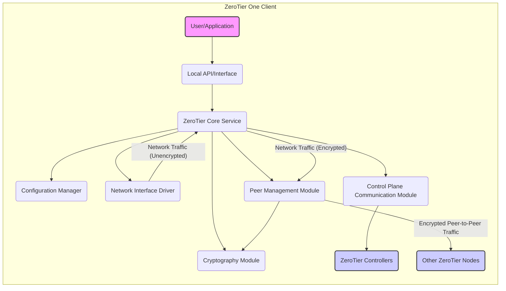

# Project Design Document: ZeroTier One Client

**Document Version:** 1.1
**Date:** October 26, 2023
**Author:** Gemini (AI Model)

## 1. Introduction

This document provides a detailed architectural design of the ZeroTier One client application, as represented by the codebase in the provided GitHub repository ([https://github.com/zerotier/zerotierone](https://github.com/zerotier/zerotierone)). This document serves as a foundation for subsequent threat modeling activities. It outlines the key components, their interactions, and the data flows within the client application.

### 1.1. Purpose

The purpose of this document is to:

* Clearly describe the architecture of the ZeroTier One client.
* Identify the key components and their specific responsibilities.
* Illustrate the interactions and data flows between components with greater detail.
* Provide a robust basis for identifying potential security vulnerabilities and attack vectors during threat modeling.

### 1.2. Scope

This document focuses specifically on the design of the ZeroTier One client application. It does not cover the architecture of the ZeroTier central controller infrastructure, relay servers (moons/roots), or other related services. The scope is limited to the functionality and components directly within the `zerotierone` codebase executing on an end-user device.

### 1.3. Target Audience

This document is intended for:

* Security engineers and architects performing threat modeling and security assessments.
* Developers working on or integrating with the ZeroTier One client codebase.
* System administrators and network engineers seeking a detailed understanding of the client's internal architecture for deployment and troubleshooting.
* Anyone requiring a deep technical understanding of the ZeroTier One client.

## 2. System Overview

ZeroTier One is an open-source software-defined networking (SDN) solution that enables the creation of secure, virtualized Ethernet networks spanning diverse physical networks and geographical locations. The `zerotierone` client is the essential component installed on end-user devices that participates in these virtual networks, acting as a virtual network adapter.

The client's core responsibilities include:

* **Virtual Network Interface Management:** Creation, configuration, and management of a virtual network interface (e.g., `zt0`).
* **Peer Discovery and Secure Connection Establishment:** Discovering other ZeroTier nodes within the same virtual network and establishing secure, authenticated connections.
* **End-to-End Encryption and Decryption:** Encrypting all network traffic transmitted over the virtual network and decrypting received traffic.
* **Intra-Network Routing and Forwarding:** Routing and forwarding network packets between the virtual network interface and the underlying physical network.
* **Configuration and State Management:** Handling user and system configuration for joining and managing ZeroTier networks, and maintaining the client's operational state.
* **Authentication and Authorization with Controllers:** Authenticating the client with ZeroTier controllers and enforcing network access policies.

## 3. Architectural Design

The ZeroTier One client is structured as a set of interacting modules, each responsible for a specific aspect of its functionality.

### 3.1. Core Components

* **ZeroTier Core Service (`zerotier-one` daemon/process):** The primary background process responsible for the core networking logic. It orchestrates all other components and manages the overall lifecycle of the ZeroTier connection. Its key responsibilities include:
    * Managing the virtual network interface lifecycle.
    * Coordinating peer discovery and connection management.
    * Enforcing security policies and managing encryption.
    * Handling routing and forwarding decisions.
    * Interacting with the control plane.
* **Configuration Manager:** Responsible for persistent storage and retrieval of the client's configuration. This includes:
    * Network membership information (network IDs).
    * Authorization tokens and secrets.
    * Local client settings and preferences.
    * Configuration is typically stored in files, with platform-specific locations and formats.
* **Network Interface Driver (Kernel Module or TUN/TAP Interface):** A platform-dependent component that implements the virtual network interface.
    * In kernel mode, it directly interacts with the operating system's networking stack.
    * In user space (using TUN/TAP), it interacts with the service to send and receive raw packets.
    * This component is responsible for presenting the virtual network interface to the operating system.
* **Cryptography Module:** Provides all cryptographic functionalities required by the client.
    * Key generation (for device identity and session keys).
    * Implementation of encryption and decryption algorithms (e.g., Curve25519 for key exchange, ChaCha20-Poly1305 for symmetric encryption).
    * Secure hashing and message authentication codes (MACs).
    * Secure random number generation.
* **Peer Management Module:** Manages the discovery, connection establishment, and maintenance of connections with other ZeroTier nodes.
    * Implements the ZeroTier handshake protocol for secure connection setup.
    * Handles NAT traversal techniques (e.g., UDP hole punching).
    * Maintains the state of connections with peers.
    * Manages reconnection attempts and connection monitoring.
* **Control Plane Communication Module:** Handles all communication with the ZeroTier central controllers.
    * Implements the communication protocol used to interact with controllers (likely a custom protocol over TLS).
    * Handles client authentication and authorization with the controller.
    * Facilitates network membership management (joining and leaving networks).
    * Receives peer discovery information from the controller.
    * Receives network configuration updates and policy information.
* **Local API/Interface:** Provides a mechanism for local applications and users to interact with the ZeroTier service.
    * Typically implemented as a command-line interface (CLI) utility (`zerotier-cli`).
    * May also include a local socket or inter-process communication (IPC) mechanism for programmatic access.

### 3.2. Component Interactions

**Detailed Interaction Description:**

* **User/Application Interaction:** Users or local applications interact with the ZeroTier client primarily through the Local API/Interface (e.g., using `zerotier-cli` commands) to manage network connections, view status, and configure the client.
* **Local API to Core Service:** The Local API/Interface translates user commands into requests to the ZeroTier Core Service, which then performs the necessary actions.
* **Core Service and Configuration:** The ZeroTier Core Service relies on the Configuration Manager to load the client's configuration at startup and to persist changes to the configuration.
* **Core Service and Network Interface:** The Core Service interacts with the Network Interface Driver to send and receive raw network packets to and from the virtual network interface. Outbound packets are passed to the Core Service for processing (encryption, routing), and inbound packets are received from the Core Service after decryption.
* **Core Service and Cryptography:** The ZeroTier Core Service utilizes the Cryptography Module for all cryptographic operations, including key generation, encryption, decryption, and secure handshake procedures.
* **Core Service and Peer Management:** The Core Service delegates the tasks of discovering, connecting to, and maintaining connections with other peers to the Peer Management Module.
* **Core Service and Control Plane:** The ZeroTier Core Service uses the Control Plane Communication Module to interact with the ZeroTier Controllers for authentication, network management, peer discovery information, and policy updates.
* **Peer Management and Cryptography:** The Peer Management Module relies on the Cryptography Module to perform cryptographic operations necessary for establishing secure connections with peers, including key exchange and session key derivation.
* **Peer Management and Network Interface (Indirect):** While the Peer Management Module doesn't directly interact with the Network Interface Driver, it instructs the Core Service on how to send and receive encrypted traffic, which ultimately uses the driver.

## 4. Data Flow

Understanding the movement and transformation of data within the ZeroTier One client is essential for identifying potential security vulnerabilities.

* **Outbound Traffic Flow (Local Application to ZeroTier Network):**
    * A local application sends network traffic destined for the ZeroTier network to the virtual network interface managed by the Network Interface Driver.
    * The Network Interface Driver passes the raw network packet to the ZeroTier Core Service.
    * The Core Service determines the destination ZeroTier peer based on the destination IP address in the packet.
    * The Cryptography Module encrypts the packet using the established session key for the destination peer.
    * The Peer Management Module encapsulates the encrypted packet and sends it to the destination peer's known IP address and port (potentially via a relay server if a direct connection isn't possible).
* **Inbound Traffic Flow (ZeroTier Network to Local Application):**
    * The Network Interface Driver receives an encrypted packet from a remote ZeroTier peer.
    * The Peer Management Module receives the encrypted packet.
    * The Cryptography Module decrypts the packet using the appropriate session key.
    * The ZeroTier Core Service forwards the decrypted packet to the appropriate local application based on the destination port and other packet headers.
* **Configuration Update Flow:**
    * The Control Plane Communication Module establishes a secure connection with a ZeroTier Controller.
    * The Controller sends configuration updates (e.g., network policies, peer information) to the client.
    * The Control Plane Communication Module receives and verifies these updates.
    * The ZeroTier Core Service processes the updates and instructs the Configuration Manager to store the new configuration.
* **Peer Discovery Flow:**
    * When joining a network or periodically, the Peer Management Module requests peer information from the ZeroTier Controllers via the Control Plane Communication Module.
    * The Controller responds with a list of other online nodes in the same network, including their public IP addresses and ports.
    * The Peer Management Module uses this information to attempt direct connections with these peers.
* **Authentication Flow:**
    * When the ZeroTier client starts or attempts to join a new network, the Control Plane Communication Module initiates an authentication handshake with a ZeroTier Controller.
    * The client presents its identity (typically a device address and potentially an authorization token).
    * The Controller verifies the client's identity and authorizes access to the requested network.

## 5. Security Considerations (Detailed)

This section expands on the initial security considerations, providing more specific potential risks and areas of focus for threat modeling.

* **Key Management Vulnerabilities:**
    * **Weak Key Generation:** Use of insecure random number generators could lead to predictable keys.
    * **Insecure Key Storage:** Private keys stored in easily accessible locations or without proper encryption could be compromised.
    * **Key Exchange Weaknesses:** Vulnerabilities in the key exchange protocol could allow attackers to intercept or manipulate session keys.
    * **Key Rotation Issues:** Infrequent or improper key rotation can increase the window of opportunity for attackers.
* **Authentication and Authorization Weaknesses:**
    * **Stolen or Compromised Tokens:** If authorization tokens are not securely stored or transmitted, they could be stolen and used by unauthorized parties.
    * **Replay Attacks:** Vulnerabilities in the authentication protocol could allow attackers to replay previous authentication attempts.
    * **Lack of Mutual Authentication:** If the client doesn't verify the identity of the controller, it could be susceptible to man-in-the-middle attacks.
* **Encryption Implementation Flaws:**
    * **Use of Weak or Obsolete Cryptographic Algorithms:** Employing outdated algorithms could make the encryption vulnerable to known attacks.
    * **Incorrect Implementation of Cryptographic Primitives:** Improper use of encryption libraries or algorithms can lead to vulnerabilities.
    * **Side-Channel Attacks:** Potential vulnerabilities related to timing or power consumption during cryptographic operations.
* **Peer-to-Peer Connection Security Risks:**
    * **Man-in-the-Middle Attacks:** Attackers intercepting communication during peer connection establishment could compromise the security of the connection.
    * **NAT Traversal Vulnerabilities:** Exploiting weaknesses in NAT traversal mechanisms to gain unauthorized access.
    * **Denial of Service Attacks:** Attackers flooding peers with connection requests or malicious traffic.
* **Control Plane Communication Security Weaknesses:**
    * **Compromised Controller Communication:** If the communication channel with the controllers is compromised, attackers could manipulate network configurations or inject malicious peer information.
    * **Controller Impersonation:** An attacker impersonating a legitimate controller could gain control over clients.
* **Local API Security Vulnerabilities:**
    * **Unauthorized Local Access:** Lack of proper access controls on the local API could allow malicious local processes to control the ZeroTier client.
    * **Privilege Escalation:** Vulnerabilities in the local API could be exploited to gain elevated privileges.
* **Software Vulnerabilities (General):**
    * **Buffer Overflows:** Memory corruption vulnerabilities that could allow arbitrary code execution.
    * **Injection Attacks:** Vulnerabilities allowing attackers to inject malicious code or commands.
    * **Logic Errors:** Flaws in the application's logic that could be exploited for malicious purposes.
* **Dependency Vulnerabilities:**
    * ** використання вразливих сторонніх бібліотек:** Using third-party libraries with known security vulnerabilities.
    * **Outdated Dependencies:** Failing to update dependencies with security patches.

## 6. Technologies Used (Based on Repository Analysis)

* **Primary Programming Language:** C++
* **Networking Libraries:** Platform-specific networking APIs (e.g., POSIX sockets on Linux/macOS, Winsock on Windows), likely with custom abstractions.
* **Cryptography Libraries:** Potentially a combination of custom implementations and established libraries like libsodium or a similar secure cryptography library.
* **Build System:** CMake
* **Inter-Process Communication (IPC):** Likely platform-specific mechanisms such as Unix domain sockets or named pipes for the local API.
* **Virtual Network Interface Implementation:** Platform-specific kernel-level APIs or TUN/TAP interfaces.
* **Operating System Support:** Cross-platform, including Linux, macOS, Windows, and potentially others (e.g., FreeBSD).

## 7. Future Considerations

This design document represents the current understanding of the ZeroTier One client architecture. Future developments and areas for consideration include:

* **Enhanced Security Auditing and Logging:** Implementing more comprehensive auditing and logging mechanisms for security monitoring and incident response.
* **Improved Resilience and Fault Tolerance:** Enhancing the client's ability to handle network disruptions and controller outages.
* **Further Modularization and Sandboxing:** Isolating components to limit the impact of potential vulnerabilities.
* **Formal Security Verification:** Employing formal methods to verify the security properties of critical components.
* **Integration with Hardware Security Modules (HSMs):** Exploring the use of HSMs for enhanced key management.

This document provides a comprehensive architectural overview of the ZeroTier One client and serves as a crucial foundation for conducting thorough threat modeling activities.
