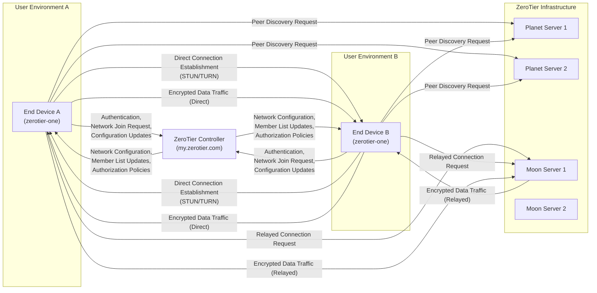

## Project Design Document: ZeroTier (Improved)

**1. Introduction**

This document provides a detailed architectural design of the ZeroTier project, based on the information available in the public GitHub repository: [https://github.com/zerotier/zerotierone](https://github.com/zerotier/zerotierone). This document aims to provide a comprehensive and clear overview of the system's components, their interactions, and data flows. It is specifically designed to serve as a robust foundation for subsequent threat modeling activities.

**1.1. Purpose**

The primary purpose of this document is to clearly and comprehensively articulate the design of the ZeroTier system. This detailed description will enable stakeholders, particularly security engineers, to thoroughly understand the system's architecture, identify potential security vulnerabilities, and assess associated risks.

**1.2. Scope**

This document focuses on the core architectural components of the ZeroTier system. This includes a detailed examination of the client application (`zerotier-one`), the central controller (my.zerotier.com), and the network infrastructure elements (Planet and Moon servers). The scope encompasses the key functionalities related to virtual network creation, member management, authentication, authorization, connection establishment, and data transmission.

**1.3. Target Audience**

This document is intended for a technical audience, including:

* Security engineers responsible for threat modeling, security assessments, and penetration testing.
* Software architects and developers involved in the design, development, and maintenance of ZeroTier or systems integrating with it.
* Operations teams responsible for the deployment, configuration, and management of ZeroTier networks and infrastructure.

**2. System Overview**

ZeroTier is a sophisticated software-defined networking (SDN) solution that empowers users to create and manage secure, private virtual Ethernet networks. It provides a layer 2 network virtualization layer that operates seamlessly over existing physical networks, enabling secure and direct communication between geographically dispersed devices as if they were on the same physical local area network (LAN). Key features include:

* **Virtual Network Creation and Management:** Users can easily create and manage multiple private, isolated, and encrypted virtual networks.
* **Effortless Device Enrollment:** Devices running the ZeroTier client can seamlessly join these virtual networks with minimal configuration.
* **Intelligent Path Selection with Direct Peer-to-Peer Connections:** ZeroTier intelligently attempts to establish direct, low-latency connections between peers whenever network conditions permit.
* **Resilient Relayed Connections:** When direct connections are not feasible due to network constraints (e.g., NAT traversal issues, firewalls), traffic is securely relayed through ZeroTier-managed infrastructure.
* **Centralized Network Management and Control:** A central controller (my.zerotier.com) provides a unified platform for managing user accounts, organizations, network membership, authorization policies, and network configurations.
* **Robust End-to-End Encryption:** All data traffic within a ZeroTier network is encrypted using strong cryptographic algorithms, ensuring confidentiality and integrity.

**3. Architectural Components**

The ZeroTier system is composed of the following essential components:

* **ZeroTier Client (`zerotier-one`):**
    * Runs as a background service or application on end-user devices, including desktops, servers, mobile devices, and embedded systems.
    * Creates and manages virtual network interfaces (typically `zt0`) on the host operating system.
    * Handles the initial authentication and ongoing authorization with the central controller to join and remain on a network.
    * Actively participates in peer discovery to locate other members of the same virtual network.
    * Establishes and maintains secure connections (direct or relayed) with other peers on the network.
    * Encrypts all outgoing network traffic destined for the virtual network and decrypts all incoming traffic.
    * Implements the core ZeroTier protocol, managing connection state, key exchange, and data transmission.
    * Interacts with Planet and Moon servers for peer discovery and relay services.
* **ZeroTier Controller (my.zerotier.com):**
    * A centralized, multi-tenant web application and backend infrastructure hosted by ZeroTier, Inc.
    * Manages user accounts, organizations, and their associated virtual networks.
    * Stores critical network configurations, including network member lists, authorized device identities, and access control rules.
    * Handles user authentication and authorization for accessing and managing networks.
    * Plays a crucial role in the initial connection setup between peers by facilitating the exchange of connection information.
    * Provides a user-friendly web interface and a programmatic API for network creation, configuration, and member management.
* **Planet Servers:**
    * Act as the root servers within the ZeroTier global network infrastructure.
    * Provide the initial peer discovery and rendezvous points for clients joining a network.
    * Their addresses are typically hardcoded or embedded within the `zerotier-one` client software.
    * Assist clients in finding potential peers on a specific network by maintaining a distributed directory of online members.
* **Moon Servers:**
    * Function as relay servers within the ZeroTier network infrastructure.
    * Are utilized when direct peer-to-peer connections cannot be established due to network limitations (e.g., symmetric NAT).
    * Facilitate communication between peers by securely relaying encrypted network traffic.
    * Can be operated and managed by ZeroTier, Inc. or self-hosted by users for enhanced control or specific network requirements.
* **End Devices:**
    * Represent the physical or virtual machines running the `zerotier-one` client application.
    * Actively participate in the created virtual networks.
    * Send and receive network traffic over the virtual network interface as if they were directly connected on a physical LAN.

**4. System Architecture Diagram**

**5. Data Flow**

The following details the typical data flow within the ZeroTier system for various operations:

* **Virtual Network Creation:**
    * A user with an account on the ZeroTier Controller (my.zerotier.com) logs in via the web interface or API.
    * The user initiates the creation of a new virtual network, providing a name and optionally configuring advanced settings.
    * The controller generates a globally unique network ID (a 16-digit hexadecimal number) and stores the network configuration details in its database.
* **Device Joining a Network:**
    * A user installs and runs the `zerotier-one` client application on their device.
    * The client needs to be authorized to join a network. This typically involves using the network ID and potentially an authorization mechanism configured on the controller (e.g., manual approval).
    * The client contacts the ZeroTier Controller, providing the network ID and its identity information.
    * The controller authenticates the client (implicitly through the network join process) and verifies if the device is authorized to join the specified network based on the network's membership policy.
    * If authorized, the controller sends the network configuration (subnet, MTU, etc.) and the current member list to the client.
* **Peer Discovery Process:**
    * Clients periodically contact known Planet servers to discover other online members of the networks they have joined.
    * Planet servers maintain a distributed database or similar mechanism that maps network IDs to the currently online members and their potential connection endpoints.
    * When a client needs to communicate with another member, it queries the Planet servers for the peer's connection information.
* **Direct Connection Establishment (Peer-to-Peer):**
    * When two clients on the same virtual network need to communicate, they attempt to establish a direct peer-to-peer connection for optimal performance.
    * This process often involves using techniques like STUN (Session Traversal Utilities for NAT) to discover their public IP addresses and ports.
    * If both peers are behind NAT, they may utilize techniques like UDP hole punching or TURN (Traversal Using Relays around NAT) servers (which can be Moon servers) to establish a direct connection.
    * Once a direct connection is established, all subsequent data traffic flows directly between the peers, encrypted end-to-end.
* **Relayed Connection Establishment and Data Transmission:**
    * If a direct peer-to-peer connection cannot be established due to restrictive network configurations (e.g., symmetric NAT), the clients will utilize Moon servers for relaying traffic.
    * Clients connect to the nearest or most suitable Moon server.
    * The sending client encrypts the data and sends it to the Moon server.
    * The Moon server forwards the encrypted data to the receiving client.
    * The receiving client decrypts the data.
* **Data Transmission within the Virtual Network:**
    * Once a connection (either direct or relayed) is established, data is transmitted between the peers.
    * All data transmitted within the ZeroTier virtual network is encrypted using strong cryptographic algorithms, ensuring confidentiality and integrity.
* **Network Configuration and Policy Updates:**
    * Network administrators can modify the network configuration (e.g., managed routes, access control rules) via the ZeroTier Controller's web interface or API.
    * The controller pushes these configuration updates to all connected clients on the affected network.
    * Clients dynamically update their local network settings based on these received updates.

**6. Security Considerations (Detailed for Threat Modeling)**

This section provides a more detailed breakdown of security considerations, crucial for effective threat modeling:

* **Authentication and Authorization:**
    * **Threat:** Compromise of user account credentials on the ZeroTier Controller could lead to unauthorized network access and manipulation.
    * **Threat:** Weak or predictable API keys used by clients could allow unauthorized devices to join networks.
    * **Threat:** Insufficient validation of network join requests could allow unauthorized devices to become members.
    * **Threat:** Lack of multi-factor authentication on controller accounts increases the risk of unauthorized access.
* **Encryption:**
    * **Threat:** Vulnerabilities in the implementation of the end-to-end encryption protocol could expose network traffic.
    * **Threat:** Weak key generation or exchange mechanisms could compromise the confidentiality of communications.
    * **Threat:** Man-in-the-middle attacks during connection establishment could potentially lead to session hijacking or data interception (though end-to-end encryption mitigates this for data).
    * **Threat:** Compromise of keys stored on end devices could allow decryption of past or future traffic from that device.
* **Network Security (Infrastructure and Communication):**
    * **Threat:** Attacks targeting the ZeroTier Controller infrastructure could disrupt service availability or compromise sensitive network data.
    * **Threat:** Eavesdropping or tampering of communication between clients and the controller could lead to unauthorized actions or information disclosure.
    * **Threat:** Denial-of-service attacks against Planet or Moon servers could disrupt peer discovery or relay services.
    * **Threat:** Compromise of Planet or Moon servers could potentially allow for the redirection or interception of network traffic.
* **Client Security (`zerotier-one`):**
    * **Threat:** Vulnerabilities in the `zerotier-one` client application could be exploited by malicious actors to gain control of the host device or the virtual network.
    * **Threat:** Malicious peers could potentially exploit vulnerabilities in the client to launch attacks against other members of the network.
    * **Threat:** Insecure storage of cryptographic keys or configuration data on client devices could lead to compromise.
    * **Threat:** Lack of proper input validation in the client could lead to buffer overflows or other vulnerabilities.
* **Privacy:**
    * **Threat:** The ZeroTier Controller stores information about users, networks, and member devices. Unauthorized access to this data could lead to privacy breaches.
    * **Threat:** Metadata about network connections (e.g., timestamps, peer information) could be logged and potentially analyzed.
* **Supply Chain Security:**
    * **Threat:** Compromise of the software development or distribution pipeline for `zerotier-one` could introduce malicious code into the client application.
    * **Threat:** Vulnerabilities in third-party libraries or dependencies used by ZeroTier could introduce security risks.

**7. Future Considerations (Beyond Immediate Threat Modeling)**

These are potential areas for future development or consideration:

* **Enhanced Scalability and Performance:** Optimizing the system to handle a significantly larger number of networks and concurrently connected devices.
* **Improved High Availability and Resilience:** Implementing redundancy and failover mechanisms for the controller and network infrastructure components.
* **Advanced Integration Capabilities:** Developing more robust APIs and integration points with other networking, security, and management platforms.
* **Granular Access Control and Policy Management:** Providing more fine-grained control over network access and security policies.
* **Enhanced Monitoring and Logging:** Implementing more comprehensive monitoring and logging capabilities for security auditing and troubleshooting.
* **Decentralized or Federated Control Options:** Exploring options for more decentralized network management models.

**8. Conclusion**

This improved design document provides a comprehensive and detailed understanding of the ZeroTier system architecture. It elaborates on the key components, their intricate interactions, and the flow of data within the system. This detailed information is essential for conducting thorough and effective threat modeling exercises to proactively identify and mitigate potential security risks. The expanded security considerations section serves as a valuable starting point for a more in-depth security analysis and risk assessment of the ZeroTier platform.