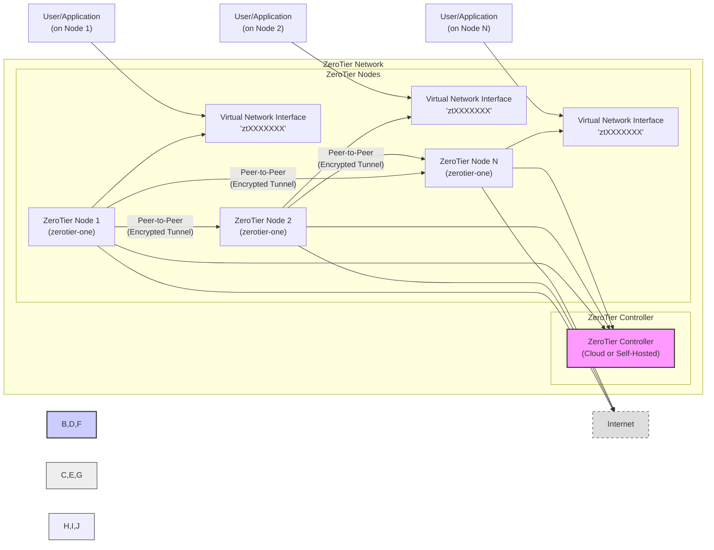
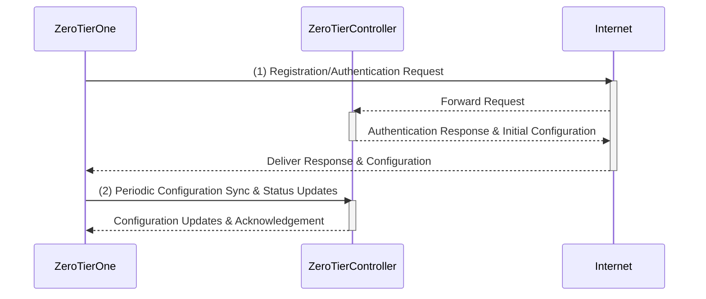
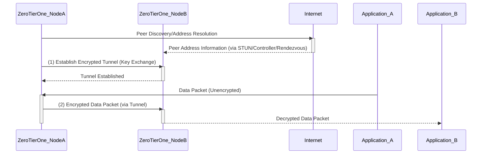
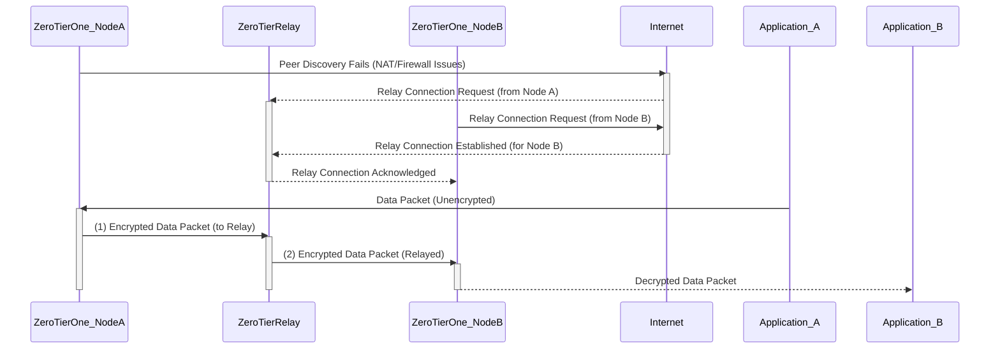

# Project Design Document: ZeroTierOne

**Project Name:** ZeroTierOne

**Project Repository:** [https://github.com/zerotier/zerotierone](https://github.com/zerotier/zerotierone)

**Document Version:** 1.1
**Date:** 2023-10-27
**Author:** AI Cloud & Security Architect

## 1. Introduction

This document provides a detailed design overview of the ZeroTierOne project, specifically focusing on the `zerotierone` component. This document is intended to serve as a foundation for threat modeling and security analysis. It outlines the system architecture, key components, data flow, and technology stack involved in `zerotierone`. This document will be used to identify potential vulnerabilities and attack vectors within the ZeroTierOne system.

ZeroTier is a software-defined networking (SDN) solution that enables the creation and management of virtual networks, primarily targeting users and organizations needing secure, flexible, and easily managed network connectivity across geographically dispersed locations. `zerotierone` is the core open-source client component, acting as the network endpoint on individual devices. It is responsible for establishing and maintaining secure connections to ZeroTier virtual networks, regardless of the underlying physical network infrastructure.

## 2. System Overview

ZeroTierOne facilitates the creation of secure, decentralized, and easily manageable virtual networks. It operates at Layer 2/3 of the OSI model, providing Ethernet bridging and IP routing capabilities over a globally distributed network. The core functionality of `zerotierone` is to establish secure tunnels to other ZeroTier nodes and the ZeroTier network controller, enabling devices to communicate as if they were on the same physical network. This allows for seamless connectivity for applications and services across different networks, simplifying network management and enhancing security.

### 2.1. Key Features

*   **Virtual Network Creation and Participation:** Users can create new virtual networks with unique 64-bit network IDs or join existing networks using invitation mechanisms.
*   **Broad Platform Support:**  `zerotierone` is designed for cross-platform compatibility, supporting a wide range of operating systems including Linux, macOS, Windows, FreeBSD, Android, and iOS, ensuring accessibility across diverse environments.
*   **Robust End-to-End Encryption:** Utilizes strong cryptographic primitives, primarily Curve25519 for key exchange and ChaCha20-Poly1305 for authenticated encryption, providing confidentiality and integrity for all network traffic.
*   **Intelligent Peer-to-Peer Networking:** Prioritizes direct peer-to-peer connections between nodes whenever network conditions permit, minimizing latency and maximizing throughput. This reduces reliance on relays and improves overall network performance.
*   **Centralized Network Management (via Controller):** Integrates with ZeroTier Central (cloud-hosted) or self-hosted controllers. This provides a centralized point for network administration, including member authorization, access control lists (ACLs), network configuration, and monitoring.
*   **Advanced NAT and Firewall Traversal:** Employs sophisticated techniques, including UDP hole punching, STUN, and relay servers, to effectively traverse NAT and firewall restrictions, ensuring connectivity even in complex network topologies.
*   **Layer 2 Bridging and Ethernet Emulation:** Supports Layer 2 Ethernet bridging capabilities within the virtual network, enabling the use of Ethernet-based protocols and features like multicast and broadcast, crucial for certain applications and network services.
*   **Zero-Configuration Networking:** Aims for minimal configuration on the client side. Joining a network typically requires only the network ID and authorization, simplifying deployment and usability.

## 3. System Architecture

The following diagram illustrates the high-level architecture of ZeroTierOne and its interaction with other components of the ZeroTier ecosystem, including the Internet as the underlying transport network.

### 3.1. Component Description

*   **ZeroTier Controller:** A centralized service (either hosted by ZeroTier as ZeroTier Central or self-hosted using ZeroTier Network Controller - ZTNC) responsible for the control plane functions of a ZeroTier network:
    *   **Network Definition and Management:** Defines the parameters of a ZeroTier network, including network ID, name, subnet ranges, managed routes, and access control rules.
    *   **Member Management and Authorization:** Manages the list of authorized nodes (members) allowed to join the network. Controls access through member authorization and potentially Access Control Lists (ACLs).
    *   **Configuration Distribution and Synchronization:**  Distributes network configuration updates, member lists, and policies to all connected `zerotierone` nodes, ensuring consistent network state.
    *   **Relay Service (Planet/Moon Infrastructure):** Operates a global network of relay servers (Planets and Moons) to facilitate communication between nodes when direct peer-to-peer connections are not possible due to NAT, firewalls, or network topology. These relays forward encrypted traffic between nodes.
    *   **Authentication and Key Management:**  Plays a role in initial node authentication and key exchange processes, although the primary encryption keys are negotiated peer-to-peer.

*   **ZeroTier Node (zerotier-one):** The core client software running on each device participating in a ZeroTier network. It is responsible for the data plane and interacting with the control plane:
    *   **Virtual Network Interface Creation and Management:** Creates and manages virtual network interfaces (e.g., `zt0`, `zt1`, `ztXXXXXXX`) on the host operating system. These interfaces act as the entry and exit points for ZeroTier network traffic.
    *   **Peer Discovery and Connection Establishment:**  Initiates peer discovery using mechanisms like UDP broadcasts, STUN servers, and rendezvous points (potentially via the Controller). Establishes secure, encrypted tunnels with discovered peers using protocols like UDP and potentially TCP for fallback.
    *   **Data Encryption and Decryption:** Encrypts all outgoing data packets before transmission and decrypts all incoming packets received from peers, ensuring data confidentiality and integrity. Employs ChaCha20-Poly1305 authenticated encryption.
    *   **Routing and Bridging within Virtual Network:**  Performs routing of IP packets and bridging of Ethernet frames within the virtual network based on network configuration and destination addresses.
    *   **NAT Traversal and Firewall Circumvention:** Implements NAT traversal techniques like UDP hole punching and utilizes relay servers (via the Controller's infrastructure) to overcome NAT and firewall restrictions, enabling connectivity in diverse network environments.
    *   **Configuration Retrieval and Policy Enforcement:** Communicates with the ZeroTier Controller to retrieve network configurations, member lists, and policies. Enforces these policies locally, such as access control rules and managed routes.
    *   **User Interface (zerotier-cli):** Provides a command-line interface (`zerotier-cli`) for user interaction, allowing users to manage networks (join, leave, list), view status, and configure basic settings.

*   **Virtual Network Interface ('ztXXXXXXX'):** A virtual network interface created by `zerotier-one` on the host operating system. It emulates a physical network interface and is used by applications to send and receive traffic on the ZeroTier network.  Applications interact with this interface as they would with a standard Ethernet or IP interface.

*   **User/Application:** Represents any software application or user process running on a device that utilizes the ZeroTier virtual network for communication. This could include applications, services, operating system processes, or user interactions that generate or consume network traffic over the ZeroTier network.

## 4. Data Flow

### 4.1. Control Plane

The control plane manages the configuration and state of the ZeroTier network. Communication is primarily between `zerotierone` clients and the ZeroTier Controller.

1.  **Node Registration, Authentication, and Authorization:** When `zerotierone` starts or attempts to join a network, it initiates a registration process with the ZeroTier Controller. This involves:
    *   Generating a unique node identity (public/private key pair).
    *   Authenticating with the Controller, typically using the node's public key.
    *   Requesting authorization to join a specific network (identified by network ID).
    *   The Controller verifies the node's identity and authorization status based on network membership and potentially ACLs.
2.  **Configuration Synchronization:** `zerotierone` periodically polls the ZeroTier Controller to retrieve and synchronize the latest network configuration. This includes:
    *   Network-specific parameters (subnet, MTU, etc.).
    *   List of authorized members (peers) on the network, including their public keys and network addresses (if known).
    *   Network rules and policies (e.g., flow rules, access control lists).
3.  **Status Reporting and Monitoring:** `zerotierone` regularly sends status updates to the ZeroTier Controller, reporting its connectivity status, network interface information, and potentially performance metrics. This allows the Controller to monitor network health and node availability.
4.  **Command and Control (Limited):** The ZeroTier Controller can send limited commands to `zerotierone` clients, primarily related to configuration updates or network management actions. Direct remote control of nodes is generally not a primary function of the Controller in the data plane sense.

**Data Flow Diagram - Control Plane:**

### 4.2. Data Plane

The data plane handles the actual transmission of user data between devices on the ZeroTier network. Communication is primarily peer-to-peer, but can be relayed if direct connections are not possible.

1.  **Peer Discovery and Address Resolution:** `zerotierone` initiates peer discovery to find other nodes on the same ZeroTier network. This involves:
    *   Using information from the Controller (member list) to identify potential peers.
    *   Employing techniques like UDP broadcasts and STUN to discover the public IP addresses and ports of peers behind NAT.
    *   Potentially using rendezvous servers (part of the ZeroTier infrastructure) to facilitate initial peer contact.
2.  **Secure Tunnel Establishment (Peer-to-Peer):** Once peers are discovered and their network addresses are resolved, `zerotierone` attempts to establish a direct, encrypted tunnel. This process includes:
    *   Key exchange using Curve25519 to establish shared secret keys.
    *   Negotiation of encryption parameters (ChaCha20-Poly1305).
    *   Establishment of a UDP-based tunnel, or potentially TCP as a fallback if UDP is blocked.
3.  **Data Transmission (Peer-to-Peer):** After a secure tunnel is established:
    *   Data packets originating from applications on the virtual network interface are encrypted using ChaCha20-Poly1305.
    *   Encapsulated within UDP packets (or TCP if using TCP tunnels).
    *   Transmitted directly to the peer's public IP address and port.
4.  **Data Reception (Peer-to-Peer):** Upon receiving encrypted data packets from a peer:
    *   `zerotierone` decrypts the packets using the established shared secret key.
    *   Verifies the integrity of the packets using the Poly1305 MAC.
    *   Forwards the decrypted data to the virtual network interface.
5.  **Relayed Communication (if Peer-to-Peer Fails):** If direct peer-to-peer connections cannot be established (due to symmetric NAT, restrictive firewalls, etc.), `zerotierone` will utilize ZeroTier relay servers (Planets/Moons). In this case:
    *   Traffic is encrypted by the originating node.
    *   Sent to a relay server.
    *   The relay server forwards the encrypted traffic to the destination node (or another relay server closer to the destination).
    *   The destination node decrypts the traffic.

**Data Flow Diagram - Data Plane (Peer-to-Peer):**

**Data Flow Diagram - Data Plane (Relayed):**

## 5. Technology Stack

*   **Core Programming Language:** C++ (primarily for performance and system-level access)
*   **Cryptography Library:** libsodium (provides high-quality, secure cryptographic primitives, including Curve25519, ChaCha20-Poly1305, and others)
*   **Networking Libraries:** Platform-specific networking APIs (e.g., BSD sockets on Linux/macOS, WinSock on Windows) for low-level network operations. Potentially uses cross-platform abstraction layers for network access.
*   **Build System and Dependencies:** CMake (cross-platform build system), likely uses standard C++ libraries and potentially other dependencies managed through system package managers or bundled libraries.
*   **Operating System Support:** Designed for broad OS support: Linux (various distributions), macOS, Windows, FreeBSD, Android, iOS, and potentially embedded Linux systems.

## 6. Deployment Model

`zerotierone` is designed for flexible deployment across a wide range of environments and device types:

*   **Desktop and Laptop Computers:** Windows, macOS, and Linux desktops and laptops for individual users, remote workers, and developers needing secure network access.
*   **Server Infrastructure:** Linux servers in data centers, cloud environments (AWS, Azure, GCP), and on-premises infrastructure to connect server resources, create private networks, and enable hybrid cloud scenarios.
*   **Embedded Systems and IoT Devices:** Routers, NAS devices, industrial control systems, and various IoT devices to create secure device networks for remote management, data collection, and device-to-device communication.
*   **Mobile Devices:** Android and iOS smartphones and tablets for mobile VPN functionality, secure access to resources, and mobile application networking.
*   **Virtual Machines and Containers:** Cloud-based virtual machines and containers (Docker, Kubernetes) to connect virtualized environments, create overlay networks, and simplify container networking.
*   **Edge Computing Devices:** Deployments on edge devices for secure data processing and communication at the network edge.

## 7. Security Considerations (Detailed)

This section expands on the security considerations for `zerotierone`, providing a more detailed view for threat modeling.

*   **Cryptographic Security:**
    *   **Strength of Algorithms:** Reliance on Curve25519 and ChaCha20-Poly1305 is generally considered strong. However, vulnerabilities could arise from implementation flaws in libsodium or incorrect usage within `zerotierone`.
    *   **Key Management:** Secure generation, storage, and handling of private keys are critical. Compromise of a private key allows impersonation and network access. Key rotation and revocation mechanisms should be considered.
    *   **Protocol Vulnerabilities:** Potential vulnerabilities in the key exchange or encryption protocols themselves (though Curve25519 and ChaCha20-Poly1305 are well-vetted).
*   **Authentication and Authorization Weaknesses:**
    *   **Controller Compromise:** If the ZeroTier Controller is compromised, attackers could potentially gain control over managed networks, authorize malicious nodes, and intercept traffic.
    *   **Authorization Bypass:** Vulnerabilities in the authorization mechanisms could allow unauthorized nodes to join networks or gain access to resources.
    *   **Man-in-the-Middle (MitM) Attacks:** While end-to-end encryption mitigates eavesdropping, vulnerabilities in peer discovery or connection establishment could potentially allow MitM attacks, especially during initial key exchange.
*   **Peer-to-Peer Security Risks:**
    *   **DoS Attacks:**  Peer-to-peer nature can make nodes susceptible to Distributed Denial of Service (DDoS) attacks if an attacker can flood a node with connection requests or malicious traffic.
    *   **Peer Impersonation:** If peer authentication is weak or flawed, attackers could potentially impersonate legitimate peers to gain unauthorized access or inject malicious data.
    *   **Information Leakage:** Peer discovery mechanisms might inadvertently leak information about network topology or node locations.
*   **NAT Traversal and Relay Security:**
    *   **Relay Server Compromise:** If ZeroTier relay servers are compromised, attackers could potentially intercept relayed traffic, although it is still encrypted end-to-end. However, metadata and timing information might be exposed.
    *   **NAT Traversal Vulnerabilities:** Vulnerabilities in NAT traversal techniques (e.g., UDP hole punching) could potentially be exploited to bypass firewalls or gain unintended access to networks.
*   **Code and Dependency Security:**
    *   **Software Vulnerabilities:** Vulnerabilities in the `zerotierone` codebase itself (buffer overflows, memory corruption, logic errors) could be exploited for code execution or denial of service.
    *   **Third-Party Library Vulnerabilities:** Vulnerabilities in libsodium or other third-party libraries used by `zerotierone` could indirectly affect its security. Regular dependency updates and vulnerability scanning are important.
*   **Configuration and Management Security:**
    *   **Insecure Configuration:** Misconfiguration of `zerotierone` or the ZeroTier network (e.g., overly permissive ACLs, weak network policies) could weaken security.
    *   **Credential Management:** Secure storage and handling of any configuration credentials or API keys are important.
*   **Denial of Service (DoS) and Availability:**
    *   **Resource Exhaustion:** Attacks that exhaust node resources (CPU, memory, bandwidth) could lead to denial of service.
    *   **Network Flooding:** Flooding attacks targeting the virtual network or underlying physical network could disrupt connectivity.
*   **Privacy Concerns:**
    *   **Metadata Collection:** While traffic is encrypted, metadata about network connections (source/destination IPs, timestamps, connection durations) might be logged or accessible to ZeroTier or relay operators.
    *   **Traffic Analysis:**  Although encrypted, traffic patterns might still reveal information about user activity to sophisticated observers.

## 8. Assumptions and Constraints

*   **Reliable Network Connectivity:** Assumes underlying reliable internet connectivity for communication between nodes and the Controller. Network disruptions can impact ZeroTier network availability.
*   **Trust in Cryptographic Libraries:** Relies on the security and correctness of the libsodium cryptography library.
*   **Security of ZeroTier Infrastructure:** Assumes the security of the ZeroTier Controller infrastructure (if using ZeroTier Central) and relay servers. Self-hosted controllers shift this responsibility to the user.
*   **Competent User Configuration:** Assumes users will configure ZeroTier networks and `zerotierone` clients in a reasonably secure manner, following best practices.
*   **Focus on Network Layer Security:** Primarily focuses on network layer security. Application-level security is the responsibility of applications using the ZeroTier network.

## 9. Future Work

*   **Comprehensive Threat Model Development:** Create a detailed threat model based on this design document, identifying specific threats, attack vectors, and potential impact. This will involve using frameworks like STRIDE or PASTA.
*   **Formal Security Analysis and Code Review:** Conduct in-depth security analysis of the `zerotierone` codebase, including static and dynamic analysis, and perform thorough code reviews to identify potential vulnerabilities.
*   **Penetration Testing and Vulnerability Assessment:** Perform regular penetration testing and vulnerability assessments against `zerotierone` in various deployment scenarios to validate security controls and identify weaknesses.
*   **Security Hardening and Best Practices Guide:** Develop a comprehensive security hardening guide and best practices document for deploying and operating `zerotierone` securely.
*   **Continuous Security Monitoring and Incident Response Plan:** Establish processes for continuous security monitoring, vulnerability management, and incident response related to `zerotierone` deployments.
*   **Explore Formal Verification of Security-Critical Components:** Investigate the feasibility of using formal verification techniques for security-critical components of `zerotierone`, such as cryptographic implementations and key management routines.

This improved design document provides a more detailed and security-focused overview of ZeroTierOne, serving as a robust foundation for comprehensive threat modeling and security analysis. It highlights key architectural components, data flows, and security considerations necessary for a thorough security assessment of the project.