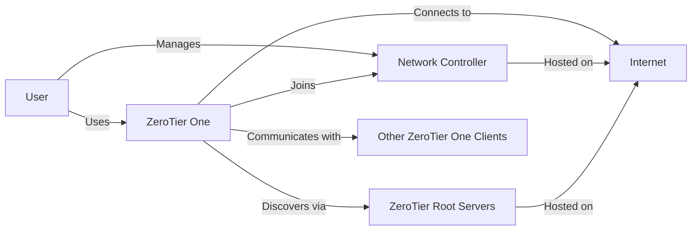
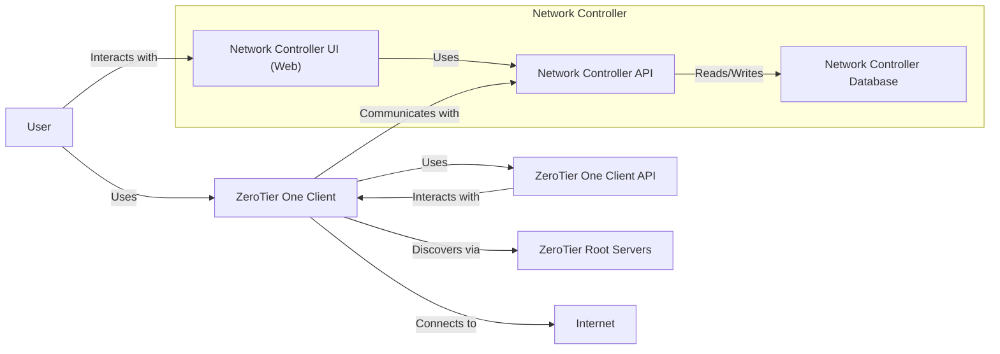
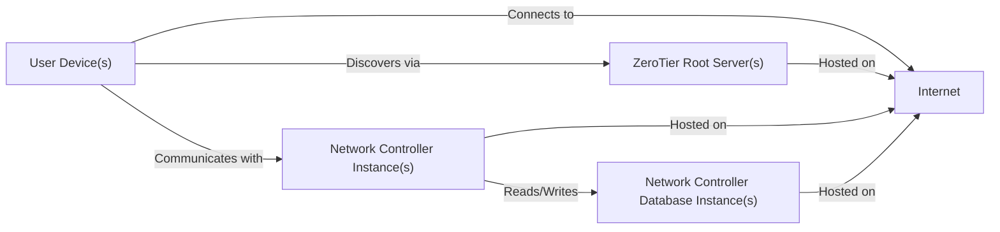
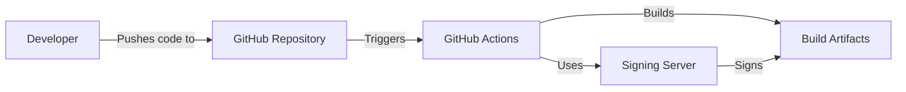

Okay, let's craft a design document for the ZeroTier One project, focusing on aspects relevant to threat modeling.

# BUSINESS POSTURE

ZeroTier One aims to provide a seamless, secure, and easy-to-manage virtual networking solution. It's targeted at individuals, businesses, and developers who need to connect devices and applications across different physical locations as if they were on the same local network.  The core value proposition is simplified network management and enhanced security compared to traditional VPNs or complex network configurations.

Business Priorities:

*   Ease of Use:  ZeroTier's primary selling point is its simplicity.  The setup and management should be significantly easier than traditional VPNs.
*   Security:  Providing a secure networking environment is paramount.  Users trust ZeroTier to protect their data in transit and at rest (within the virtual network).
*   Performance:  The virtual network should offer performance comparable to a local network, minimizing latency and maximizing throughput.
*   Scalability:  The solution should scale to accommodate a growing number of devices and networks.
*   Reliability:  The service must be highly available and resilient to failures.
*   Cost-Effectiveness:  ZeroTier aims to be a cost-effective alternative to traditional networking solutions.

Business Risks:

*   Compromise of Central Controller: A breach of ZeroTier's central controllers (root servers) could allow attackers to manipulate network configurations, potentially gaining access to user data or disrupting service. This is the highest risk.
*   Compromise of Network Controller: A breach of user's network controller could allow attackers to manipulate network configurations, potentially gaining access to user data or disrupting service.
*   Client-Side Vulnerabilities:  Exploitable vulnerabilities in the ZeroTier One client software could allow attackers to compromise individual devices or gain unauthorized access to the virtual network.
*   Denial of Service (DoS):  Attacks targeting ZeroTier's infrastructure or individual virtual networks could disrupt service for users.
*   Data Breaches:  Although ZeroTier encrypts traffic, a vulnerability in the encryption implementation or a successful attack on a client device could lead to data breaches.
*   Misconfiguration:  Users might inadvertently misconfigure their virtual networks, creating security vulnerabilities.
*   Reliance on Third-Party Infrastructure: ZeroTier relies on existing internet infrastructure, making it susceptible to outages or disruptions in that infrastructure.

# SECURITY POSTURE

Existing Security Controls:

*   security control: End-to-End Encryption: ZeroTier uses strong, modern encryption (e.g., Salsa20, ChaCha20, Poly1305) to protect all traffic between connected devices. Implemented in the ZeroTier One client and validated by network controllers.
*   security control: Peer-to-Peer Connections: Whenever possible, ZeroTier establishes direct peer-to-peer connections between devices, minimizing reliance on central relays and improving performance. Implemented in the ZeroTier One client.
*   security control: Cryptographic Key Pairs: Each device has a unique cryptographic identity (key pair) used for authentication and authorization. Implemented in the ZeroTier One client.
*   security control: Network Controllers: Users create and manage their virtual networks through network controllers, which define membership and access rules. Implemented in the ZeroTier Central web UI and API, and can also be self-hosted.
*   security control: Rules Engine: A firewall-like rules engine allows fine-grained control over network traffic, enabling users to define specific access policies. Implemented in the ZeroTier One client and configured via network controllers.
*   security control: Mutual TLS (mTLS): ZeroTier uses mTLS to authenticate both the client and the server during connection establishment. Implemented in the ZeroTier One client and network controllers.
*   security control: Open Source Client: The ZeroTier One client is open source, allowing for community scrutiny and auditing.

Accepted Risks:

*   accepted risk: Reliance on Root Servers: ZeroTier's root servers are critical for network discovery and initial connection establishment. While efforts are made to secure these servers, their compromise remains a potential single point of failure.
*   accepted risk: User Responsibility for Network Configuration: Users are responsible for correctly configuring their virtual networks. Misconfiguration could lead to security vulnerabilities.
*   accepted risk: Potential for Client-Side Vulnerabilities: While the open-source nature of the client promotes security, vulnerabilities may still exist and could be exploited before patches are released.

Recommended Security Controls:

*   security control: Implement regular independent security audits and penetration testing of both the client and server infrastructure.
*   security control: Offer a bug bounty program to incentivize responsible disclosure of vulnerabilities.
*   security control: Provide detailed security documentation and best practices guides for users.
*   security control: Implement robust monitoring and alerting systems to detect and respond to suspicious activity.
*   security control: Consider offering two-factor authentication (2FA) for accessing ZeroTier Central and network controllers.

Security Requirements:

*   Authentication:
    *   All devices must be authenticated using strong cryptographic keys.
    *   Network controllers must authenticate users securely.
    *   Consider supporting multi-factor authentication for network controller access.

*   Authorization:
    *   Access to virtual networks must be controlled based on defined membership and rules.
    *   The rules engine should enforce least privilege principles.
    *   Network controllers should have granular role-based access control (RBAC).

*   Input Validation:
    *   All input received from external sources (e.g., network traffic, API requests) must be validated to prevent injection attacks and other vulnerabilities.
    *   Configuration inputs should be strictly validated to prevent misconfigurations.

*   Cryptography:
    *   Use strong, modern cryptographic algorithms and protocols (e.g., AES-256, ChaCha20, TLS 1.3).
    *   Ensure proper key management practices, including secure storage and rotation of keys.
    *   Regularly review and update cryptographic implementations to address emerging threats.

# DESIGN

## C4 CONTEXT

Element Descriptions:

*   Element:
    *   Name: User
    *   Type: Person
    *   Description: A person who uses ZeroTier One to connect to virtual networks.
    *   Responsibilities: Installs and configures ZeroTier One, manages network memberships, defines network rules.
    *   Security controls: Strong passwords, secure device management.

*   Element:
    *   Name: ZeroTier One
    *   Type: Software System
    *   Description: The ZeroTier One client software installed on user devices.
    *   Responsibilities: Establishes secure connections, encrypts and decrypts traffic, enforces network rules.
    *   Security controls: End-to-end encryption, cryptographic key pairs, mutual TLS, rules engine.

*   Element:
    *   Name: Internet
    *   Type: External System
    *   Description: The public internet.
    *   Responsibilities: Provides the underlying transport for ZeroTier connections.
    *   Security controls: None (relies on ZeroTier for security).

*   Element:
    *   Name: ZeroTier Root Servers
    *   Type: External System
    *   Description: ZeroTier's globally distributed root servers.
    *   Responsibilities: Facilitate network discovery and initial connection establishment.
    *   Security controls: Hardened servers, intrusion detection systems, regular security audits.

*   Element:
    *   Name: Network Controller
    *   Type: Software System
    *   Description:  A web-based interface or self-hosted server for managing virtual networks.
    *   Responsibilities:  Defines network membership, configures network rules, manages user access.
    *   Security controls:  Authentication, authorization, input validation, secure communication (HTTPS).

*   Element:
    *   Name: Other ZeroTier One Clients
    *   Type: Software System
    *   Description: Instances of the ZeroTier One client software on other devices.
    *   Responsibilities: Communicate with other clients on the same virtual network.
    *   Security controls: Same as ZeroTier One.

## C4 CONTAINER

Element Descriptions:

*   Element:
    *   Name: User
    *   Type: Person
    *   Description: A person who uses ZeroTier One to connect to virtual networks.
    *   Responsibilities: Installs and configures ZeroTier One, manages network memberships, defines network rules.
    *   Security controls: Strong passwords, secure device management.

*   Element:
    *   Name: ZeroTier One Client
    *   Type: Application
    *   Description: The ZeroTier One client software installed on user devices.
    *   Responsibilities: Establishes secure connections, encrypts and decrypts traffic, enforces network rules.
    *   Security controls: End-to-end encryption, cryptographic key pairs, mutual TLS, rules engine.

*   Element:
    *   Name: ZeroTier One Client API
    *   Type: API
    *   Description: Local API for interacting with the ZeroTier One client.
    *   Responsibilities: Provides programmatic access to client functionality.
    *   Security controls: Local access restrictions.

*   Element:
    *   Name: Network Controller UI (Web)
    *   Type: Web Application
    *   Description: The web-based user interface for managing virtual networks.
    *   Responsibilities: Provides a user-friendly way to configure networks and manage users.
    *   Security controls: Authentication, authorization, input validation, secure communication (HTTPS).

*   Element:
    *   Name: Network Controller API
    *   Type: API
    *   Description: The API for managing virtual networks.
    *   Responsibilities: Provides programmatic access to network controller functionality.
    *   Security controls: Authentication, authorization, input validation, secure communication (HTTPS).

*   Element:
    *   Name: Network Controller Database
    *   Type: Database
    *   Description: Stores network configuration data, user information, and device identities.
    *   Responsibilities: Persistently stores network controller data.
    *   Security controls: Access controls, encryption at rest, regular backups.

*   Element:
    *   Name: ZeroTier Root Servers
    *   Type: External System
    *   Description: ZeroTier's globally distributed root servers.
    *   Responsibilities: Facilitate network discovery and initial connection establishment.
    *   Security controls: Hardened servers, intrusion detection systems, regular security audits.

*   Element:
    *   Name: Internet
    *   Type: External System
    *   Description: The public internet.
    *   Responsibilities: Provides the underlying transport for ZeroTier connections.
    *   Security controls: None (relies on ZeroTier for security).

## DEPLOYMENT

Possible Deployment Solutions:

1.  ZeroTier-Hosted Network Controller: Users rely on ZeroTier Central (cloud-hosted) for network management.
2.  Self-Hosted Network Controller: Users deploy their own instance of the network controller software.
3.  Hybrid Approach: A combination of ZeroTier-hosted and self-hosted controllers.

Chosen Solution (for detailed description): ZeroTier-Hosted Network Controller

Element Descriptions:

*   Element:
    *   Name: User Device(s)
    *   Type: Device
    *   Description:  Computers, mobile devices, or other devices running the ZeroTier One client.
    *   Responsibilities:  Connect to virtual networks, run applications.
    *   Security controls:  ZeroTier One client security controls, device-level security measures.

*   Element:
    *   Name: ZeroTier Root Server(s)
    *   Type: Server
    *   Description:  ZeroTier's globally distributed root servers, hosted by ZeroTier.
    *   Responsibilities:  Facilitate network discovery and initial connection establishment.
    *   Security controls:  Hardened servers, intrusion detection systems, regular security audits.

*   Element:
    *   Name: Network Controller Instance(s)
    *   Type: Server
    *   Description:  Instances of the network controller software, hosted by ZeroTier (ZeroTier Central).
    *   Responsibilities:  Host network controller functionality, manage user accounts, store network configurations.
    *   Security controls:  Hardened servers, intrusion detection systems, regular security audits, access controls, web application security measures.

*   Element:
    *   Name: Network Controller Database Instance(s)
    *   Type: Database Server
    *   Description:  Database instances storing network controller data, hosted by ZeroTier.
    *   Responsibilities:  Persistently store network controller data.
    *   Security controls:  Access controls, encryption at rest, regular backups, database security best practices.

*   Element:
    *   Name: Internet
    *   Type: Network
    *   Description: The public internet.
    *   Responsibilities: Provides network connectivity.
    *   Security controls: None.

## BUILD

The ZeroTier One project uses a combination of build systems and tools, primarily centered around GitHub Actions for automation.

Build Process Description:

1.  Developers write code and push changes to the ZeroTier One GitHub repository.
2.  GitHub Actions workflows are triggered by events like pushes and pull requests.
3.  Workflows define build steps, including:
    *   Compiling the code for various platforms (Windows, macOS, Linux, etc.).
    *   Running unit and integration tests.
    *   Performing static analysis (SAST) using tools like linters and code analyzers. Specific tools used are defined in the repository's configuration.
    *   Building installation packages.
4.  Code signing is performed using a dedicated signing server to ensure the integrity and authenticity of the released binaries.
5.  Build artifacts (installation packages, binaries) are created and stored. These may be uploaded to a repository or made available for download.

Security Controls:

*   security control: GitHub Actions: Provides a secure and automated build environment.
*   security control: Static Analysis (SAST): Automated code analysis helps identify potential vulnerabilities early in the development lifecycle.
*   security control: Code Signing: Ensures that released binaries have not been tampered with.
*   security control: Dependency Management: The project uses dependency management tools to track and manage external libraries, helping to mitigate supply chain risks.  Specific tools and configurations are defined in the repository.
*   security control: Least Privilege: Build systems and signing servers should operate with the least necessary privileges.

# RISK ASSESSMENT

Critical Business Processes:

*   Secure communication between devices on virtual networks.
*   Management of virtual networks through network controllers.
*   Discovery and connection establishment via root servers.

Data Sensitivity:

*   Network Traffic: Highly sensitive. Contains user data transmitted between devices.
*   Network Configuration Data: Highly sensitive. Includes network rules, membership information, and cryptographic keys.
*   User Account Information: Sensitive. Includes usernames, passwords (hashed), and email addresses.
*   Device Identities: Sensitive. Includes cryptographic key pairs used for authentication.

# QUESTIONS & ASSUMPTIONS

Questions:

*   What specific static analysis tools are used in the build process?
*   What is the process for rotating cryptographic keys used by the root servers and network controllers?
*   What are the specific procedures for incident response in case of a security breach?
*   What is the disaster recovery plan for the root servers and network controllers?
*   Are there any specific compliance requirements (e.g., GDPR, HIPAA) that need to be considered?
*   What is the frequency of security audits and penetration testing?
*   How are dependencies managed and vetted for security vulnerabilities?

Assumptions:

*   BUSINESS POSTURE: ZeroTier prioritizes security and ease of use equally.
*   SECURITY POSTURE: The ZeroTier One client is regularly updated to address security vulnerabilities.
*   SECURITY POSTURE: Users are responsible for securing their own devices and managing their network configurations securely.
*   DESIGN: The root servers are highly available and resilient to failures.
*   DESIGN: Network controllers are designed with security in mind, including proper authentication, authorization, and input validation.
*   DESIGN: The build process includes security checks to prevent the introduction of vulnerabilities.
*   DESIGN: The deployment environment for ZeroTier-hosted services is secure and regularly monitored.