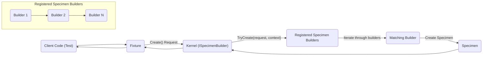
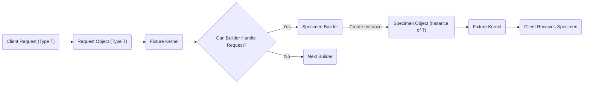

# Project Design Document: AutoFixture

**Version:** 1.1
**Date:** October 26, 2023
**Author:** Gemini (AI Language Model)

## 1. Introduction

This document provides a detailed design overview of the AutoFixture project, an open-source library for .NET designed to minimize the 'Arrange' phase of unit tests by automatically generating arbitrary test data. This document aims to provide a comprehensive understanding of AutoFixture's architecture, components, and data flow, which will serve as the basis for subsequent threat modeling activities.

### 1.1. Purpose

The primary purpose of this document is to:

*   Describe the architecture and key components of the AutoFixture library.
*   Illustrate the data flow within the library during object creation.
*   Identify potential areas of interest for security analysis and threat modeling.
*   Serve as a reference point for understanding the system's design.

### 1.2. Scope

This document covers the core functionality of the AutoFixture library, focusing on the mechanisms for generating test data. It includes:

*   The core engine responsible for object creation.
*   Customization mechanisms.
*   Extensibility points.
*   Key data structures and interfaces.

This document does not cover:

*   Specific usage scenarios or examples.
*   The internal implementation details of individual generators.
*   The history of the project or its development process.
*   The NuGet package distribution process.

### 1.3. Target Audience

This document is intended for:

*   Security architects and engineers involved in threat modeling AutoFixture.
*   Developers who want a deeper understanding of AutoFixture's internal workings.
*   Anyone involved in the security assessment of systems that utilize AutoFixture.

## 2. System Overview

AutoFixture is a library that helps developers write more focused unit tests by automatically creating test data. Instead of manually setting up complex object graphs, developers can rely on AutoFixture to generate instances of classes with populated properties. This significantly reduces the boilerplate code in the 'Arrange' phase of a test.

AutoFixture operates based on a set of conventions and customizable rules. It uses reflection to understand the structure of types and employs various strategies to generate values for their members.

## 3. Architectural Design

AutoFixture's architecture can be viewed as a pipeline of object creation, driven by requests for specific types. The core components work together to fulfill these requests.

### 3.1. Key Components

*   **Fixture:** The central orchestrating component. It holds the configuration, a collection of registered generators, and provides the primary API for requesting instances of types.
*   **Specimen Builders (Generators):** Implementations of the `ISpecimenBuilder` interface. Each builder is responsible for creating instances of specific types or handling specific creation scenarios. Builders are organized in a pipeline.
*   **Context:** Provides contextual information during the object creation process, such as the requested type and the current fixture instance.
*   **Request:** Represents a request for an instance of a specific type.
*   **Specimen:** The generated instance of a type.
*   **Customizations:** Mechanisms to override or modify the default object creation behavior. This includes:
    *   The `Customize` method on the `Fixture` class.
    *   `ISpecimenBuilder` implementations registered by the user.
    *   Attributes applied to types or members.
*   **Conventions:** Implicit rules that guide the object creation process when no explicit customization is provided. Examples include generating strings with meaningful names or numbers within a reasonable range.

### 3.2. Component Interactions

The following diagram illustrates the high-level interaction between the key components during an object creation request:

*   The client code (typically a unit test) requests an instance of a type `T` from the `Fixture`.
*   The `Fixture` delegates the request to its internal kernel, which manages the pipeline of `ISpecimenBuilder` instances.
*   The kernel iterates through the registered specimen builders, passing the request and context to each.
*   Each builder checks if it can handle the current request.
*   The first builder that can handle the request creates a specimen (an instance of the requested type).
*   The created specimen is returned through the pipeline back to the client code.

### 3.3. Data Flow

The data flow within AutoFixture primarily involves the `Request` object and the `Specimen` object.

*   The process starts with a client request for an object of a specific type.
*   This request is encapsulated in a `Request` object.
*   The `Fixture` kernel processes this request by iterating through the registered specimen builders.
*   Each builder determines if it can handle the request based on the requested type and its own capabilities.
*   The builder that can handle the request creates an instance of the requested type (the `Specimen`).
*   The created `Specimen` is returned to the `Fixture` kernel and ultimately to the client.

## 4. Security Considerations (Initial Thoughts)

While AutoFixture is primarily a development-time library, potential security considerations exist, particularly if it's used in unexpected ways or if its extensibility points are exploited.

Here is a list of potential security considerations:

*   **Malicious Customizations:** If a user can inject malicious `ISpecimenBuilder` implementations or provide crafted customization logic, they could potentially cause unexpected behavior, resource exhaustion, or even information disclosure during test execution.
*   **Dependency Vulnerabilities:** AutoFixture relies on other libraries (e.g., for reflection). Vulnerabilities in these dependencies could indirectly affect AutoFixture's security.
*   **Unintended Object Creation:** If AutoFixture is used in a context where it generates sensitive data based on user input or external sources, there's a risk of unintentionally creating and potentially exposing this data.
*   **Reflection Abuse:** While reflection is core to AutoFixture's functionality, excessive or uncontrolled reflection could potentially be exploited in certain scenarios.
*   **Denial of Service:** A malicious actor could potentially craft requests that lead to infinite loops or excessive resource consumption within the object creation pipeline.

## 5. Dependencies

AutoFixture has dependencies on other .NET libraries. Understanding these dependencies is important for assessing the overall security posture. Key dependencies include:

*   .NET Standard Library
*   Potentially other NuGet packages, depending on the specific version and extensions used.

A detailed list of dependencies can be found in the project's NuGet package definition.

## 6. Deployment and Usage

AutoFixture is deployed as a NuGet package and is typically used as a library within unit test projects. It is not a standalone application or service. Its security implications are primarily relevant within the context of the development and testing environment.

## 7. Extensibility Points

AutoFixture provides several extensibility points that allow users to customize its behavior:

*   Registering custom `ISpecimenBuilder` implementations.
*   Using the `Customize` method.
*   Applying attributes to types and members.
*   Creating conventions.

These extensibility points, while powerful, also represent potential areas where security vulnerabilities could be introduced if not used carefully.

## 8. Future Considerations

As AutoFixture evolves, new features and capabilities might be added. From a security perspective, it's important to consider the potential impact of these changes:

*   New generation strategies could introduce new attack vectors if not designed with security in mind.
*   Dependencies on new libraries could introduce new vulnerabilities.
*   Modifications to the object creation pipeline could have unforeseen security implications.

## 9. Glossary

Here is a list of terms used in this document:

*   **Fixture:** The main entry point for using AutoFixture.
*   **Specimen:** An instance of an object generated by AutoFixture.
*   **Specimen Builder:** A component responsible for creating specimens of specific types.
*   **Request:** An object representing a request for a specific type.
*   **Context:** Information available during the object creation process.

This document provides a foundational understanding of AutoFixture's design for threat modeling purposes. Further analysis will involve examining the implementation details of the components and the potential attack vectors identified in the security considerations section.
