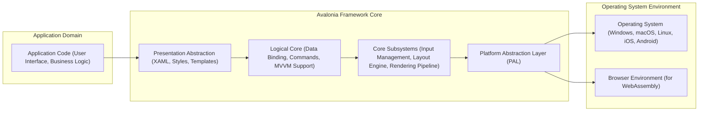
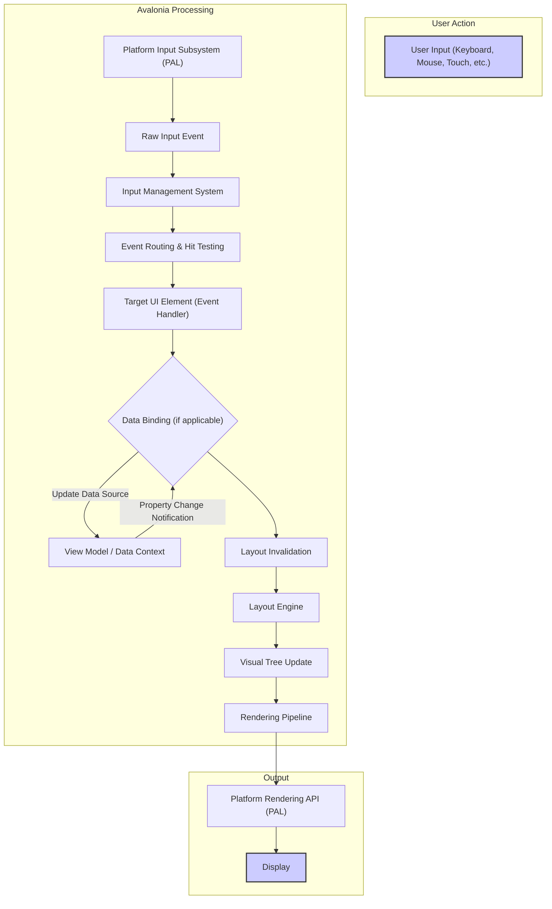

# Project Design Document: Avalonia UI Framework

**Version:** 1.1
**Date:** October 26, 2023
**Author:** AI Software Architect

## 1. Introduction

This document provides an enhanced design overview of the Avalonia UI framework. Avalonia is a versatile, cross-platform UI framework for .NET, empowering developers to create visually appealing and functional desktop, mobile, and web applications from a unified codebase. This document delves into the architectural layers, key components, intricate data flows, and preliminary security considerations of Avalonia. It is intended to serve as a robust foundation for subsequent threat modeling exercises.

## 2. Goals and Objectives

The core objectives driving the development and design of Avalonia are:

* **Ubiquitous Cross-Platform Compatibility:** To enable developers to seamlessly deploy applications across a wide range of operating systems, including Windows, macOS, Linux, iOS, Android, and web browsers (leveraging WebAssembly).
* **Empowering Modern UI Development:** To provide a rich and intuitive development experience through a declarative UI definition language (XAML), robust data binding mechanisms, comprehensive styling and theming capabilities, and a diverse set of pre-built and customizable controls for crafting contemporary user interfaces.
* **Extensibility and Adaptability:** To facilitate the extension and customization of the framework, allowing developers to tailor it to the unique requirements of their applications through custom controls, renderers, and platform integrations.
* **Optimized Performance and Efficiency:** To ensure a fluid and responsive user experience across diverse platforms and hardware configurations by employing efficient rendering techniques and minimizing resource consumption.

## 3. High-Level Architecture

Avalonia's architecture is structured into distinct layers that promote modularity and separation of concerns:

* **Application Domain:** This outermost layer encompasses the application-specific code developed by users of the Avalonia framework. It includes the XAML-defined user interface, the application's business logic, and supporting code.
* **Avalonia Framework Core:** This layer represents the heart of the Avalonia framework, responsible for managing the application's lifecycle, processing user interactions, and rendering the user interface. It is further subdivided into:
    * **Presentation Abstraction:** This component handles the declarative definition of the UI using XAML, manages styling and theming, and provides templating mechanisms for UI elements.
    * **Logical Core:** This part of the framework provides support for data binding, command handling, and architectural patterns like Model-View-ViewModel (MVVM), facilitating separation of concerns and testability.
    * **Core Subsystems:** This encompasses the fundamental functionalities of Avalonia, including the input management system (handling keyboard, mouse, and touch events), the layout engine (calculating the size and position of UI elements), and the rendering pipeline (responsible for drawing the UI).
    * **Platform Abstraction Layer (PAL):** This crucial layer provides an abstraction over the underlying operating system or browser environment. It implements platform-specific functionalities, allowing the core of Avalonia to remain platform-agnostic.
* **Operating System Environment:** This layer represents the underlying operating system or the browser environment in which the Avalonia application is executing. The PAL interacts with this layer to access platform-specific services and resources.

## 4. Key Components

Avalonia's functionality is delivered through a set of interconnected key components:

* **Input Management System:**
    * Responsible for capturing raw input events from various sources, including keyboards, mice, touchscreens, and styluses.
    * Translates raw input into platform-independent input events.
    * Dispatches these events to the appropriate UI elements based on focus, hit-testing, and event routing strategies.
    * Manages input focus and the activation of UI elements.
* **Layout Engine:**
    * Calculates the size and position of each UI element within the visual tree.
    * Implements various layout strategies through layout panels (e.g., `StackPanel`, `Grid`, `Canvas`).
    * Handles layout invalidation and re-layout processes when UI elements change size or visibility.
    * Supports adaptive and responsive layout design principles.
* **Rendering Pipeline:**
    * Orchestrates the process of drawing UI elements onto the screen.
    * Utilizes platform-specific rendering APIs through the PAL (e.g., Direct3D on Windows, Metal on macOS/iOS, OpenGL/Vulkan on Linux/Android, Canvas API for WebAssembly).
    * Supports hardware acceleration for improved performance.
    * Manages drawing contexts, brushes, pens, and other drawing primitives.
* **Styling and Theming Subsystem:**
    * Enables developers to define the visual appearance of UI elements using styles defined in XAML.
    * Supports cascading styles, inheritance, and style selectors for targeted styling.
    * Provides theming capabilities to easily switch the overall look and feel of an application.
    * Allows for dynamic styling based on application state or user preferences.
* **Data Binding Engine:**
    * Facilitates the synchronization of data between UI elements and data sources (typically view models in an MVVM architecture).
    * Supports various binding modes: one-way, two-way, one-time, and one-way-to-source.
    * Provides mechanisms for data conversion and validation.
    * Reduces boilerplate code and improves the maintainability of UI logic.
* **Control Library:**
    * Offers a comprehensive collection of pre-built, reusable UI controls (e.g., `Button`, `TextBox`, `ListBox`, `DataGrid`).
    * Provides a foundation for building complex user interfaces without writing everything from scratch.
    * Supports customization through styling, templating, and inheritance.
* **Platform Abstraction Layer (PAL):**
    * Acts as an intermediary between the Avalonia core and the underlying operating system or browser environment.
    * Provides platform-specific implementations for functionalities such as window management, input handling, rendering, threading, and file system access.
    * Ensures that the core Avalonia code remains platform-independent.
* **XAML Parser and Loader:**
    * Parses XAML markup files at runtime or compile time to create the visual tree of the application.
    * Instantiates objects, sets properties, and establishes relationships between UI elements based on the XAML definition.
    * Supports custom markup extensions and type converters.
* **Threading and Asynchronicity Model:**
    * Primarily operates on a single UI thread for rendering and handling user interactions.
    * Provides mechanisms for performing long-running operations asynchronously using tasks and async/await patterns to prevent blocking the UI thread.
    * Offers synchronization primitives for managing access to shared resources from multiple threads.

## 5. Data Flow

A typical data flow within an Avalonia application, triggered by user interaction, can be visualized as follows:

1. **User Action:** The user initiates an action through an input device.
2. **Platform Input Subsystem (PAL):** The platform-specific input subsystem captures the raw input event.
3. **Raw Input Event:** The raw input event is passed to Avalonia.
4. **Input Management System:** Avalonia's input system processes the raw event.
5. **Event Routing & Hit Testing:** The input system determines the target UI element for the event based on the visual tree structure and the location of the input.
6. **Target UI Element (Event Handler):** The appropriate event handler on the target UI element is invoked.
7. **Data Binding (if applicable):** If the event handler modifies data that is bound to a UI element, the data binding engine is triggered.
8. **View Model / Data Context:** The data source (typically a view model) is updated.
9. **Property Change Notification:** The view model notifies the UI of the data change (e.g., through `INotifyPropertyChanged`).
10. **Layout Invalidation:** Changes in data or UI element properties may trigger a layout invalidation.
11. **Layout Engine:** The layout engine recalculates the layout of the affected UI elements.
12. **Visual Tree Update:** The visual tree is updated to reflect the changes in layout and data.
13. **Rendering Pipeline:** The rendering pipeline processes the updated visual tree.
14. **Platform Rendering API (PAL):** The rendering pipeline utilizes the platform-specific rendering API through the PAL.
15. **Display:** The updated UI is rendered on the screen.

## 6. Security Considerations (Detailed)

Considering that this document will be used for threat modeling, a more detailed look at potential security considerations is warranted:

* **Input Validation and Sanitization:**
    * Applications must rigorously validate and sanitize all user-provided input to prevent injection attacks such as Cross-Site Scripting (XSS) in WebAssembly scenarios, SQL injection (if interacting with databases), and command injection.
    * Avalonia's data binding mechanisms can assist with validation, but developers must implement appropriate validation rules.
* **Dependency Management and Supply Chain Security:**
    * The security of third-party libraries and NuGet packages used by Avalonia and applications built upon it is paramount.
    * Regularly auditing dependencies for known vulnerabilities and using tools to manage and secure the dependency supply chain is crucial.
    * Ensuring the integrity and authenticity of downloaded packages is important.
* **Platform Security and Isolation:**
    * The security features and vulnerabilities of the underlying operating system or browser environment directly impact Avalonia applications.
    * Developers should be aware of platform-specific security best practices and potential attack vectors.
    * When running in a browser via WebAssembly, the browser's security sandbox provides a degree of isolation, but developers should understand its limitations and adhere to web security principles.
* **Secure Data Handling and Storage:**
    * Sensitive data should be handled and stored securely, employing encryption at rest and in transit.
    * Avoid storing sensitive information directly in application settings or local storage without proper protection.
    * Be mindful of data leakage through logging or debugging information.
* **Code Signing and Application Integrity:**
    * Signing application binaries with a trusted certificate helps ensure their integrity and authenticity, protecting against tampering.
    * This is particularly important for desktop and mobile deployments.
* **Permissions and Sandboxing (Native Applications):**
    * Properly managing application permissions on different platforms is essential to limit the potential damage from malicious code.
    * Adhering to the principle of least privilege when requesting permissions.
    * Utilizing platform-specific sandboxing mechanisms where available.
* **WebAssembly Security Considerations:**
    * While WebAssembly runs within a browser sandbox, developers should be aware of potential vulnerabilities related to JavaScript interop, DOM manipulation, and resource limits.
    * Carefully consider the security implications of any JavaScript code interacting with the Avalonia WebAssembly application.
* **Custom Controls and Renderers:**
    * Security vulnerabilities can be introduced through poorly designed or implemented custom controls or renderers.
    * Thoroughly review and test custom components for potential security flaws.
    * Adhere to secure coding practices when developing custom UI elements.
* ** межпроцессное взаимодействие (IPC) Security:**
    * If the Avalonia application interacts with other processes, secure communication channels and proper authorization mechanisms should be implemented to prevent unauthorized access or data breaches.

## 7. Technologies Used

Avalonia leverages a range of technologies to achieve its cross-platform capabilities and rich feature set:

* **.NET (Core or Framework):** The foundational runtime environment for Avalonia.
* **C#:** The primary programming language used for developing Avalonia applications and the framework itself.
* **XAML (Extensible Application Markup Language):** Used for declaratively defining user interfaces, styles, and templates.
* **SkiaSharp:** A cross-platform 2D graphics library that serves as the primary rendering engine on many platforms.
* **Platform-Specific Native APIs:** Accessed through the Platform Abstraction Layer (PAL) for functionalities like windowing, input, and platform-specific services.
* **NuGet Packages:** A package manager for managing dependencies and extending Avalonia's functionality.
* **WebAssembly (Wasm):** Enables running Avalonia applications within web browsers.
* **Various Platform SDKs:**  Interactions with platform-specific SDKs (e.g., Windows SDK, macOS SDK, Android SDK, iOS SDK) through the PAL.

## 8. Deployment Model

Avalonia applications offer flexible deployment options:

* **Native Desktop Applications:** Packaged as platform-specific executables with necessary dependencies for Windows (.exe), macOS (.app), and Linux (various package formats).
* **Mobile Applications:** Compiled and packaged as native mobile applications for iOS (.ipa) and Android (.apk or .aab).
* **Web Applications (via WebAssembly):** Deployed as static web assets that can be hosted on any standard web server. The application runs within the user's web browser.

## 9. Assumptions and Constraints

The design and functionality of Avalonia are based on the following assumptions and constraints:

* **Developer Proficiency in .NET and C#:**  It is assumed that developers utilizing Avalonia possess a solid understanding of the .NET ecosystem and the C# programming language.
* **Target Platform Considerations:** The specific target platforms for an Avalonia application can influence development choices, performance optimizations, and security considerations.
* **Open-Source Development Model:** Avalonia's open-source nature fosters transparency and community contributions but also relies on community involvement for security audits and issue resolution.
* **Evolving Framework Landscape:** Avalonia is an actively developed framework, and its architecture, features, and supported platforms may evolve over time, requiring ongoing adaptation and updates.
* **Reliance on Platform APIs:**  The functionality of Avalonia inherently depends on the availability and stability of underlying platform APIs.

This revised document provides a more detailed and comprehensive design overview of the Avalonia UI framework, specifically tailored for use in threat modeling activities. It elaborates on the key components, data flows, and security considerations to facilitate a thorough analysis of potential vulnerabilities and risks.
