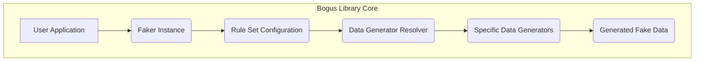

# Project Design Document: Bogus Library

**Version:** 1.1
**Date:** October 26, 2023
**Author:** AI Software Architect

## 1. Introduction

This document provides an enhanced architectural design of the Bogus library, a .NET library designed for generating realistic fake data for various purposes, including software testing, database population, and the creation of sample datasets. This revised document aims to offer a more in-depth understanding of the library's structure, internal components, and data flow, serving as a robust foundation for subsequent threat modeling activities. This version expands on the initial design with more specific details and potential security implications.

## 2. Goals and Objectives

The core goals of the Bogus library are:

*   To offer a fluent and intuitive Application Programming Interface (API) for generating synthetic data.
*   To provide a comprehensive range of data types and formats, catering to diverse data generation needs.
*   To incorporate localization features, enabling the generation of data relevant to different languages and cultural contexts.
*   To be extensible, allowing users to define custom data generation logic and rules.
*   To maintain performance and efficiency in the data generation process.

This design document specifically focuses on elucidating the internal mechanisms of the library to facilitate the identification of potential security vulnerabilities and possible attack vectors.

## 3. Architecture Overview

The Bogus library employs a modular architecture, primarily built around the concept of `Faker<T>`. This generic class empowers users to define specific rules for generating fake data tailored to objects of a particular type `T`. The fundamental architecture can be visualized as follows:



**Key Components:**

*   **User Application:** The external application or code that integrates and utilizes the Bogus library to generate synthetic data instances.
*   **`Faker<T>` Instance:** The central class providing the fluent API for configuring data generation rules specifically for objects of type `T`.
*   **Rule Set Configuration:** The collection of rules defined by the user, typically using the `RuleFor` method, which dictates how each property of the type `T` should be populated with fake data.
*   **Data Generator Resolver:**  A component responsible for determining and instantiating the appropriate specific data generators based on the rules configured. This replaces the term "Factory" to better reflect its role in selecting rather than just creating.
*   **Specific Data Generators:** Individual classes dedicated to generating particular types of fake data, such as names, addresses, numerical values, and dates. These often utilize internal data sources or algorithmic approaches.
*   **Generated Fake Data:** The output of the library, which is an instance of the type `T`, populated with synthetic data according to the defined configuration.

## 4. Component Details

This section provides a more detailed examination of the key components within the Bogus library.

### 4.1. `Faker<T>` Class

*   **Purpose:** Serves as the primary interface for interacting with the Bogus library, offering a fluent API for defining data generation specifications.
*   **Functionality:**
    *   Enables users to instantiate `Faker<T>` for a given type `T`.
    *   Provides the `RuleFor` method to specify the generation logic for individual properties of `T`. For example, `faker.RuleFor(u => u.Name, f => f.Name.FullName());`.
    *   Offers methods like `Generate()` to create a single instance and `Generate(int count)` to produce multiple instances of `T` populated with fake data.
    *   Manages internal state related to the data generation process, including the random number generator instance and locale settings.
*   **Potential Security Considerations:**
    *   Improper handling or sanitization of user-provided input within custom rule definitions could potentially lead to unexpected behavior or vulnerabilities, such as denial-of-service if a computationally expensive function is used.
    *   The seeding mechanism of the internal random number generator could be a target for predictability analysis, especially if default or easily guessable seeds are used.

### 4.2. Rule Set Configuration

*   **Purpose:**  To define the precise instructions and logic for generating fake data for each property of the target type `T`.
*   **Functionality:**
    *   Employs lambda expressions within the `RuleFor` method to target specific properties and define their data generation logic. For instance, `faker.RuleFor(u => u.Age, f => f.Random.Number(18, 65));`.
    *   Supports method chaining to further refine the generated data, allowing for complex data generation scenarios. Example: `faker.RuleFor(u => u.Email, (f, u) => f.Internet.Email(u.Name));`.
    *   Can incorporate conditional logic and custom functions to handle more intricate data generation requirements.
*   **Potential Security Considerations:**
    *   Allowing arbitrary user-provided functions within `RuleFor` presents a significant risk of arbitrary code execution vulnerabilities if not carefully sandboxed or restricted.
    *   The complexity of rule definitions can make it challenging to fully understand the potential range and characteristics of the generated data, potentially leading to unexpected behavior in dependent systems.

### 4.3. Data Generator Resolver

*   **Purpose:**  To dynamically select and instantiate the appropriate data generator based on the type of data being requested by the configured rules.
*   **Functionality:**
    *   Maintains a registry or mapping between data types or categories (e.g., "Name", "Address", "Number") and their corresponding data generator classes.
    *   Dynamically creates instances of the required data generators as needed during the data generation process.
*   **Potential Security Considerations:**
    *   If the resolver mechanism is not properly secured, there's a potential risk of injecting malicious or compromised data generators, which could then be executed by the library.
    *   The process of resolving data generators based on string identifiers or configuration could be vulnerable to injection attacks if user-controlled input is involved.

### 4.4. Specific Data Generators

*   **Purpose:** To implement the concrete logic for generating specific types of synthetic data.
*   **Examples:**
    *   `Name`: Responsible for generating fake names (e.g., first name, last name, full name) using lists of common names.
    *   `Address`: Generates fake address components (e.g., street address, city, state, zip code) based on geographical data.
    *   `Phone`: Generates fake phone numbers adhering to various regional formats.
    *   `Internet`: Generates fake internet-related data like email addresses, usernames, and URLs, often following common patterns.
    *   `Random`: Provides utility methods for generating random numbers, boolean values, and other primitive data types.
*   **Functionality:**
    *   Often rely on internal data sources (e.g., lists of names, city names, common words) or algorithms to produce realistic-looking data.
    *   May support localization to generate data appropriate for different cultural and linguistic contexts, drawing from locale-specific data sets.
*   **Potential Security Considerations:**
    *   Vulnerabilities within the internal data sources (e.g., inclusion of excessively long strings, potentially malicious patterns) could lead to unexpected output or even buffer overflows in consuming applications.
    *   Predictable algorithms used for data generation, especially if the seed is known or easily guessed, could be exploited in scenarios where the generated data's randomness is critical for security.
    *   Improper handling of locale-specific data, such as incorrect character encoding or handling of right-to-left languages, could lead to display issues or even security vulnerabilities in applications processing the generated data.

### 4.5. Locales

*   **Purpose:** To enable the library to generate data that is specific to a particular language and cultural region.
*   **Functionality:**
    *   Provides a mechanism to specify the desired locale (e.g., "en_US", "fr_FR", "de_DE").
    *   Data generators utilize locale-specific data sources and formatting rules based on the selected locale. For example, generating a phone number in a specific country format.
*   **Potential Security Considerations:**
    *   Maliciously crafted or compromised locale data files could potentially introduce vulnerabilities if the library attempts to load and process them without proper validation.
    *   Incorrect handling of character encoding within different locales could lead to injection vulnerabilities or display issues in applications consuming the generated data.

### 4.6. Random Number Generator

*   **Purpose:** To provide the necessary randomness for generating diverse and unpredictable fake data.
*   **Functionality:**
    *   Typically uses a pseudo-random number generator (PRNG) algorithm.
    *   Allows users to seed the PRNG, enabling reproducible data generation for testing or other specific scenarios.
*   **Potential Security Considerations:**
    *   If the PRNG algorithm used is weak or predictable, the generated data might also be predictable, which could be a security concern in contexts where the randomness of the data is important (e.g., generating API keys or temporary passwords, though Bogus is generally not intended for such use cases).
    *   Using default or easily guessable seeds can make the generated data predictable.

## 5. Data Flow

The typical sequence of actions when using the Bogus library to generate fake data is as follows:

```mermaid
graph LR
    A["User Application"] --> B{Create Faker<T> Instance};
    B --> C{Define Rules with RuleFor};
    C --> D{Call Generate()};
    D --> E{Data Generator Resolver selects Generators};
    E --> F{Specific Data Generators generate data};
    F --> G{Faker<T> assembles generated data};
    G --> H["Generated Fake Data (Instance of T)"];
```

**Detailed Steps:**

1. The **User Application** instantiates a `Faker<T>` object for the desired data type `T`.
2. The user defines the data generation rules for the properties of `T` using the fluent `RuleFor` method, specifying which data generator or custom logic should be applied to each property.
3. The user invokes the `Generate()` method (or `Generate(count)`) on the `Faker<T>` instance to initiate the data generation process.
4. The **Data Generator Resolver** analyzes the configured rules and selects the appropriate **Specific Data Generators** to handle each property's data generation.
5. The selected **Specific Data Generators** execute their internal logic and utilize their data sources to generate the fake data for their assigned properties.
6. The `Faker<T>` instance collects and assembles the generated data from the individual data generators into a complete instance of type `T`.
7. The **Generated Fake Data**, which is a fully populated instance of `T` with synthetic data, is returned to the **User Application**.

## 6. Security Considerations (Pre-Threat Modeling)

Building upon the initial considerations, here are more specific security aspects to consider:

*   **Dependency Vulnerabilities:**  Thoroughly assess and regularly update the library's dependencies (NuGet packages) to mitigate risks associated with known vulnerabilities in those components. Utilize tools for dependency scanning.
*   **Input Validation and Sanitization:** While the primary input is through the fluent API, ensure that any user-provided data or logic within rule definitions is carefully validated and sanitized to prevent unexpected behavior, code injection, or denial-of-service attacks.
*   **Randomness and Predictability:**  Scrutinize the implementation of the random number generator. Avoid using easily predictable seeding mechanisms. Consider the security implications if the generated data's randomness is a critical factor in its usage.
*   **Code Injection Risks:**  Carefully evaluate the potential for code injection if users are allowed to provide arbitrary code or expressions within the `RuleFor` method. Implement robust sandboxing or restrict the types of expressions allowed.
*   **Data Source Integrity:**  Implement mechanisms to verify the integrity of the internal data sources used by data generators. Protect these sources from unauthorized modification, which could lead to the generation of malicious or unexpected data. Consider using checksums or digital signatures.
*   **Localization Security:**  Implement strict validation and sanitization of locale data files to prevent the introduction of malicious content or code through compromised locale data.
*   **Resource Exhaustion:**  Implement safeguards to prevent resource exhaustion attacks if a user attempts to generate an extremely large amount of fake data. Consider adding limits or implementing pagination for large datasets.
*   **Error Handling:**  Ensure robust error handling throughout the library to prevent sensitive information from being leaked in error messages or stack traces.
*   **Serialization/Deserialization:** If the generated data is intended to be serialized or deserialized, consider potential vulnerabilities related to insecure deserialization practices.

## 7. Deployment Considerations

The Bogus library is typically distributed as a NuGet package and integrated as a dependency into other .NET projects. It operates within the process of the application that utilizes it. No specific deployment configurations are inherently required for the Bogus library itself beyond its inclusion as a project dependency.

## 8. Assumptions and Constraints

*   It is generally assumed that the library is used within a development or testing environment, although the generated data might be used in other contexts.
*   The primary objective of the library is to generate realistic-looking *fake* data, not necessarily cryptographically secure or anonymized data suitable for production environments handling sensitive information.
*   The library's functionality is dependent on the underlying .NET framework and its capabilities.
*   This design document primarily focuses on the core functionalities of the Bogus library and does not delve into potential third-party extensions or integrations.

## 9. Future Considerations

*   Conduct a formal threat modeling exercise based on this detailed design document to systematically identify potential security vulnerabilities and attack vectors.
*   Perform security code reviews to identify potential flaws in the implementation.
*   Investigate the feasibility of implementing a more robust sandboxing mechanism for user-provided code within `RuleFor` definitions.
*   Explore options for providing more control over the randomness and seeding of the random number generator.
*   Consider adding features for generating data that adheres to specific security or privacy requirements (e.g., generating data that is differentially private).

This enhanced design document provides a more comprehensive understanding of the Bogus library's architecture and internal workings. The detailed component descriptions, data flow analysis, and expanded security considerations will be invaluable for conducting a thorough threat modeling process and identifying potential areas for security improvements.