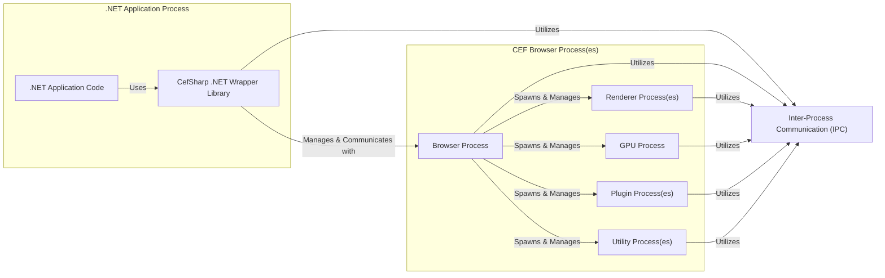

# Project Design Document: CefSharp Integration

**Document Version:** 1.1
**Date:** October 26, 2023
**Author:** AI Software Architect

## 1. Introduction

This document provides a detailed architectural design of the CefSharp project, a .NET (WPF and Windows Forms) browser control based on the Chromium Embedded Framework (CEF). This document aims to provide a comprehensive understanding of the system's components, interactions, and data flow, which will serve as the foundation for subsequent threat modeling activities. This revision includes more detail on specific components and expands on the security considerations relevant for threat analysis.

## 2. Goals and Objectives

The primary goal of CefSharp is to enable .NET developers to embed a full-fledged web browser within their desktop applications. Key objectives include:

*   Providing a robust and performant browser control leveraging the Chromium rendering engine.
*   Offering a comprehensive API for interacting with the embedded browser, allowing control and customization.
*   Maintaining compatibility with the latest stable Chromium releases to benefit from new features and security updates.
*   Supporting seamless integration within both WPF and Windows Forms UI frameworks.
*   Facilitating secure and efficient communication between the .NET application and the embedded web content.

## 3. High-Level Architecture

CefSharp operates as a bridge between the .NET application and the native Chromium Embedded Framework. It involves multiple processes and communication channels to achieve its functionality, adhering to Chromium's multi-process architecture for stability and security.

**Components:**

*   **.NET Application Code:** The custom application logic developed by the user that integrates and utilizes the CefSharp browser control. This code interacts directly with the CefSharp API.
*   **CefSharp .NET Wrapper Library:** A managed .NET library that provides the API surface for interacting with the underlying native CEF framework. This library abstracts away the complexities of inter-process communication and native code interaction, offering .NET-idiomatic interfaces.
*   **CEF Browser Process:** The primary process responsible for managing the overall browser instance and its sub-processes. It handles high-level tasks such as network request routing, resource management, and the lifecycle of other processes.
*   **Renderer Process(es):** Dedicated processes responsible for rendering web pages, executing JavaScript code, and managing the Document Object Model (DOM) for each tab or isolated browsing context. This isolation enhances security and stability.
*   **GPU Process:** A process dedicated to handling GPU-accelerated operations, such as compositing layers and rendering graphics, improving performance and visual fidelity.
*   **Plugin Process(es):**  Separate processes that host and manage browser plugins (though these are becoming less prevalent with the move away from technologies like Flash).
*   **Utility Process(es):** Processes dedicated to various utility tasks, such as audio decoding, network service resolution, and other background operations.
*   **Inter-Process Communication (IPC):** The fundamental mechanism enabling communication and data exchange between the .NET application process and the various CEF browser processes. This is critical for control, data transfer, and event handling across the managed and native boundaries.

## 4. Detailed Design

This section provides a more granular view of the key components and their interactions.

### 4.1. CefSharp .NET Wrapper Library

*   **Purpose:** Serves as the primary bridge and API gateway for .NET developers to interact with the CEF framework. It handles the marshalling of data and commands between the managed and native environments.
*   **Key Features:**
    *   **.NET Abstractions:** Provides .NET classes and interfaces that mirror or abstract CEF concepts, such as `ChromiumWebBrowser` (the main browser control), `IRequestHandler` (for intercepting network requests), `ILifeSpanHandler` (for managing browser window lifecycle), and `IJsDialogHandler` (for handling JavaScript dialogs).
    *   **Lifecycle Management:** Manages the creation, initialization, and shutdown of the CEF browser process and its associated resources.
    *   **IPC Management:**  Handles the underlying complexities of setting up and managing inter-process communication channels with the CEF processes.
    *   **Data Marshalling:**  Responsible for converting data between .NET types and the native types used by CEF, ensuring seamless data exchange.
    *   **Event Handling:**  Provides mechanisms for subscribing to and handling events originating from the CEF browser process, such as navigation events, load events, and console messages.
    *   **API for Browser Control:** Offers a rich API for controlling the embedded browser, including:
        *   Loading URLs (`LoadUrl`).
        *   Executing JavaScript code (`ExecuteScriptAsync`, `EvaluateScriptAsync`).
        *   Registering .NET objects for JavaScript access (`JavascriptObjectRepository`).
        *   Handling browser events (e.g., `FrameLoadEnd`, `ConsoleMessage`, `StatusMessage`).
        *   Intercepting and modifying network requests (`IRequestHandler`).
        *   Managing browser settings and preferences (`BrowserSettings`).
        *   Accessing and manipulating cookies.
        *   Implementing custom context menus.
*   **Implementation Details:**
    *   **P/Invoke (Platform Invoke):**  Relies extensively on P/Invoke to call native functions within the CEF library. This involves defining signatures for native functions and marshalling data appropriately.
    *   **Message Loop and Event System:** Utilizes a message loop and event system to handle asynchronous communication and events from the CEF processes, ensuring responsiveness.
    *   **Custom Handlers:** Implements custom handler classes (e.g., request handlers, life span handlers) that are instantiated in the .NET process and whose methods are invoked by CEF in the browser process via IPC.

### 4.2. CEF Browser Process and Sub-Processes

*   **Purpose:**  Provides the core browser functionality, leveraging the open-source Chromium project. It handles the heavy lifting of web content rendering, JavaScript execution, and network operations.
*   **Key Features:**
    *   **Rendering Engine (Blink):**  The core rendering engine responsible for parsing HTML, CSS, and generating the visual representation of web pages. It adheres to web standards and handles layout and rendering.
    *   **JavaScript Engine (V8):**  A high-performance JavaScript engine that executes JavaScript code embedded within web pages. It provides the runtime environment for dynamic web content.
    *   **Network Stack (Chromium Network Stack):**  A comprehensive network stack responsible for handling network requests, including DNS resolution, TCP/IP communication, SSL/TLS negotiation, and cookie management.
    *   **Browser UI (Minimal Host):** CEF provides a minimal host environment without a full browser UI (like address bars or menus). CefSharp integrates the rendered output into the .NET application's UI.
    *   **Security Sandbox:** Renderer processes operate within a security sandbox, limiting their access to system resources and isolating them from other processes. This is a crucial security feature of Chromium.
*   **Process Model:**
    *   **Multi-Process Architecture:**  Employs a multi-process architecture where different parts of the browser (e.g., rendering, plugins) run in separate processes. This enhances stability (a crash in one process is less likely to affect others) and security (through process isolation).
    *   **Internal IPC (Mojo):** CEF utilizes its own internal IPC mechanisms, primarily Mojo, for communication between its various processes. This is separate from the IPC used between the .NET application and CEF.

### 4.3. Inter-Process Communication (IPC)

*   **Purpose:**  Enables bidirectional communication between the managed .NET application process and the unmanaged CEF browser processes. This is essential for controlling the browser, exchanging data, and receiving notifications.
*   **Mechanisms Used:**
    *   **Named Pipes:** A common and efficient mechanism for local IPC in Windows, frequently used by CefSharp for communication between the .NET application and the main browser process. This allows for structured data exchange.
    *   **Custom Message Passing Infrastructure:** CefSharp implements its own message passing layer on top of the underlying IPC mechanisms. This provides a higher-level abstraction for sending and receiving messages between processes.
    *   **JavaScript to .NET Communication:**
        *   **JavaScript Object Binding (CefSharp.JavascriptObjectRepository):** Allows .NET objects to be registered and exposed to JavaScript code running within the browser's renderer process. JavaScript can then call methods on these .NET objects, with calls being marshaled across the process boundary. This requires careful security considerations.
        *   **`CefSharp.BindObjectAsync`:**  A key method used to asynchronously register .NET objects for JavaScript access, ensuring thread safety.
        *   **`window.chrome.webview.postMessage` (or similar mechanisms):**  JavaScript code can send string-based messages to the .NET application, which can be handled by subscribing to specific events.
    *   **.NET to JavaScript Communication:**
        *   **`IWebBrowser.ExecuteScriptAsync`:** Enables .NET code to inject and execute arbitrary JavaScript code within the context of the currently loaded web page in the renderer process.
        *   **`IWebBrowser.EvaluateScriptAsync`:** Similar to `ExecuteScriptAsync`, but allows the .NET code to retrieve the result of the executed JavaScript code.

## 5. Data Flow

Understanding the flow of data is crucial for identifying potential vulnerabilities. Here are common data flow scenarios:

*   **Loading a URL:**
    1. The .NET application initiates navigation by calling `ChromiumWebBrowser.LoadUrl(url)`.
    2. The CefSharp .NET wrapper sends a message via IPC to the CEF browser process, instructing it to load the specified URL.
    3. The browser process initiates a network request using Chromium's network stack.
    4. The response (HTML, CSS, JavaScript) is received by the browser process.
    5. The browser process directs the renderer process to load and render the content.
    6. The renderer process parses the HTML, CSS, executes JavaScript, and renders the web page.
    7. The rendered output is then composited and displayed within the browser control in the .NET application.

*   **Executing JavaScript from .NET:**
    1. The .NET application calls `ChromiumWebBrowser.ExecuteScriptAsync(script)`.
    2. The CefSharp .NET wrapper sends the JavaScript code via IPC to the appropriate renderer process (based on the target frame).
    3. The renderer process's V8 engine executes the provided JavaScript code.
    4. If a result is expected (using `EvaluateScriptAsync`), the result is serialized and sent back via IPC to the .NET application.

*   **JavaScript Calling .NET:**
    1. JavaScript code within the browser executes a method on a previously bound .NET object.
    2. The CEF renderer process sends a message via IPC to the browser process, indicating the method call and its parameters.
    3. The browser process forwards the call details via IPC to the CefSharp .NET wrapper in the .NET application process.
    4. The CefSharp wrapper marshals the parameters and invokes the corresponding method on the registered .NET object.
    5. The return value (if any) is marshaled back through the same IPC channels to the JavaScript code in the renderer process.

*   **Handling Browser Events:**
    1. Various events occur within the CEF browser processes (e.g., navigation started, loading finished, console messages, download requests).
    2. The relevant CEF process sends event notifications via IPC to the CefSharp .NET wrapper in the .NET application process.
    3. The CefSharp wrapper translates these notifications into corresponding .NET events (e.g., `FrameLoadEnd`, `ConsoleMessage`, `DownloadUpdated`).
    4. The .NET application can subscribe to these events and implement custom logic to handle them.

## 6. Security Considerations (Detailed for Threat Modeling)

This section provides a more detailed overview of security considerations, crucial for identifying potential threats and vulnerabilities.

*   **Inter-Process Communication (IPC) Security:**
    *   **Data Integrity and Confidentiality:**  Ensure that data exchanged via named pipes or other IPC mechanisms is not susceptible to tampering or eavesdropping. Consider encryption or signing of sensitive data transmitted over IPC.
    *   **Authentication and Authorization:**  While processes are typically running under the same user context, ensure that the IPC mechanisms don't introduce vulnerabilities allowing unauthorized communication or control.
    *   **Injection Attacks:**  Validate and sanitize any data received via IPC to prevent injection of malicious commands or code into either the .NET application or the CEF processes.
    *   **Denial of Service (DoS):**  Consider the potential for malicious processes to flood the IPC channels with messages, leading to resource exhaustion and DoS. Implement rate limiting or other protective measures.
*   **Chromium Security:**
    *   **Reliance on Chromium Security Features:** CefSharp inherently relies on the robust security features built into the Chromium project, including its sandbox, site isolation, and security policies. Keeping CefSharp updated is critical to benefit from the latest Chromium security patches.
    *   **Vulnerabilities in CEF:**  Be aware of potential vulnerabilities within the CEF framework itself. Monitor security advisories and update CefSharp regularly.
*   **Handling Untrusted Web Content:**
    *   **Cross-Site Scripting (XSS):**  The embedded browser can render untrusted web pages containing malicious JavaScript. Implement appropriate Content Security Policy (CSP) headers and educate developers on preventing DOM-based XSS.
    *   **Malware and Drive-by Downloads:**  Protect against malicious content that could exploit browser vulnerabilities or trick users into downloading malware. Consider using download interception features to scan downloaded files.
    *   **Frame Injection and Clickjacking:**  Implement measures to prevent malicious websites from embedding the application's content in iframes or tricking users into performing unintended actions.
*   **JavaScript Object Binding Security:**
    *   **Privilege Escalation:**  Carefully consider the methods and properties exposed to JavaScript. Malicious scripts could potentially exploit these bindings to gain access to sensitive .NET functionality or data. Follow the principle of least privilege.
    *   **Input Validation:**  Thoroughly validate any data received from JavaScript calls to bound .NET objects to prevent vulnerabilities like SQL injection or command injection in the .NET application.
    *   **Serialization/Deserialization Issues:**  Ensure that the serialization and deserialization of data passed between JavaScript and .NET is secure and doesn't introduce vulnerabilities.
*   **Network Security:**
    *   **HTTPS and Certificate Validation:**  Ensure that the application enforces HTTPS and properly validates SSL/TLS certificates to prevent man-in-the-middle attacks.
    *   **Custom Request Handling:**  Utilize `IRequestHandler` to implement custom logic for controlling network requests, such as blocking access to specific URLs or enforcing security policies.
    *   **Proxy Settings:**  Be aware of how proxy settings are configured and ensure they don't introduce security risks.
*   **Resource Exhaustion:**
    *   **Memory Leaks:**  Monitor for potential memory leaks in both the .NET application and the CEF processes, which could be exploited for DoS.
    *   **CPU Starvation:**  Prevent malicious web pages from consuming excessive CPU resources, impacting the application's performance.
*   **Local File Access:**
    *   **Restricting File System Access:**  By default, web pages have limited file system access. If local file access is required, carefully control and restrict it to specific directories using appropriate CEF settings.
    *   **Path Traversal:**  Sanitize any file paths provided by web content to prevent path traversal vulnerabilities.
*   **Cookie and Data Storage:**
    *   **Sensitive Data in Cookies:**  Avoid storing sensitive information in cookies if possible. If necessary, ensure cookies are marked as secure and HTTPOnly.
    *   **Local Storage and IndexedDB:**  Be aware of the data stored by web pages in local storage and IndexedDB and the potential security implications.

## 7. Deployment Considerations

*   **Native Binary Deployment:** CefSharp requires the deployment of native CEF binaries alongside the .NET application. These binaries are platform-specific (x86, x64) and must match the application's architecture.
*   **CEF Binary Distribution:** Choose the appropriate CEF binary distribution (Standard or Release) based on application requirements. The Release distribution is generally recommended for production environments due to its stability.
*   **NuGet Packages:** Utilize the official CefSharp NuGet packages to simplify the deployment process, as they include the necessary native binaries and handle dependencies.
*   **Licensing:** Be aware of the licensing terms of both CefSharp (BSD-style) and the underlying Chromium Embedded Framework (BSD-style).

## 8. Future Considerations

*   **Exploring Enhanced IPC Mechanisms:** Investigate newer and potentially more secure or performant IPC mechanisms for communication between the .NET application and CEF.
*   **API Enhancements:**  Continuously evaluate and enhance the CefSharp API to provide developers with more fine-grained control over browser behavior and security settings.
*   **Integration with Modern .NET UI Frameworks:** Explore and support integration with newer .NET UI frameworks like MAUI to broaden the applicability of CefSharp.
*   **Staying Current with Chromium:**  Maintain a commitment to keeping CefSharp aligned with the latest stable Chromium releases to ensure access to the newest features, performance improvements, and critical security updates.

This revised document provides a more in-depth architectural overview of the CefSharp project, with a strong focus on security considerations relevant for thorough threat modeling. This detailed information will enable a more comprehensive analysis of potential vulnerabilities and the design of effective mitigation strategies.