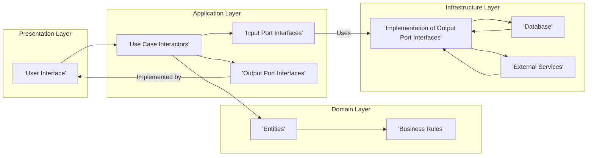

# Project Design Document: Clean Architecture Example

**Version:** 1.1
**Date:** October 26, 2023
**Prepared By:** Gemini (AI Language Model)

## 1. Introduction

This document provides a detailed design overview of the Clean Architecture example project located at [https://github.com/ardalis/CleanArchitecture](https://github.com/ardalis/CleanArchitecture). This document aims to clearly articulate the architecture, components, and data flow of the project. It will serve as a foundational resource for subsequent threat modeling activities.

### 1.1. Purpose

The primary purpose of this document is to provide a comprehensive architectural description of the Clean Architecture example project. This description will be used to identify potential security vulnerabilities and threats during the threat modeling process. It aims to be a single source of truth for the project's high-level design.

### 1.2. Scope

This document covers the high-level architecture, key components, and data flow within the Clean Architecture example project. It focuses on the logical structure, responsibilities of each layer, and interactions between different layers and modules. Specific implementation details within individual classes or methods are outside the scope of this document. This document also outlines initial security considerations based on the architecture.

### 1.3. Target Audience

This document is intended for:

* Security engineers and analysts involved in threat modeling and security assessments.
* Developers who need a high-level understanding of the project's architecture for development and maintenance.
* Architects reviewing the design and security aspects of the project for compliance and best practices.
* Onboarding team members to quickly grasp the project's structure.

## 2. Overview

The Clean Architecture example project demonstrates the principles of Clean Architecture, a software design philosophy that emphasizes separation of concerns and independence from frameworks, databases, and UI. The core idea is to organize the codebase into independent, concentric layers, with dependencies pointing inwards. This structure promotes maintainability, testability, and flexibility, allowing for changes in external frameworks and technologies without impacting core business logic.

### 2.1. Project Goals

The primary goals of the Clean Architecture example project are:

* To showcase a practical and well-documented implementation of Clean Architecture principles in a real-world scenario.
* To provide a well-structured and easily understandable codebase that serves as a learning resource.
* To demonstrate how to effectively separate core business logic from infrastructure and presentation concerns.
* To facilitate independent testing of core business rules and application logic.
* To create a system that is adaptable to changes in frameworks, UI technologies, and data storage mechanisms.

## 3. Architectural Design

The project follows the layered architecture pattern as defined by Clean Architecture. The core layers, from innermost to outermost, are:

* **Entities (Domain Layer):** This is the innermost and most stable layer. It contains the core business objects (entities) and fundamental business rules. It is completely independent of any other layers and external concerns.
* **Use Cases (Application Layer):** This layer contains the application-specific business logic and orchestrates the interaction between entities to fulfill specific user requirements. It depends on the Entities layer but is unaware of the outer layers.
* **Interface Adapters (Presentation and Infrastructure Layers):** These layers act as translators between the inner layers and the outside world, converting data and formats as needed.
    * **Presentation Layer:** Responsible for user interface and user interaction. It translates user actions into requests for the Application Layer and formats data for display. It depends on the Application Layer.
    * **Infrastructure Layer:** Handles all interactions with the outside world, such as databases, file systems, external services, and specific frameworks. It implements interfaces defined in the Application Layer.

### 3.1. Layer Responsibilities

*   **Domain Layer:** Defines the core business concepts and rules. Contains no application-specific logic or infrastructure details.
*   **Application Layer:** Implements the use cases of the application, orchestrating the domain logic. Defines interfaces for infrastructure concerns.
*   **Presentation Layer:** Handles user input and output, formatting data for the user.
*   **Infrastructure Layer:** Provides concrete implementations for interfaces defined in the Application Layer, dealing with external systems.

### 3.2. Dependencies

The dependencies between the layers strictly flow inwards, adhering to the Dependency Inversion Principle:

* The Presentation Layer depends on the Application Layer.
* The Infrastructure Layer depends on the Application Layer.
* The Application Layer depends on the Domain Layer.
* The Domain Layer has no dependencies on other layers.

This dependency rule ensures that changes in outer layers do not impact the inner, more stable layers.

### 3.3. Data Flow

A typical request flow within the application would be:

1. A user interacts with the **Presentation Layer** (e.g., clicks a button, submits a form).
2. The Presentation Layer translates this interaction into a request and calls a specific **Use Case Interactor** in the **Application Layer**.
3. The Use Case Interactor retrieves and manipulates **Entities** from the **Domain Layer** to perform the core business logic.
4. If the Use Case needs to interact with external resources (e.g., a database), it uses **Input Port Interfaces** (also known as Repository Interfaces or Gateway Interfaces) defined within the Application Layer.
5. The **Infrastructure Layer** provides concrete implementations of these Input Port Interfaces, handling the actual interaction with the database, external API, or other external systems.
6. Data flows back through the layers: from the Infrastructure Layer to the Application Layer (via Output Port Interfaces), and finally to the Presentation Layer for display to the user.

## 4. Data Flow Diagram

## 5. Key Components

This section details the key components within each layer and their responsibilities.

### 5.1. Domain Layer

*   **Entities:** Core business objects representing the fundamental data and state of the application (e.g., `Customer`, `Order`, `Product`). These objects encapsulate data and behavior relevant to the business domain.
*   **Business Rules:** Logic that defines how entities behave and interact. These can be encapsulated within entities themselves or implemented as separate domain services for more complex logic.
*   **Value Objects:** Immutable objects that represent a conceptual whole whose identity is based on its value rather than object identity (e.g., `Address`, `Email`, `Money`).

### 5.2. Application Layer

*   **Use Case Interactors:** Classes that implement specific business operations or workflows from the user's perspective (e.g., `CreateOrderInteractor`, `GetCustomerDetailsInteractor`). They orchestrate the interaction between domain entities to fulfill a specific use case.
*   **Input Port Interfaces (Repository/Gateway Interfaces):** Interfaces that define the operations required to access data or interact with external systems. These interfaces are defined in the Application Layer but implemented in the Infrastructure Layer (e.g., `ICustomerRepository`, `IPaymentGateway`).
*   **Output Port Interfaces:** Interfaces that define how the results of a use case are presented back to the Presentation Layer. This allows for different presentation formats without changing the application logic.
*   **Application Services (Optional):** Can provide cross-cutting concerns or helper functions that are specific to the application logic but not part of the core domain (e.g., application-level logging or caching).

### 5.3. Presentation Layer

*   **Controllers/API Endpoints:** Handle incoming user requests (e.g., HTTP requests) and translate them into calls to the appropriate Use Case Interactors in the Application Layer.
*   **View Models/DTOs (Data Transfer Objects):** Data structures specifically designed for presentation to the user. They encapsulate the data needed by the UI and are often different from the domain entities.
*   **User Interface (UI):** The visual elements and user interaction logic (e.g., web pages, mobile app screens, command-line interface). This layer is responsible for rendering the view models.

### 5.4. Infrastructure Layer

*   **Database Access Implementations (Repositories):** Concrete implementations of the Input Port Interfaces that handle the actual interaction with the database (e.g., using an ORM like Entity Framework or a direct database connection).
*   **External Service Integrations:** Code for communicating with external APIs or services (e.g., payment gateways, email services).
*   **Framework-Specific Implementations:** Implementations of interfaces defined in the Application Layer using specific frameworks or libraries (e.g., logging frameworks, caching mechanisms, message queues).
*   **Cross-Cutting Concerns:** Implementations for concerns that span multiple layers, such as logging, security, and monitoring.

## 6. Security Considerations

Based on the architectural design, several security considerations are important:

*   **Input Validation:** The **Presentation Layer** is the first point of contact with user input and must implement robust validation to prevent common injection attacks (e.g., SQL injection, cross-site scripting).
*   **Authorization:** The **Application Layer** should enforce authorization rules to ensure that users can only access and modify data they are permitted to. This prevents unauthorized access to sensitive information and functionalities.
*   **Data Protection:** Sensitive data should be encrypted both in transit (using HTTPS) and at rest within the **Infrastructure Layer**. Consider encryption at the database level or using data protection APIs.
*   **Dependency Management:**  Careful management of external dependencies is crucial. Regularly audit and update dependencies to patch known vulnerabilities introduced by third-party libraries. Use dependency scanning tools.
*   **Logging and Auditing:**  The **Infrastructure Layer** should implement comprehensive logging and auditing mechanisms to track user actions, system events, and potential security breaches. This is essential for security monitoring and incident response.
*   **Secure Communication:** Communication between different components and external services should be secured using appropriate protocols (e.g., HTTPS for web services, TLS for database connections).
*   **Error Handling:**  Implement proper error handling throughout the application to prevent information leakage through overly detailed error messages. Generic error messages should be returned to the user, while detailed error information should be logged securely.
*   **Authentication:**  Implement secure authentication mechanisms to verify the identity of users accessing the application. This might involve username/password, multi-factor authentication, or integration with identity providers.
*   **Rate Limiting:**  Implement rate limiting in the **Presentation Layer** to protect against denial-of-service attacks.
*   **CORS (Cross-Origin Resource Sharing):** Configure CORS policies appropriately in the **Presentation Layer** to control which domains can access the application's resources.

## 7. Assumptions and Constraints

The following assumptions and constraints are relevant to this design:

*   The project is implemented using object-oriented programming principles, allowing for clear separation of concerns and encapsulation.
*   The specific programming language and frameworks used are not explicitly defined in this document but are assumed to support the principles of Clean Architecture and dependency inversion.
*   The focus is on the logical architecture and high-level component interactions. Specific deployment details, such as server configurations or network topology, are not covered in this document.
*   It is assumed that developers implementing this architecture have a good understanding of SOLID principles and design patterns.

## 8. Future Considerations

Potential future enhancements or changes that could impact the architecture include:

*   Introduction of new features or functionalities that require new use cases and potentially new domain entities.
*   Changes in the technology stack or frameworks used in the Presentation or Infrastructure Layers.
*   Scaling requirements that might necessitate architectural adjustments, such as introducing message queues or microservices.
*   Integration with new external services or APIs.
*   Adoption of new security best practices or compliance requirements.
*   Refactoring of existing components to improve performance or maintainability.
