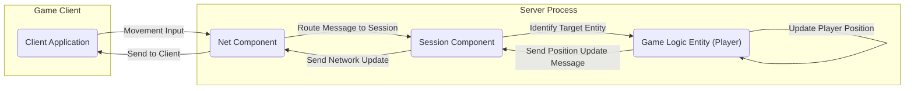
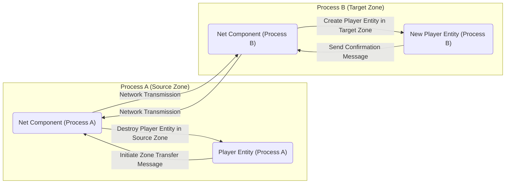
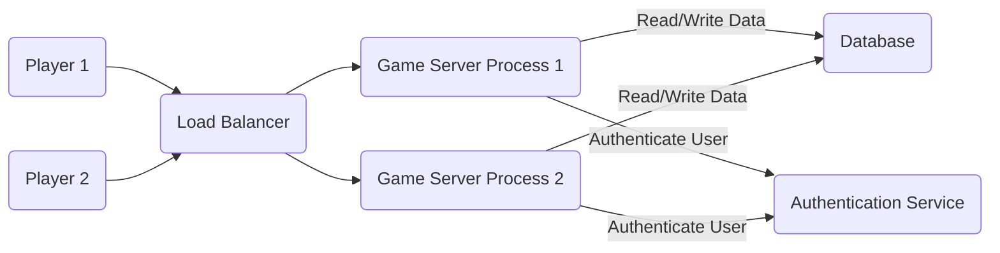

## Project Design Document: ET Framework (Improved)

**1. Introduction**

This document provides an enhanced architectural design of the ET framework, a high-performance distributed game server framework written in C# and often used with the Unity engine. This detailed design serves as a crucial foundation for subsequent threat modeling activities, clearly outlining the key components, data flows, and underlying technologies. The design is based on the publicly available source code at [https://github.com/egametang/ET](https://github.com/egametang/ET) as of the time of writing. This revision aims for greater clarity and detail to facilitate a more thorough threat analysis.

**2. Goals and Objectives**

The primary goals of the ET framework are to:

* Facilitate the development of scalable and robust multiplayer game servers.
* Offer a modular and extensible architecture adaptable to diverse game genres and requirements.
* Enable efficient and reliable communication between game clients and the server infrastructure.
* Streamline the development of complex game logic and state management through its actor-based model.
* Support flexible deployment models, including distributed server instances for enhanced scalability and resilience.

**3. System Architecture Overview**

ET leverages an actor-based concurrency model, where `Entity` objects act as independent actors communicating asynchronously via messages. The framework is organized around several core processes and components:

* **App:** The central entry point for a server instance, responsible for bootstrapping and managing the lifecycle of other components and handling initial configuration.
* **Process:** Represents an isolated operating system process hosting a segment of the game server logic. Multiple Processes can operate independently, potentially across different physical or virtual machines.
* **Fiber:** A lightweight, cooperative concurrency unit operating within a Process. Entities residing within the same Fiber execute sequentially, simplifying concurrent programming.
* **Scene:** A logical container for grouping related Entities within a Process. Scenes can represent distinct game areas, instances, or other logical divisions of the game world.
* **Entity:** The fundamental building block representing game objects or concepts. Entities encapsulate data (through components) and behavior, interacting with each other via messages.
* **Message:** The primary mechanism for communication between Entities, both within the same Process and across different Processes. Messages are asynchronous and facilitate decoupled interactions.
* **Net:** Manages all network communication, handling interactions between clients and servers, as well as communication between different server Processes.

**4. Detailed Component Design**

A more granular breakdown of the key components and their responsibilities:

* **App Component:**
    * Initializes the server application and manages its overall lifecycle.
    * Loads and manages configuration parameters from various sources.
    * Creates and oversees the lifecycle of `Process` instances.
    * Handles global application events and signals (e.g., startup, shutdown).

* **Process Component:**
    * Represents a single, independent server process.
    * Hosts one or more `Scene` instances, logically partitioning the game world.
    * Manages the creation, scheduling, and execution of `Fiber` instances within its scope.
    * Provides mechanisms for inter-process communication with other `Process` instances.

* **Fiber Component:**
    * Offers a cooperative multitasking environment, allowing for efficient concurrency within a single thread.
    * Ensures that Entities within the same Fiber execute sequentially, simplifying state management and reducing the need for explicit locking.
    * Managed by the parent `Process` component.

* **Scene Component:**
    * Acts as a container for `Entity` objects, providing a scope for their existence and interaction.
    * Offers methods for creating, retrieving, and destroying Entities within the Scene.
    * Facilitates querying and filtering Entities based on their components or properties.

* **Entity Component:**
    * Represents a distinct game object or concept within the game world.
    * Composed of data components that define its attributes and state.
    * Exhibits behavior through methods and message handlers.
    * Possesses a unique identifier within its containing `Scene`.

* **Message Component:**
    * Represents a discrete unit of communication between Entities.
    * Can be sent synchronously (within the same Fiber) or asynchronously (across Fibers or Processes).
    * Supports various message types to represent different kinds of interactions (e.g., commands, events, data synchronization).
    * Relies on serialization and deserialization mechanisms for transmission.

* **Net Component:**
    * Manages all network-related operations for the Process.
    * Establishes and maintains connections with game clients.
    * Facilitates communication with other server Processes.
    * Handles message serialization and deserialization for network transmission.
    * Implements message routing to deliver messages to the correct `Process` and `Entity`.
    * Includes sub-components for session management, connection state tracking, and potentially transport-level security.

**5. Data Flow Diagrams**

Illustrating key data flows within the ET framework:

* **Client-Server Interaction (Example: Player Movement):**

* **Inter-Process Communication (Example: Zone Transfer):**

**6. Key Technologies and Dependencies**

* **Core Language:** C#
* **Primary Environment:** .NET Framework or .NET (Core)
* **Client Integration:** Often used with the Unity game engine for client development.
* **Networking:**  Utilizes standard .NET networking libraries (e.g., `System.Net.Sockets`, potentially with abstractions).
* **Serialization:** Employs a serialization library for efficient message encoding and decoding (likely a high-performance binary serializer like MessagePack or a custom solution).
* **Concurrency:**  Relies heavily on asynchronous programming (`async`/`await`) and the actor model for managing concurrent operations.
* **Logging:**  Includes logging mechanisms for debugging and monitoring server activity.
* **Configuration:**  Supports configuration management, potentially through files or environment variables.

**7. Deployment Architecture (Conceptual)**

A typical deployment of an ET-based game server might involve:

* **Multiple Game Server Processes:** Distributed across several physical or virtual machines to handle a large number of concurrent players and game world complexity.
* **Load Balancer:**  Distributes incoming client connections across the available game server Processes to ensure even load distribution and high availability.
* **Database Layer (Optional):**  Used for persistent storage of game data, such as player accounts, character information, and world state.
* **Authentication Service (Optional):**  Handles the verification of client credentials before allowing access to the game server.
* **Service Discovery (Optional):**  Mechanisms for server Processes to locate and communicate with each other.

**8. Security Considerations (More Specific)**

Building upon the initial considerations, here are more specific security aspects:

* **Client Authentication and Authorization:**
    * Secure authentication protocols to verify client identity (e.g., OAuth 2.0).
    * Role-based access control (RBAC) to manage client permissions and prevent unauthorized actions.
    * Protection against replay attacks and credential stuffing.
* **Inter-Process Communication Security:**
    * Encryption of communication between server Processes (e.g., TLS).
    * Mutual authentication between Processes to prevent unauthorized servers from joining the network.
    * Message integrity checks to detect tampering.
* **Data Validation and Sanitization:**
    * Strict validation of all data received from clients and other Processes to prevent injection attacks (e.g., SQL injection, command injection).
    * Sanitization of user-generated content to prevent cross-site scripting (XSS) vulnerabilities (if applicable to in-game chat or similar features).
* **Denial of Service (DoS) Protection:**
    * Rate limiting on client requests to prevent resource exhaustion.
    * Implementing anti-DDoS measures at the network infrastructure level.
    * Input validation to prevent resource-intensive operations triggered by malicious input.
* **Session Management:**
    * Securely generated and managed session tokens.
    * Protection against session hijacking (e.g., using HTTPS, HttpOnly and Secure flags on cookies).
    * Session timeout mechanisms.
* **Code Security:**
    * Adherence to secure coding practices to prevent common vulnerabilities (e.g., buffer overflows, integer overflows).
    * Regular code reviews and static analysis to identify potential security flaws.
* **Dependency Management:**
    * Maintaining an inventory of all dependencies and regularly updating them to patch known security vulnerabilities.
    * Using dependency scanning tools to identify vulnerable libraries.
* **Network Security:**
    * Proper firewall configuration to restrict access to necessary ports and services.
    * Consideration of using secure transport protocols (e.g., TLS for client-server communication).

**9. Assumptions and Constraints**

* This design document is based on the publicly available source code of the ET framework. Specific internal implementations and configurations may vary.
* The security posture of an ET-based game server is heavily dependent on the implementation choices made by the game developers using the framework.
* The network transport protocol and serialization mechanisms used have significant implications for security and performance.
* This document primarily focuses on the server-side architecture. Client-side security measures are also crucial but are outside the scope of this document.

**10. Future Considerations**

* Conducting thorough threat modeling exercises based on this detailed design document to identify potential attack vectors and vulnerabilities.
* Performing security audits and penetration testing of deployed ET-based game servers to validate security measures.
* Developing and documenting security best practices and guidelines for developers using the ET framework.
* Investigating and documenting any built-in security features or mechanisms provided by the ET framework itself.
* Exploring integration with security monitoring and incident response systems.

This improved design document provides a more detailed and nuanced understanding of the ET framework's architecture, offering a stronger foundation for comprehensive threat modeling and security analysis. The enhanced component descriptions, refined data flow diagrams, and more specific security considerations aim to facilitate a more effective assessment of potential risks and vulnerabilities.