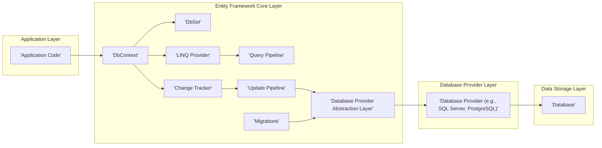

## Project Design Document: Entity Framework Core (EF Core)

**Version:** 1.1
**Date:** October 26, 2023
**Author:** AI Software Architect

### 1. Project Overview

Entity Framework Core (EF Core) is a modern, lightweight, extensible, open-source, and cross-platform Object-Relational Mapper (ORM) for .NET applications. It enables developers to interact with databases using .NET objects, significantly reducing the amount of data access code required. EF Core supports various database systems through its provider model. This document provides a detailed architectural overview of EF Core, focusing on aspects relevant for security threat modeling.

### 2. Goals

* Clearly articulate the high-level architecture and key interactions within EF Core.
* Identify and describe the core components of EF Core and their responsibilities.
* Illustrate the typical data flow for read and write operations.
* Provide a foundation for identifying potential security vulnerabilities and threats.

### 3. Non-Goals

* Serve as a comprehensive API reference for EF Core.
* Detail the internal implementation of specific database providers beyond their general role.
* Provide specific security mitigation strategies or code examples (this is the purpose of subsequent threat modeling).
* Document the historical development or future roadmap of the project.

### 4. Target Audience

* Security Architects and Engineers
* Software Developers involved in secure coding practices and threat analysis for applications utilizing EF Core.
* DevOps engineers responsible for the secure deployment and configuration of applications using EF Core.

### 5. Architectural Overview

EF Core employs a layered architecture to abstract database interactions. The core framework interacts with specific database providers to translate object-oriented operations into database commands.



### 6. Key Components

* **DbContext:**
    * Represents a connection and a session with the database.
    * Acts as the central point for interacting with EF Core.
    * Manages database connections, transactions, and change tracking.
    * Exposes `DbSet<T>` properties, which represent collections of entities mapped to database tables.
    * Configuration, including the connection string and database provider, is typically defined within or for the `DbContext`.

* **DbSet\<T>:**
    * Represents a collection of all entities of a given type in the context.
    * Provides a starting point for LINQ queries against the database.
    * Operations performed on `DbSet<T>` are translated into database queries by the LINQ provider.

* **LINQ Provider:**
    * Responsible for translating Language Integrated Query (LINQ) expressions written against `DbSet<T>` into database-specific query language (e.g., SQL).
    * Optimizes the generated queries for efficient execution on the target database.
    * Different database providers have their own implementations of the LINQ provider to handle database-specific syntax and features.

* **Query Pipeline:**
    * The sequence of steps involved in executing a database query:
        * **Expression Tree Parsing:** The LINQ query is analyzed and broken down into an expression tree.
        * **Query Compilation:** The expression tree is compiled into an executable query plan.
        * **Query Optimization:** The query plan is optimized based on database provider capabilities and indexes.
        * **Command Generation:** Database-specific commands (e.g., SQL statements) are generated from the optimized query plan.
        * **Command Execution:** The generated commands are executed against the database through the active database connection managed by the provider.
        * **Result Materialization:** The raw data returned from the database is transformed into entity objects and populated with data.

* **Change Tracker:**
    * Monitors the state of entity instances retrieved from the database or added to the `DbContext`.
    * Tracks changes made to the properties of loaded entities.
    * Determines which entities need to be inserted, updated, or deleted when `SaveChanges()` is called.
    * Manages relationships between entities, ensuring referential integrity.

* **Update Pipeline:**
    * The sequence of steps involved in persisting changes to the database when `SaveChanges()` is invoked:
        * **Change Detection:** The change tracker identifies entities that have been added, modified, or deleted.
        * **Command Generation:** Database-specific commands (INSERT, UPDATE, DELETE statements) are generated based on the tracked changes.
        * **Transaction Management:** Transactions are initiated and managed to ensure atomicity of changes (all changes succeed or none are applied).
        * **Command Execution:** The generated commands are executed against the database through the database provider.
        * **Identity Resolution:** Updates entity properties with values generated by the database (e.g., auto-incrementing primary keys).
        * **Savepoint Management:**  Supports nested transactions and partial rollbacks in some scenarios.

* **Migrations:**
    * A feature that enables developers to evolve the database schema in sync with changes to the application's data model.
    * Generates migration files that describe the necessary schema changes (e.g., adding tables, columns, indexes).
    * Provides mechanisms to apply these migrations to a database, bringing its schema up to the current model.
    * Can also be used to revert migrations, rolling back schema changes.

* **Database Provider Abstraction Layer:**
    * Provides an abstraction layer that allows EF Core to work with various database systems without requiring significant code changes.
    * Each database provider implements specific logic for:
        * Query translation (adapting the LINQ provider).
        * Command generation (creating database-specific SQL or other commands).
        * Data type mapping (mapping .NET types to database types).
        * Connection management (handling database connections and connection pooling).
        * Transaction management (implementing database-specific transaction semantics).

### 7. Data Flow

The following describes the typical data flow for common operations:

* **Querying Data:**
    * Application code initiates a query using LINQ against a `DbSet<T>`.
    * The LINQ Provider translates the LINQ expression into a database-specific query.
    * The Query Pipeline optimizes the query and generates executable database commands.
    * The Database Provider executes these commands against the target database.
    * The database returns the result set to the Database Provider.
    * The Database Provider passes the raw data back to EF Core.
    * EF Core materializes the raw data into entity objects.
    * The populated entity objects are returned to the application code.

    ```mermaid
    graph LR
        A["'Application Code'"] --> B["'DbSet<T>'"]
        B --> C["'LINQ Provider'"]
        C --> D["'Query Pipeline'"]
        D --> E["'Database Provider'"]
        E --> F["'Database'"]
        F --> E
        E --> D
        D --> G["'Entity Materialization'"]
        G --> A
    ```

* **Saving Data (Insert, Update, Delete):**
    * Application code modifies entity objects or adds/removes entities from the `DbContext`.
    * The Change Tracker detects these changes in entity states.
    * When `SaveChanges()` is called, the Update Pipeline generates appropriate database commands (INSERT, UPDATE, DELETE) based on the tracked changes.
    * The Database Provider manages a transaction and executes these commands against the database.
    * The database performs the requested data modifications.
    * The Database Provider informs EF Core about the success or failure of the operations.
    * EF Core updates entity properties with any database-generated values (e.g., identity values).

    ```mermaid
    graph LR
        A["'Application Code'"] --> B["'DbContext / Entities'"]
        B --> C["'Change Tracker'"]
        C --> D["'Update Pipeline'"]
        D --> E["'Database Provider'"]
        E --> F["'Database'"]
        F --> E
        E --> D
    ```

* **Migrations:**
    * A developer modifies the data model in the application code (e.g., adds a property to an entity).
    * The Migrations feature compares the current data model with the last applied database schema.
    * It generates a migration file containing code to update the database schema to match the new model.
    * This migration can be applied to the database using command-line tools or programmatically.
    * The Database Provider executes the schema changes on the database.

    ```mermaid
    graph LR
        A["'Developer (Code Changes)'"] --> B["'Migrations Feature'"]
        B --> C["'Migration Files'"]
        C --> D["'Database Provider'"]
        D --> E["'Database Schema'"]
    ```

### 8. Security Considerations

This section outlines potential security considerations relevant to EF Core, which will be further explored during threat modeling.

* **SQL Injection Vulnerabilities:**  Constructing dynamic queries using string concatenation or failing to parameterize queries properly can lead to SQL injection attacks. This is especially relevant when using raw SQL queries or when LINQ queries incorporate user-provided input without proper sanitization.
* **Data Breach Potential:**  Unauthorized access to the database, whether through compromised credentials, application vulnerabilities, or insecure database configurations, can result in data breaches.
* **Authentication and Authorization Weaknesses:**  EF Core relies on the underlying database's authentication and authorization mechanisms. Misconfigurations or vulnerabilities in these systems can lead to unauthorized data access or manipulation.
* **Insufficient Data Validation:**  Relying solely on client-side or EF Core validation without database-level constraints can lead to invalid or malicious data being persisted.
* **Denial of Service (DoS) Attacks:**  Maliciously crafted, resource-intensive queries can overload the database, leading to a denial of service for legitimate users.
* **Dependency Vulnerabilities:**  EF Core depends on various NuGet packages. Vulnerabilities in these dependencies could potentially be exploited.
* **Information Disclosure through Errors:**  Verbose error messages or overly detailed logging can inadvertently expose sensitive information about the database structure or data.
* **Insecure Migration Practices:**  If migration scripts are not reviewed and applied securely, malicious actors could potentially introduce harmful schema changes.
* **Sensitive Data Handling:**  Improper handling of sensitive data within entities or during data transfer can lead to exposure.
* **Connection String Security:**  Storing connection strings insecurely (e.g., in plain text in configuration files) can provide attackers with direct access to the database.

### 9. Technologies Used

* **Primary Programming Language:** C#
* **Target Platform:** .NET (including .NET Framework and .NET Core/.NET)
* **Core Libraries:** `Microsoft.EntityFrameworkCore` and related packages.
* **Database Provider Packages:**  Examples include `Microsoft.EntityFrameworkCore.SqlServer`, `Npgsql.EntityFrameworkCore.PostgreSQL`, `Pomelo.EntityFrameworkCore.MySql`, etc.

### 10. Deployment Considerations

Secure deployment of applications using EF Core requires careful attention to several factors:

* **Secure Connection String Management:**  Employ secure methods for storing and retrieving database connection strings, such as using environment variables, Azure Key Vault, or other secure configuration providers. Avoid hardcoding connection strings.
* **Network Security:**  Ensure secure network communication between the application and the database server. Use firewalls and network segmentation to restrict access.
* **Database Security Hardening:**  Follow database vendor best practices for securing the database server itself, including strong passwords, access controls, and regular security updates.
* **Regular Updates and Patching:**  Keep EF Core and all its dependencies updated to the latest versions to patch known security vulnerabilities.
* **Principle of Least Privilege:**  Grant database users only the necessary permissions required for the application to function. Avoid using overly permissive database accounts.
* **Input Sanitization and Validation:**  Implement robust input sanitization and validation at all layers of the application to prevent injection attacks.
* **Secure Logging and Monitoring:**  Implement secure logging practices and monitor database activity for suspicious behavior. Avoid logging sensitive data.
* **Code Reviews:**  Conduct thorough code reviews to identify potential security vulnerabilities in the application's data access logic.

This improved design document provides a more detailed and refined overview of Entity Framework Core, emphasizing aspects crucial for security threat modeling. The identified security considerations serve as a starting point for a deeper analysis of potential vulnerabilities and the development of appropriate mitigation strategies.