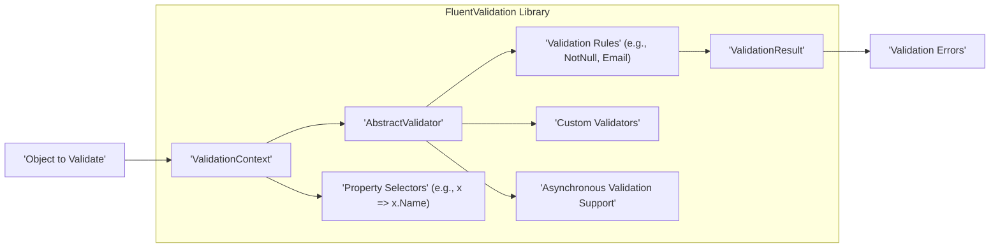
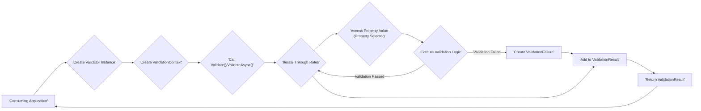

# Project Design Document: FluentValidation Library

**Version:** 1.1
**Date:** October 26, 2023
**Author:** AI Software Architect

## 1. Introduction

This document provides a detailed design overview of the FluentValidation library, an open-source .NET library for building strongly-typed validation rules. This document aims to serve as a comprehensive resource for understanding the library's architecture, components, and data flow, specifically for the purpose of conducting threat modeling. This version includes refinements for clarity and expanded detail based on initial review.

## 2. Goals and Objectives

The primary goals of the FluentValidation library are:

*   Provide a fluent and intuitive interface for defining validation rules in C#.
*   Enable strongly-typed validation of objects, leveraging compile-time safety.
*   Offer a flexible and extensible validation framework, allowing for custom rules and integrations.
*   Improve the readability and maintainability of validation logic compared to traditional imperative approaches.
*   Support asynchronous validation for operations that may involve I/O or other time-consuming tasks.
*   Provide clear, informative, and localizable validation error messages to aid developers and end-users.

The objective of this design document is to clearly articulate the library's internal workings and external interactions to facilitate a thorough and effective threat modeling exercise.

## 3. Scope

This document covers the design of the core FluentValidation library as represented in the provided GitHub repository. It focuses on the architectural components, data flow within the library, and key extension points that are part of the core functionality. This document does *not* cover:

*   Specific implementations of validators within consuming applications or business logic.
*   The hosting environment or infrastructure where applications using FluentValidation are deployed.
*   Third-party integrations or extensions built on top of FluentValidation that are not part of the core library's codebase.
*   The NuGet package creation, distribution, or management processes.
*   Specific usage patterns or best practices for consuming the library.

## 4. Architectural Overview

FluentValidation is designed as a lightweight, in-process library that integrates directly into .NET applications. It operates within the application's process and does not inherently involve external services or network communication for its core validation logic. The central concept revolves around defining validator classes that encapsulate the validation rules for specific types.



**Key Architectural Elements:**

*   **`AbstractValidator<T>`:** This is the abstract base class that developers inherit from to create concrete validator classes for specific types (`T`). It provides the fluent interface for defining validation rules.
*   **Validation Rules:** These represent the individual constraints or checks applied to properties of the object being validated. Examples include `NotNull()`, `NotEmpty()`, `Email()`, `Length()`, and more complex conditional rules.
*   **`ValidationContext<T>`:** This object encapsulates the context for a specific validation execution. It holds the instance of the object being validated, along with optional contextual data.
*   **`ValidationResult`:** This object contains the outcome of the validation process. It includes a boolean indicating success or failure and a collection of any validation errors encountered.
*   **Property Selectors:** Lambda expressions (e.g., `x => x.Name`) are used to specify which property of the object a particular validation rule should be applied to. This ensures type safety.
*   **Custom Validators:**  The library allows developers to create reusable validation logic beyond the built-in rules by implementing specific interfaces or using delegate-based approaches.
*   **Asynchronous Validation Support:**  FluentValidation provides mechanisms to define and execute validation rules that involve asynchronous operations, returning `Task`-based results.

## 5. Component Details

This section provides a more detailed look at the key components within the FluentValidation library, elaborating on their purpose and functionality.

### 5.1. `AbstractValidator<T>`

*   **Purpose:** Serves as the blueprint for creating validators. It enforces a structure for defining validation logic in a fluent manner.
*   **Functionality:**
    *   Provides core methods like `RuleFor<TProperty>(Expression<Func<T, TProperty>> expression)` to start defining a rule for a specific property.
    *   Offers methods for defining different types of rules (e.g., `NotNull()`, `NotEmpty()`, `Must()`).
    *   Supports conditional rule application using `When(Func<T, bool> predicate)` and `Unless(Func<T, bool> predicate)`.
    *   Allows grouping of rules into rule sets using `RuleSet(string ruleSetName, Action rules)`.
    *   Manages an internal collection of `IValidationRule` instances, each representing a defined validation constraint.
    *   Contains the primary entry points for validation: `Validate(ValidationContext<T> context)` for synchronous validation and `ValidateAsync(ValidationContext<T> context, CancellationToken cancellation = default)` for asynchronous validation.
*   **Example:**
    ```csharp
    public class UserValidator : AbstractValidator<User>
    {
        public UserValidator()
        {
            RuleFor(user => user.Name).NotEmpty().WithMessage("Name is required.");
            RuleFor(user => user.Email).EmailAddress().WithMessage("Invalid email format.");
            RuleFor(user => user.Age).GreaterThan(0).WithMessage("Age must be greater than 0.");
        }
    }
    ```

### 5.2. Validation Rules

*   **Purpose:** Encapsulate the specific logic for validating a property against a constraint.
*   **Types:**
    *   **Built-in Validators:** FluentValidation provides a rich set of pre-built validators for common scenarios (e.g., `NotNullValidator`, `NotEmptyValidator`, `EmailValidator`, `LengthValidator`, `RegularExpressionValidator`, `InclusiveBetweenValidator`).
    *   **Custom Validators:** Developers can create custom validation logic by implementing the `IPropertyValidator` interface or by using the `Custom()` rule method with a delegate. This allows for highly specific or complex validation logic.
*   **Configuration:** Rules can be configured with:
    *   **Error Messages:**  Customizable error messages to provide context when validation fails. These can be localized.
    *   **Conditions:**  Rules can be applied conditionally based on the state of the object being validated.
    *   **Severity:**  Indicates the severity of the validation failure (e.g., Error, Warning, Information).
*   **Chaining:** The fluent interface allows for chaining multiple validators for a single property (e.g., `.NotEmpty().EmailAddress()`).

### 5.3. `ValidationContext<T>`

*   **Purpose:** Provides all the necessary information for the validation process to execute correctly.
*   **Contents:**
    *   `InstanceToValidate`: The actual instance of the object of type `T` that is being validated.
    *   `Selector`: An optional `IValidatorSelector` that allows for selective validation of specific properties or rule sets.
    *   `RootContextData`: A dictionary (`PropertyCollection`) that can be used to store and retrieve custom data relevant to the validation process. This can be used to pass contextual information to validators.
    *   `PropertyName`:  The name of the current property being validated (primarily used internally).
    *   `PropertyChain`: Represents the path to the current property being validated (useful for nested objects).
*   **Creation:** Typically created by the calling code when initiating the validation process by calling `Validate()` or `ValidateAsync()` on a validator instance.

### 5.4. `ValidationResult`

*   **Purpose:**  Represents the outcome of a validation operation.
*   **Contents:**
    *   `IsValid`: A boolean property indicating whether the validation was successful (i.e., no validation errors were found).
    *   `Errors`: A `IList<ValidationFailure>` containing details of any validation failures that occurred.
*   **`ValidationFailure`:** Each `ValidationFailure` object contains:
    *   `PropertyName`: The name of the property that caused the validation failure.
    *   `ErrorMessage`: A human-readable message describing the validation error.
    *   `AttemptedValue`: The value of the property that failed validation.
    *   `ErrorCode`: A string code identifying the type of validation failure.
    *   `CustomState`: An optional property to store custom state information related to the failure.
    *   `Severity`: The severity of the validation failure.

### 5.5. Property Selectors

*   **Purpose:**  Provide a type-safe way to specify the properties to which validation rules should be applied.
*   **Mechanism:**  Utilizes strongly-typed lambda expressions (`Expression<Func<T, TProperty>>`) to reference properties. This provides compile-time checking and refactoring support.
*   **Example:** `RuleFor(user => user.Address.City).NotEmpty();` uses the selector `user => user.Address.City` to target the `City` property of the nested `Address` object.

### 5.6. Custom Validators

*   **Purpose:**  To extend the built-in validation capabilities of FluentValidation with specific or complex validation logic.
*   **Implementation:**
    *   **Implementing `IPropertyValidator<T, TProperty>`:**  Provides the most control and allows for reusable, strongly-typed custom validators.
    *   **Using the `Custom()` rule:**  Allows defining validation logic using a delegate (e.g., a lambda expression or a method). This is suitable for simpler, inline custom validation.
*   **Benefits:** Promotes code reusability, improves the organization of validation logic, and allows for validation scenarios not covered by the built-in validators.

### 5.7. Asynchronous Validation Support

*   **Purpose:** Enables validation rules that need to perform asynchronous operations, such as database lookups or external service calls.
*   **Mechanism:**
    *   Provides asynchronous versions of the `Validate` method (`ValidateAsync`).
    *   Allows defining asynchronous custom validators by implementing `IAsyncPropertyValidator`.
    *   The `MustAsync` rule can be used to define asynchronous validation logic directly within the fluent interface.
*   **Considerations:** Requires careful handling of `CancellationToken` to allow for cancellation of long-running asynchronous validation operations.

## 6. Data Flow

The typical data flow within the FluentValidation library during a validation process can be broken down into the following steps:

1. **Initiation:** The consuming application creates an instance of a concrete validator class (derived from `AbstractValidator<T>`) for the type of object to be validated.
2. **Context Creation:** A `ValidationContext<T>` is created. This context holds the instance of the object being validated and may contain additional contextual information.
3. **Validation Invocation:** The `Validate()` or `ValidateAsync()` method of the validator instance is called, passing in the created `ValidationContext`.
4. **Rule Processing:** The validator iterates through the collection of `IValidationRule` instances that have been defined for the type.
5. **Property Selection:** For each rule, the associated property selector is evaluated against the object being validated to access the relevant property value.
6. **Validator Execution:** The validation logic within the rule's validator (either a built-in validator or a custom validator) is executed against the selected property value and the validation context.
7. **Error Reporting (on Failure):** If a validation rule fails (the validation logic returns false or throws an exception), a `ValidationFailure` object is created. This object captures details about the failure, such as the property name, error message, and attempted value.
8. **Result Aggregation:** All generated `ValidationFailure` objects are collected and stored within the `ValidationResult`.
9. **Result Return:** The `ValidationResult` object, containing the overall validation outcome and any errors, is returned to the calling application.



## 7. Security Considerations (For Threat Modeling)

This section outlines potential security considerations relevant to the FluentValidation library itself, providing more specific examples to aid in threat modeling.

*   **Denial of Service (DoS):**
    *   **Complex Validation Rules:**  Defining an excessive number of complex validation rules, especially those involving computationally expensive operations (e.g., intricate regular expressions or calls to external resources within custom validators), could be exploited by providing input that triggers the execution of many such rules, leading to resource exhaustion.
    *   **ReDoS Vulnerabilities in Regular Expressions:**  If regular expression validators are used with patterns susceptible to ReDoS attacks, malicious input strings could cause the validation process to take an extremely long time, effectively causing a denial of service.
    *   **Inefficient Custom Validators:**  Custom validators with poorly optimized logic or that perform unnecessary operations could contribute to performance degradation and potential DoS.
*   **Injection Attacks:**
    *   **Code Injection in Custom Validators:** If custom validators are implemented by dynamically executing code based on user-provided input without proper sanitization, they could be vulnerable to code injection attacks. This is a risk if custom validators use techniques like `eval()` or similar dynamic execution mechanisms (though less common in typical .NET development).
    *   **Error Message Injection (Indirect):** While the core library focuses on validation logic, if consuming applications directly display raw error messages generated by FluentValidation in a web UI without proper encoding, they could be vulnerable to cross-site scripting (XSS) attacks if malicious data was somehow introduced into the validation process (e.g., through database contamination).
*   **Information Disclosure:**
    *   **Overly Verbose Error Messages:**  Error messages that reveal sensitive internal information about the application's structure, data, or logic could be exploited by attackers. For example, error messages indicating the existence of specific database fields or internal system components.
    *   **Exception Handling in Custom Validators:**  If custom validators do not handle exceptions properly, unhandled exceptions could expose stack traces containing sensitive information.
*   **Dependency Vulnerabilities:**
    *   FluentValidation relies on other NuGet packages. Security vulnerabilities in these dependencies could indirectly impact the security of applications using FluentValidation. Regular dependency scanning and updates are essential to mitigate this risk.
*   **Bypass Vulnerabilities:**
    *   **Flaws in Conditional Validation Logic:**  Errors in the logic of `When()` or `Unless()` conditions could lead to validation rules being unintentionally skipped, allowing invalid data to pass through.
    *   **Incorrect Validator Configuration:**  While not a vulnerability in the library itself, misconfiguration of validators in consuming applications (e.g., forgetting to register a validator or applying it to the correct input) can lead to inadequate validation and security weaknesses.
*   **Asynchronous Validation Issues:**
    *   **Improper Cancellation Handling:**  If asynchronous validators do not correctly handle cancellation requests, long-running validation operations might not be terminated promptly, potentially leading to resource exhaustion.
    *   **Race Conditions in Custom Asynchronous Validators:**  If custom asynchronous validators access or modify shared state without proper synchronization mechanisms, race conditions could occur, leading to unexpected behavior or security vulnerabilities.

## 8. Deployment Considerations

FluentValidation is deployed as a NuGet package that is integrated directly into the consuming .NET application. There are no specific deployment infrastructure requirements for the library itself. The security of applications using FluentValidation depends on the overall security practices applied during the development and deployment of the application. This includes secure coding practices, secure configuration management, and appropriate security measures for the hosting environment.

## 9. Future Considerations

Potential future enhancements to FluentValidation that might impact its design and security include:

*   **Performance Optimizations:** Further improvements to the validation engine to handle very large objects or extremely complex validation scenarios more efficiently.
*   **Enhanced Extensibility Points:**  New interfaces or mechanisms for integrating with other validation frameworks or external services.
*   **Expanded Set of Built-in Validators:**  Adding support for more niche or emerging validation requirements directly within the library.
*   **Integration with Cloud-Native Patterns:**  Potential features or guidance for using FluentValidation in cloud-native architectures, such as serverless functions or microservices.
*   **Improved Localization Support:**  More advanced features for managing and applying localized error messages.

This document provides a comprehensive design overview of the FluentValidation library, intended to facilitate effective threat modeling. It is a living document and will be updated to reflect significant changes or additions to the library. The security considerations outlined here should be considered a starting point for a more detailed security analysis.
