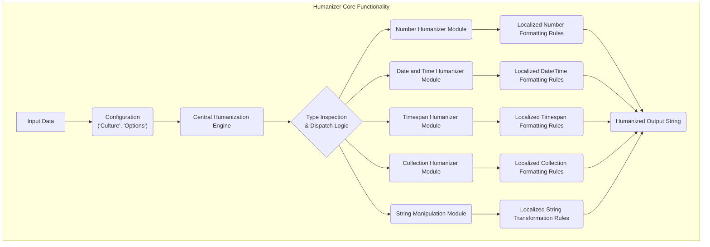
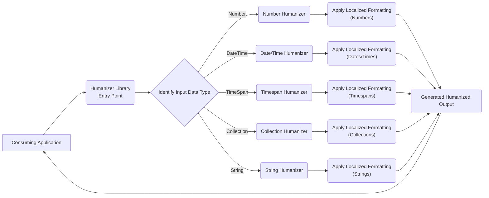

# Project Design Document: Humanizer Library

**Version:** 1.1
**Date:** October 26, 2023
**Authors:** AI Software Architect

## 1. Introduction

This document provides an enhanced design overview of the Humanizer library, a .NET library designed to improve code readability by transforming machine-oriented data into human-friendly formats. This detailed design serves as a crucial artifact for subsequent threat modeling, enabling a comprehensive understanding of the library's architecture, data flow, and key components from a security perspective.

## 2. Goals

The core objectives of the Humanizer library are:

*   To offer a fluent and intuitive Application Programming Interface (API) for seamless conversion of diverse data types into human-readable representations.
*   To provide extensive support for a wide array of data types, encompassing numerical values, dates, timespans, and collections.
*   To facilitate easy extension and customization to accommodate various languages and cultural contexts through robust localization mechanisms.
*   To ensure high performance and efficiency for utilization across diverse application scenarios, minimizing overhead.
*   To maintain a high standard of reliability through comprehensive testing and adherence to best practices.

## 3. System Architecture

The Humanizer library employs a modular architecture, with distinct components dedicated to handling specific types of humanization. The library's core provides an extensible framework that allows for the addition of new humanization capabilities.

*   **Input Data:** Represents the data submitted for humanization (e.g., an integer, a `DateTime` object, a string).
*   **Configuration ('Culture', 'Options'):** Settings that govern the humanization process, including the target culture (language and regional settings) and specific formatting preferences.
*   **Central Humanization Engine:** The primary component responsible for managing and coordinating the overall humanization workflow.
*   **Type Inspection & Dispatch Logic:**  Analyzes the data type of the input and directs it to the appropriate specialized humanizer module.
*   **Number Humanizer Module:**  Dedicated to the humanization of numeric values (e.g., converting `1000` to "one thousand").
*   **Date and Time Humanizer Module:** Handles the conversion of date and time values into human-friendly formats (e.g., converting a specific date to "yesterday").
*   **Timespan Humanizer Module:**  Manages the humanization of time intervals (e.g., converting a `TimeSpan` to "5 hours").
*   **Collection Humanizer Module:**  Responsible for the humanization of collections of data (e.g., converting a list of items to a comma-separated string).
*   **String Manipulation Module:** Provides functionalities for transforming strings into more human-readable forms (e.g., converting "PascalCase" to "Pascal Case").
*   **Localized Formatting Rules:** Sub-components within each specific humanizer module that implement culture-specific formatting conventions.
*   **Humanized Output String:** The final human-readable representation of the input data, ready for use by the consuming application.

## 4. Data Flow

The typical data flow within the Humanizer library proceeds as follows:

1. **Input Reception:** The consuming application provides the data intended for humanization to the Humanizer library, potentially along with configuration settings (culture, specific options).
2. **Type Determination:** The Central Humanization Engine inspects the data type of the received input.
3. **Module Routing:** Based on the determined data type, the engine routes the data to the corresponding specialized humanizer module (e.g., the Number Humanizer Module for integer inputs).
4. **Processing and Formatting:** The designated humanizer module applies its specific logic to transform the input data into a human-readable format, taking into account the provided configuration and utilizing relevant localized formatting rules.
5. **Output Generation:** The humanizer module generates the final humanized string representation of the input data.
6. **Return to Application:** The generated humanized string is returned to the calling application for display or further processing.

## 5. Key Components

*   **Central Humanization Engine:**
    *   Serves as the primary entry point for humanization requests.
    *   Manages the overall configuration and settings of the library.
    *   Implements the logic for detecting input types and dispatching to appropriate modules.
    *   Provides extension points for incorporating new humanization capabilities.
*   **Number Humanizer Module:**
    *   Responsible for converting numeric values into their word equivalents (e.g., `123` becomes "one hundred and twenty-three").
    *   Supports the generation of ordinal numbers (e.g., `1st` becomes "first").
    *   Handles the application of metric prefixes (e.g., `1000` meters becomes "1 kilometer").
    *   Utilizes localized rules for number formatting based on the specified culture.
*   **Date and Time Humanizer Module:**
    *   Converts `DateTime` objects into relative, human-understandable phrases (e.g., "yesterday", "in 5 minutes").
    *   Offers various levels of detail and granularity in the output format.
    *   Applies localized formatting conventions for dates and times.
*   **Timespan Humanizer Module:**
    *   Transforms `TimeSpan` objects into human-readable durations (e.g., "1 hour 30 minutes").
    *   Allows for customization of the output format to suit different contexts.
    *   Leverages localized formatting for timespan representations.
*   **Collection Humanizer Module:**
    *   Formats collections of items into grammatically correct and readable strings (e.g., "apple, banana, and cherry").
    *   Supports different types of collections, including lists and arrays.
    *   Applies localized rules for collection formatting, such as the appropriate conjunction.
*   **String Manipulation Module:**
    *   Provides a set of methods for transforming strings to enhance readability (e.g., converting "PascalCase" to "Pascal Case", "underscore_case" to "underscore case").
    *   Includes functionalities for title casing and sentence casing.
    *   Applies localized rules for string transformations where applicable.
*   **Localization Infrastructure:**
    *   Manages culture-specific data, including translated strings and formatting rules.
    *   Provides mechanisms for adding and managing support for different cultures.
    *   Typically relies on resource files (e.g., `.resx` files in .NET) to store localized data.

## 6. Dependencies

The Humanizer library relies on the following dependencies:

*   **.NET Standard Library:** Provides fundamental functionalities and abstractions required by the library.
*   **Potentially third-party localization libraries:**  May be used to enhance or extend the built-in localization capabilities. The specific libraries would be listed in the project's dependency manifest.

A comprehensive list of dependencies, including specific versions, is crucial for vulnerability analysis and can be found in the project's `csproj` file or the relevant dependency management tool configuration.

## 7. Deployment Considerations

The Humanizer library is distributed as a NuGet package and is typically integrated into other .NET applications as a dependency. The deployment of Humanizer is inherently tied to the deployment process of the consuming application. No dedicated deployment infrastructure is required for the Humanizer library itself. It's important to note that the security posture of the consuming application directly impacts the overall security when using Humanizer.

## 8. Security Considerations (Pre-Threat Modeling)

While Humanizer's primary function is data presentation, several security considerations are relevant:

*   **Input Handling by Consuming Application:** Humanizer relies on the consuming application to provide valid and safe input. Insufficient input validation or sanitization *before* data reaches Humanizer could lead to unexpected behavior or vulnerabilities if malicious data is processed. For example, extremely large numbers or specially crafted strings could potentially cause resource exhaustion.
*   **Localization Resource Integrity:** The integrity and authenticity of localization resources are critical. If these resources (e.g., `.resx` files) are compromised or sourced from untrusted locations, attackers could inject malicious content into the output strings, potentially leading to Cross-Site Scripting (XSS) vulnerabilities if the output is used in a web context without proper encoding.
*   **Regular Expression Denial of Service (ReDoS):** Certain humanization logic, particularly within the String Manipulation Module, might utilize regular expressions. Carefully crafted input strings could exploit inefficient regular expressions, leading to excessive backtracking and causing a denial-of-service condition.
*   **Dependency Vulnerabilities:**  Like any software project, Humanizer depends on other libraries. Known vulnerabilities in these dependencies could introduce security risks. Regularly auditing and updating dependencies to their latest secure versions is essential. Knowing the specific versions of dependencies is crucial for identifying potential vulnerabilities.
*   **Culture-Specific Formatting Exploits:** While less common, vulnerabilities could arise from the improper handling of culture-specific formatting rules. For instance, if a culture's number formatting rules allow for unexpected characters or patterns, this could potentially be exploited if not handled carefully by the consuming application.
*   **Information Disclosure through Error Handling:**  Verbose error messages or stack traces generated by Humanizer (or its dependencies) could inadvertently disclose sensitive information about the application's internal workings if not properly handled in production environments.

## 9. Future Considerations

Potential future developments for the Humanizer library include:

*   **Enhanced Language and Culture Support:** Expanding the range of supported languages and cultural contexts to reach a broader audience.
*   **More Granular Customization Options:** Providing developers with finer-grained control over the humanization process and output formats.
*   **Performance Optimizations:** Continuously improving the efficiency and performance of humanization algorithms to minimize resource consumption.
*   **Improved Extensibility:** Making it even easier for developers to extend the library with custom humanization logic.
*   **Integration with Modern Frameworks:**  Ensuring seamless integration with the latest .NET frameworks and related technologies.

This enhanced design document provides a more detailed and security-conscious overview of the Humanizer library's architecture and components. This information is intended to be a valuable resource for conducting a thorough threat model, enabling the identification of potential security vulnerabilities and the implementation of appropriate mitigation strategies.