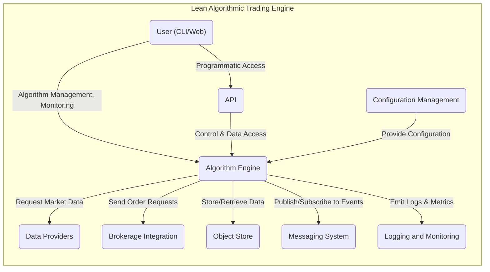
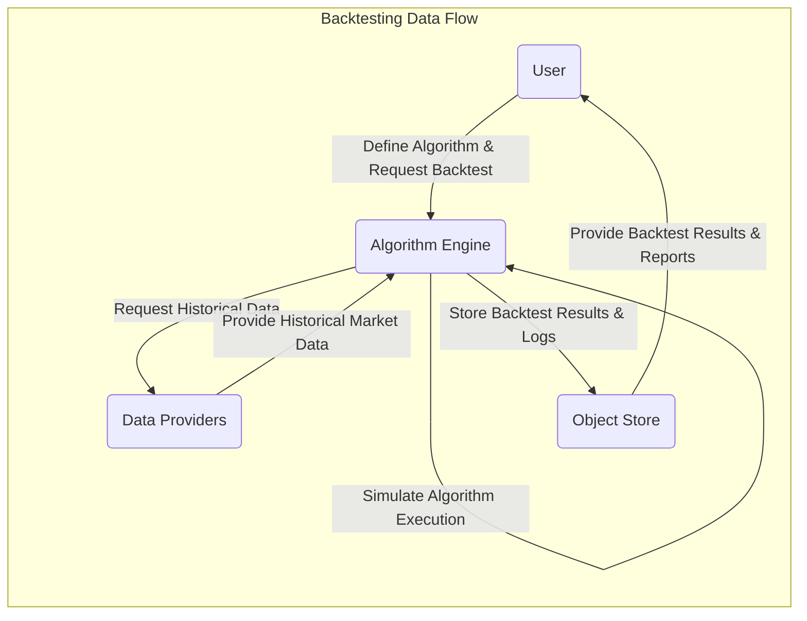
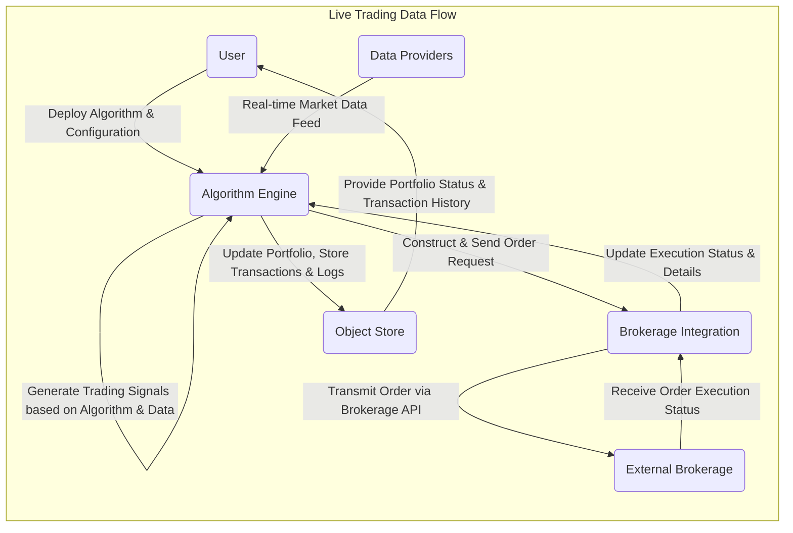

# Project Design Document: Lean Algorithmic Trading Engine

**Version:** 1.1
**Date:** October 26, 2023
**Prepared By:** Gemini AI (Expert in Software, Cloud, and Cybersecurity Architecture)

## 1. Introduction

This document provides a detailed architectural design of the Lean Algorithmic Trading Engine project, as found on GitHub at [https://github.com/QuantConnect/Lean](https://github.com/QuantConnect/Lean). This document aims to serve as a robust foundation for subsequent threat modeling activities. It meticulously outlines the key components, data flows, and interactions within the Lean system, providing a comprehensive understanding of its structure.

### 1.1. Purpose

The primary purpose of this document is to furnish a comprehensive and unambiguous understanding of the Lean architecture specifically for security analysis and threat modeling. It will serve as the definitive reference point for identifying potential vulnerabilities, attack vectors, and security weaknesses within the system.

### 1.2. Scope

This document encompasses the core architectural components of the Lean engine, including its diverse data sources, intricate processing units, and various external integrations. It maintains a focus on the logical architecture and crucial interactions, delivering sufficient granularity for thorough security assessment.

### 1.3. Target Audience

This document is specifically intended for:

* Security engineers and analysts tasked with performing threat modeling, vulnerability assessments, and penetration testing.
* Developers actively contributing to the Lean project, requiring a deep understanding of the overall architecture and inherent security considerations.
* Operations teams responsible for the deployment, maintenance, and monitoring of the Lean platform in various environments.

## 2. System Overview

Lean is a versatile open-source algorithmic trading engine engineered for both rigorous backtesting and seamless live trading execution. It boasts support for multiple programming languages, notably C# and Python, and offers extensive integration capabilities with a wide array of data providers and brokerage platforms. The fundamental functionality revolves around the creation of trading algorithms, the simulation of their performance against historical market data, and the automated execution of trades in live financial markets.

## 3. Architectural Design

The Lean architecture can be logically decomposed into the following essential components:

* **Algorithm Engine:** This is the central processing unit, responsible for the execution of user-defined trading algorithms. It manages the lifecycle of algorithms, including initialization, data processing, signal generation, and order management.
* **Data Providers:** These are external services or local data sources that furnish the system with essential market data. This includes historical and real-time price feeds, volume data, and potentially fundamental data. Examples include IQFeed, Polygon.io, and brokerage-provided data streams.
* **Brokerage Integration:** These are specialized modules that facilitate secure and reliable communication and order placement with various external brokerage platforms. They handle API interactions, authentication, order routing, and execution status updates. Examples include Interactive Brokers, Alpaca, and paper trading simulators.
* **Object Store:** This component provides persistent storage for various types of data. It's used for storing and retrieving backtest results, the current state of running algorithms, configuration settings, and system logs. This could be a file system, a database, or a cloud storage service.
* **Messaging System:** This facilitates asynchronous communication between different components within the Lean ecosystem. It enables decoupled interactions for tasks like distributing workloads, broadcasting events, and managing inter-process communication.
* **User Interface (CLI/Web):** This provides the means for users to interact with the Lean system. The CLI offers command-line access for scripting and automation, while the Web UI provides a graphical interface for managing algorithms, viewing results, and monitoring performance.
* **API:** This offers programmatic access to Lean's core functionalities, allowing external applications and services to interact with the engine for tasks like algorithm management, data retrieval, and monitoring.
* **Configuration Management:** This component is responsible for loading, managing, and providing access to system-wide and algorithm-specific configuration parameters. It ensures consistent behavior and allows for easy customization.
* **Logging and Monitoring:** This critical component collects, aggregates, and displays system logs, performance metrics, and error information. It provides insights into the system's health, performance, and potential issues.

### 3.1. High-Level Architecture Diagram

## 4. Data Flow

The following details the typical data flow patterns within the Lean system for both backtesting and live trading scenarios:

* **Algorithm Definition:** Users develop trading algorithms by writing code in supported programming languages (C# or Python). This code defines the trading logic, risk management rules, and order execution strategies.
* **Backtesting:**
    * The Algorithm Engine initiates a backtest by requesting historical market data for a specified period and set of securities from configured Data Providers.
    * The Algorithm Engine simulates the execution of the user's algorithm step-by-step using the retrieved historical data, mimicking real-time market conditions.
    * Throughout the simulation, trading decisions, order placements, and resulting performance metrics (e.g., profit/loss, drawdown) are meticulously recorded and subsequently stored in the Object Store.
* **Live Trading:**
    * The Algorithm Engine establishes real-time connections with subscribed Data Providers to receive live market data feeds, including price updates, volume information, and potentially order book data.
    * Based on the algorithm's defined logic and the incoming real-time market data, the Algorithm Engine generates trading signals indicating when and what to buy or sell.
    * These trading signals are then translated into specific order requests (e.g., buy X shares of symbol Y at market price) and securely transmitted to the appropriate Brokerage Integration modules.
    * The Brokerage Integration modules handle the communication with external brokerage platforms, securely authenticating and submitting the order requests.
    * The Brokerage Integration modules continuously monitor the status of submitted orders, receiving updates on execution status (e.g., pending, filled, rejected) from the brokerage platforms.
    * Upon order execution, the Brokerage Integration modules relay the transaction details (e.g., price, quantity, fees) back to the Algorithm Engine.
    * The Algorithm Engine updates its internal state, including portfolio holdings and cash balance, and persists transaction details and portfolio updates in the Object Store.
* **Data Storage and Retrieval:** The Object Store serves as the central repository for persistent data:
    * Historical market data retrieved from Data Providers (potentially cached for performance).
    * Comprehensive backtest results, including detailed trade logs, performance reports, and visualizations.
    * Algorithm configurations, including parameters, settings, and deployed versions.
    * The current state of running algorithms, allowing for persistence and potential recovery.
    * System logs, audit trails, and error information for debugging and monitoring.
* **Communication:** The Messaging System facilitates asynchronous communication for various operational tasks:
    * Distributing backtesting or live trading workloads across multiple instances of the Algorithm Engine for scalability.
    * Broadcasting real-time market data events or system-level notifications to interested components.

### 4.1. Data Flow Diagram (Backtesting)

### 4.2. Data Flow Diagram (Live Trading)

## 5. Key Interactions

This section elaborates on critical interactions between components, highlighting the data exchanged and the purpose of the interaction:

* **User Authentication and Authorization:** Users interacting through the CLI or Web UI are required to authenticate their identity (e.g., using username/password, API keys). Upon successful authentication, the system verifies their authorization level to control access to specific functionalities and data.
* **Algorithm Deployment:** Users deploy their trading algorithms to the Algorithm Engine by uploading their code and associated configuration files. This process involves validating the code, loading necessary dependencies, and configuring the algorithm's parameters.
* **Data Subscription:** The Algorithm Engine subscribes to specific market data feeds from configured Data Providers. This involves specifying the securities, data types (e.g., trades, quotes, bars), and update frequencies required by the running algorithms.
* **Order Placement:** When an algorithm generates a trading signal, the Algorithm Engine constructs a detailed order request (specifying symbol, quantity, order type, price, etc.) and securely transmits it to the appropriate Brokerage Integration module.
* **Order Execution Updates:** Brokerage Integration modules continuously listen for and receive order execution updates from the external brokerage platforms. These updates provide real-time information on the status of submitted orders (e.g., pending, partially filled, fully filled, cancelled, rejected).
* **Data Storage and Retrieval:** Components interact with the Object Store using well-defined APIs to store and retrieve various types of data. For example, the Algorithm Engine stores backtest results, and the Web UI retrieves this data for visualization.
* **Configuration Loading:** The Algorithm Engine and other components load their operational configurations from the Configuration Management system at startup and potentially during runtime. This ensures consistent behavior and allows for dynamic updates.
* **Logging and Monitoring Data Collection:** Various components throughout the Lean system generate log messages (detailing events, errors, and informational messages) and performance metrics (e.g., CPU usage, memory consumption, network activity). This data is sent to the Logging and Monitoring system for aggregation, analysis, and alerting.

## 6. Security Considerations (Initial)

This section provides an initial overview of potential security considerations relevant to the Lean architecture. A more detailed threat model will delve deeper into these areas.

* **Authentication and Authorization:**
    * Securely managing user credentials and API keys to prevent unauthorized access to the system and sensitive data.
    * Implementing robust authorization mechanisms to enforce granular access control based on user roles and permissions.
* **Data Security:**
    * Encrypting sensitive data at rest (e.g., API keys, brokerage credentials, algorithm code) within the Object Store.
    * Ensuring secure communication channels (e.g., using TLS/SSL) for all network traffic, especially when interacting with external Data Providers and Brokerage platforms.
    * Protecting the confidentiality and integrity of trading algorithms to prevent unauthorized modification or disclosure.
* **Input Validation:**
    * Rigorously validating all inputs, particularly from user-defined algorithms and external data sources, to prevent common injection attacks (e.g., SQL injection, code injection).
    * Implementing sanitization and encoding techniques to neutralize potentially malicious input.
* **Secure Communication:**
    * Enforcing the use of secure protocols (e.g., HTTPS, SSH) for all communication between components and with external services.
    * Properly configuring TLS/SSL certificates and ensuring their regular renewal.
* **Dependency Management:**
    * Maintaining a comprehensive inventory of all software dependencies and regularly scanning for known vulnerabilities.
    * Implementing a process for promptly patching or updating vulnerable dependencies.
* **Code Security:**
    * Adhering to secure coding practices throughout the development lifecycle to minimize the introduction of vulnerabilities.
    * Conducting regular code reviews and security audits to identify and remediate potential security flaws.
* **Rate Limiting and Throttling:**
    * Implementing rate limiting and throttling mechanisms to protect against denial-of-service attacks and abuse of API endpoints.
* **Auditing and Logging:**
    * Maintaining comprehensive audit logs that record significant events, user actions, and system activities for security monitoring, incident response, and forensic analysis.
    * Securely storing and managing audit logs to prevent tampering or unauthorized deletion.
* **Secrets Management:**
    * Employing secure secrets management solutions (e.g., HashiCorp Vault, AWS Secrets Manager) to store and manage sensitive credentials and API keys, avoiding hardcoding secrets in configuration files or code.

## 7. Technologies Used (Illustrative)

This is a non-exhaustive list illustrating potential technologies used within the Lean project:

* **Programming Languages:** C#, Python
* **Data Storage:**
    * Relational Databases: PostgreSQL, MySQL
    * NoSQL Databases: MongoDB, Redis
    * Cloud Storage: AWS S3, Azure Blob Storage, Google Cloud Storage
    * File Systems
* **Messaging Systems:**
    * Message Brokers: RabbitMQ, Apache Kafka
    * Cloud-based Messaging: AWS SQS, Azure Service Bus, Google Cloud Pub/Sub
* **Web Frameworks:**
    * Backend: ASP.NET Core, Flask, Django
    * Frontend: React, Angular, Vue.js
* **Cloud Platforms (Optional):** AWS, Azure, GCP
* **Containerization (Optional):** Docker, Kubernetes
* **Orchestration (Optional):** Kubernetes, Docker Swarm
* **Logging and Monitoring:**
    * Logging Frameworks: Serilog, Log4net
    * Monitoring Tools: Prometheus, Grafana, ELK Stack (Elasticsearch, Logstash, Kibana)

## 8. Deployment Model (Illustrative)

Lean offers flexibility in its deployment options, each with its own security implications:

* **Local Machine:** Primarily used for development, testing, and experimentation. Security relies heavily on the security posture of the local operating system and user practices.
* **On-Premise Servers:** Deployed on infrastructure managed by the user. This provides greater control over the environment but requires the user to manage all aspects of security, including physical security, network security, and system hardening.
* **Cloud-Based Deployment:** Deployed on cloud platforms (e.g., AWS, Azure, GCP) leveraging virtual machines, containers, or serverless functions. Security becomes a shared responsibility between the user and the cloud provider. Users need to configure cloud security services appropriately (e.g., firewalls, identity and access management).

## 9. Future Considerations

Potential future developments that could influence the architecture and security landscape of Lean include:

* **Enhanced API Functionality:** Expanding the API to offer more granular control and access to internal functionalities, requiring careful consideration of authentication and authorization.
* **Integration with More Brokers and Data Providers:** Increasing the attack surface by introducing new external dependencies and requiring secure integration patterns.
* **Improved User Interface:** Developing a more sophisticated user interface, potentially introducing new client-side vulnerabilities.
* **Scalability and Performance Enhancements:** Optimizing the engine for handling larger datasets and higher trading volumes, potentially involving distributed computing and requiring secure inter-process communication.
* **Advanced Analytics and Machine Learning Integration:** Incorporating machine learning models and analytical tools, introducing new data processing pipelines and potential vulnerabilities related to model security and data integrity.

This document provides a comprehensive architectural design of the Lean Algorithmic Trading Engine, serving as a vital resource for conducting thorough threat modeling and security assessments to proactively identify and mitigate potential security risks.