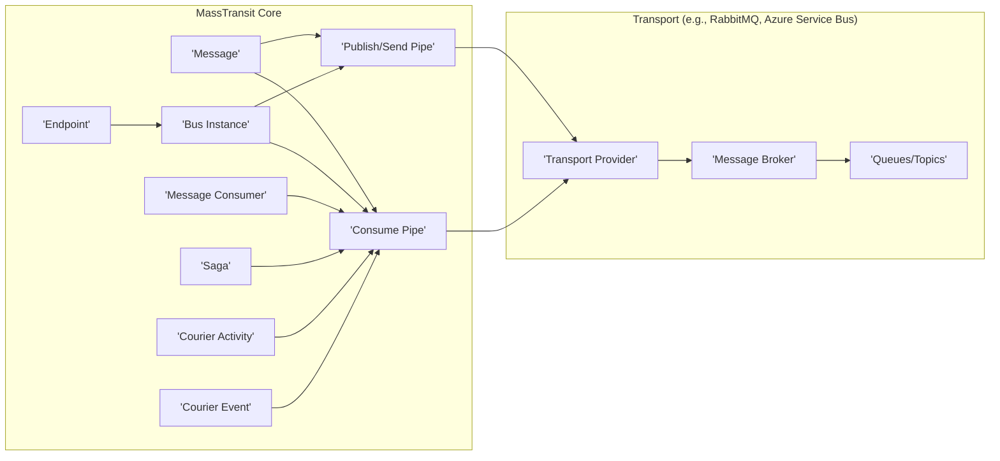
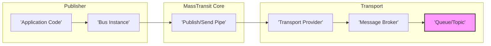
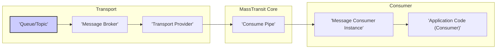

# Project Design Document: MassTransit

**Version:** 1.1
**Date:** October 26, 2023
**Author:** AI Software Architect

## 1. Introduction

This document provides a detailed architectural design of the MassTransit project, an open-source distributed application framework for .NET. It focuses on the core components, their interactions, and key architectural decisions relevant for understanding the system's structure and potential security vulnerabilities. This document will serve as the foundation for subsequent threat modeling activities. This revision includes clarifications and more detail based on initial review.

## 2. Goals and Objectives

The primary goals of MassTransit are to:

* Simplify the development of message-based applications.
* Provide a consistent abstraction over various message transport technologies, shielding developers from transport-specific complexities.
* Offer features for reliable message delivery, including configurable retry mechanisms, dead-letter queues, and message redelivery.
* Support various message exchange patterns, such as publish/subscribe, point-to-point messaging (send), and request/response.
* Enable testability and maintainability of message-based systems through features like in-memory transport and test harnesses.

## 3. Architectural Overview

MassTransit adopts a layered architecture with a strong emphasis on decoupling application logic from the underlying message transport. The core concepts revolve around the idea of a message bus that acts as an intermediary, facilitating communication between different parts of an application or across different services. The framework utilizes pipelines and middleware to provide extensibility and customization of message processing.

## 4. Key Components and Interactions

This section details the major components of MassTransit and how they interact to facilitate message-based communication.

### 4.1. Core Components

* **Message:** The fundamental unit of communication within MassTransit. It represents a data structure (typically a .NET class or record) that is exchanged between different parts of the system. Messages are serialized into a transport-specific format (e.g., JSON, binary).
* **Endpoint:** A logical address within the message broker for sending or receiving messages. Endpoints are associated with a specific transport and typically map to a queue or topic. MassTransit provides abstractions for managing endpoints.
* **Bus Instance:** The central orchestrator of MassTransit. It manages connections to the message transport, handles message publishing and consumption, and orchestrates the message processing pipelines. An application typically has one or more bus instances.
* **Publish/Send Pipe:** A configurable pipeline of middleware components that are executed when a message is published or sent. This pipeline allows for cross-cutting concerns to be applied, such as message transformation, routing rules, custom headers, and error handling logic for outbound messages.
* **Consume Pipe:** A configurable pipeline of middleware components that are executed when a message is received from an endpoint. This pipeline handles deserialization of the message, inbound filtering, dispatching the message to the appropriate consumer, and error handling for inbound messages.
* **Message Consumer:** A class that implements the logic to handle a specific type of message. Consumers are registered with the bus to subscribe to specific message types and process them when they arrive at the designated endpoint.
* **Saga:** A stateful, long-running process that manages a business transaction or workflow that spans multiple services or components. MassTransit provides abstractions and persistence mechanisms (e.g., Entity Framework Core, MongoDb) for implementing sagas.
* **Courier Activity:** A unit of work within a distributed saga that represents a specific operation to be performed. Activities can be compensated if the overall saga needs to be rolled back.
* **Courier Event:** An event that occurs during the execution of a Courier activity, providing insight into the progress of a distributed saga.
* **Transport Provider:** An abstraction layer that provides the specific implementation for interacting with a particular message transport (e.g., RabbitMQ, Azure Service Bus, Amazon SQS, In-Memory). This allows MassTransit to be transport-agnostic.
* **Message Broker:** The underlying messaging infrastructure that handles message routing, persistence, and delivery guarantees (e.g., RabbitMQ server, Azure Service Bus namespace, Amazon SQS service).
* **Queues/Topics:** The physical destinations within the message broker where messages are stored and routed. Queues typically support point-to-point messaging, while topics enable publish/subscribe patterns.

### 4.2. Message Flow - Publishing

1. **Application Code:** The application code initiates the publishing of a message through the `IBus.Publish<T>(message)` method, where `T` is the message type.
2. **Bus Instance:** The bus instance receives the message and passes it to the configured Publish/Send Pipe.
3. **Publish/Send Pipe:** The pipeline executes a series of middleware components. Common middleware in this pipeline includes:
    * **Message Serialization:** Converting the message object into a byte stream using a configured serializer (e.g., JSON.NET, System.Text.Json).
    * **Routing:** Determining the appropriate exchange or topic on the message broker based on the message type and configured routing rules.
    * **Message Interceptors:** Custom middleware that can modify the message or its headers before it's sent. This can be used for adding correlation IDs, timestamps, or security tokens.
    * **Outbound Message Filters:** Middleware that can conditionally prevent messages from being sent based on certain criteria.
    * **Error Handling:** Middleware to handle exceptions that occur during the publishing process.
4. **Transport Provider:** The transport provider specific to the configured message broker handles the interaction with the broker. This involves translating MassTransit's internal representation of the message into the transport's native format and sending it to the broker.
5. **Message Broker:** The message broker receives the message and routes it to the appropriate queues or topics based on its configuration (exchanges, bindings, etc.).
6. **Queue/Topic:** The message is stored in the designated queue or topic until a consumer subscribed to that endpoint is ready to process it.

### 4.3. Message Flow - Consumption

1. **Queue/Topic:** The message broker delivers a message from a queue or topic to a registered consumer. This delivery is typically push-based, where the broker pushes messages to MassTransit.
2. **Transport Provider:** The transport provider receives the message from the broker. This involves fetching messages from the broker's queues or topic subscriptions.
3. **Consume Pipe:** The bus instance's Consume Pipe processes the incoming message through a series of middleware components. Common middleware in this pipeline includes:
    * **Message Deserialization:** Converting the byte stream received from the transport back into a message object using the configured serializer.
    * **Inbound Message Filters:** Middleware that can conditionally prevent messages from being processed by consumers based on certain criteria.
    * **Message Type Dispatch:** Identifying the appropriate message consumer(s) registered to handle the specific message type.
    * **Consumer Invocation:** Creating an instance of the registered message consumer (often resolved through a dependency injection container) and invoking its message handling method.
    * **Transaction Management:** Middleware to manage transactions around message consumption, ensuring atomicity of operations.
    * **Error Handling:** Middleware to handle exceptions that occur during message deserialization or consumer processing. This often includes retry mechanisms and moving messages to error queues (dead-letter queues).
4. **Message Consumer Instance:** An instance of the registered message consumer is created (or retrieved from a dependency injection container).
5. **Application Code (Consumer):** The consumer's message handling logic (e.g., a method decorated with `IConsumer<T>`) is executed, processing the received message.

## 5. Security Considerations

MassTransit itself doesn't implement its own security mechanisms but relies heavily on the security features provided by the underlying message transport and the secure configuration of the application. Here are key security considerations:

* **Transport Security:**
    * **Encryption in Transit:**  Crucially important to ensure messages are encrypted while being transmitted between MassTransit instances and the message broker. This is typically achieved using TLS/SSL for connections to the message broker. Proper certificate management is essential.
    * **Authentication and Authorization:**  Configuring strong authentication credentials (usernames, passwords, API keys, certificates) for MassTransit to connect to the message broker. Implementing appropriate authorization rules (e.g., using ACLs or broker-specific permissions) to control which applications can publish to or consume from specific queues and topics.
* **Message Security:**
    * **Data Integrity:**  Ensuring messages are not tampered with during transit. While TLS provides transport-level integrity, message signing (e.g., using digital signatures) can provide end-to-end integrity verification, independent of the transport.
    * **Confidentiality (Encryption at Rest and in Transit):**  Protecting sensitive data within messages. This can involve encrypting message payloads before publishing. Consider using message-level encryption where only authorized consumers can decrypt the message. Ensure proper key management practices are in place.
* **Application Security:**
    * **Input Validation:**  Consumers should rigorously validate the content of incoming messages to prevent injection attacks (e.g., SQL injection if message data is used in database queries) or unexpected behavior due to malformed data.
    * **Error Handling and Information Disclosure:**  Implementing robust error handling to prevent sensitive information from being leaked in error messages, logs, or through exception details. Avoid exposing internal system details.
    * **Dependency Management:**  Regularly updating MassTransit and all its dependencies to patch known security vulnerabilities. Utilize dependency scanning tools to identify potential risks.
    * **Configuration Management:**  Securely storing and managing connection strings, API keys, and other sensitive configuration data. Avoid hardcoding credentials in source code. Utilize environment variables, secure configuration providers (e.g., Azure Key Vault, HashiCorp Vault), or encrypted configuration files.
* **Saga Security:**
    * **State Management Security:**  If sagas persist state, ensure the persistence mechanism (database, etc.) is secure and access is strictly controlled. Encrypt sensitive data stored within saga state.
    * **Idempotency:**  Designing consumers and saga state transitions to be idempotent, meaning processing the same message multiple times has the same effect as processing it once. This is crucial for handling retries and preventing unintended side effects.
* **Deployment Security:**
    * **Network Segmentation:**  Isolating the message broker and MassTransit instances within secure network segments to limit the impact of potential breaches.
    * **Access Control:**  Restricting access to the message broker and related infrastructure based on the principle of least privilege.
    * **Secure Logging:**  Implementing secure logging practices, ensuring logs do not contain sensitive information and are protected from unauthorized access.

## 6. Deployment Considerations

MassTransit's deployment is closely tied to the deployment of the chosen message broker. Common deployment scenarios include:

* **On-Premises:**  Deploying MassTransit applications alongside the message broker on local infrastructure. This requires managing the message broker infrastructure.
* **Cloud Environments:**  Leveraging cloud-based managed message broker services like Azure Service Bus, Amazon SQS, or managed RabbitMQ offerings. This simplifies infrastructure management.
* **Containerized Environments (e.g., Docker, Kubernetes):**  Deploying MassTransit applications as containerized services, offering scalability, portability, and easier management through orchestration platforms.
* **Serverless Environments:**  Integrating MassTransit with serverless functions or services, often using transport providers that support serverless deployments.

Key deployment considerations include:

* **Message Broker Selection:** Carefully choosing the appropriate message broker based on factors like scalability requirements, reliability needs, security features, cost, and existing infrastructure.
* **Endpoint Configuration:**  Properly configuring queues and topics on the message broker, including settings for durability (ensuring messages survive broker restarts), message time-to-live (preventing messages from lingering indefinitely), dead-letter queues (for handling messages that cannot be processed), and message size limits.
* **Scalability and High Availability:**  Designing the system to handle increasing message volumes and ensure continuous availability. This may involve scaling out consumers, configuring message broker clusters, and implementing load balancing.
* **Monitoring and Logging:**  Implementing comprehensive monitoring and logging to track message flow, identify errors, monitor performance, and ensure the overall health of the message-based system. Utilize tools to monitor queue lengths, message processing times, and error rates.
* **Disaster Recovery:**  Planning for disaster recovery scenarios, including backups of message broker configurations and message data, and strategies for failover to secondary message broker instances.

## 7. Future Considerations

Potential future enhancements or areas for further development in MassTransit could include:

* **Enhanced Observability:**  Deeper integration with tracing and metrics platforms (e.g., OpenTelemetry) for more comprehensive insights into message flow and performance bottlenecks.
* **Improved Security Features:**  Potentially incorporating built-in support for message encryption and signing at the framework level, providing a more consistent approach across different transports.
* **More Flexible Middleware:**  Expanding the capabilities and configurability of the publish/send and consume pipelines to address more complex message processing scenarios.
* **Integration with Serverless Platforms:**  Further optimizing MassTransit for seamless integration with various serverless compute platforms and event sources.
* **Standardized Error Handling Patterns:**  Providing more standardized and configurable patterns for handling message processing errors and retries.

This revised document provides a more detailed and comprehensive overview of the MassTransit architecture, with a continued focus on aspects relevant for threat modeling. The enhanced component descriptions, more detailed message flow explanations, and expanded security considerations should provide a stronger foundation for identifying potential vulnerabilities and designing effective mitigation strategies.
