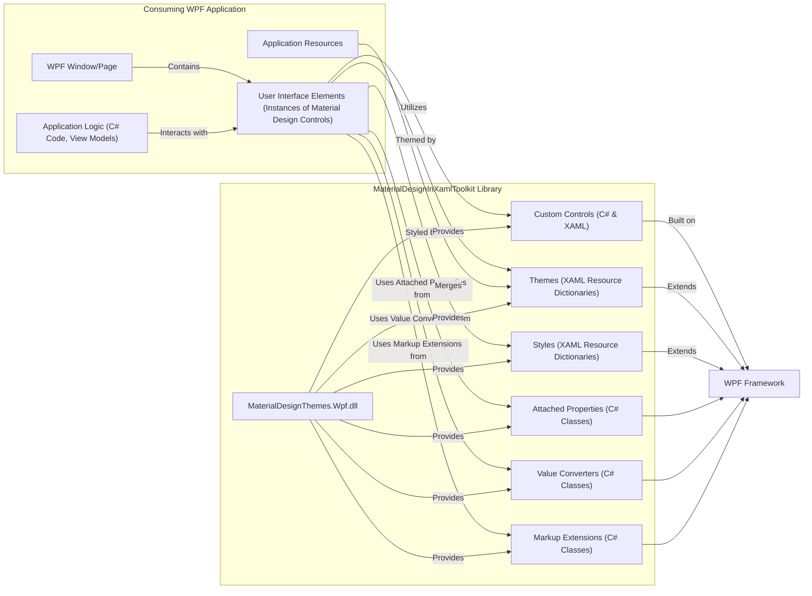
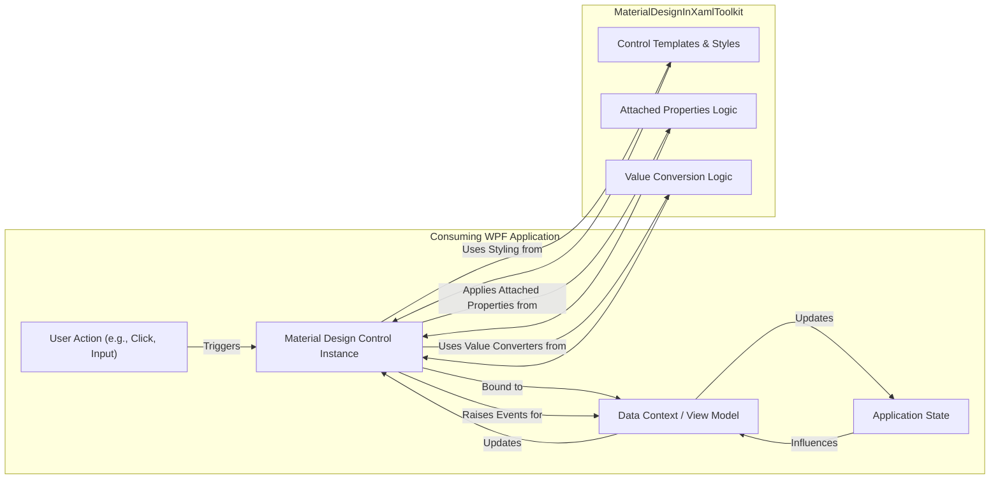

# Project Design Document: MaterialDesignInXamlToolkit

**Version:** 1.1
**Date:** October 26, 2023
**Author:** AI Software Architect

## 1. Introduction

This document provides an enhanced design overview of the MaterialDesignInXamlToolkit project. This open-source toolkit empowers developers to integrate Google's Material Design principles into their WPF (Windows Presentation Foundation) applications. The primary purpose of this document is to serve as a robust foundation for subsequent threat modeling activities, offering a detailed understanding of the toolkit's structure and interactions.

## 2. Goals and Scope

The central goal of this document is to furnish a clear, comprehensive, and technically accurate description of the MaterialDesignInXamlToolkit's architecture and functionality. This detailed overview is specifically intended to facilitate effective and targeted threat modeling. The scope of this document encompasses:

*   A detailed explanation of the toolkit's purpose and the problems it solves for WPF developers.
*   In-depth identification and description of key architectural components and their relationships.
*   A thorough description of the data flow within the toolkit and the communication pathways between the toolkit and consuming applications.
*   An expanded initial identification of potential security considerations, providing context for threat assessment.

This document explicitly excludes:

*   Granular details of code implementation within the toolkit.
*   Specific threat analysis outcomes or detailed vulnerability assessments.
*   Concrete mitigation strategies or security controls to address identified threats.

## 3. Overview

The MaterialDesignInXamlToolkit is a client-side library designed for WPF developers seeking to implement the Material Design visual language in their desktop applications. It provides a rich set of pre-built UI controls, styles, and theming capabilities that adhere to Google's Material Design specifications. By integrating this toolkit, developers can create modern, visually consistent, and user-friendly WPF applications without needing to implement the design system from scratch. The toolkit is distributed as a set of libraries that are included in a consuming WPF application project.

## 4. Architecture

The toolkit's architecture is centered around extending the existing WPF framework with Material Design concepts. It operates entirely within the client-side context of a consuming WPF application. Key components include:

*   **Core Library (`MaterialDesignThemes.Wpf.dll`):** The primary assembly containing the core logic, custom controls' code-behind, attached properties, converters, and markup extensions. This is the essential component that developers reference in their projects.
*   **Themes (XAML Resource Dictionaries):** A collection of XAML files defining the visual aesthetics of the controls. These dictionaries specify colors, typography, corner radii, and other visual attributes. Multiple themes (e.g., light and dark) are provided and can be customized or extended by developers.
*   **Custom Controls (C# and XAML):**  A suite of WPF controls built from the ground up or derived from standard WPF controls, styled and enhanced to embody Material Design principles. Examples include `Button`, `TextBox`, `CheckBox`, `Card`, `DialogHost`, and `Drawer`. These controls offer extended functionality and a distinct visual appearance.
*   **Styles (XAML Resource Dictionaries):** XAML styles that define the default appearance and behavior of the custom controls. These styles are often implicitly applied based on the control type and theme, ensuring consistency.
*   **Attached Properties (C#):** Static properties that can be attached to any WPF dependency object, allowing for the modification of their behavior or appearance in line with Material Design. For instance, properties controlling elevation or ripple effects.
*   **Value Converters (C#):** Classes implementing the `IValueConverter` interface, used to transform data for display purposes within the controls. This is crucial for data binding scenarios, ensuring data is presented according to Material Design specifications.
*   **Markup Extensions (C#):** Classes that simplify XAML markup by providing a shorthand way to reference resources or perform logic within the XAML. These are used to streamline the application of themes and styles.
*   **Demo Application (`MaterialDesignDemo`):** A separate WPF application serving as a showcase and testing ground for the toolkit's features. While not a core library component, it demonstrates usage patterns and helps developers understand the toolkit's capabilities.

## 5. Data Flow

The data flow within a WPF application utilizing the MaterialDesignInXamlToolkit revolves around the rendering and interaction with UI elements, driven by data binding and event handling.

*   **Resource Loading:** When a consuming WPF application starts, the XAML resource dictionaries containing the toolkit's themes and styles are loaded and merged into the application's resource hierarchy. This makes the toolkit's visual definitions available to the application's UI elements.
*   **Control Instantiation and Styling:** Developers declare instances of the toolkit's custom controls within their XAML markup. The WPF framework automatically applies the relevant styles and templates defined in the toolkit's resources to these control instances, shaping their visual appearance according to the selected theme.
*   **Data Binding:**  A core WPF concept, data binding connects properties of the Material Design controls to data sources within the application (typically view models). When the data source changes, the bound control properties are updated, and the UI reflects these changes. Similarly, user interactions with controls can update the underlying data source. Value converters from the toolkit are often used within data bindings to format or transform data for display.
*   **User Interaction and Event Handling:** When a user interacts with a Material Design control (e.g., clicking a button, toggling a switch, entering text), events are raised by the control. The consuming application's code subscribes to these events and executes logic in response, potentially updating application state or triggering other actions.
*   **Visual Updates via Attached Properties:** Attached properties provided by the toolkit can dynamically alter the appearance or behavior of controls based on data or application state. For example, the elevation of a card can be bound to a property, changing its shadow dynamically.

## 6. Security Considerations

While the MaterialDesignInXamlToolkit is a client-side UI library and doesn't inherently handle sensitive data transmission or server-side logic, several security considerations are important for developers using the toolkit:

*   **Cross-Site Scripting (XSS) via Data Binding:** If a consuming application binds user-provided, unsanitized data directly to properties of Material Design controls that render HTML or interpret script (though less common in standard WPF controls, potential exists in custom implementations or future extensions), it could create XSS vulnerabilities. Malicious scripts could be injected and executed within the application's context.
*   **Information Disclosure through UI Elements:** Improper use of Material Design controls could inadvertently expose sensitive information. For example, displaying detailed error messages containing internal system details or personally identifiable information within a `Snackbar` or `Dialog`.
*   **Denial of Service (DoS) through Resource Exhaustion:** While less likely, excessively complex or deeply nested styles and templates within the toolkit, or misuse by developers creating overly complex UIs, could potentially lead to performance degradation or resource exhaustion, causing the application to become unresponsive.
*   **Vulnerabilities in Toolkit Code:** Bugs or security flaws within the MaterialDesignInXamlToolkit's code itself could be exploited. This includes potential vulnerabilities in custom control logic, attached property implementations, or value converters. Open-source nature allows for community scrutiny but also potential for publicly known vulnerabilities.
*   **Dependency Chain Vulnerabilities:** The toolkit relies on the underlying WPF framework and potentially other NuGet packages. Vulnerabilities in these dependencies could indirectly impact applications using the toolkit. Developers should ensure they are using updated and patched versions of all dependencies.
*   **Malicious Customizations:** If developers create custom controls or styles based on the toolkit without proper security considerations, they could introduce vulnerabilities. For example, a custom control might not properly sanitize user input.
*   **Clickjacking:** While primarily a web vulnerability, if a WPF application embeds web content or uses browser controls styled with the toolkit, there's a potential risk of clickjacking if not handled carefully.
*   **Insecure Handling of User Input:**  Material Design controls often handle user input. If the consuming application doesn't properly validate and sanitize this input before processing it, vulnerabilities like injection attacks (though less direct than in web applications) could arise in the application's logic.

## 7. Future Considerations

As the MaterialDesignInXamlToolkit continues to evolve, potential new features and functionalities could introduce new security considerations:

*   **More Complex Control Interactions:** Introduction of controls with more intricate interactions or data handling might present new attack surfaces if not designed with security in mind.
*   **Advanced Theming Capabilities:** More sophisticated theming mechanisms could introduce vulnerabilities if they allow for the execution of arbitrary code or the injection of malicious content.
*   **Integration with External Services:** If future versions of the toolkit provide features that directly interact with external services or APIs, new security considerations related to authentication, authorization, and data transmission would arise.
*   **Accessibility Enhancements:** While crucial, the implementation of advanced accessibility features should be reviewed for potential unintended security implications.

## 8. Conclusion

This enhanced design document provides a more detailed and nuanced understanding of the MaterialDesignInXamlToolkit's architecture, data flow, and potential security considerations. This information is essential for conducting a comprehensive threat modeling exercise to proactively identify and mitigate potential security risks associated with the toolkit and its integration into WPF applications. The expanded security considerations section offers a more concrete starting point for in-depth security analysis.