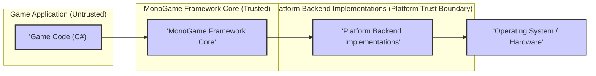
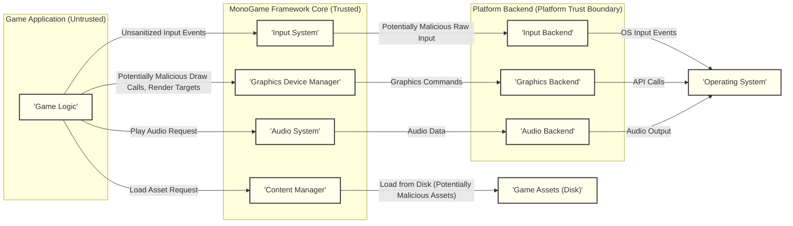

# Project Design Document: MonoGame Framework

**Version:** 1.1
**Date:** October 26, 2023
**Author:** AI Software Architect

## 1. Introduction

This document provides a detailed architectural design of the MonoGame framework, intended for use in subsequent threat modeling activities. It offers a comprehensive understanding of the system's components, their interactions, and data flow, with a particular focus on security-relevant aspects.

MonoGame is an open-source, cross-platform game development framework. It provides a set of APIs that closely mirror Microsoft's XNA Framework 4.0, enabling developers to create games for various platforms using C# and .NET. This document emphasizes the architectural elements relevant to identifying potential security vulnerabilities.

## 2. Goals and Objectives

The primary goals of this design document are:

*   Clearly articulate the architecture of the MonoGame framework, emphasizing security-relevant components and interactions.
*   Identify key components and their responsibilities, highlighting potential trust boundaries and attack surfaces.
*   Describe the data flow within the framework, focusing on the movement of potentially sensitive data and interaction points.
*   Provide a solid foundation for identifying potential security threats and vulnerabilities using methodologies like STRIDE.
*   Serve as a reference for developers, security analysts, and anyone involved in the security assessment of MonoGame-based applications.

## 3. Architectural Overview

MonoGame employs a layered architecture, abstracting platform-specific details to offer a consistent API for game developers. The core of MonoGame manages the fundamental game loop, input handling, graphics rendering, audio playback, and content management. Platform-specific implementations are provided through backend implementations, creating clear trust boundaries.

## 4. Detailed Component Design

This section details the key components within the MonoGame framework, with a focus on their security implications.

### 4.1. MonoGame Framework Core (Trusted)

This is the central, trusted part of the framework, providing core functionalities and APIs. It acts as a boundary between the game application code and the platform-specific implementations.

*   **Game Class:**
    *   Manages the game lifecycle (initialization, update, draw, shutdown).
    *   Provides the main game loop, a critical execution path.
    *   Handles game settings and configuration, which might include sensitive information.
*   **Graphics Device Manager:**
    *   Manages the graphics device (e.g., DirectX, OpenGL, Vulkan).
    *   Handles device creation, presentation, and resource management, potentially interacting with privileged system resources.
    *   Responsible for shader management, a potential area for injection attacks.
*   **Content Manager:**
    *   Loads and manages game assets (textures, models, audio) from storage.
    *   Handles content processing and serialization, a potential point for vulnerabilities if processing malicious assets.
    *   Defines the trust boundary for game assets.
*   **Input System:**
    *   Abstracts input from various devices (keyboard, mouse, gamepad, touch).
    *   Provides a unified input API, responsible for sanitizing or validating input to prevent injection attacks.
*   **Audio System:**
    *   Manages audio playback and sound effects.
    *   Provides APIs for playing, pausing, and controlling audio, potentially interacting with audio drivers.
*   **Math Library:**
    *   Provides mathematical structures and functions (vectors, matrices, quaternions). While seemingly benign, incorrect usage can lead to vulnerabilities in game logic.
*   **Framework Classes (e.g., SpriteBatch, Model, Texture2D):**
    *   Provides high-level abstractions for common game development tasks.
    *   Simplifies rendering, drawing sprites, and managing game objects, but improper use can lead to rendering vulnerabilities.

### 4.2. Platform Backend Implementations (Platform Trust Boundary)

These components provide platform-specific implementations of the core functionalities, forming a trust boundary with the underlying operating system.

*   **Graphics Backend (e.g., DirectX, OpenGL, Vulkan):**
    *   Implements the low-level graphics rendering using the target platform's graphics API.
    *   Handles shader compilation and resource binding, directly interacting with the GPU and drivers.
    *   Vulnerabilities in these backends can expose the system to attacks.
*   **Input Backend:**
    *   Interacts with the operating system's input APIs to capture user input.
    *   Translates platform-specific input events into a unified format, a critical point for security as it handles raw, untrusted input.
*   **Audio Backend (e.g., OpenAL, NAudio):**
    *   Uses the target platform's audio APIs for sound playback.
    *   Handles audio device management and mixing, potentially interacting with audio drivers.
*   **Platform-Specific Libraries:**
    *   Provides access to platform-specific features and APIs (e.g., networking, storage, sensors). These are potential entry points for platform-specific vulnerabilities.

### 4.3. Content Pipeline (Build-Time Tool, Potential Vulnerability)

The Content Pipeline is a separate tool used to process game assets before they are loaded into the game. It operates during the development process but can introduce vulnerabilities if not handled securely.

*   **Content Importers:**
    *   Read raw asset files (e.g., images, 3D models).
    *   Convert them into an intermediate format. These are potential points for exploiting vulnerabilities in file format parsing.
*   **Content Processors:**
    *   Perform operations on the intermediate format (e.g., texture compression, model optimization). Malicious processors could introduce vulnerabilities into the processed assets.
*   **Content Writers:**
    *   Serialize the processed content into binary files. Vulnerabilities here could lead to corrupted or malicious game assets.

## 5. Data Flow with Security Considerations

This section describes the flow of data within the MonoGame framework during a typical game execution, highlighting potential security implications at each stage.

**Detailed Data Flow Steps with Security Implications:**

1. **Input Handling:**
    *   The operating system (I) detects user input events (e.g., key presses, mouse movements).
    *   The Input Backend (F) receives these raw, potentially malicious events. **Security Concern:** Input Backend needs to be robust against malformed or malicious input.
    *   The Input Backend (F) translates these events into a platform-independent format. **Security Concern:** Improper translation could introduce vulnerabilities.
    *   The Input System (B) in the MonoGame Core receives the processed input. **Security Concern:** Input System must validate and sanitize input before passing it to the game logic.
    *   The Game Logic (A) queries the Input System (B) to get the current input state. **Security Concern:** Game logic should not assume input is safe and should implement its own validation where necessary.

2. **Rendering:**
    *   The Game Logic (A) determines what needs to be rendered, potentially based on untrusted data. **Security Concern:** Vulnerabilities in game logic could lead to rendering exploits.
    *   It makes calls to the Graphics Device Manager (C) to submit rendering commands (e.g., draw sprites, draw models). **Security Concern:** Malicious draw calls could potentially crash the application or exploit driver vulnerabilities.
    *   The Graphics Device Manager (C) translates these commands into API calls for the specific Graphics Backend (G). **Security Concern:** Improper translation or handling of rendering commands could lead to vulnerabilities.
    *   The Graphics Backend (G) interacts with the operating system's graphics API to render the scene. **Security Concern:** Vulnerabilities in the graphics backend or drivers could be exploited.

3. **Content Loading:**
    *   When the Game Logic (A) needs an asset, it requests it from the Content Manager (D).
    *   The Content Manager (D) locates and loads the asset from disk (J). **Security Concern:** Game assets on disk could be tampered with or replaced with malicious content.
    *   The Content Manager (D) may perform deserialization or further processing of the asset data. **Security Concern:** Vulnerabilities in deserialization or processing could lead to code execution or data breaches.
    *   The loaded asset is returned to the Game Logic (A). **Security Concern:** Game logic should handle loaded assets carefully and not assume their integrity.

4. **Audio Playback:**
    *   When the Game Logic (A) wants to play audio, it makes a request to the Audio System (E).
    *   The Audio System (E) retrieves the audio data. **Security Concern:** Audio data could be malicious or corrupted.
    *   The Audio System (E) sends the audio data to the Audio Backend (H). **Security Concern:** Vulnerabilities in the audio system could be exploited by malicious audio data.
    *   The Audio Backend (H) uses the operating system's audio API to play the sound. **Security Concern:** Vulnerabilities in the audio backend or drivers could be exploited.

## 6. Security Considerations (For Threat Modeling)

This section expands on potential areas of security concern within the MonoGame framework, providing more specific examples relevant to threat modeling.

*   **Input Validation (STRIDE: Tampering, Denial of Service, Elevation of Privilege):**
    *   Improper or missing validation of user input (keyboard, mouse, gamepad) can allow attackers to inject malicious data, potentially leading to buffer overflows, crashes, or unintended game behavior.
    *   Example threats: Sending excessively long strings for text input, injecting control characters, or simulating a large number of simultaneous inputs to cause denial of service.
*   **Content Pipeline Security (STRIDE: Tampering, Information Disclosure, Elevation of Privilege):**
    *   Maliciously crafted assets (images, models, audio files) could exploit vulnerabilities in content importers or processors, potentially leading to code execution during the build process or when loading assets at runtime.
    *   Example threats: Image files with embedded malicious code, 3D models with excessively complex geometry leading to denial of service, or audio files exploiting vulnerabilities in audio decoders.
*   **Graphics Backend Vulnerabilities (STRIDE: Denial of Service, Elevation of Privilege):**
    *   Exploiting vulnerabilities in the underlying graphics APIs (DirectX, OpenGL, Vulkan) through crafted rendering commands could lead to crashes, GPU hangs, or potentially even privilege escalation if driver vulnerabilities are present.
    *   Example threats: Submitting excessively large textures, using deprecated or vulnerable shader features, or exploiting buffer overflows in driver implementations.
*   **Dependency Management (STRIDE: All):**
    *   MonoGame relies on external libraries and dependencies. Vulnerabilities in these dependencies could be exploited by attackers if not properly managed and updated.
    *   Example threats: Using outdated versions of libraries with known vulnerabilities, or including dependencies from untrusted sources.
*   **Platform-Specific Security (STRIDE: Varies by Platform):**
    *   Security features and vulnerabilities vary across different target platforms (Windows, macOS, Linux, mobile). The platform backend implementations need to be aware of and mitigate these platform-specific risks.
    *   Example threats: Exploiting platform-specific API vulnerabilities, bypassing sandboxing mechanisms on mobile platforms, or leveraging insecure default configurations.
*   **Build Process Security (STRIDE: Tampering, Elevation of Privilege):**
    *   A compromised build environment or tools could introduce malicious code into the MonoGame framework or games built with it.
    *   Example threats: Injecting malicious code during compilation, replacing legitimate libraries with trojaned versions, or compromising the signing process.
*   **Distribution Security (STRIDE: Tampering):**
    *   Ensuring the integrity of the MonoGame framework and games built with it during distribution is crucial to prevent tampering by attackers.
    *   Example threats: Distributing modified versions of the framework containing malware, or tampering with game binaries to inject malicious code.

## 7. Deployment

MonoGame is primarily deployed as a set of libraries that are integrated into game projects. Developers typically:

*   Install the MonoGame SDK or NuGet packages from official, trusted sources.
*   Create a new MonoGame project or add MonoGame references to an existing project.
*   Write game code using the MonoGame APIs, being mindful of security best practices.
*   Build their game, which includes compiling the game code and processing assets using the Content Pipeline. **Security Consideration:** Ensure the build process is secure and uses trusted tools.
*   Deploy the built game to the target platform. **Security Consideration:** Ensure the distribution channel is secure and protects against tampering.

## 8. Technologies Used

*   **Programming Language:** C#
*   **.NET Framework / .NET:** The runtime environment for MonoGame. **Security Consideration:** Ensure the .NET runtime is up-to-date with security patches.
*   **Graphics APIs:** DirectX, OpenGL, Vulkan (depending on the target platform). **Security Consideration:** These APIs have their own security considerations.
*   **Audio APIs:** OpenAL, NAudio, platform-specific audio APIs. **Security Consideration:** These APIs have their own security considerations.
*   **Build Tools:** MSBuild, NuGet. **Security Consideration:** Use trusted versions of build tools.
*   **Platforms:** Windows, macOS, Linux, iOS, Android, various consoles. **Security Consideration:** Each platform has its own security model.

## 9. Future Considerations

*   **Enhanced Security Features:** Explore opportunities to integrate more robust security measures within the framework, such as built-in input sanitization helpers, content validation mechanisms, and secure coding guidelines.
*   **Regular Security Audits and Penetration Testing:** Conduct periodic security assessments by independent experts to identify and address potential vulnerabilities proactively.
*   **Community Engagement and Bug Bounty Program:** Encourage security researchers and the community to report potential security issues through a responsible disclosure process, potentially incentivized by a bug bounty program.
*   **Supply Chain Security:** Implement measures to ensure the security of dependencies and build tools used in the development of MonoGame.

This document provides a detailed architectural overview of the MonoGame framework, emphasizing security-relevant aspects for effective threat modeling. The identified components, data flows, and security considerations are crucial for understanding potential attack vectors and implementing appropriate mitigation strategies.
