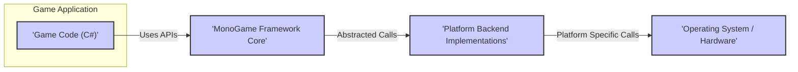
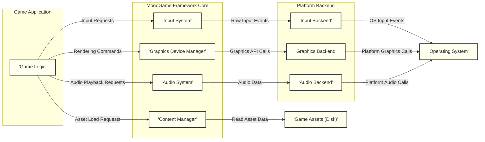

# Project Design Document: MonoGame Framework

**Version:** 1.1
**Date:** October 26, 2023
**Author:** AI Software Architect

## 1. Introduction

This document provides a detailed architectural design of the MonoGame framework. It aims to offer a comprehensive understanding of the system's components, their interactions, and data flow. This document will serve as the foundation for subsequent threat modeling activities, enabling a thorough assessment of potential security vulnerabilities.

MonoGame is an open-source, cross-platform game development framework. It provides a set of APIs that closely mirror Microsoft's XNA Framework 4.0, allowing developers to create games for various platforms using C# and .NET. Understanding its internal structure is crucial for identifying potential security weaknesses that could be exploited in games built using this framework.

## 2. Goals and Objectives

The primary goals of this design document are:

*   Clearly articulate the architecture of the MonoGame framework, emphasizing security-relevant aspects.
*   Identify key components and their specific responsibilities, highlighting potential attack surfaces.
*   Describe the data flow within the framework, pinpointing where data transformations and interactions occur.
*   Provide a solid foundation for identifying potential security threats and vulnerabilities, facilitating effective threat modeling.
*   Serve as a reference for developers, security analysts, and anyone seeking a deep understanding of MonoGame's internal workings.

## 3. Architectural Overview

MonoGame employs a layered architecture, effectively abstracting platform-specific complexities to offer a consistent API for game developers. The core of MonoGame manages the fundamental game loop, input processing, graphics rendering, audio playback, and content management. Platform-specific implementations are provided through distinct backend modules, ensuring cross-platform compatibility. This separation is important for understanding where platform-specific vulnerabilities might arise.

## 4. Detailed Component Design

This section provides a detailed breakdown of the key components within the MonoGame framework, focusing on their functionalities and potential security implications.

### 4.1. MonoGame Framework Core

This is the central, platform-agnostic part of the framework, providing the core functionalities and APIs exposed to game developers.

*   **Game Class:**
    *   Manages the overarching game lifecycle, including initialization, the central update-draw loop, and shutdown procedures.
    *   Provides the fundamental structure for game execution and resource management.
    *   Handles global game settings and configurations, which if improperly managed, could lead to security issues.
*   **Graphics Device Manager:**
    *   Abstracts the underlying graphics device (e.g., DirectX, OpenGL, Vulkan), providing a consistent interface.
    *   Manages the creation, presentation, and resource management of graphics resources (textures, buffers, etc.). Improper resource handling could lead to memory leaks or vulnerabilities.
    *   Responsible for shader management and compilation, a potential area for injection attacks if not handled carefully.
*   **Content Manager:**
    *   Handles the loading and management of game assets from various sources (local files, network streams).
    *   Responsible for content processing and serialization, which is a critical point for potential vulnerabilities if malicious assets are loaded.
    *   Provides mechanisms for accessing and caching loaded content.
*   **Input System:**
    *   Provides an abstraction layer over various input devices (keyboard, mouse, gamepad, touch), offering a unified input API.
    *   Responsible for translating raw input events into a usable format for the game. Lack of proper input sanitization here can lead to exploits.
    *   Manages the state of input devices.
*   **Audio System:**
    *   Manages audio playback, sound effects, and music.
    *   Provides APIs for controlling audio parameters (volume, panning, etc.).
    *   Handles the loading and decoding of audio files, a potential vulnerability point if malicious audio files are processed.
*   **Math Library:**
    *   Provides fundamental mathematical structures and functions (vectors, matrices, quaternions) essential for game development.
    *   Used extensively in graphics calculations, physics simulations, and game logic. While generally not a direct security risk, incorrect usage can lead to unexpected behavior.
*   **Framework Classes (e.g., SpriteBatch, Model, Texture2D):**
    *   Offers high-level abstractions for common game development tasks, simplifying rendering and object management.
    *   Provides convenient ways to draw sprites, render 3D models, and manage textures. Improper use of these classes could lead to rendering glitches or performance issues, and in some cases, potential vulnerabilities.

### 4.2. Platform Backend Implementations

These components provide the platform-specific implementations of the core functionalities, bridging the gap between the platform-agnostic core and the underlying operating system and hardware.

*   **Graphics Backend (e.g., DirectX, OpenGL, Vulkan):**
    *   Implements the low-level graphics rendering using the target platform's native graphics API.
    *   Handles the actual communication with the GPU, including command buffer submission and resource binding. Vulnerabilities in the underlying API or its usage can be exploited.
    *   Responsible for shader compilation and management specific to the graphics API.
*   **Input Backend:**
    *   Interacts directly with the operating system's input APIs to capture raw user input events.
    *   Translates platform-specific input events into the unified format expected by the Input System. This translation layer is crucial for security as it handles potentially untrusted input.
    *   Manages the connection and communication with input devices.
*   **Audio Backend (e.g., OpenAL, NAudio, platform-specific APIs):**
    *   Utilizes the target platform's audio APIs for sound playback and management.
    *   Handles audio device initialization, buffer management, and mixing. Vulnerabilities in the underlying audio libraries can be a concern.
    *   Responsible for the final output of audio to the system's audio devices.
*   **Platform-Specific Libraries and Services:**
    *   Provides access to platform-specific features and APIs that are not part of the core framework (e.g., networking, storage, sensors).
    *   These interactions represent potential security boundaries and require careful consideration of platform-specific security models.

### 4.3. Content Pipeline

The Content Pipeline is a separate tool, typically executed during the game development process, used to process game assets before they are included in the final game build.

*   **Content Importers:**
    *   Read raw asset files in various formats (e.g., images, 3D models, audio files).
    *   Convert these raw formats into an intermediate, more manageable format for processing. Vulnerabilities in importers could allow malicious files to exploit the pipeline.
*   **Content Processors:**
    *   Perform various operations on the intermediate format, such as texture compression, model optimization, and audio encoding.
    *   These processors can potentially introduce vulnerabilities if they mishandle data or have exploitable flaws.
*   **Content Writers:**
    *   Serialize the processed content into binary files that are then included in the game's distribution.
    *   The format and integrity of these output files are important for preventing tampering.

## 5. Data Flow

This section illustrates the flow of data within the MonoGame framework during a typical game execution, highlighting potential points of interest for security analysis.

**Detailed Data Flow Steps with Security Considerations:**

1. **Input Handling:**
    *   The Operating System (I) detects raw user input events (keyboard, mouse, etc.). This is the initial entry point for potentially malicious input.
    *   The Input Backend (F) receives these raw events. Vulnerabilities here could allow bypassing input sanitization.
    *   The Input Backend (F) translates these events into a platform-independent format. Improper translation could lead to unexpected behavior.
    *   The Input System (B) in the MonoGame Core receives the processed input. Lack of proper sanitization at this stage is a major risk.
    *   The Game Logic (A) queries the Input System (B) to get the current input state. Vulnerabilities in the game logic's handling of input can be exploited.

2. **Rendering:**
    *   The Game Logic (A) determines what needs to be rendered and issues rendering commands. Malicious game logic could attempt to exploit rendering vulnerabilities.
    *   It makes calls to the Graphics Device Manager (C) to submit rendering commands (draw calls, state changes). Improper command construction could lead to issues.
    *   The Graphics Device Manager (C) translates these commands into API calls for the specific Graphics Backend (G). Vulnerabilities in this translation layer are possible.
    *   The Graphics Backend (G) interacts with the operating system's graphics API to render the scene. Exploits in the underlying graphics API are a concern.

3. **Content Loading:**
    *   When the Game Logic (A) needs an asset, it requests it from the Content Manager (D). This is a point where malicious asset requests could be made.
    *   The Content Manager (D) locates and loads the asset from disk (J). If the asset source is untrusted, this poses a risk.
    *   The Content Manager (D) may perform deserialization or further processing of the asset data. Vulnerabilities in deserialization are common.
    *   The loaded asset is returned to the Game Logic (A). If the asset is compromised, it could lead to issues in the game logic.

4. **Audio Playback:**
    *   When the Game Logic (A) wants to play audio, it makes a request to the Audio System (E). Similar to content loading, malicious audio requests are a concern.
    *   The Audio System (E) retrieves the audio data. If the audio source is untrusted, this is a risk.
    *   The Audio System (E) sends the audio data to the Audio Backend (H). Vulnerabilities in the audio backend could be exploited.
    *   The Audio Backend (H) uses the operating system's audio API to play the sound. Exploits in the underlying audio API are a concern.

## 6. Security Considerations (For Threat Modeling)

This section details potential areas of security concern within the MonoGame framework, providing specific examples relevant for threat modeling.

*   **Input Validation Vulnerabilities:**
    *   **Threat:** Maliciously crafted input (e.g., excessively long strings, special characters) could exploit vulnerabilities in the Input System or game logic, leading to crashes, unexpected behavior, or even code injection.
    *   **Example:** A long player name could cause a buffer overflow if not properly handled.
*   **Content Pipeline Exploits:**
    *   **Threat:** Maliciously crafted assets (e.g., images with embedded code, corrupted 3D models) could exploit vulnerabilities in Content Importers or Processors, potentially leading to arbitrary code execution during the content build process or when the asset is loaded at runtime.
    *   **Example:** A specially crafted image file could exploit a buffer overflow in an image decoding library used by a Content Importer.
*   **Graphics Backend Security Issues:**
    *   **Threat:** Improper use of the underlying graphics APIs (DirectX, OpenGL, Vulkan) in the Graphics Backend could introduce vulnerabilities such as shader injection attacks or resource exhaustion.
    *   **Example:** A game might be vulnerable to a shader injection attack if it dynamically constructs shader code based on untrusted input.
*   **Dependency Vulnerabilities:**
    *   **Threat:** MonoGame relies on external libraries and dependencies. Known vulnerabilities in these dependencies could be exploited if not properly managed and updated.
    *   **Example:** A vulnerable version of an audio decoding library could be exploited by a malicious audio file.
*   **Platform-Specific Security Weaknesses:**
    *   **Threat:** Security features and vulnerabilities vary across different target platforms. The platform backend implementations need to be robust against platform-specific attacks and adhere to platform security guidelines.
    *   **Example:** On some platforms, improper file access permissions could allow unauthorized modification of game data.
*   **Build Process Compromise:**
    *   **Threat:** If the build environment or tools used to compile MonoGame or games built with it are compromised, malicious code could be injected into the framework or the game.
    *   **Example:** A compromised compiler could insert backdoors into the compiled binaries.
*   **Distribution Integrity:**
    *   **Threat:** If the MonoGame framework or games built with it are distributed through insecure channels, they could be tampered with, leading to the introduction of malware.
    *   **Example:** A man-in-the-middle attack could replace the legitimate MonoGame download with a compromised version.
*   **Audio Processing Vulnerabilities:**
    *   **Threat:** Processing audio files from untrusted sources could expose vulnerabilities in the Audio System or underlying audio codecs, potentially leading to buffer overflows or other memory corruption issues.
    *   **Example:** A specially crafted MP3 file could exploit a vulnerability in the MP3 decoding library.

## 7. Deployment

MonoGame is typically deployed as a set of libraries that are integrated into game projects during development. The deployment process involves:

*   **Installation:** Developers install the MonoGame SDK or utilize NuGet packages to include MonoGame in their projects.
*   **Development:** Game developers write their game logic using the MonoGame APIs.
*   **Content Processing:** The Content Pipeline tool is used to process game assets into a format suitable for distribution.
*   **Building:** The game project is built, compiling the game code and packaging the processed assets.
*   **Distribution:** The final game package is distributed to end-users through various channels (e.g., app stores, direct downloads). Security considerations are important at each stage, from the integrity of the SDK to the security of the distribution channels.

## 8. Technologies Used

*   **Primary Programming Language:** C#
*   **Runtime Environment:** .NET Framework / .NET
*   **Graphics APIs:** DirectX, OpenGL, Vulkan (platform-dependent)
*   **Audio APIs:** OpenAL, NAudio, platform-specific audio APIs
*   **Build Tools:** MSBuild, NuGet
*   **Target Platforms:** Windows, macOS, Linux, iOS, Android, various consoles

## 9. Future Considerations

*   **Enhanced Input Sanitization:** Implement more robust and configurable input sanitization mechanisms within the Input System to mitigate input-based attacks.
*   **Content Validation and Sandboxing:** Explore options for validating loaded content against known good states and potentially sandboxing content processing to limit the impact of malicious assets.
*   **Regular Security Audits and Penetration Testing:** Conduct periodic security assessments of the MonoGame framework and example games to identify and address potential vulnerabilities proactively.
*   **Secure Dependency Management:** Implement stricter controls over external dependencies, including regular vulnerability scanning and updates.
*   **Community Security Engagement:** Foster a community-driven approach to security by encouraging responsible disclosure of vulnerabilities and providing clear channels for reporting security issues.
*   **Address Platform-Specific Security Best Practices:** Continuously review and update platform backend implementations to adhere to the latest security best practices for each target platform.

This improved document provides a more detailed and security-focused overview of the MonoGame framework's architecture. The enhanced descriptions of components, data flows, and security considerations offer a stronger foundation for effective threat modeling and the development of secure games using MonoGame.
