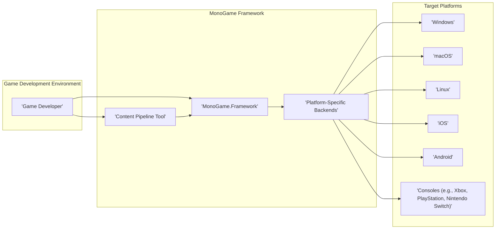
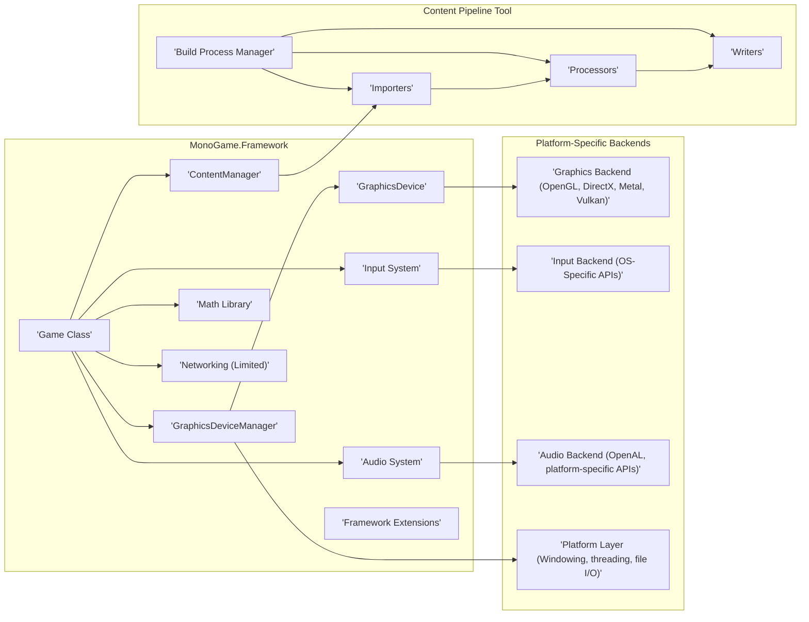
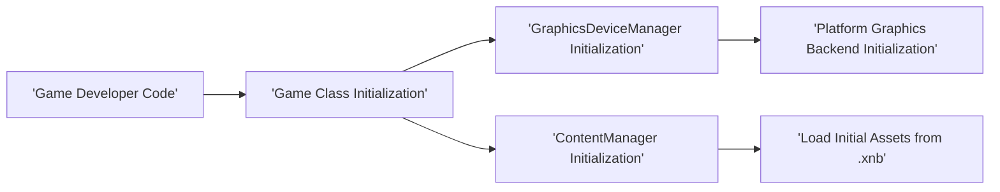
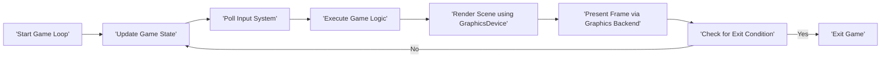
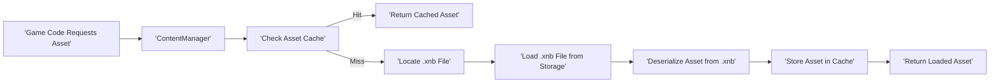
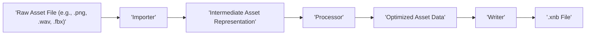

# Project Design Document: MonoGame Framework

**Version:** 1.1
**Date:** October 26, 2023
**Author:** Gemini (AI Language Model)

## 1. Introduction

This document provides an enhanced and more detailed design overview of the MonoGame framework, an open-source, cross-platform game development framework. The primary purpose of this document is to offer a comprehensive understanding of the system's architecture, components, and data flow, specifically tailored to serve as a robust foundation for subsequent threat modeling activities.

MonoGame empowers developers to create games targeting a wide array of platforms, including Windows, macOS, Linux, iOS, Android, and various gaming consoles. It achieves this by implementing the Microsoft XNA 4 API, providing a familiar development environment for those with prior XNA experience. This document aims to delve deeper into the framework's inner workings to facilitate a thorough security analysis.

## 2. Goals and Objectives

The core goals and objectives of the MonoGame project are:

*   To provide a genuinely cross-platform game development experience, minimizing platform-specific code requirements.
*   To faithfully implement the Microsoft XNA 4 API, ensuring a smooth transition and compatibility for existing XNA projects and developers.
*   To offer a high-performance and reliable environment suitable for developing demanding game applications.
*   To foster a vibrant and supportive open-source community around the framework.
*   To maintain and expand support for a diverse and growing range of target platforms.

## 3. System Architecture

### 3.1. High-Level Architecture

*   **Game Developer:** The individual or team responsible for writing the game's source code, designing game mechanics, and creating game assets. They interact directly with the MonoGame framework through code and the Content Pipeline tool.
*   **MonoGame.Framework:** This is the central library, providing the core implementation of the XNA 4 API. It exposes namespaces and classes for graphics, input, audio, and other game-related functionalities.
*   **Platform-Specific Backends:** These are collections of platform-dependent implementations that bridge the gap between the platform-agnostic core framework and the underlying operating system and hardware. They handle tasks like creating graphics contexts, accessing input devices, and managing audio output.
*   **Content Pipeline Tool:** A standalone application used during the development process to process various game assets (images, audio files, 3D models, etc.) into an optimized format (`.xnb`) suitable for efficient loading and use within the game on the target platform.
*   **Target Platforms:** The specific operating systems and hardware environments where games built using MonoGame are intended to run.

### 3.2. Detailed Component Architecture

*   **MonoGame.Framework Components:**
    *   **Game Class:** The central orchestrator of the game application. It manages the game loop (Update and Draw), initializes resources, and handles the overall lifecycle of the game.
    *   **GraphicsDeviceManager:** Responsible for managing the creation, initialization, and presentation of the `GraphicsDevice`. It handles settings related to screen resolution, full-screen mode, and other graphics configurations.
    *   **GraphicsDevice:** Provides the core interface for interacting with the underlying graphics API. It offers methods for drawing primitives, textures, and managing rendering states.
    *   **ContentManager:**  Handles the loading, caching, and unloading of game assets. It abstracts the underlying file system and provides a consistent way to access game resources.
    *   **Input System:** Provides a unified interface for accessing input from various devices, including keyboard, mouse, gamepads, and touchscreens. It normalizes input events across different platforms.
    *   **Audio System:** Manages audio playback, sound effects, and music. It provides classes for controlling volume, panning, and other audio properties.
    *   **Math Library:** Contains essential mathematical structures (vectors, matrices, quaternions) and functions used for game logic, transformations, and physics.
    *   **Framework Extensions:**  A collection of utility classes and extension methods that provide additional functionality and convenience for game developers.
    *   **Networking (Limited):** Offers basic networking capabilities, often relying on platform-specific implementations or external libraries for more advanced features.
*   **Platform-Specific Backends:**
    *   **Graphics Backend:**  Implements the low-level communication with the graphics hardware using APIs like OpenGL, DirectX, Metal (on Apple platforms), or Vulkan. This component is crucial for rendering the game's visuals.
    *   **Input Backend:**  Handles the specifics of receiving input events from the operating system and translating them into a platform-independent format for the `Input System`.
    *   **Audio Backend:**  Utilizes platform-specific audio libraries or APIs (like OpenAL, CoreAudio, or Android's audio system) to manage audio output and playback.
    *   **Platform Layer:** Provides abstractions for fundamental operating system functionalities such as window creation and management, threading, file system access, and other platform-dependent services.
*   **Content Pipeline Tool Components:**
    *   **Importers:** Modules responsible for reading and parsing raw asset files in various formats (e.g., `.png`, `.jpg`, `.wav`, `.obj`, `.fbx`).
    *   **Processors:** Modules that transform the imported assets into a format optimized for the game and the target platform. This might involve texture compression, model optimization, or audio encoding.
    *   **Writers:** Modules that serialize the processed assets into the `.xnb` file format, which is designed for efficient loading by the `ContentManager`.
    *   **Build Process Manager:** Orchestrates the entire content processing workflow, managing dependencies between assets and invoking the appropriate importers, processors, and writers.

## 4. Data Flow

### 4.1. Game Initialization

*   The game development process begins with the **Game Developer Code**, which defines the game's entry point and initial setup.
*   The **Game Class Initialization** phase involves setting up core game systems and components.
*   The **GraphicsDeviceManager Initialization** configures the graphics subsystem, leading to the **Platform Graphics Backend Initialization**, where the appropriate graphics API is initialized for the target platform.
*   Simultaneously, the **ContentManager Initialization** prepares the asset loading system.
*   Finally, **Load Initial Assets from .xnb** involves the `ContentManager` reading pre-processed asset files, making them available for the game.

### 4.2. Game Loop

*   The **Start Game Loop** marks the beginning of the continuous cycle of updating and rendering the game.
*   The **Update Game State** phase involves updating game variables, physics, and other game-related logic.
*   **Poll Input System** retrieves the current state of input devices.
*   **Execute Game Logic** uses the input and current game state to determine the next state of the game world.
*   **Render Scene using GraphicsDevice** utilizes the `GraphicsDevice` and the underlying graphics backend to draw the current game scene.
*   **Present Frame via Graphics Backend** sends the rendered image to the display.
*   **Check for Exit Condition** determines if the game should terminate.

### 4.3. Content Loading

*   When **Game Code Requests Asset**, the request is directed to the **ContentManager**.
*   The **ContentManager** first checks its **Asset Cache**.
*   If the asset is found (**Hit**), the **Return Cached Asset** step provides the already loaded asset.
*   If the asset is not in the cache (**Miss**), the **Locate .xnb File** step finds the corresponding pre-processed asset file.
*   The **Load .xnb File from Storage** step reads the asset data from disk.
*   **Deserialize Asset from .xnb** converts the binary data back into usable game objects.
*   The **Store Asset in Cache** step adds the loaded asset to the cache for future requests.
*   Finally, the **Return Loaded Asset** step provides the requested asset to the game code.

### 4.4. Content Pipeline Workflow

*   The workflow begins with a **Raw Asset File**, such as an image, audio file, or 3D model.
*   The appropriate **Importer** reads and parses the raw asset data.
*   The **Intermediate Asset Representation** is a platform-agnostic representation of the asset's data.
*   A **Processor** then transforms this intermediate representation, applying optimizations and conversions specific to the target platform and game requirements.
*   The result is **Optimized Asset Data**.
*   Finally, a **Writer** serializes this optimized data into an **.xnb File**.

## 5. Key Components

*   **MonoGame.Framework.dll:** The core assembly containing the primary implementation of the XNA 4 API. This is the foundation upon which game logic is built.
*   **Platform-Specific Backend Assemblies:**  These assemblies (e.g., `MonoGame.Framework.DesktopGL.dll`, `MonoGame.Framework.Android.dll`, `MonoGame.Framework.iOS.dll`) provide the platform-specific implementations for graphics, input, audio, and other system-level functionalities. They are crucial for adapting the framework to different operating systems and hardware.
*   **Content Pipeline Tool (MGCB.exe or dotnet mgcb):** A separate executable or command-line tool used to process game assets. It manages the importing, processing, and writing of assets into the `.xnb` format.
*   **NuGet Packages:** MonoGame and its dependencies are distributed and managed through NuGet packages, simplifying the process of including the framework in a project.
*   **Templates and Samples:**  Provide starting points and illustrative examples for developers, showcasing how to use the framework's features and best practices.

## 6. Security Considerations (For Threat Modeling)

This section details potential security considerations relevant for threat modeling, categorized for clarity:

*   **Dependency Management Vulnerabilities:**
    *   **Use of Known Vulnerable Libraries:** MonoGame relies on external libraries and platform SDKs. Outdated or vulnerable versions of these dependencies could introduce security flaws into games built with MonoGame. Regularly scanning dependencies for known vulnerabilities is crucial.
    *   **Supply Chain Risks:**  Compromised NuGet packages or malicious build tools could inject malicious code into the development or build process, potentially affecting all games built using the compromised components. Verifying package integrity and using trusted sources is essential.
*   **Content Pipeline Security Risks:**
    *   **Malicious Asset Exploitation:**  Crafted asset files could exploit vulnerabilities in the Importers or Processors of the Content Pipeline, potentially leading to arbitrary code execution on the developer's machine during the build process. Input validation and sandboxing within the Content Pipeline are important considerations.
    *   **Content Spoofing and Tampering:**  Attackers might attempt to replace legitimate game assets with malicious ones, either during development or distribution. This could lead to unexpected behavior or the delivery of harmful content to players. Implementing content signing and verification mechanisms can mitigate this.
*   **Input Handling Vulnerabilities:**
    *   **Input Injection Attacks:**  Improperly sanitized user input (from keyboard, mouse, network, or other sources) could be used to inject malicious commands or data, potentially leading to exploits within the game logic. Robust input validation and sanitization are necessary.
    *   **Denial of Service through Input Flooding:**  Sending excessive or malformed input could overwhelm the game's input processing mechanisms, leading to performance degradation or crashes. Implementing rate limiting and input validation can help prevent this.
*   **Graphics and Audio Backend Vulnerabilities:**
    *   **Exploiting Driver or API Bugs:**  Specific rendering commands or audio processing operations could trigger vulnerabilities in the underlying graphics or audio drivers or APIs. Keeping drivers updated and being aware of known issues is important.
    *   **Shader Vulnerabilities:**  Custom shaders written in GLSL or HLSL might contain vulnerabilities that could be exploited to cause crashes or unexpected behavior. Careful shader development and security reviews are recommended.
    *   **Malicious Audio File Exploits:**  Vulnerabilities in audio decoding libraries could be exploited by providing specially crafted audio files. Using well-vetted and updated audio libraries is crucial.
*   **Platform-Specific Security Considerations:**
    *   **Operating System Vulnerabilities:**  Games ultimately run on the target operating system, inheriting any vulnerabilities present in that system. Keeping the operating system updated is important for end-users.
    *   **Permission Issues:**  Incorrectly configured permissions on mobile or console platforms could allow unauthorized access to device resources or sensitive data. Following platform-specific security guidelines is essential.
*   **Code Security within Game Logic:**
    *   **Memory Safety Issues (if using unsafe code):** While C# is generally memory-safe, the use of `unsafe` code blocks or interoperability with native libraries can introduce memory management vulnerabilities. Careful use and thorough testing of unsafe code are critical.
    *   **Logic Errors Leading to Exploits:**  Bugs in the game's logic, such as incorrect state management or flawed game mechanics, could be exploited by attackers to gain unfair advantages or cause unintended consequences. Thorough testing and code reviews are necessary.
*   **Distribution and Update Security:**
    *   **Compromised Distribution Channels:**  If the game is distributed through insecure or untrusted channels, attackers could tamper with the game files before they reach the end-user. Using reputable distribution platforms and signing game packages can help mitigate this.
    *   **Insecure Update Mechanisms:**  Vulnerabilities in the game's update process could allow attackers to inject malicious updates, potentially compromising the user's system. Implementing secure update mechanisms with integrity checks is crucial.

## 7. Deployment

Deployment of MonoGame applications involves platform-specific processes:

*   **Windows:** Typically involves compiling the game into an executable (`.exe`) and packaging it with necessary DLLs (including MonoGame's platform-specific backend) and content (`.xnb` files). Installers (e.g., using MSI or ClickOnce) are often used for distribution.
*   **macOS:**  Games are usually packaged as application bundles (`.app`) containing the executable, frameworks, and content. Code signing is essential for distribution through official channels.
*   **Linux:** Deployment can vary depending on the distribution. Common methods include creating distributable packages (e.g., `.deb`, `.rpm`) or providing standalone executables with required libraries.
*   **iOS:**  Requires building an `.ipa` file using Xcode, which is then distributed through the App Store or ad-hoc distribution methods. Code signing and provisioning profiles are mandatory.
*   **Android:** Games are packaged as `.apk` files, which can be distributed through the Google Play Store or sideloaded. Signing the APK is required.
*   **Consoles (e.g., Xbox, PlayStation, Nintendo Switch):**  Deployment involves specific SDKs, development kits, and submission processes dictated by the console manufacturers. These platforms have stringent security requirements and code signing procedures.

## 8. Future Considerations

*   **Enhanced Graphics API Support:**  Further integration and optimization for modern graphics APIs like Vulkan and Metal to improve performance and access advanced rendering features. This includes potentially providing more direct access to these APIs while maintaining a degree of abstraction.
*   **Improved Content Pipeline Security:** Implementing more robust input validation, sandboxing, and potentially static analysis tools within the Content Pipeline to mitigate the risk of malicious asset exploitation. Exploring options for content encryption and integrity checking.
*   **Expanded Networking Capabilities:**  Potentially incorporating more advanced and secure networking features directly into the framework or providing better integration with established networking libraries.
*   **Strengthened Input Handling Security:**  Providing built-in mechanisms for input sanitization and validation to help developers avoid common input-related vulnerabilities.
*   **Community-Driven Security Audits:** Encouraging and facilitating community involvement in security reviews and vulnerability identification.
*   **Regular Dependency Updates and Security Scans:**  Establishing a process for regularly updating dependencies and performing security scans to identify and address potential vulnerabilities proactively.

This enhanced design document provides a more in-depth understanding of the MonoGame framework, specifically focusing on aspects relevant to security. It serves as a more comprehensive foundation for conducting thorough threat modeling and identifying potential vulnerabilities.