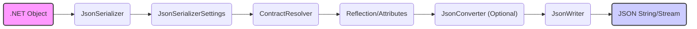
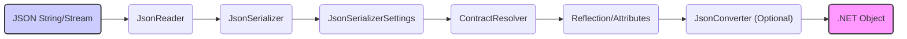
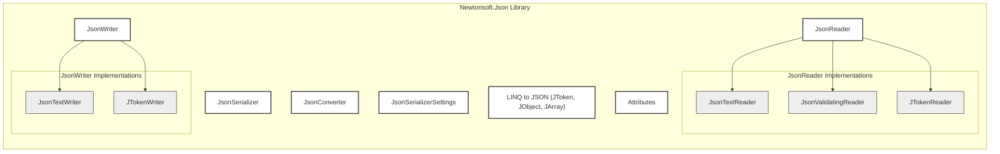

# Project Design Document: Newtonsoft.Json

**Version:** 1.1
**Date:** October 26, 2023
**Author:** AI Software Architect

## 1. Introduction

This document provides a detailed design overview of the Newtonsoft.Json library, a widely adopted .NET library for serializing and deserializing JSON (JavaScript Object Notation). This document aims to provide a comprehensive understanding of the library's architecture, core components, and data flow, serving as a foundation for subsequent threat modeling activities. It emphasizes aspects relevant to security considerations.

## 2. Goals

The primary goals of the Newtonsoft.Json library are:

*   To provide a robust and efficient mechanism for converting .NET objects to JSON strings (serialization).
*   To provide a robust and efficient mechanism for converting JSON strings back to .NET objects (deserialization).
*   To offer extensive flexibility and customization options for both serialization and deserialization processes, catering to diverse scenarios.
*   To maintain broad compatibility across various .NET frameworks and platforms.
*   To offer a performant and reliable solution for JSON processing in .NET applications.

## 3. Target Audience

This document is intended for:

*   Security engineers and architects responsible for performing threat modeling on systems utilizing Newtonsoft.Json.
*   Software developers requiring a detailed understanding of the library's architecture and its implications.
*   Quality assurance engineers involved in testing applications that rely on Newtonsoft.Json.
*   Anyone involved in the design, development, or security assessment of applications integrating Newtonsoft.Json.

## 4. Architectural Overview

Newtonsoft.Json employs a modular and extensible architecture, with distinct components handling specific aspects of JSON processing. The core functionalities center around reading and writing JSON data and the mapping between JSON structures and .NET objects.

### 4.1. Key Components

*   **`JsonSerializer`:** The central orchestrator for serialization and deserialization. It manages settings defined in `JsonSerializerSettings`, invokes appropriate `JsonConverter` instances, and utilizes `JsonReader` and `JsonWriter` for the actual data processing.
*   **`JsonReader`:** An abstract class defining the interface for reading JSON data. Concrete implementations include:
    *   **`JsonTextReader`:** Reads JSON data from text-based sources like strings or streams.
    *   **`JsonValidatingReader`:** Wraps another `JsonReader` and validates the JSON structure against a schema.
    *   **`JTokenReader`:** Reads JSON data from the LINQ to JSON object model (`JToken`).
    `JsonReader` provides a forward-only, read-only stream of JSON tokens.
*   **`JsonWriter`:** An abstract class defining the interface for writing JSON data. Concrete implementations include:
    *   **`JsonTextWriter`:** Writes JSON data to text-based destinations like strings or streams.
    *   **`JTokenWriter`:** Writes JSON data to the LINQ to JSON object model (`JToken`).
    `JsonWriter` provides methods for writing various JSON tokens (objects, arrays, properties, values).
*   **`JsonConverter`:** An abstract class enabling custom serialization and deserialization logic for specific .NET types or scenarios. Developers can create custom converters to handle complex object structures, perform custom formatting, or manage type conversions. Built-in converters handle common types.
*   **`JsonSerializerSettings`:** A crucial class holding configuration options that govern the behavior of the `JsonSerializer`. These settings include:
    *   `Formatting`: Controls indentation and whitespace in the output JSON.
    *   `NullValueHandling`: Determines how null values are handled during serialization and deserialization.
    *   `TypeNameHandling`: Controls whether type information is included in the JSON, critical for polymorphic deserialization but also a potential security risk.
    *   `Converters`: A collection of `JsonConverter` instances to be used.
    *   `ContractResolver`:  Allows customization of how .NET types are mapped to JSON structures.
*   **LINQ to JSON (JObject, JArray, JToken, etc.):** Provides a dynamic, in-memory representation of JSON data. This allows for querying and manipulating JSON structures without mapping them to specific .NET classes. `JToken` is the base class for all LINQ to JSON objects.
*   **Attributes (e.g., `JsonProperty`, `JsonIgnore`, `JsonConverterAttribute`):** Attributes applied to .NET classes and members to influence their serialization and deserialization behavior. They offer a declarative way to control how objects are mapped to JSON.

### 4.2. Data Flow

The following diagrams illustrate the general data flow for serialization and deserialization processes within Newtonsoft.Json.

#### 4.2.1. Serialization Flow

*   A .NET object is passed to the `JsonSerializer`.
*   The `JsonSerializer` retrieves configuration settings from `JsonSerializerSettings`.
*   The `ContractResolver` determines how the .NET object's properties should be mapped to JSON properties.
*   Reflection and applied attributes guide the serialization process.
*   If a relevant `JsonConverter` is registered or specified via an attribute, it's invoked to handle the serialization of specific types or properties.
*   The `JsonWriter` receives the data and writes it to the output stream or string in JSON format, adhering to the specified formatting.

#### 4.2.2. Deserialization Flow

*   A JSON string or stream is passed to the appropriate `JsonReader` implementation.
*   The `JsonReader` parses the JSON data and generates a stream of tokens.
*   The `JsonSerializer` receives the token stream and retrieves configuration settings from `JsonSerializerSettings`.
*   The `ContractResolver` determines how JSON properties should be mapped to properties of the target .NET type.
*   Reflection and applied attributes guide the deserialization process, including type creation and property population.
*   If a relevant `JsonConverter` is registered or type information is present (e.g., with `TypeNameHandling`), it's invoked to handle the deserialization of specific types or properties.
*   The `JsonSerializer` constructs and populates the resulting .NET object.

## 5. Security Considerations

This section details security considerations relevant to the use of Newtonsoft.Json.

*   **Deserialization of Untrusted Data:** This is a primary security concern. Deserializing JSON from untrusted sources can lead to various vulnerabilities:
    *   **Remote Code Execution (RCE):** If `TypeNameHandling` is set to `Auto` or `All` without careful consideration, attackers can craft malicious JSON payloads that instruct the deserializer to instantiate arbitrary types, potentially leading to code execution. This often involves exploiting known gadgets or vulnerabilities in the .NET framework or application dependencies.
    *   **Denial of Service (DoS):** Maliciously crafted JSON with deeply nested structures or extremely large arrays can consume excessive memory and CPU resources, leading to application crashes or unavailability.
    *   **Type Confusion Attacks:** Attackers might attempt to trick the deserializer into instantiating objects of unexpected types, potentially bypassing security checks or leading to unexpected behavior.
    *   **Resource Exhaustion:**  Deserializing very large numbers or strings can lead to memory exhaustion.
*   **Information Disclosure:**
    *   **Over-serialization:**  Default serialization settings might inadvertently include sensitive information in the JSON output that should be excluded. Proper use of attributes like `JsonIgnore` or custom `ContractResolver` implementations is crucial.
    *   **Error Messages:**  Verbose error messages during deserialization might reveal internal application details to attackers.
*   **Injection Attacks:** While Newtonsoft.Json itself doesn't directly execute code from JSON, vulnerabilities can arise in applications that construct JSON strings based on user input without proper sanitization. This could lead to JSON injection issues if the resulting JSON is later processed by another system.
*   **Custom Converters:**  Security vulnerabilities can be introduced through poorly written or malicious custom `JsonConverter` implementations. These converters have direct access to object properties and can perform arbitrary actions during serialization and deserialization. Thorough review and testing of custom converters are essential.
*   **Configuration Issues:** Incorrectly configured `JsonSerializerSettings` can weaken security:
    *   **Enabling `TypeNameHandling` unnecessarily:**  Increases the attack surface for deserialization vulnerabilities.
    *   **Using insecure default settings:**  Failing to configure settings like `MaxDepth` can leave applications vulnerable to DoS attacks.
*   **Billion Laughs Attack (XML External Entity - XXE Analogue):** While primarily an XML vulnerability, if custom converters or application logic process data within the JSON that resembles XML, similar resource exhaustion attacks might be possible.
*   **Regular Expression Denial of Service (ReDoS):** If custom converters or validation logic use regular expressions on JSON data, poorly written regexes could be exploited for DoS.

## 6. Deployment

Newtonsoft.Json is typically deployed as a NuGet package that is included as a dependency in .NET projects. Applications then utilize the library's classes and methods within their code. It's a core dependency for many .NET applications.

## 7. Dependencies

Newtonsoft.Json has minimal external dependencies, primarily relying on core .NET framework libraries. This reduces the risk of transitive dependencies introducing vulnerabilities.

## 8. Error Handling

Newtonsoft.Json provides mechanisms for handling errors during serialization and deserialization:

*   **Exceptions:** The library throws exceptions (e.g., `JsonSerializationException`, `JsonReaderException`) when errors occur during parsing or conversion. Applications should implement appropriate error handling to catch and manage these exceptions.
*   **`Error` Event on `JsonSerializerSettings`:**  Allows developers to register a callback function to handle errors encountered during serialization or deserialization. This provides a mechanism for logging errors or implementing custom error handling logic without halting the entire process.

## 9. Future Considerations

*   Potential for enhanced support for new JSON standards and features.
*   Ongoing performance optimizations and memory usage improvements.
*   Continued support for new .NET features and platforms.
*   Potential for more granular control over serialization and deserialization processes.

## 10. Diagrams

### 10.1. High-Level Component Diagram

This improved document provides a more detailed and comprehensive understanding of the Newtonsoft.Json library's design, with a stronger emphasis on security considerations. This information will serve as a robust foundation for conducting thorough threat modeling activities.