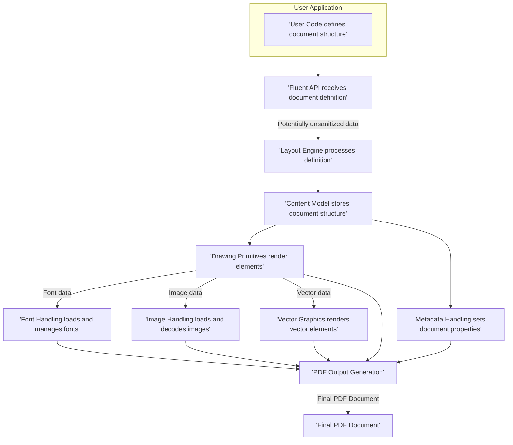

# Project Design Document: QuestPDF Library

**Version:** 1.1
**Date:** October 26, 2023
**Author:** AI Software Architect

## 1. Introduction

This document provides a detailed design overview of the QuestPDF library, an open-source, modern .NET library for generating PDF documents programmatically. This document aims to clearly articulate the architecture, components, and data flow within QuestPDF to facilitate effective threat modeling. This version includes enhanced details and specific security considerations for each component.

## 2. Project Overview

QuestPDF is a C# library that empowers developers to create sophisticated and visually rich PDF documents using a fluent and composable API. It abstracts the complexities of PDF generation, allowing developers to concentrate on the content and layout of their documents. The library is designed for extensibility and supports a wide range of features, including text rendering, image embedding, vector graphics, complex layouts, and more.

## 3. Goals

* Provide a clear and concise design overview of the QuestPDF library's architecture and components.
* Identify key components and their interactions, with a focus on potential security implications.
* Describe the data flow within the library during PDF generation, highlighting potential security touchpoints.
* Serve as a robust foundation for subsequent threat modeling activities, enabling the identification of potential vulnerabilities.

## 4. Non-Goals

* This document does not delve into the fine-grained implementation details of specific algorithms or data structures within QuestPDF's internal workings.
* This document does not provide an exhaustive description of the user-facing API, focusing instead on the architectural aspects relevant to security and data flow.
* This document does not constitute a comprehensive security audit or threat assessment of the QuestPDF library.

## 5. Target Audience

* Security engineers and architects responsible for performing threat modeling and security assessments.
* Developers contributing to or extending the QuestPDF library, particularly those working on core components.
* Individuals seeking a deeper understanding of QuestPDF's internal workings from a security perspective.

## 6. High-Level Architecture

QuestPDF employs a layered architecture emphasizing composability and extensibility. The core components work together to process user-defined document structures and generate the final PDF output.

```mermaid
graph LR
    subgraph "User Application"
        UA["'User Code (C#)'"]
    end
    subgraph "QuestPDF Library"
        API["'Fluent API'"] --> Layout["'Layout Engine'"];
        Layout --> Content["'Content Model'"];
        Content --> Drawing["'Drawing Primitives'"];
        Drawing --> Fonts["'Font Handling'"];
        Drawing --> Images["'Image Handling'"];
        Drawing --> Vectors["'Vector Graphics'"];
        Layout --> Metadata["'Metadata Handling'"];
        Content --> Metadata;
        Metadata --> Output["'PDF Output Generation'"];
        Fonts --> Output;
        Images --> Output;
        Vectors --> Output;
    end
    UA -- "Document Definition" --> API
    Output -- "PDF Document" --> User Application
```

* **User Code (C#):** The developer's application code that utilizes the QuestPDF library to define the structure and content of the PDF document programmatically. This code interacts directly with the QuestPDF API.
* **Fluent API:** The primary programmatic interface through which developers interact with QuestPDF. It offers a declarative and chainable way to construct the document structure and define its content and styling.
* **Layout Engine:** The core component responsible for interpreting the document structure defined through the Fluent API. It calculates the precise placement, sizing, and flow of elements on each page of the PDF document.
* **Content Model:** An internal, in-memory representation of the document's structure and content. It acts as an intermediary between the Layout Engine and the Drawing Primitives, holding the elements to be rendered.
* **Drawing Primitives:** A set of low-level components responsible for the actual rendering of basic graphical elements onto the PDF canvas. This includes drawing text, lines, shapes, and managing colors and styles.
* **Font Handling:** Manages the loading, embedding, and rendering of fonts used within the document. This component deals with various font formats and ensures proper font representation in the final PDF.
* **Image Handling:** Responsible for loading, decoding, and embedding various image formats (e.g., JPEG, PNG) into the PDF document. This component may also handle image optimization and resizing.
* **Vector Graphics:** Supports the rendering of vector-based graphics and shapes defined within the document. This allows for scalable and high-quality graphics in the PDF output.
* **Metadata Handling:** Manages the PDF document's metadata, such as author, title, subject, keywords, and creation date. This information is embedded within the PDF file itself.
* **PDF Output Generation:** The final stage where the rendered content from the Drawing Primitives and the document metadata are assembled into a valid PDF file format according to the PDF specification.

## 7. Detailed Component Descriptions

### 7.1. Fluent API

* **Purpose:** Provides a developer-friendly and expressive interface for defining PDF document structure and content.
* **Functionality:** Offers a chainable set of methods for adding elements, applying styling, defining layout rules, and incorporating data.
* **Security Considerations:**
    * **Input Sanitization:** While the API itself doesn't directly handle external user input in a traditional web application sense, developers using the API might embed data sourced from external systems. The library's handling of potentially malicious or malformed data passed through the API needs consideration. For example, embedding unsanitized HTML or script tags could be a risk if the rendering process isn't secure.
    * **Error Handling:** How does the API handle invalid or unexpected input from the developer? Are error messages sufficiently informative for debugging but not overly verbose, potentially revealing internal implementation details?

### 7.2. Layout Engine

* **Purpose:** Interprets the document structure defined through the API and calculates the precise position and size of each element on the page.
* **Functionality:** Implements layout algorithms to handle flow layout, fixed positioning, table layouts, and other complex arrangement strategies.
* **Security Considerations:**
    * **Resource Exhaustion:**  Processing extremely complex or deeply nested layouts could potentially lead to excessive CPU or memory consumption, resulting in a denial-of-service. Are there safeguards against such scenarios?
    * **Logic Errors:**  Bugs in the layout engine's logic could lead to unexpected output, potentially revealing sensitive information through misaligned or overlapping content.
    * **Infinite Loops:**  Could a specially crafted document definition cause the layout engine to enter an infinite loop, leading to resource exhaustion?

### 7.3. Content Model

* **Purpose:** Serves as an intermediate, in-memory representation of the document structure before the rendering process.
* **Functionality:** Stores the hierarchical arrangement of elements, their properties (styling, content), and associated data.
* **Security Considerations:**
    * **Memory Management:** How efficiently is memory managed within the Content Model, especially for large and complex documents? Are there potential memory leaks that could be exploited?
    * **Data Integrity:**  While primarily an internal structure, ensuring the integrity of the data within the Content Model is important. Corruption could lead to rendering errors or unexpected behavior.

### 7.4. Drawing Primitives

* **Purpose:** Responsible for the actual rendering of basic graphical elements onto the PDF canvas.
* **Functionality:** Includes components for drawing text, lines, rectangles, paths, and managing colors, fonts, and styles.
* **Security Considerations:**
    * **Buffer Overflows:**  Improper handling of input parameters (e.g., excessively large coordinates, lengths, or text strings) could potentially lead to buffer overflows in the underlying rendering logic.
    * **Integer Overflows:**  Calculations involving sizes, positions, or counts could be susceptible to integer overflows, leading to unexpected behavior or vulnerabilities.
    * **Cross-Site Scripting (PDF Context):** While not traditional XSS, if user-provided data is directly rendered without proper encoding, it could potentially lead to issues if the PDF is opened in a vulnerable viewer that interprets certain PDF commands as executable.

### 7.5. Font Handling

* **Purpose:** Manages the loading, embedding, and rendering of fonts used in the document.
* **Functionality:** Supports various font formats (e.g., TrueType, OpenType), handles font subsetting, and ensures proper character rendering.
* **Security Considerations:**
    * **Malicious Font Files:** If the library allows loading arbitrary font files (e.g., through user configuration or plugins), there's a risk of processing maliciously crafted fonts that could exploit vulnerabilities in the font parsing or rendering engine. This could potentially lead to arbitrary code execution.
    * **Font Parsing Vulnerabilities:**  Flaws in the library's font parsing logic could be exploited by specially crafted font files.
    * **Denial of Service:** Processing very large or complex font files could lead to excessive resource consumption.

### 7.6. Image Handling

* **Purpose:** Handles the loading, decoding, and embedding of images into the PDF.
* **Functionality:** Supports various image formats (e.g., JPEG, PNG, GIF), potentially performs image optimization, and manages image resources.
* **Security Considerations:**
    * **Malicious Image Files:** Processing untrusted image files is a significant security risk. Vulnerabilities in image decoding libraries (e.g., libjpeg, libpng) could be exploited by crafted images, potentially leading to buffer overflows, arbitrary code execution, or denial-of-service.
    * **Image Format Vulnerabilities:** Specific vulnerabilities within the image format specifications themselves could be exploited by carefully crafted images.
    * **Resource Exhaustion:** Processing extremely large or numerous images could lead to excessive memory consumption or processing time, resulting in a denial-of-service.

### 7.7. Vector Graphics

* **Purpose:** Enables the rendering of vector-based graphics and shapes.
* **Functionality:** Processes vector drawing commands (e.g., SVG paths) and converts them into PDF drawing instructions.
* **Security Considerations:**
    * **Malicious Vector Graphics Data:** Similar to image handling, processing untrusted vector graphics data (e.g., from SVG files or user input) could lead to vulnerabilities in the parsing or rendering logic. This could include issues like XML External Entity (XXE) injection if SVG parsing is not handled securely.
    * **Complexity Attacks:**  Extremely complex vector graphics with a large number of paths or elements could lead to excessive processing time and resource consumption.

### 7.8. Metadata Handling

* **Purpose:** Manages the PDF document's metadata.
* **Functionality:** Allows setting properties like author, title, subject, keywords, and creation date.
* **Security Considerations:**
    * **Metadata Injection:** While generally low-risk, improper sanitization of metadata could potentially lead to injection vulnerabilities if the PDF viewer software has flaws in how it handles or displays metadata. This is less about direct code execution and more about potential misrepresentation or exploitation of viewer behavior.

### 7.9. PDF Output Generation

* **Purpose:** The final stage where the rendered content and metadata are assembled into a valid PDF file.
* **Functionality:** Implements the PDF file format specification to generate the output stream or file.
* **Security Considerations:**
    * **PDF Specification Vulnerabilities:** Exploits in the PDF specification itself or in the implementation of PDF generation logic could lead to vulnerabilities. This could involve creating PDFs that crash viewers or exploit specific features in unintended ways.
    * **Information Disclosure:** Care must be taken to avoid inadvertently including sensitive information in the PDF output that was not intended to be there (e.g., temporary files, internal data structures).
    * **Output Stream Handling:**  If the output is streamed, proper handling of the stream is crucial to prevent issues like incomplete writes or data corruption.

## 8. Data Flow

The process of generating a PDF document with QuestPDF involves the following data flow, highlighting potential security touchpoints:



1. **User Code defines document structure:** The developer uses the Fluent API to define the layout and content of the PDF document. This is the initial point where potentially untrusted or malformed data might enter the system.
2. **Fluent API receives document definition:** The API captures the user's instructions. This is a crucial point for initial input validation and sanitization.
3. **Layout Engine processes definition:** The Layout Engine interprets the API calls and calculates the positioning and sizing of elements. This stage is susceptible to resource exhaustion attacks if the document definition is overly complex.
4. **Content Model stores document structure:** The internal representation of the document is created and populated. Memory management and data integrity are key concerns here.
5. **Drawing Primitives render elements:** The Drawing Primitives are invoked to render text, shapes, and other graphical elements based on the layout. This stage interacts with Font Handling, Image Handling, and Vector Graphics.
6. **Font Handling loads and manages fonts:** Fonts required for rendering are loaded and managed. This is a critical security touchpoint due to the potential for malicious font files.
7. **Image Handling loads and decodes images:** Images to be embedded are loaded and decoded. Similar to font handling, this is a high-risk area due to the potential for malicious image files exploiting decoding vulnerabilities.
8. **Vector Graphics renders vector elements:** Vector graphics are processed and prepared for output. Parsing of vector data needs to be secure to prevent vulnerabilities like XXE.
9. **Metadata Handling sets document properties:** Metadata like author and title are set. Sanitization of metadata is important to prevent potential injection issues in PDF viewers.
10. **PDF Output Generation:** All rendered elements and metadata are combined and formatted according to the PDF specification. Vulnerabilities in the PDF specification or its implementation can be exploited at this stage.
11. **Final PDF Document:** The resulting PDF file is generated.

## 9. Security Considerations for Threat Modeling

Based on the architecture and data flow, the following areas should be prioritized during threat modeling:

* **Input Validation and Sanitization:**
    * How rigorously does QuestPDF validate and sanitize data passed through the Fluent API, especially when embedding external data?
    * Are there specific checks in place to prevent the embedding of malicious HTML, script tags, or other potentially harmful content?
* **Resource Management and Limits:**
    * Are there enforced limits on the complexity of layouts, the number of elements, the size of images, or the number of fonts that can be processed to prevent resource exhaustion attacks?
    * How does the library handle scenarios where these limits are exceeded?
* **Third-Party Dependencies:**
    * What specific external libraries does QuestPDF rely on for critical functionalities like image decoding (e.g., SkiaSharp, ImageSharp), font rendering, and PDF generation?
    * What are the security track records of these dependencies? Are they regularly updated to address known vulnerabilities?
    * Is there a Software Bill of Materials (SBOM) available for QuestPDF to track these dependencies?
* **Malicious File Handling (Fonts and Images):**
    * How does QuestPDF protect against the processing of malicious font files or image files that could exploit vulnerabilities in parsing or rendering libraries?
    * Are there any security measures like sandboxing or content security policies applied during the processing of these files?
* **Error Handling and Information Disclosure:**
    * How does QuestPDF handle errors during PDF generation? Are error messages designed to be informative for debugging without revealing sensitive internal details or potential attack vectors?
    * Could error conditions lead to unexpected behavior or security vulnerabilities?
* **Output Security:**
    * Does QuestPDF offer any features or options to enhance the security of the generated PDF documents, such as password protection, encryption, or digital signatures?
    * Are there any known vulnerabilities related to the specific PDF generation techniques used by the library?
* **Vector Graphics Security:**
    * How does QuestPDF handle the parsing and rendering of vector graphics data, particularly from potentially untrusted sources?
    * Are there protections against vulnerabilities like XML External Entity (XXE) injection or other vector-specific attacks?

This design document provides a more detailed and security-focused foundation for understanding the architecture and data flow of the QuestPDF library. This information is crucial for conducting thorough threat modeling and identifying potential security vulnerabilities. Further investigation into the specific implementation details of each component and its dependencies will be necessary for a comprehensive security assessment.