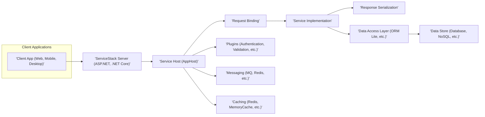

# Project Design Document: ServiceStack Framework

**Version:** 1.1
**Date:** October 26, 2023
**Prepared By:** AI Software Architect

## 1. Introduction

This document provides a detailed architectural design of the ServiceStack framework. It outlines the key components, their interactions, and the overall structure of the framework. This document is intended to serve as a foundation for understanding the system's architecture and will be used as input for subsequent threat modeling activities. This revision incorporates feedback to improve clarity and formatting, particularly for Mermaid diagrams.

## 2. Goals

*   Provide a comprehensive overview of the ServiceStack framework's architecture.
*   Identify key components and their responsibilities with greater detail.
*   Describe the interactions and data flow between components, including specific protocols and data formats.
*   Highlight important security considerations within the design, categorized for better understanding.
*   Serve as a basis for threat modeling and security analysis.

## 3. Scope

This document covers the core architectural elements of the ServiceStack framework, focusing on the server-side components and their interactions. It includes aspects related to request handling, service implementation, data access, and common features. Client-side implementations and specific application logic built on top of ServiceStack are outside the scope of this document. We will delve deeper into the request pipeline and plugin interactions.

## 4. Architectural Overview

ServiceStack is a .NET framework for building web services and applications. It emphasizes simplicity, speed, and a convention-based approach. The core of ServiceStack revolves around the concept of "Services" that handle specific requests.

### 4.1. High-Level Architecture Diagram

### 4.2. Component Descriptions

*   **Client Application:** Any application (web browser, mobile app, desktop application, or another service) that initiates requests to the ServiceStack server. This component is responsible for formatting requests according to the agreed-upon protocol and consuming the responses.
*   **ServiceStack Server:** The host process (typically an ASP.NET or .NET Core application) where the ServiceStack framework is running. This acts as the entry point and orchestrator for handling incoming requests. It manages the lifecycle of requests and responses.
*   **Service Host (AppHost):** The central configuration point for ServiceStack. It is responsible for:
    *   Registering available service implementations.
    *   Configuring the request pipeline and middleware.
    *   Registering and configuring plugins.
    *   Defining routes for mapping requests to services.
    *   Setting up IOC (Inversion of Control) container and dependencies.
*   **Request Binding:**  Responsible for taking incoming requests (e.g., HTTP requests) and converting them into strongly-typed request DTOs (Data Transfer Objects). This involves:
    *   Parsing request headers, query parameters, and body.
    *   Validating the request format and content.
    *   Populating the properties of the request DTO.
*   **Service Implementation:**  The core business logic of the application. Services are classes that implement specific operations based on the received request DTOs. Key aspects include:
    *   Containing the application's core functionality.
    *   Following a convention-based approach for naming and structure.
    *   Interacting with the data access layer or other services.
    *   Returning strongly-typed response DTOs.
*   **Response Serialization:**  Converts the output of the service implementation (typically response DTOs) into a format suitable for the client (e.g., JSON, XML, Protocol Buffers). This process involves:
    *   Formatting the response data according to the requested or default content type.
    *   Setting appropriate response headers.
    *   Handling potential errors and exceptions.
*   **Data Access Layer (ORM Lite, etc.):**  Provides an abstraction layer for interacting with data stores. ServiceStack includes ORM Lite, a lightweight ORM, but can integrate with other data access technologies like Entity Framework Core or Dapper. This layer handles:
    *   Mapping objects to database tables.
    *   Generating SQL queries or other data store commands.
    *   Managing database connections and transactions.
*   **Data Store:** The underlying storage mechanism for the application's data (e.g., relational database like PostgreSQL, MySQL, SQL Server; NoSQL database like MongoDB, Redis).
*   **Plugins:**  Extend the functionality of ServiceStack by providing reusable components. Examples include:
    *   **Authentication Providers:**  Handle user authentication (e.g., JWT, OAuth, Basic Auth).
    *   **Validation Rules:** Define rules for validating request DTOs.
    *   **API Explorers:** Generate interactive API documentation (e.g., Swagger).
    *   **AutoQuery:**  Allows querying data based on conventions.
    *   **CORS:**  Enables Cross-Origin Resource Sharing.
*   **Messaging:**  Supports asynchronous communication patterns using message queues (e.g., RabbitMQ, Redis Pub/Sub, Azure Service Bus). This enables:
    *   Decoupling of services.
    *   Background task processing.
    *   Event-driven architectures.
*   **Caching:**  Provides mechanisms for storing frequently accessed data in memory or distributed caches (e.g., Redis, MemoryCache) to improve performance and reduce database load.

### 4.3. Key Interactions and Data Flow

The typical request lifecycle within ServiceStack follows these steps:

1. **Client Request:** A client application sends a request to the ServiceStack server, typically via HTTP (e.g., a GET request to `/customers/123` or a POST request to `/orders`).
2. **Request Reception:** The ServiceStack server (hosted in ASP.NET or .NET Core) receives the request through its web server component (e.g., Kestrel or IIS).
3. **Routing:** ServiceStack's routing mechanism, configured within the `AppHost`, determines which service should handle the incoming request. This is based on the request URL, HTTP method, and registered routes.
4. **Request Binding:** The appropriate request binder analyzes the request (headers, query string, body) and attempts to populate the corresponding request DTO. For example, a JSON payload in the request body might be deserialized into a `CreateOrder` DTO.
5. **Pre-processing (Plugins):** Registered plugins have the opportunity to intercept the request. This can include:
    *   **Authentication:** Verifying the user's identity.
    *   **Authorization:** Checking if the user has permission to perform the requested action.
    *   **Validation:** Ensuring the request DTO meets predefined validation rules.
6. **Service Execution:** If the request passes pre-processing, the appropriate service implementation is instantiated and its corresponding method (based on the HTTP method and route) is invoked, receiving the populated request DTO as an argument.
7. **Business Logic:** The service executes its core business logic. This might involve:
    *   Interacting with the Data Access Layer to retrieve or persist data.
    *   Calling other internal services or external APIs.
    *   Performing calculations or transformations.
8. **Response Generation:** The service generates a response, typically in the form of a response DTO. This DTO contains the data to be returned to the client.
9. **Post-processing (Plugins):**  Plugins can again intercept the response for tasks like logging, auditing, or modifying response headers.
10. **Response Serialization:** The response DTO is serialized into the desired format (e.g., JSON, XML) based on content negotiation or the server's default configuration.
11. **Client Response:** The serialized response, along with appropriate HTTP status codes and headers, is sent back to the client application.

### 4.4. Communication Protocols

ServiceStack primarily supports:

*   **HTTP:** For standard web service requests using verbs like GET, POST, PUT, DELETE, and PATCH. Supports various content types like `application/json`, `application/xml`, etc.
*   **gRPC:** For high-performance, contract-based API communication using Protocol Buffers for serialization. This offers benefits like strong typing and efficient data transfer.
*   **Message Queues:** For asynchronous communication using various message brokers. ServiceStack provides abstractions for publishing and subscribing to messages.

### 4.5. Data Formats

ServiceStack supports various data formats for request and response serialization, including:

*   **JSON:** The default and most common format due to its simplicity and wide browser support.
*   **XML:** Supported for interoperability with legacy systems or when XML is a preferred format.
*   **CSV:** For exchanging tabular data.
*   **Protocol Buffers:** Used primarily with gRPC for efficient binary serialization.
*   **MessagePack:** Another efficient binary serialization format.

## 5. Security Considerations

Several security aspects are inherent in the design of ServiceStack:

*   **Authentication:**
    *   ServiceStack provides a flexible authentication system through its `IAuthProvider` interface and various built-in providers (e.g., API Keys, JWT, OAuth 2.0, Basic Authentication, Credentials).
    *   Authentication plugins can be easily registered in the `AppHost`.
    *   Session management is also handled by ServiceStack.
*   **Authorization:**
    *   Role-based and permission-based authorization can be implemented using attributes like `[RequiredRole]` and `[RequiredPermission]` on service classes or methods.
    *   Custom authorization logic can be implemented by creating custom authorization attributes or by checking user roles/permissions within the service implementation.
*   **Input Validation:**
    *   ServiceStack strongly encourages the use of strongly-typed DTOs, which helps in defining the expected structure and types of input data.
    *   FluentValidation integration is a common practice for defining complex validation rules for DTOs.
    *   Validation attributes can be applied directly to DTO properties for basic validation.
*   **Secure Communication (HTTPS):**
    *   While ServiceStack itself doesn't enforce HTTPS, it's crucial to configure the hosting environment (e.g., IIS, Kestrel, load balancers) to use HTTPS to encrypt communication between the client and the server.
    *   Consider using HSTS (HTTP Strict Transport Security) headers to enforce HTTPS.
*   **Cross-Site Scripting (XSS) Prevention:**
    *   ServiceStack's default JSON and XML serializers generally escape output to prevent basic XSS attacks.
    *   When rendering user-provided content in views or other contexts, developers must use appropriate encoding techniques to prevent XSS.
*   **Cross-Site Request Forgery (CSRF) Protection:**
    *   ServiceStack offers built-in CSRF protection mechanisms that should be enabled in the `AppHost`. This typically involves generating and validating anti-forgery tokens.
*   **SQL Injection Prevention:**
    *   When using ORM Lite, parameterized queries are used by default, significantly mitigating SQL injection risks.
    *   Developers should avoid constructing raw SQL queries using string concatenation with user input.
*   **Dependency Management:**
    *   Regularly audit and update third-party dependencies to patch known vulnerabilities.
    *   Use tools like OWASP Dependency-Check to identify potential security issues in dependencies.
*   **Rate Limiting and Throttling:**
    *   Implement rate limiting middleware or use ServiceStack's built-in features or plugins to protect against denial-of-service attacks and abuse.
*   **Logging and Auditing:**
    *   Implement comprehensive logging of requests, authentication attempts, authorization failures, and other security-related events.
    *   Consider using structured logging for easier analysis.
*   **Security Headers:** Configure appropriate security headers like Content Security Policy (CSP), X-Content-Type-Options, and Referrer-Policy to enhance security.

## 6. Technologies Used

*   **.NET Framework (4.5+) or .NET Core (.NET 6+ recommended):** The underlying platform for ServiceStack.
*   **ASP.NET or ASP.NET Core:** Typically used as the web server hosting ServiceStack.
*   **ORM Lite:** ServiceStack's built-in lightweight ORM supporting various database providers.
*   **Database Providers:**  Support for a wide range of relational databases (SQL Server, PostgreSQL, MySQL, SQLite) and NoSQL databases (Redis, MongoDB).
*   **Message Queue Providers:** Integration with popular message brokers like RabbitMQ, Redis, Azure Service Bus, Amazon SQS.
*   **Caching Providers:** Support for in-memory caching (`MemoryCache`) and distributed caching solutions (Redis, Memcached).
*   **Serialization Libraries:**  Built-in support for JSON.NET, XML serializers, and Protocol Buffers.

## 7. Deployment Considerations

ServiceStack applications can be deployed in various environments:

*   **IIS (Internet Information Services):** For traditional Windows-based deployments, leveraging the full features of IIS.
*   **Kestrel:** A cross-platform, high-performance web server suitable for .NET Core applications, often used behind a reverse proxy like Nginx or Apache in production.
*   **Docker Containers:** For containerized deployments, enabling portability and scalability. Orchestration platforms like Kubernetes can be used to manage containerized ServiceStack applications.
*   **Serverless Environments (e.g., AWS Lambda, Azure Functions):** While ServiceStack is primarily designed for long-running services, certain aspects can be adapted for serverless deployments.
*   **Cloud Platforms (AWS, Azure, GCP):** Leveraging cloud-specific services for hosting, databases, messaging, and caching.

Security considerations during deployment include:

*   **Secure Configuration:**  Properly configure the web server (e.g., disabling unnecessary features, setting appropriate timeouts), application settings (e.g., connection strings, API keys), and environment variables.
*   **Network Security:**  Implement firewall rules to restrict access to the server and specific ports. Use network segmentation to isolate different parts of the infrastructure.
*   **Access Control:**  Implement strong access control mechanisms for the server, databases, and other resources. Follow the principle of least privilege.
*   **Regular Security Updates:**  Maintain up-to-date operating systems, web servers, .NET runtime, and ServiceStack libraries to patch known vulnerabilities. Automate patching where possible.
*   **Secrets Management:**  Securely manage sensitive information like connection strings, API keys, and certificates using dedicated secrets management services (e.g., Azure Key Vault, AWS Secrets Manager).
*   **Monitoring and Alerting:** Implement monitoring and alerting systems to detect suspicious activity and potential security breaches.

## 8. Future Considerations

*   **Evolution of .NET:**  Continuously adapt to the latest features and security best practices in the .NET ecosystem.
*   **Microservices Architecture:**  Further enhance ServiceStack's capabilities for building and managing microservices, including service discovery and inter-service communication patterns.
*   **GraphQL Support:**  Explore deeper integration with GraphQL as an alternative API paradigm.
*   **Real-time Communication:**  Enhance support for real-time communication protocols like WebSockets.
*   **Enhanced Security Features:**  Continuously evaluate and implement new security features and address emerging threats proactively.

This document provides a more detailed and formatted understanding of the ServiceStack framework's architecture, suitable for in-depth threat modeling and security analysis. The improvements focus on clarity, specific examples, and adherence to formatting guidelines.
