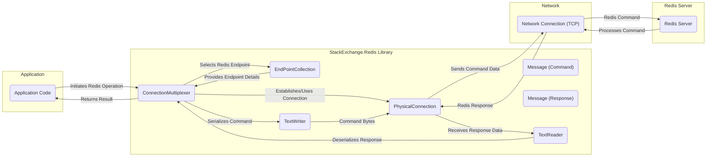

## Project Design Document: StackExchange.Redis Library

**Revision:** 1.1
**Date:** October 26, 2023
**Author:** Gemini (AI Language Model)

### 1. Introduction

This document provides a detailed design overview of the StackExchange.Redis library, a widely adopted and high-performance .NET client for the Redis in-memory data structure store, often used as a cache, message broker, and database. This document is specifically crafted to serve as a foundational resource for subsequent threat modeling exercises. It meticulously outlines the key components, architectural design, data flow mechanisms, and crucial security considerations inherent in the library's operation. This document targets developers, security engineers, and architects involved in systems utilizing StackExchange.Redis.

### 2. System Overview

The StackExchange.Redis library empowers .NET applications to seamlessly interact with Redis servers. It offers a robust and feature-rich interface for executing a comprehensive range of Redis commands, efficiently managing connections to Redis instances, and adeptly handling asynchronous operations. The library is engineered for efficiency and resilience, providing essential features such as connection pooling and multiplexing to optimize resource utilization, and comprehensive support for diverse Redis functionalities including Publish/Subscribe messaging, atomic transactions, and server-side Lua scripting.

### 3. Architectural Design

The library's architecture is modular and can be dissected into several distinct yet interconnected components:

*   **`ConnectionMultiplexer`:** This serves as the central orchestrator, responsible for managing and pooling connections to one or more Redis server endpoints. It handles the complexities of connection establishment, persistent connection maintenance, and the efficient multiplexing of commands across these established connections. It is the primary entry point for most interactions with the library.
*   **`EndPointCollection`:** This component maintains a dynamic collection of Redis server endpoints (defined by hostnames or IP addresses and port numbers) that the `ConnectionMultiplexer` can connect to. It supports both statically configured endpoints and dynamic endpoint discovery mechanisms, crucial for clustered Redis deployments.
*   **`PhysicalConnection`:** Represents a single, underlying physical TCP connection established with a Redis server. This component manages the low-level intricacies of serializing and sending Redis commands as byte streams and receiving the corresponding responses. It handles connection state management and error detection at the transport layer.
*   **`Message`:**  This structure encapsulates a Redis command or a server response. It holds the raw byte arrays representing the command being sent to the Redis server or the response received back. This abstraction allows for efficient handling of the binary protocol.
*   **`TextWriter` and `TextReader`:** These components are responsible for the serialization and deserialization of Redis commands and responses, respectively. They translate .NET objects and data structures into the byte stream format required for network transmission and vice versa, adhering to the Redis protocol.
*   **`IServer`:** This interface provides access to a suite of server-level commands and information. It allows querying the Redis server for configuration details, retrieving server statistics, and obtaining information about the Redis cluster topology (if applicable).
*   **`IDatabase`:** This interface represents a specific Redis database (numbered from 0 to 15 by default). It exposes methods for executing a wide array of data manipulation commands, such as retrieving values (`GET`), setting values (`SET`), and performing operations on data structures like hashes (`HGET`), lists, and sets.
*   **`ISubscriber`:** This interface facilitates interaction with Redis's powerful Publish/Subscribe messaging system. It provides methods for subscribing to channels to receive messages and publishing messages to specific channels.
*   **`ITransaction`:** This interface enables the grouping of multiple Redis commands into a single atomic operation. All commands within a transaction are guaranteed to be executed sequentially and without interruption, ensuring data consistency.
*   **`IBatch`:** This interface allows for the efficient execution of multiple Redis commands without waiting for a response after each individual command. This is particularly beneficial for bulk operations, significantly reducing network round trips and improving performance.
*   **Configuration Options:** A comprehensive set of parameters that govern the behavior of the `ConnectionMultiplexer`. These options include settings for connection timeouts, retry strategies in case of connection failures, password-based authentication credentials, and preferences for TLS/SSL encryption.
*   **Async/Await Support:** The library extensively leverages asynchronous programming patterns (`async`/`await`) throughout its API. This allows for non-blocking operations, preventing the application's main thread from being blocked while waiting for Redis server responses, leading to improved responsiveness and scalability.
*   **Lua Scripting Support:** The library provides mechanisms for executing Lua scripts directly on the Redis server. This allows for complex operations to be performed server-side, reducing network traffic and improving performance for certain use cases.
*   **Clustering Support:**  The library offers robust support for connecting to and interacting with Redis clusters. It handles the complexities of routing commands to the correct cluster nodes and managing cluster topology changes.

### 4. Data Flow Diagram

**Data Flow Description:**

1. The **Application Code** initiates a Redis operation (e.g., `GET`, `SET`, `PUBLISH`) by invoking methods on the `ConnectionMultiplexer` or its related interfaces (`IDatabase`, `ISubscriber`).
2. The **`ConnectionMultiplexer`** consults the **`EndPointCollection`** to select the appropriate Redis server endpoint to communicate with.
3. The **`ConnectionMultiplexer`** either establishes a new **`PhysicalConnection`** or reuses an existing one from its connection pool.
4. The command to be executed is serialized into a **`Message (Command)`** by the **`TextWriter`**, converting it into a byte stream adhering to the Redis protocol.
5. The serialized command bytes are passed to the **`PhysicalConnection`**.
6. The **`PhysicalConnection`** sends the command data over the **Network Connection (TCP)** to the **Redis Server**.
7. The **Redis Server** receives the command, processes it, and generates a response.
8. The **Redis Server** sends the response data back over the **Network Connection (TCP)**.
9. The **`PhysicalConnection`** receives the response data.
10. The **`TextReader`** deserializes the received data back into a **`Message (Response)`**.
11. The **`ConnectionMultiplexer`** processes the response and returns the result to the originating **Application Code**.

### 5. Security Considerations

Security is a paramount concern when utilizing the StackExchange.Redis library. Several key aspects must be carefully considered:

*   **Connection Security (TLS/SSL):** The library offers robust support for establishing secure, encrypted connections to Redis servers using TLS/SSL. This is crucial for protecting sensitive data transmitted between the application and the Redis server from eavesdropping and tampering.
    *   Enabling TLS/SSL requires explicit configuration within the `ConnectionMultiplexer` options.
    *   Properly configuring certificate validation settings is essential to prevent man-in-the-middle attacks. Consider using certificate pinning for enhanced security.
*   **Authentication:** Redis provides mechanisms for authentication, including password-based authentication and more granular Access Control Lists (ACLs). The library allows providing these credentials during the `ConnectionMultiplexer` initialization.
    *   Securely storing and managing Redis credentials is of utmost importance. Avoid hardcoding credentials directly in the application code. Utilize secure configuration management techniques or secrets management services.
    *   Leveraging strong passwords or implementing fine-grained access control using Redis ACLs is highly recommended to restrict access to sensitive data and commands.
*   **Command Injection:** While less probable in a client library compared to applications directly handling user input in queries, vigilance is required. Improperly constructing Redis commands by concatenating unsanitized user-provided data could potentially lead to command injection vulnerabilities, although the library's parameterized command execution largely mitigates this.
    *   Exercise caution when dynamically constructing commands based on external input. Always sanitize and validate user-provided data before incorporating it into Redis commands.
*   **Denial of Service (DoS):**  Misconfiguration of connection settings or sending an excessive volume of requests can potentially lead to Denial of Service attacks against the Redis server or the application itself.
    *   Carefully configure connection timeouts, retry attempts, and maximum connection pool sizes to prevent resource exhaustion.
    *   Implement rate limiting mechanisms on the application side to control the number of requests sent to the Redis server, especially when handling user-generated actions.
*   **Data Serialization/Deserialization:** If custom serialization mechanisms are employed (beyond the library's default handling), vulnerabilities in the serialization logic could be exploited to execute arbitrary code or leak sensitive information.
    *   Adhere to well-established and secure serialization libraries and practices. Thoroughly vet any custom serialization implementations.
*   **Dependency Management:** The StackExchange.Redis library relies on other .NET libraries. Security vulnerabilities discovered in these dependencies could indirectly impact the security of applications using StackExchange.Redis.
    *   Maintain a vigilant approach to dependency management. Regularly update to the latest versions of all dependencies to patch known vulnerabilities. Utilize dependency scanning tools to identify potential risks.
*   **Configuration Security:**  Securely managing connection strings and authentication details is paramount. Exposing these details can lead to unauthorized access to the Redis server.
    *   Avoid hardcoding sensitive information in application code or configuration files. Utilize environment variables, secure configuration providers with appropriate access controls, or dedicated secrets management solutions like Azure Key Vault or HashiCorp Vault.
*   **Pub/Sub Security:** In scenarios utilizing Redis's Publish/Subscribe functionality, ensure that only authorized clients can publish or subscribe to specific channels, preventing unauthorized information dissemination or manipulation.
    *   Leverage Redis ACLs to control access to specific channels and enforce authorization policies.
*   **Lua Scripting Security:** When utilizing Lua scripting, meticulously review and validate all scripts before execution to prevent the introduction of malicious code that could compromise the Redis server or data.
    *   Adhere to the principle of least privilege when defining Lua scripts. Limit the use of potentially dangerous Lua commands and sandbox script execution if possible.
*   **Redis Cluster Security:** When connecting to a Redis cluster, ensure that all individual nodes within the cluster are properly secured, as vulnerabilities in one node could potentially compromise the entire cluster.

### 6. Deployment Considerations

Deploying applications utilizing the StackExchange.Redis library requires careful consideration of several factors:

*   **Network Connectivity:** Ensure robust and low-latency network connectivity between the application server(s) and the Redis server(s). Network latency can significantly impact the performance of Redis operations.
*   **Firewall Rules:** Configure firewall rules to permit network traffic on the necessary ports between the application and the Redis server. Typically, this involves allowing outbound traffic from the application server to the Redis server on port 6379 (default).
*   **Resource Allocation:**  Adequately provision resources (CPU, memory, network bandwidth) for both the application and the Redis server to handle the anticipated workload and traffic volume. Insufficient resources can lead to performance degradation and instability.
*   **Connection Pooling:** The library's built-in connection pooling mechanism is crucial for optimizing resource utilization and performance. Configure the maximum pool size appropriately based on the application's concurrency and request volume.
*   **High Availability:** For production environments demanding high availability, consider deploying Redis in a highly available configuration, such as using Redis Sentinel for failover or Redis Cluster for data sharding and replication. The library supports seamless integration with these configurations.
*   **Monitoring:** Implement comprehensive monitoring of both the application's Redis client interactions (e.g., connection health, command latency, error rates) and the Redis server itself (e.g., CPU usage, memory consumption, network traffic). This allows for proactive identification and resolution of potential issues.

### 7. Assumptions and Constraints

The following assumptions and constraints are relevant to this design document:

*   It is assumed that developers utilizing the library possess a foundational understanding of core Redis concepts and its operational principles.
*   This document primarily focuses on the core functionalities of the library and may not delve into every advanced feature or handle all possible edge cases.
*   The security considerations outlined are based on widely accepted best practices and general threat landscapes. Specific application requirements and unique threat models may necessitate additional security measures.
*   The performance characteristics of the library can fluctuate depending on various factors, including network latency, the load on the Redis server, and the specific workload patterns of the application.
*   The library inherently relies on the underlying .NET framework and its inherent security features and limitations.

This revised design document provides a more detailed and refined overview of the StackExchange.Redis library, strengthening its utility as a foundation for thorough threat modeling activities. By understanding the intricacies of its architecture, data flow, and security considerations, security professionals can more effectively identify potential vulnerabilities and implement appropriate mitigation strategies.
