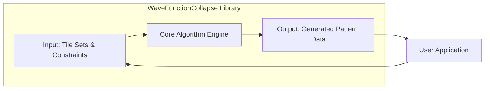
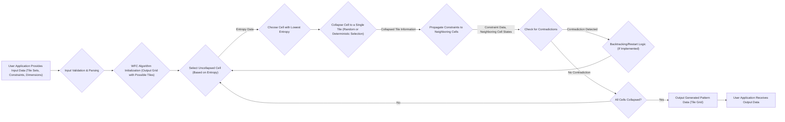

# Project Design Document: WaveFunctionCollapse

**Version:** 1.1
**Date:** October 26, 2023
**Author:** AI Software Architect

## 1. Introduction

This document outlines the design of the WaveFunctionCollapse (WFC) project, based on the implementation found at [https://github.com/mxgmn/WaveFunctionCollapse](https://github.com/mxgmn/WaveFunctionCollapse). This document serves as a comprehensive overview of the system's architecture, components, and data flow, specifically tailored to facilitate future threat modeling activities. It details the core logic and structure of the WFC algorithm as implemented in the provided repository, emphasizing aspects relevant to security analysis.

## 2. Goals and Objectives

The primary goal of this project is to implement the Wave Function Collapse algorithm, a procedural content generation technique that creates patterns based on a given sample or ruleset. The objectives of this design document, with a focus on security, are:

*   To provide a clear and detailed description of the WFC implementation's architecture and internal workings.
*   To identify the key components and their interactions, highlighting potential trust boundaries and data exchange points.
*   To illustrate the data flow through the WFC process, pinpointing stages where data manipulation or injection could occur.
*   To serve as a robust foundation for subsequent threat modeling exercises, enabling the identification of potential vulnerabilities and attack vectors.

## 3. System Architecture

The WaveFunctionCollapse project, as implemented, is primarily a library or a set of algorithms designed to be integrated into other applications. It does not operate as a standalone service with network endpoints. Therefore, the architecture focuses on the internal structure of the library and its interaction with the embedding user application.

**Components:**

*   **Input: Tile Sets & Constraints:** This component represents the data structures and logic responsible for receiving and validating the input provided to the WFC algorithm. This includes:
    *   **Tile Definitions:**  Data representing individual tiles (e.g., image data, identifiers).
    *   **Adjacency Rules/Constraints:**  Specifications on how tiles can be placed next to each other. This can be in the form of explicit rules or derived from a sample pattern.
    *   **Output Dimensions:**  The desired width and height of the generated pattern.
    *   **Algorithm Parameters:**  Optional settings that influence the generation process (e.g., seed value for randomness).
*   **Core Algorithm Engine:** This is the central component housing the core logic of the WFC algorithm. It encompasses the steps for:
    *   **Initialization:** Setting up the output grid and initial possibilities for each cell.
    *   **Entropy Calculation:** Determining the uncertainty or number of possibilities for each cell.
    *   **Cell Selection:** Choosing the next cell to collapse based on a defined strategy (often lowest entropy).
    *   **Collapse:**  Randomly or deterministically selecting a valid tile for the chosen cell.
    *   **Constraint Propagation:** Updating the possible tiles for neighboring cells based on the collapsed cell's tile and the defined constraints.
    *   **Conflict Detection:** Identifying situations where no valid tile can be placed in a cell.
    *   **Backtracking (if implemented):** Reverting to a previous state to resolve conflicts.
*   **Output: Generated Pattern Data:** This component represents the final output of the WFC algorithm. It consists of:
    *   **Tile Grid:** A data structure representing the generated pattern, where each cell contains the identifier of the placed tile.
    *   **Metadata (Optional):**  Information about the generation process, such as the seed used or the time taken.
*   **User Application:** This represents the external program or system that integrates and utilizes the WaveFunctionCollapse library. Its responsibilities include:
    *   **Providing Input:** Loading or creating tile sets, constraints, and output dimensions.
    *   **Invoking the Algorithm:** Calling the appropriate functions in the WFC library to initiate the generation process.
    *   **Receiving Output:**  Obtaining the generated pattern data from the library.
    *   **Utilizing the Output:**  Displaying, storing, or further processing the generated pattern.

## 4. Data Flow

The process of generating a pattern using the WaveFunctionCollapse algorithm involves the following data flow, highlighting potential points of interest for security analysis:

**Detailed Steps:**

1. **User Application Provides Input Data (Tile Sets, Constraints, Dimensions):** The user application provides the raw input data to the WFC library. This data could originate from files, user input, or other sources.
2. **Input Validation & Parsing:** The WFC library parses and validates the input data to ensure it conforms to the expected format and constraints (e.g., valid tile identifiers, consistent constraint definitions, reasonable dimensions).
3. **WFC Algorithm Initialization (Output Grid with Possible Tiles):** The algorithm initializes the output grid, where each cell initially holds the set of all possible tiles.
4. **Select Uncollapsed Cell (Based on Entropy):** The algorithm selects the next cell to be collapsed. This often involves calculating the entropy (number of possible tiles) for each uncollapsed cell.
5. **Choose Cell with Lowest Entropy:**  The cell with the lowest entropy is typically chosen to be collapsed next.
6. **Collapse Cell to a Single Tile (Random or Deterministic Selection):** A single tile is selected for the chosen cell. This selection can be random (weighted by tile frequencies or other factors) or deterministic.
7. **Propagate Constraints to Neighboring Cells:** Based on the tile chosen for the collapsed cell and the defined adjacency rules, the possible tiles for neighboring cells are updated, removing any tiles that violate the constraints.
8. **Check for Contradictions:** The algorithm checks if any cell has reached a state where it has no possible valid tiles, indicating a contradiction.
9. **Backtracking/Restart Logic (If Implemented):** If a contradiction is detected, the algorithm may backtrack to a previous state or restart the generation process.
10. **All Cells Collapsed?:** The algorithm checks if all cells in the output grid have been successfully collapsed to a single tile.
11. **Output Generated Pattern Data (Tile Grid):** Once all cells are collapsed, the resulting grid of tile identifiers represents the generated pattern.
12. **User Application Receives Output Data:** The generated pattern data is returned to the user application.

## 5. Components Details

This section provides a more detailed breakdown of the key components, highlighting potential security considerations within each.

*   **Tile Set Loader & Validator:**
    *   **Functionality:** Reads and parses tile definitions from various sources (e.g., image files, configuration files). Validates the integrity and format of tile data.
    *   **Security Considerations:** Vulnerable to path traversal attacks if loading from file paths provided by the user. Improper parsing could lead to buffer overflows or other memory corruption issues if tile data is malformed or excessively large. Lack of validation could allow injection of malicious data disguised as tile information.
*   **Constraint Handler & Validator:**
    *   **Functionality:**  Manages and validates the rules defining how tiles can be adjacent. This might involve parsing explicit rule sets or inferring rules from sample patterns.
    *   **Security Considerations:**  Complex or poorly validated constraint definitions could lead to excessive memory consumption or infinite loops during constraint propagation. Maliciously crafted constraints could force the algorithm into computationally expensive states, leading to denial of service.
*   **Core Algorithm Engine (Solver):**
    *   **Functionality:** Implements the core WFC logic, including entropy calculation, cell selection, collapse, and propagation.
    *   **Security Considerations:**  Potential for integer overflows or underflows in calculations related to entropy or grid indexing. Inefficient algorithm implementation could be exploited for denial of service. The randomness source used for tile selection should be cryptographically secure if predictability is a concern.
*   **Output Buffer & Renderer (Optional, May be in User Application):**
    *   **Functionality:** Stores the generated pattern data and potentially renders it visually.
    *   **Security Considerations:**  If the output buffer is not properly managed, it could lead to buffer overflows if the generated pattern exceeds expected dimensions. If rendering is included, vulnerabilities in the rendering library could be exploited.

## 6. Security Considerations (Detailed)

This section outlines potential security threats and vulnerabilities associated with the WaveFunctionCollapse project, categorized for clarity.

*   **Input Validation Vulnerabilities:**
    *   **Malicious Tile Sets:**  Providing tile sets with excessively large image data or crafted content could lead to memory exhaustion or vulnerabilities in image processing libraries (if used).
    *   **Exploiting Constraint Logic:**  Crafted constraints could lead to infinite loops or exponential processing times within the constraint propagation logic, causing denial of service.
    *   **Path Traversal:** If tile sets or constraints are loaded from file paths provided by the user, an attacker could potentially access arbitrary files on the system.
    *   **Format String Bugs:** If input parsing involves format strings, vulnerabilities could arise if user-controlled data is directly used in format string functions.
*   **Algorithm Implementation Flaws:**
    *   **Integer Overflows/Underflows:**  Errors in calculations related to grid indexing, entropy, or other numerical values could lead to unexpected behavior or crashes.
    *   **Denial of Service (DoS):**  Specific input combinations or algorithm states might trigger computationally expensive operations, leading to resource exhaustion and denial of service.
    *   **Predictable Output:** If the random number generator used for tile selection is not cryptographically secure, the generated patterns might be predictable, which could be a security concern in certain applications.
*   **Dependency Vulnerabilities:**
    *   If the WFC implementation relies on external libraries for image processing, data parsing, or other functionalities, vulnerabilities in those libraries could be exploited.
    *   It's crucial to keep dependencies up-to-date and scan for known vulnerabilities.
*   **Integration Risks:**
    *   The security of the overall system heavily depends on how the WFC library is integrated into the user application.
    *   Vulnerabilities in the user application could allow attackers to manipulate the input to the WFC library or exploit the generated output.
    *   Improper handling of error conditions or exceptions thrown by the WFC library in the user application could expose sensitive information or lead to unexpected behavior.

## 7. Deployment Considerations

The WaveFunctionCollapse project, being a library, is typically "deployed" by integrating it into another application. Deployment considerations from a security perspective include:

*   **Secure Integration:** Ensure the user application integrates the WFC library securely, properly sanitizing inputs before passing them to the library and handling the output safely.
*   **Dependency Management:**  Carefully manage the dependencies of the WFC library and the user application to avoid introducing vulnerable components. Use dependency scanning tools to identify and address potential issues.
*   **Resource Limits:**  Consider the resource requirements of the WFC algorithm (CPU, memory) and set appropriate limits in the deployment environment to prevent denial-of-service attacks.
*   **Sandboxing/Isolation:**  If the WFC library processes untrusted input, consider running it in a sandboxed or isolated environment to limit the potential impact of vulnerabilities.

## 8. Future Considerations (Security Focused)

Future development efforts could incorporate the following security enhancements:

*   **Robust Input Sanitization:** Implement comprehensive input validation and sanitization to prevent injection attacks and handle malformed data gracefully.
*   **Algorithm Hardening:**  Review the core algorithm for potential integer overflows, infinite loops, or other implementation flaws and implement mitigations.
*   **Secure Random Number Generation:**  Utilize cryptographically secure random number generators for tile selection if predictability is a security concern.
*   **Dependency Management Automation:**  Implement automated dependency scanning and update processes to ensure all dependencies are up-to-date and free of known vulnerabilities.
*   **Security Audits:**  Conduct regular security audits and penetration testing to identify and address potential vulnerabilities in the WFC library.
*   **Error Handling and Logging:** Implement secure error handling and logging mechanisms that do not expose sensitive information.

This improved design document provides a more detailed and security-focused overview of the WaveFunctionCollapse project, serving as a valuable resource for subsequent threat modeling activities.