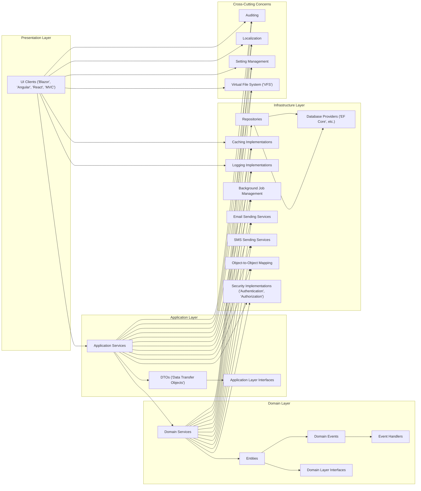
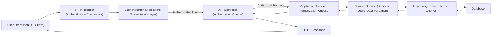

## Project Design Document: ABP Framework for Threat Modeling (Improved)

**1. Introduction**

This document provides an enhanced architectural overview of the ABP Framework, an open-source application framework for building modern web applications and APIs with .NET. This improved version is specifically tailored to facilitate comprehensive threat modeling activities by providing deeper insights into the framework's components, data flows, security mechanisms, and deployment considerations.

**2. Project Overview**

*   **Project Name:** ABP Framework
*   **Project Goal:** To provide a comprehensive and modular framework for building robust and scalable .NET applications, abstracting away common infrastructure concerns and promoting security best practices.
*   **Target Audience:** Security engineers, architects, and developers involved in threat modeling, security assessments, and the secure development of ABP-based applications.
*   **Key Features:**
    *   Modular and extensible architecture.
    *   Layered design enforcing separation of concerns.
    *   Built-in security features and conventions.
    *   Comprehensive authentication and authorization system.
    *   Abstraction of common security concerns.
    *   Support for various UI frameworks and database providers.

**3. Architecture Overview**

The ABP Framework employs a layered architecture, which is crucial for understanding potential attack vectors and security boundaries.

*   **Presentation Layer:**  Handles user interaction and presents data. This layer is a primary target for client-side attacks.
    *   UI Clients ('Blazor', 'Angular', 'React', 'MVC'):  Responsible for rendering the user interface and handling user input. Susceptible to XSS and other client-side vulnerabilities.
    *   API Controllers: Receive and process HTTP requests, acting as the entry point for external interactions. Requires robust input validation and authorization.

*   **Application Layer:** Contains application-specific logic and orchestrates interactions between the presentation and domain layers.
    *   Application Services: Implement use cases and expose functionalities to the presentation layer. Requires authorization checks to prevent unauthorized access.
    *   DTOs ('Data Transfer Objects'): Used for data transfer between layers. Ensure sensitive data is not inadvertently exposed.
    *   Application Layer Interfaces: Define contracts for application services, promoting decoupling.

*   **Domain Layer:** Represents the core business logic and data of the application. This layer should be protected from direct external access.
    *   Entities: Represent business objects and their state. Sensitive data within entities needs appropriate protection.
    *   Domain Services: Implement complex business rules and logic. Ensure proper authorization and data validation within domain services.
    *   Domain Events: Allow decoupling of domain logic. Ensure event handlers do not introduce security vulnerabilities.
    *   Event Handlers: React to domain events. Require careful implementation to avoid unintended side effects or security breaches.
    *   Domain Layer Interfaces: Define contracts for domain services and entities.

*   **Infrastructure Layer:** Provides concrete implementations for cross-cutting concerns and external dependencies.
    *   Repositories: Abstract data access logic, mitigating direct database access from other layers. Vulnerabilities here can lead to data breaches.
    *   Database Providers ('EF Core', etc.): Interact with the underlying database. Susceptible to SQL injection if queries are not properly parameterized.
    *   Caching Implementations: Store frequently accessed data. Ensure sensitive data is not cached insecurely.
    *   Logging Implementations: Record application events. Secure logging practices are crucial for incident detection and response.
    *   Background Job Management: Executes asynchronous tasks. Ensure jobs are properly authorized and do not introduce vulnerabilities.
    *   Email Sending Services: Handle sending emails. Potential for abuse if not properly secured.
    *   SMS Sending Services: Handle sending SMS messages. Potential for abuse if not properly secured.
    *   Object-to-Object Mapping: Maps between different object types. Ensure mapping configurations do not expose sensitive data.
    *   Security Implementations ('Authentication', 'Authorization'): Provides the core security mechanisms of the framework. Vulnerabilities here can have significant impact.

*   **Cross-Cutting Concerns:** Modules that provide functionalities across different layers.
    *   Auditing: Tracks changes to data. Ensure audit logs are securely stored and protected from tampering.
    *   Localization: Supports multiple languages. Ensure localization resources do not introduce vulnerabilities.
    *   Setting Management: Manages application settings. Secure storage and access control for sensitive settings are critical.
    *   Virtual File System ('VFS'): Allows access to embedded resources. Ensure access controls are in place to prevent unauthorized access to sensitive files.

**4. Key Components and Modules (Detailed)**

*   **ABP Framework Core:** The foundation of the framework, providing essential services like dependency injection, modularity, and configuration.
    *   **Dependency Injection Container:** Manages object dependencies. Misconfigurations can lead to security vulnerabilities.
    *   **Module System:** Enables modular application development. Untrusted or malicious modules can introduce significant risks.
    *   **Configuration System:** Manages application settings. Secure storage and access control are crucial.
    *   **Exception Handling:** Handles application errors. Ensure sensitive information is not leaked in error messages.

*   **ABP Identity:** A comprehensive solution for authentication and authorization.
    *   **User Management:** Manages user accounts. Vulnerabilities here can lead to unauthorized access.
    *   **Role Management:** Manages user roles and permissions. Incorrectly configured roles can lead to privilege escalation.
    *   **Permission Management:** Controls access to specific features and resources. Fine-grained permission control is essential for security.
    *   **Login and Logout:** Handles user authentication. Secure implementation is critical to prevent credential compromise.
    *   **Password Management:** Handles password storage and retrieval. Strong hashing algorithms and secure storage are mandatory.
    *   **Two-Factor Authentication (2FA):** Adds an extra layer of security. Ensure robust implementation to prevent bypass.
    *   **External Login Providers:** Allows authentication via third-party providers. Secure integration is crucial.

*   **ABP Data:** Provides abstractions for data access.
    *   **Repositories:** Abstract data access logic. Ensure proper implementation to prevent SQL injection and other data access vulnerabilities.
    *   **Unit of Work:** Manages database transactions. Ensure transactional integrity to prevent data corruption.
    *   **Data Filters:** Allow filtering of data based on certain criteria (e.g., tenant). Ensure proper implementation to prevent data leakage.

*   **ABP Auditing:** Automatically logs changes to entities.
    *   **Audit Log Storage:** Secure storage of audit logs is essential to prevent tampering.
    *   **Audit Data:** Ensure sensitive data is not inadvertently logged.

*   **ABP Background Jobs:** Enables asynchronous task execution.
    *   **Job Scheduling:** Ensure only authorized users or systems can schedule jobs.
    *   **Job Execution:** Secure execution environment to prevent malicious code execution.

*   **ABP Real-Time:** Provides real-time communication capabilities using SignalR.
    *   **Hub Security:** Secure access to SignalR hubs to prevent unauthorized communication.
    *   **Message Security:** Ensure secure transmission of real-time messages.

*   **ABP CLI (Command-Line Interface):** Provides development and administrative tools.
    *   **Access Control:** Restrict access to the CLI to authorized personnel only.
    *   **Secure Operations:** Ensure CLI commands do not introduce security vulnerabilities.

**5. Data Flow (with Security Context)**

The following diagram illustrates a typical request flow, highlighting key security checkpoints.

*   **User Interaction ('UI Client'):** The user interacts with the application, potentially providing credentials.
*   **HTTP Request (Authentication Credentials):** The UI sends an HTTP request, which may include authentication credentials (e.g., cookies, tokens).
*   **Authentication Middleware (Presentation Layer):** The authentication middleware verifies the user's identity based on the provided credentials. This is a crucial security checkpoint.
*   **API Controller (Authorization Checks):** The API controller checks if the authenticated user has the necessary permissions to access the requested resource or perform the action.
*   **Application Service (Authorization Checks):** The application service may perform further authorization checks to enforce business rules.
*   **Domain Service (Business Logic, Data Validation):** The domain service executes business logic and performs data validation to prevent invalid or malicious data from being processed.
*   **Repository (Parameterized Queries):** The repository interacts with the database using parameterized queries to prevent SQL injection attacks.
*   **Database:** The database stores and retrieves data. Access control and data encryption are important security measures at this level.
*   **HTTP Response:** The server sends an HTTP response back to the user. Ensure sensitive data is not exposed in the response.

**6. Deployment Model (with Security Considerations)**

ABP applications can be deployed in various environments, each with its own security implications.

*   **Cloud Platforms (Azure, AWS, GCP):**
    *   **Security Considerations:** Leverage cloud-native security services (e.g., Azure Active Directory, AWS IAM, Google Cloud IAM). Securely configure network access (e.g., Network Security Groups, Security Groups). Implement encryption for data at rest and in transit using cloud provider services. Regularly review and update security configurations.
*   **On-Premises Servers:**
    *   **Security Considerations:** Implement robust firewall rules and network segmentation. Secure the operating system and web server. Implement strong access controls for the server environment. Regularly patch and update systems.
*   **Containerized Environments (Docker, Kubernetes):**
    *   **Security Considerations:** Secure container images and registries. Implement network policies to control container communication. Use security context constraints to limit container privileges. Regularly scan containers for vulnerabilities. Secure the Kubernetes control plane.

**7. Security Considerations (Detailed)**

This section expands on the initial security considerations, providing more specific details.

*   **Authentication and Authorization:**
    *   **Threats:** Brute-force attacks, credential stuffing, session hijacking, privilege escalation, insecure direct object references.
    *   **Mitigations:** Implement strong password policies, multi-factor authentication, secure session management, role-based access control, principle of least privilege.
*   **Input Validation:**
    *   **Threats:** SQL injection, cross-site scripting (XSS), command injection, path traversal, XML External Entity (XXE) attacks.
    *   **Mitigations:** Implement robust input validation on all user-supplied data, use parameterized queries, encode output data, sanitize HTML content.
*   **Data Protection:**
    *   **Threats:** Data breaches, unauthorized access to sensitive data, data tampering.
    *   **Mitigations:** Encrypt sensitive data at rest and in transit, implement access controls, use data masking or tokenization where appropriate.
*   **Cross-Site Scripting (XSS):**
    *   **Threats:** Stealing user credentials, session hijacking, defacement of websites.
    *   **Mitigations:** Encode output data, use a Content Security Policy (CSP), implement HTTP Only and Secure flags for cookies.
*   **Cross-Site Request Forgery (CSRF):**
    *   **Threats:** Unauthorized actions performed on behalf of a legitimate user.
    *   **Mitigations:** Implement anti-CSRF tokens, use SameSite cookie attribute.
*   **Dependency Management:**
    *   **Threats:** Exploiting vulnerabilities in third-party libraries.
    *   **Mitigations:** Regularly update dependencies, use dependency scanning tools, follow secure coding practices.
*   **Logging and Monitoring:**
    *   **Threats:** Failure to detect and respond to security incidents.
    *   **Mitigations:** Implement comprehensive logging, monitor logs for suspicious activity, set up alerts for security events.
*   **API Security:**
    *   **Threats:** Unauthorized access to APIs, data breaches through APIs, denial-of-service attacks on APIs.
    *   **Mitigations:** Implement API authentication and authorization (e.g., OAuth 2.0, JWT), rate limiting, input validation, secure communication (HTTPS).
*   **Background Job Security:**
    *   **Threats:** Unauthorized execution of background jobs, denial of service.
    *   **Mitigations:** Implement authorization checks for job scheduling and execution, secure job parameters.
*   **Module Security:**
    *   **Threats:** Malicious or vulnerable modules compromising the application.
    *   **Mitigations:** Review and audit third-party modules, implement security checks within modules.
*   **Deployment Security:**
    *   **Threats:** Misconfigurations leading to vulnerabilities, exposure of sensitive information.
    *   **Mitigations:** Follow security best practices for the deployment environment, secure configuration files, limit access to deployment infrastructure.
*   **Communication Security:**
    *   **Threats:** Man-in-the-middle attacks, eavesdropping.
    *   **Mitigations:** Use HTTPS for all communication, implement secure communication protocols between components.

**8. Technology Stack**

*   **Programming Language:** C#
*   **Framework:** .NET
*   **Web Frameworks (Optional):** ASP.NET Core MVC, Blazor, Angular, React
*   **Database Providers (Examples):** Entity Framework Core (SQL Server, PostgreSQL, MySQL, etc.), MongoDB
*   **Dependency Injection:** Microsoft.Extensions.DependencyInjection
*   **Caching:** Distributed caching (Redis, Memcached) or in-memory caching
*   **Logging:** Serilog, NLog
*   **Real-Time Communication:** SignalR

**9. Diagrams**

*   **Architecture Diagram:** (Provided in Section 3)
*   **Data Flow Diagram (with Security Context):** (Provided in Section 5)
*   **Deployment Diagram:** (To be added based on specific deployment scenarios during threat modeling)

**10. External Integrations (Security Considerations)**

ABP applications often integrate with external services. Security considerations for these integrations include:

*   **Authentication and Authorization:** Securely authenticate and authorize requests to external services.
*   **Data Transmission:** Use secure protocols (HTTPS) for communication with external services.
*   **API Keys and Secrets:** Securely store and manage API keys and secrets for external services. Avoid hardcoding credentials.
*   **Input Validation:** Validate data received from external services to prevent injection attacks.
*   **Error Handling:** Handle errors from external services gracefully and avoid leaking sensitive information.
*   **Rate Limiting:** Implement rate limiting to prevent abuse of external services.
*   **Examples:** Payment gateways, social login providers, email services, SMS gateways.

**11. Future Considerations**

*   Detailed threat models for specific components and functionalities.
*   Security testing plans and results.
*   Secure coding guidelines specific to ABP development.

This improved design document provides a more detailed and security-focused overview of the ABP Framework, enabling more effective and comprehensive threat modeling activities.