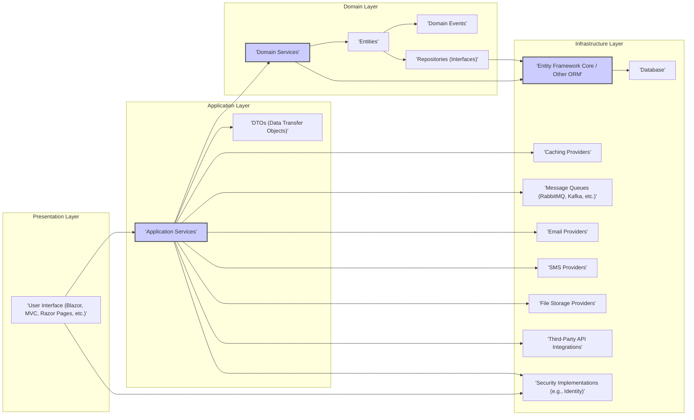
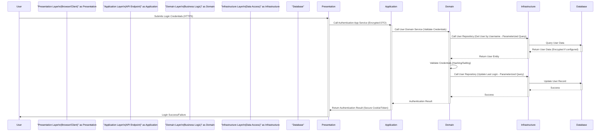

# Project Design Document: ABP Framework (Improved for Threat Modeling)

**Version:** 1.1
**Date:** October 26, 2023
**Author:** AI Software Architect

## 1. Introduction

This document provides an enhanced and more detailed design overview of the ABP Framework, specifically tailored for threat modeling activities. It builds upon the previous version by providing deeper insights into the framework's architecture, component interactions, and security considerations. This document serves as the primary reference for identifying potential threats and vulnerabilities within applications built using the ABP Framework.

### 1.1. Project Overview

The ABP Framework is a comprehensive, open-source application framework built upon ASP.NET Core. Its core design principles emphasize Domain-Driven Design (DDD), modularity, and the implementation of software development best practices. ABP aims to significantly reduce boilerplate code and accelerate the development of robust, scalable, and maintainable web applications and APIs.

### 1.2. Goals of this Document

*   Provide a granular and security-focused architectural overview of the ABP Framework.
*   Clearly define the roles and responsibilities of key components and their interactions, with an emphasis on data flow and security boundaries.
*   Detail typical deployment scenarios, highlighting potential attack surfaces in each.
*   Thoroughly describe security-relevant architectural decisions, built-in security features, and potential weaknesses.
*   Serve as the definitive resource for conducting comprehensive threat modeling exercises on ABP-based applications.

## 2. System Architecture

The ABP Framework's layered architecture is designed to enforce separation of concerns and enhance security by isolating different parts of the application.

### 2.1. High-Level Architecture Diagram

### 2.2. Component Breakdown (Detailed)

*   **Presentation Layer:**
    *   **Purpose:**  Handles user interactions, renders the user interface, and translates user actions into requests for the Application Layer. This layer is a primary entry point for potential attacks.
    *   **Components:**
        *   User Interface (Blazor Components, MVC Controllers, Razor Pages): Responsible for displaying data and capturing user input. Susceptible to XSS if not handled carefully.
        *   View Models: Prepare data for rendering in the UI.
        *   API Controllers (if applicable):  Expose endpoints for programmatic access, requiring careful authentication and authorization.
    *   **Security Considerations:** XSS vulnerabilities, insecure direct object references (IDOR) in URLs, lack of proper input sanitization before sending data to the Application Layer.

*   **Application Layer:**
    *   **Purpose:** Contains application-specific business logic, orchestrates interactions between the Presentation and Domain layers, and enforces authorization rules.
    *   **Components:**
        *   Application Services: Implement use cases and business workflows. Act as a gatekeeper, performing authorization checks before invoking Domain Services.
        *   DTOs (Data Transfer Objects):  Used for data transfer between layers, preventing direct exposure of Domain Entities and potential over-posting issues.
        *   Authorization Interceptors/Handlers: Enforce permission checks before executing Application Service methods. Potential for bypass if misconfigured.
        *   Validation Logic: Ensures the integrity of input data before processing. Inadequate validation can lead to various attacks.
    *   **Security Considerations:** Authorization bypass vulnerabilities, business logic flaws leading to unintended data manipulation, exposure of sensitive information in DTOs if not carefully designed.

*   **Domain Layer:**
    *   **Purpose:**  Represents the core business logic and rules of the application. It should be independent of any specific technology or framework.
    *   **Components:**
        *   Domain Services: Implement complex business operations that involve multiple Entities.
        *   Entities: Represent the core business objects and their associated data. Should encapsulate business rules and invariants.
        *   Domain Events:  Used to notify other parts of the system about significant changes within the domain. Potential for information leakage if events contain sensitive data and are not handled securely.
        *   Repositories (Interfaces): Define contracts for data access, abstracting away the underlying data storage mechanism.
        *   Domain Logic/Rules:  Enforce business constraints and validation rules at the core of the application.
    *   **Security Considerations:**  Flaws in business logic that could be exploited, unintended data modification due to incorrect rule implementation, potential for sensitive data exposure through Domain Events.

*   **Infrastructure Layer:**
    *   **Purpose:** Provides concrete implementations for abstractions defined in other layers and handles interactions with external systems. This layer often introduces the most direct security risks related to external dependencies.
    *   **Components:**
        *   Entity Framework Core / Other ORM Implementations:  Handles database interactions. Vulnerable to SQL injection if raw SQL queries are used improperly.
        *   Database Connection: Requires secure storage and management of connection strings.
        *   Caching Providers (Implementations):  Stores frequently accessed data. Potential for data leakage if not secured properly.
        *   Message Queue Implementations: Facilitate asynchronous communication. Security concerns include message tampering and unauthorized access.
        *   Email/SMS Provider Integrations: Used for sending notifications. Potential for abuse if not rate-limited or properly authenticated.
        *   File Storage Provider Integrations: Handles file uploads and storage. Vulnerable to unauthorized access and malicious file uploads.
        *   Third-Party API Integrations:  Interactions with external services. Security depends on the security of the external API and the secure handling of API keys and tokens.
        *   Security Implementations (e.g., ASP.NET Core Identity): Provides concrete implementations for authentication and authorization. Misconfiguration can lead to significant vulnerabilities.
    *   **Security Considerations:** SQL injection vulnerabilities, insecure storage of credentials and API keys, unauthorized access to cached data, message queue manipulation, insecure file uploads, vulnerabilities in third-party API integrations, misconfigured authentication and authorization mechanisms.

## 3. Key Features (Security Relevant)

This section highlights features with significant security implications:

*   **Module System:**
    *   **Security Implication:** While promoting modularity, improperly secured modules or insecure communication between modules could introduce vulnerabilities. Dynamic module loading requires careful validation of module sources.

*   **Abstraction Layers (Data Access, Caching, etc.):**
    *   **Security Implication:**  While providing flexibility, vulnerabilities in the underlying implementations of these abstractions (e.g., a vulnerable caching provider) can impact the entire application.

*   **Automatic Repository Generation:**
    *   **Security Implication:**  While convenient, developers need to be aware of the generated queries and ensure they are not susceptible to injection attacks, especially when custom filtering or sorting is implemented.

*   **Audit Logging:**
    *   **Security Implication:** Crucial for security monitoring and incident response. Ensure logs are securely stored and access is restricted. Insufficient logging can hinder threat detection.

*   **Exception Handling:**
    *   **Security Implication:**  Detailed error messages exposed to users can reveal sensitive information. Proper error handling should prevent information leakage while providing useful debugging information to developers in secure environments.

*   **Localization:**
    *   **Security Implication:**  Localized content should be carefully reviewed to prevent injection attacks through malicious translations.

*   **Authorization:**
    *   **Security Implication:** The core of access control. Flaws in the authorization logic or misconfigured permissions can lead to unauthorized access to resources and data.

*   **Data Filtering (Multi-Tenancy):**
    *   **Security Implication:**  Incorrectly implemented data filters in multi-tenant applications can lead to data leakage between tenants.

*   **Background Jobs:**
    *   **Security Implication:**  Background jobs that process sensitive data require careful security considerations. Unauthorized access or manipulation of job queues can be a risk.

*   **Real-time Notifications:**
    *   **Security Implication:**  Ensure only authorized users can send and receive specific notifications to prevent information disclosure or manipulation.

*   **UI Framework Integrations:**
    *   **Security Implication:**  Security vulnerabilities in the integrated UI frameworks can impact the ABP application. Keep UI framework dependencies up-to-date.

*   **CLI Tooling:**
    *   **Security Implication:**  Ensure the CLI tool itself is secure and does not introduce vulnerabilities during code generation or project setup.

## 4. Deployment Architecture (Threat Surface Analysis)

Understanding the deployment architecture is crucial for identifying potential attack surfaces.

*   **Single Server Deployment:**
    *   **Threat Surface:** All components reside on a single server, making it a single point of failure. Vulnerabilities in any part of the application can potentially compromise the entire system. Exposed ports and services are key targets.

*   **Cloud Deployment (e.g., Azure, AWS, GCP):**
    *   **Threat Surface:**  Increased complexity introduces new attack vectors related to cloud service configurations, IAM roles, network security groups, and API keys. Misconfigured storage buckets or publicly accessible databases are common risks.

*   **Microservices Architecture:**
    *   **Threat Surface:**  Inter-service communication becomes a significant attack surface. Insecure APIs between services, lack of proper authentication and authorization for inter-service calls, and vulnerabilities in service discovery mechanisms are potential risks.

*   **On-Premises Deployment:**
    *   **Threat Surface:** Security relies heavily on the organization's internal network security, firewall configurations, and physical security of the servers. Vulnerabilities in the underlying infrastructure can be exploited.

**Key Deployment Security Considerations for Threat Modeling:**

*   **Network Segmentation:**  How are different parts of the application and infrastructure isolated?
*   **Firewall Rules:** What ports are open and to whom?
*   **Access Control Lists (ACLs):** Who has access to which resources?
*   **Secrets Management:** How are sensitive credentials (database passwords, API keys) stored and managed?
*   **Patch Management:** How are operating systems, frameworks, and dependencies kept up-to-date?
*   **Monitoring and Logging:** What security events are being logged and monitored?

## 5. Security Architecture (Detailed Mechanisms)

This section elaborates on the security mechanisms within the ABP Framework:

*   **Authentication and Authorization:**
    *   **Mechanism:** Leverages ASP.NET Core Identity, allowing for various authentication schemes (cookie-based, JWT Bearer). Authorization is typically role-based or permission-based, enforced through attributes on controllers and application service methods.
    *   **Threats:** Brute-force attacks on login forms, credential stuffing, insecure storage of authentication cookies, JWT vulnerabilities (e.g., weak signing algorithms), authorization bypass due to misconfigured roles or permissions.

*   **Input Validation:**
    *   **Mechanism:** Encourages validation using data annotations, FluentValidation, and manual checks within application services and domain entities.
    *   **Threats:** Injection attacks (SQL injection, XSS, command injection) due to insufficient or incorrect validation.

*   **Cross-Site Scripting (XSS) Prevention:**
    *   **Mechanism:** Relies on ASP.NET Core's built-in encoding features (`@Html.AntiForgeryToken()`, `@Html.Encode()`). Developers are responsible for using these correctly.
    *   **Threats:** Stored XSS, reflected XSS, DOM-based XSS if user input is not properly sanitized before being rendered in the browser.

*   **Cross-Site Request Forgery (CSRF) Protection:**
    *   **Mechanism:**  Uses anti-forgery tokens generated by `@Html.AntiForgeryToken()` and validated on form submissions.
    *   **Threats:** CSRF attacks if anti-forgery tokens are not implemented or validated correctly.

*   **SQL Injection Prevention:**
    *   **Mechanism:** Primarily relies on ORMs like Entity Framework Core, which parameterize queries by default. Developers should avoid constructing raw SQL queries.
    *   **Threats:** SQL injection vulnerabilities if raw SQL is used or if ORM features are misused.

*   **Data Protection:**
    *   **Mechanism:** Integrates with ASP.NET Core Data Protection for encrypting sensitive data at rest and in transit (e.g., connection strings, authentication cookies).
    *   **Threats:** Exposure of sensitive data if data protection is not configured correctly or if encryption keys are compromised.

*   **Audit Logging:**
    *   **Mechanism:**  Provides a framework for logging user actions, entity changes, and other significant events. Requires developers to configure which events are logged and how logs are stored.
    *   **Threats:** Insufficient logging hindering incident detection, insecure storage of logs allowing for tampering or unauthorized access.

*   **Security Headers:**
    *   **Mechanism:**  Developers can configure security headers (e.g., Content-Security-Policy, Strict-Transport-Security) in the application's startup.
    *   **Threats:**  Missing or misconfigured security headers leaving the application vulnerable to various attacks.

*   **Dependency Security:**
    *   **Mechanism:** Relies on NuGet for package management. Developers should regularly update dependencies to patch known vulnerabilities.
    *   **Threats:** Using components with known vulnerabilities that can be exploited.

## 6. Data Flow Diagram (Detailed with Security Considerations)

## 7. External Dependencies (Security Risks)

Each external dependency introduces potential security risks:

*   **ASP.NET Core:**  Requires staying updated with security patches.
*   **Entity Framework Core (or other ORM):**  Potential for vulnerabilities if not used correctly.
*   **Database System:**  Requires strong security configurations, access controls, and encryption.
*   **Caching Providers:**  Potential for data leakage if not secured.
*   **Message Queues:**  Risk of message tampering or unauthorized access.
*   **Identity Providers:**  Security relies on the IDP's security measures.
*   **Email/SMS Providers:**  Potential for abuse if API keys are compromised.
*   **Logging Frameworks:**  Logs may contain sensitive information and need secure storage.
*   **JavaScript Frameworks:**  Susceptible to client-side vulnerabilities.
*   **Third-Party APIs:**  Security depends on the security of the external API and secure handling of credentials.

This enhanced design document provides a more detailed and security-focused view of the ABP Framework, facilitating more effective threat modeling activities. It highlights potential vulnerabilities and areas requiring careful security considerations during development and deployment.