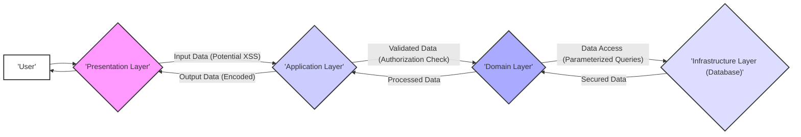

# Project Design Document: ABP Framework for Threat Modeling (Improved)

**1. Introduction**

This document provides an enhanced architectural overview of the ABP Framework, specifically tailored for threat modeling activities. It details the framework's key components, their interactions, data flows, and inherent security considerations. The primary goal is to establish a robust understanding of the system's design, enabling the effective identification of potential security vulnerabilities and associated risks. This document will serve as the foundation for subsequent threat modeling exercises.

**2. Overview of ABP Framework**

The ABP Framework (short for "ASP.NET Boilerplate") is an open-source application framework built upon ASP.NET Core. It offers a comprehensive foundation for developing modern web applications and APIs by providing pre-built components, established best practices, and well-defined architectural patterns. ABP emphasizes modularity, maintainability, and scalability, making it suitable for complex enterprise applications.

**Key Features of ABP:**

*   **Modular Architecture:** Applications are structured as a collection of independent, reusable modules, promoting separation of concerns and easier maintenance.
*   **Domain-Driven Design (DDD) Support:** Provides infrastructure and abstractions to facilitate the implementation of DDD principles, leading to more robust and business-aligned applications.
*   **Layered Architecture:** Enforces a clear separation of concerns through distinct layers: Presentation, Application, Domain, and Infrastructure. This separation aids in security by limiting the impact of vulnerabilities in one layer on others.
*   **Dependency Injection:**  Heavily leverages dependency injection for loose coupling, improved testability, and easier management of component dependencies.
*   **Convention-over-Configuration:** Reduces boilerplate code by providing sensible defaults and conventions, allowing developers to focus on business logic.
*   **Built-in Modules:** Offers pre-built, tested modules for common functionalities such as authentication, authorization, auditing, tenant management, and setting management, reducing development effort and ensuring consistent security implementations.
*   **Multi-Tenancy Support:** Provides robust infrastructure for building multi-tenant applications, including data isolation and tenant-specific configurations.
*   **API Development Focus:** Streamlines the creation of RESTful APIs with features like automatic API endpoint generation and integration with Swagger/OpenAPI.
*   **UI Framework Agnostic:** Supports various UI frameworks, including Blazor, Angular, and MVC, allowing flexibility in choosing the appropriate technology for the front-end.
*   **Extensibility:** Designed for easy extension and customization through a modular architecture and well-defined extension points.

**3. Architectural Diagram**

```mermaid
graph LR
    subgraph "Presentation Layer"
        direction LR
        A["'User Interface (Blazor, Angular, MVC)'"]
    end
    subgraph "Application Layer"
        direction LR
        B["'Application Services'"] --> C["'DTOs (Data Transfer Objects)'"]
    end
    subgraph "Domain Layer"
        direction LR
        D["'Domain Services'"] --> E["'Entities'"]
        E --> F["'Domain Events'"]
        G["'Repositories'"] <-- E
    end
    subgraph "Infrastructure Layer"
        direction LR
        H["'Entity Framework Core (Database Access)'"]
        I["'Caching (Distributed/In-Memory)'"]
        J["'Logging'"]
        K["'Background Jobs'"]
        L["'Email Sending'"]
        M["'SMS Sending'"]
        N["'Object Mapping (AutoMapper)'"]
        O["'Authentication & Authorization'"]
    end

    A --> B
    B --> D
    B --> G
    D --> G
    G --> H
    B --> N
    D --> N
    B --> O
    A --> O

    style A fill:#f9f,stroke:#333,stroke-width:2px
    style B fill:#ccf,stroke:#333,stroke-width:2px
    style C fill:#ccf,stroke:#333,stroke-width:2px
    style D fill:#aaf,stroke:#333,stroke-width:2px
    style E fill:#aaf,stroke:#333,stroke-width:2px
    style F fill:#aaf,stroke:#333,stroke-width:2px
    style G fill:#aaf,stroke:#333,stroke-width:2px
    style H fill:#ddf,stroke:#333,stroke-width:2px
    style I fill:#ddf,stroke:#333,stroke-width:2px
    style J fill:#ddf,stroke:#333,stroke-width:2px
    style K fill:#ddf,stroke:#333,stroke-width:2px
    style L fill:#ddf,stroke:#333,stroke-width:2px
    style M fill:#ddf,stroke:#333,stroke-width:2px
    style N fill:#ddf,stroke:#333,stroke-width:2px
    style O fill:#ddf,stroke:#333,stroke-width:2px
```

**4. Key Components and Interactions**

*   **Presentation Layer:**
    *   **User Interface ('User Interface (Blazor, Angular, MVC)'):** The client-facing part of the application, typically built using frameworks like Blazor, Angular, or ASP.NET MVC. Responsible for rendering the user interface, handling user input, and displaying data. **Security Consideration:** Vulnerable to XSS attacks if input is not properly sanitized and output is not encoded.
*   **Application Layer:**
    *   **Application Services ('Application Services'):** Implement the application's use cases and business logic. They orchestrate domain logic, interact with the domain layer, and handle authorization checks. **Security Consideration:**  Enforces authorization rules to prevent unauthorized access to functionalities. Potential for business logic flaws if not implemented correctly.
    *   **DTOs (Data Transfer Objects) ('DTOs (Data Transfer Objects)'):** Plain CLR Objects (POCOs) used to transfer data between the presentation and application layers. They decouple the layers and improve maintainability. **Security Consideration:**  Should not contain sensitive business logic. Proper validation of DTOs is crucial to prevent invalid data from reaching the domain layer.
*   **Domain Layer:**
    *   **Domain Services ('Domain Services'):** Contain core business logic that is not specific to a particular entity. They often encapsulate complex business rules and workflows. **Security Consideration:**  Critical for maintaining data integrity and enforcing business rules. Vulnerabilities here can have significant impact.
    *   **Entities ('Entities'):** Represent the core business objects and their associated data and behavior. They are the heart of the domain model. **Security Consideration:**  Sensitive data resides within entities. Access control and data validation are crucial.
    *   **Domain Events ('Domain Events'):** Used to notify other parts of the application when significant domain events occur, promoting loose coupling. **Security Consideration:**  Care must be taken to ensure sensitive information is not inadvertently exposed through domain events.
    *   **Repositories ('Repositories'):** Provide an abstraction over the data access layer, allowing the domain layer to be independent of the specific database implementation. They handle data persistence and retrieval. **Security Consideration:**  Potential for SQL injection vulnerabilities if not implemented carefully, especially when using raw SQL queries.
*   **Infrastructure Layer:**
    *   **Entity Framework Core ('Entity Framework Core (Database Access)'):** An ORM (Object-Relational Mapper) used for interacting with the database. It maps domain entities to database tables. **Security Consideration:**  Vulnerable to SQL injection if parameterized queries are not used correctly. Database connection security is also critical.
    *   **Caching ('Caching (Distributed/In-Memory)'):** Mechanisms for storing frequently accessed data in memory or a distributed cache to improve performance. **Security Consideration:**  Sensitive data stored in the cache needs to be protected. Insecure caching configurations can lead to data leaks.
    *   **Logging ('Logging'):** Framework for recording application events, errors, and security-related activities. **Security Consideration:**  Logs can contain sensitive information and need to be protected from unauthorized access. Comprehensive logging is essential for security auditing and incident response.
    *   **Background Jobs ('Background Jobs'):** Allows for the execution of tasks asynchronously, often used for long-running or resource-intensive operations. **Security Consideration:**  Background jobs might handle sensitive data or perform privileged operations. Proper authorization and input validation are necessary.
    *   **Email Sending ('Email Sending'):** Component for sending email notifications. **Security Consideration:**  Potential for email spoofing or disclosure of sensitive information in emails. Secure email protocols should be used.
    *   **SMS Sending ('SMS Sending'):** Component for sending SMS notifications. **Security Consideration:**  Similar to email sending, potential for spoofing and information disclosure.
    *   **Object Mapping (AutoMapper) ('Object Mapping (AutoMapper)'):** Used to map objects between different layers (e.g., Entities to DTOs). **Security Consideration:**  Incorrect mapping configurations could lead to unintended data exposure.
    *   **Authentication & Authorization ('Authentication & Authorization'):**  Handles user authentication (verifying identity) and authorization (granting access to resources). ABP provides built-in mechanisms and integrates with ASP.NET Core Identity. **Security Consideration:**  A critical component for security. Vulnerabilities here can lead to unauthorized access and data breaches.

**Typical Request Flow with Security Considerations:**

1. A user interacts with the **User Interface**. **Security Consideration:** Input validation on the client-side can prevent some basic attacks.
2. The UI sends a request to an **Application Service**. **Security Consideration:** Requests should be authenticated and authorized.
3. The Application Service receives the request, potentially validates input using **DTOs**. **Security Consideration:** Server-side validation is crucial to prevent malicious input.
4. The Application Service performs authorization checks to ensure the user has permission to perform the requested action. **Security Consideration:**  Properly configured authorization rules are essential.
5. The Application Service interacts with **Domain Services** and/or **Repositories** to perform business logic and access data. **Security Consideration:** Domain logic should enforce business rules and data integrity. Repositories should use parameterized queries to prevent SQL injection.
6. **Entities** are retrieved or modified through **Repositories** using **Entity Framework Core**. **Security Consideration:** Access to database tables should be restricted based on the principle of least privilege.
7. **Domain Events** might be raised during domain logic execution. **Security Consideration:** Ensure sensitive information is not leaked through event payloads.
8. The Application Service transforms the data into **DTOs**. **Security Consideration:** Ensure only necessary data is included in DTOs.
9. The DTOs are returned to the **User Interface**. **Security Consideration:** Output encoding is necessary to prevent XSS attacks.
10. The UI displays the results to the user.

**5. Data Flow with Security Focus**



**Detailed Data Flow Points with Security Implications:**

*   **User Input:** Data entered by the user through the UI. **Security Implication:**  Primary entry point for various attacks, including XSS and injection attacks.
*   **Request Payload:** Data sent from the presentation layer to the application layer (often as JSON or other structured formats). **Security Implication:**  Can contain sensitive information and should be transmitted securely (e.g., over HTTPS).
*   **DTOs:** Data transfer objects carrying data between layers. **Security Implication:**  Should not contain more data than necessary. Proper validation prevents invalid data from propagating.
*   **Entity Data:** Data representing business objects stored in the database. **Security Implication:**  Needs to be protected at rest through encryption and access controls.
*   **Database Queries:** SQL queries generated by Entity Framework Core to retrieve or modify data. **Security Implication:**  Vulnerable to SQL injection if not parameterized.
*   **Response Payload:** Data sent back from the application layer to the presentation layer. **Security Implication:**  May contain sensitive information and needs to be protected during transit.
*   **Displayed Data:** Data presented to the user in the UI. **Security Implication:**  Needs to be properly encoded to prevent XSS attacks.

**6. Security Considerations (Detailed)**

ABP Framework provides several built-in security features and encourages secure development practices:

*   **Authentication:**
    *   Supports cookie-based authentication for traditional web applications.
    *   Supports JWT (JSON Web Tokens) for API authentication.
    *   Integrates with ASP.NET Core Identity for user management and authentication.
    *   Allows integration with external authentication providers (e.g., OAuth 2.0, OpenID Connect).
*   **Authorization:**
    *   Provides a role-based authorization system where users are assigned roles, and permissions are granted to roles.
    *   Offers a permission-based authorization system, allowing fine-grained control over access to specific features and data.
    *   Supports declarative authorization using attributes on application service methods.
    *   Provides programmatic authorization checks within application services.
*   **Input Validation:**
    *   Encourages validation of user input at multiple layers (presentation and application).
    *   Integrates with data annotation attributes for model validation.
    *   Supports custom validation logic within application services.
*   **Cross-Site Scripting (XSS) Protection:**
    *   Utilizes built-in features in ASP.NET Core, such as Razor's encoding capabilities, to mitigate XSS vulnerabilities.
    *   Encourages developers to be mindful of output encoding in JavaScript and other client-side code.
*   **Cross-Site Request Forgery (CSRF) Protection:**
    *   Provides mechanisms to prevent CSRF attacks, such as anti-forgery tokens in forms.
    *   Automatically handles anti-forgery token generation and validation for MVC and Razor Pages.
*   **Data Protection:**
    *   Integrates with ASP.NET Core Data Protection for encrypting sensitive data at rest, such as connection strings and API keys.
    *   Can be used to protect sensitive data in cookies and other storage mechanisms.
*   **Auditing:**
    *   Provides a framework for logging significant actions and data changes for auditing purposes.
    *   Logs include information about the user, the action performed, and the data affected.
    *   Can be extended to log custom events and data.
*   **Security Headers:**
    *   Encourages the use of security headers (e.g., Content-Security-Policy, X-Frame-Options, Strict-Transport-Security) to enhance browser security.
    *   These headers can be configured in the application's startup.
*   **Tenant Isolation (for Multi-Tenant Applications):**
    *   Provides mechanisms to isolate data and resources between different tenants, ensuring that one tenant cannot access another tenant's data.
    *   Supports different tenancy strategies, such as separate databases or shared databases with tenant discriminators.

**Potential Security Areas of Focus for Threat Modeling (More Specific):**

*   **Authentication Bypass:** Vulnerabilities allowing unauthorized users to gain access. Examples: Weak password policies, insecure token generation, lack of multi-factor authentication.
*   **Authorization Flaws:**  Improperly configured or implemented authorization rules leading to privilege escalation or unauthorized access to resources. Examples: Missing authorization checks, insecure direct object references.
*   **Injection Attacks:**  Exploiting vulnerabilities in input validation to inject malicious code. Examples: SQL injection, cross-site scripting (XSS), command injection.
*   **Sensitive Data Exposure:**  Unintentional disclosure of sensitive information. Examples: Lack of encryption, insecure logging, exposing sensitive data in API responses.
*   **Session Management Issues:**  Vulnerabilities related to how user sessions are created, managed, and terminated. Examples: Session fixation, session hijacking, insecure session storage.
*   **Dependency Vulnerabilities:**  Security flaws in third-party libraries used by the framework or application. Requires regular dependency scanning and updates.
*   **API Security Weaknesses:**  Lack of proper authentication, authorization, rate limiting, or input validation for APIs.
*   **Multi-Tenancy Isolation Failures:**  Potential for data leakage or access between tenants in multi-tenant applications due to misconfiguration or vulnerabilities in the tenancy implementation.
*   **Insecure Configuration:**  Vulnerabilities arising from insecure storage or management of sensitive configuration data. Examples: Hardcoded credentials, exposed connection strings.
*   **Insufficient Logging and Monitoring:**  Lack of adequate logging and monitoring capabilities hindering incident detection and response.

**7. Deployment Model**

ABP applications can be deployed in various environments, each with its own security implications:

*   **Cloud Platforms (Azure, AWS, Google Cloud):**  Leverages cloud provider security features but requires careful configuration of access controls, network security, and data encryption. Shared responsibility model applies.
*   **On-Premise Servers:**  Requires direct management of infrastructure security, including server hardening, network security, and physical security.
*   **Containerized Environments (Docker, Kubernetes):**  Introduces container security considerations, such as image scanning, secure container configurations, and network policies within the cluster.

The chosen deployment model significantly impacts the overall security posture and dictates the specific security controls that need to be implemented.

**8. Assumptions and Dependencies**

*   The application built using ABP Framework adheres to the framework's conventions and security best practices.
*   Underlying infrastructure components (e.g., operating system, database server, web server) are assumed to be securely configured and maintained with the latest security patches.
*   Third-party libraries and dependencies are regularly updated to address known vulnerabilities.
*   Developers have a solid understanding of security principles and secure coding practices.
*   Secure communication protocols (HTTPS) are used for all sensitive data transmission.

**Dependencies:**

*   ASP.NET Core Runtime
*   Entity Framework Core
*   .NET SDK
*   Potentially other third-party libraries for specific functionalities (e.g., logging providers, caching providers).

**9. Threat Modeling Scope**

The threat modeling exercise based on this document will primarily focus on:

*   **Web Application Components:**  Analyzing potential threats within the presentation, application, and domain layers, including their interactions.
*   **API Endpoints:**  Evaluating the security of the application's RESTful APIs, including authentication, authorization, and input validation.
*   **Data Storage:**  Assessing the security of data at rest in the database and other persistent storage mechanisms.
*   **Authentication and Authorization Mechanisms:**  Thoroughly examining the effectiveness of access controls and identifying potential bypasses.
*   **Common Web Application Vulnerabilities:**  Specifically targeting threats listed in the OWASP Top Ten and similar vulnerability classifications.
*   **Multi-Tenancy Security (if applicable):**  Analyzing the isolation and security measures implemented for multi-tenant applications.

**Out of Scope:**

*   Security of the underlying operating system or hardware infrastructure (unless directly related to application configuration).
*   Physical security of the servers and data centers.
*   Social engineering attacks targeting end-users (focus will be on technical vulnerabilities).
*   Distributed Denial-of-Service (DDoS) attacks at the network infrastructure level (unless directly related to application design flaws).

This improved document provides a more detailed and security-focused overview of the ABP Framework's architecture, specifically designed to facilitate effective threat modeling. It highlights key components, data flows with security considerations, and potential threat areas to guide the identification and mitigation of security risks.