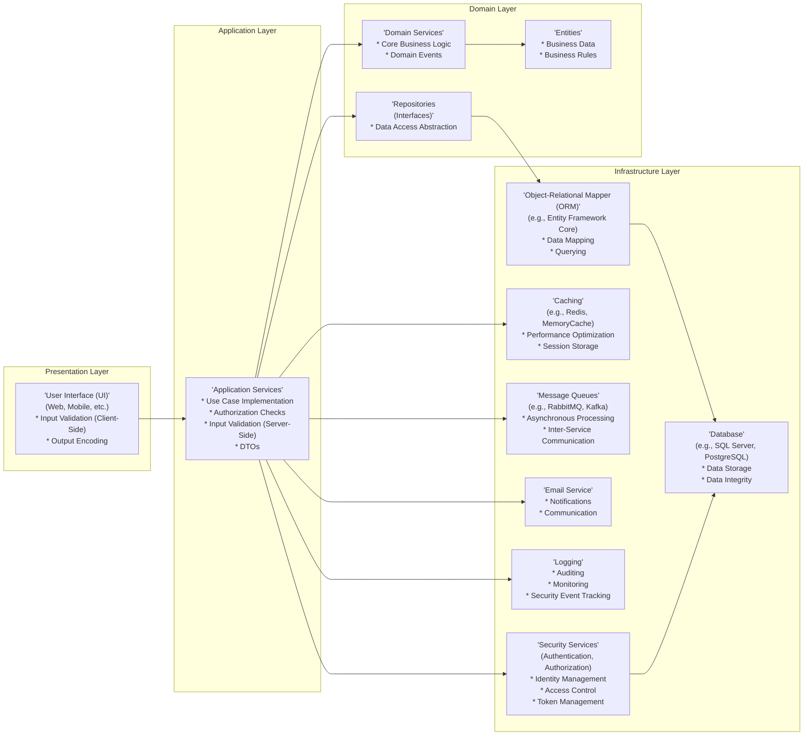
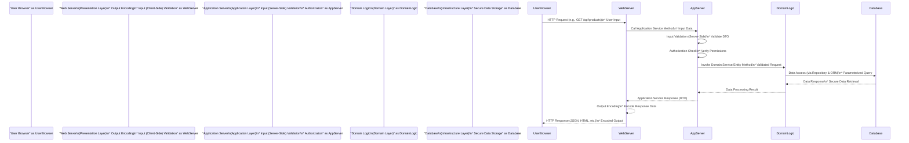
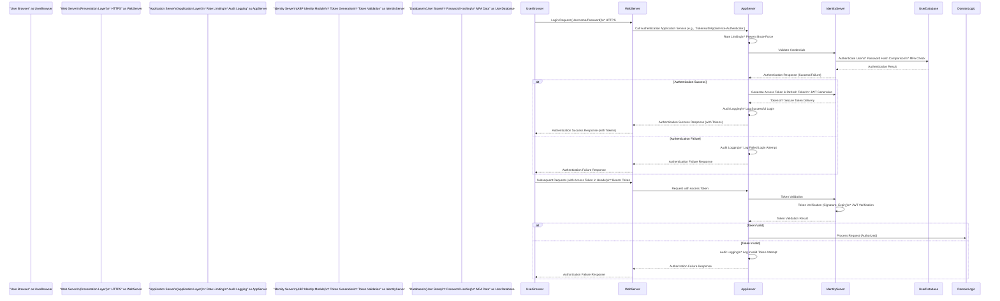

# Project Design Document: ABP Framework Application

**Version:** 1.1
**Date:** October 27, 2023
**Author:** AI Software Architect

## 1. Introduction

This document provides an enhanced design overview of an application built using the ABP Framework (https://github.com/abpframework/abp). This design document is specifically tailored for threat modeling and security analysis. It details the architectural layers, key components, data flow, technology stack, and crucial security considerations inherent in a typical ABP-based application.

The ABP Framework is a robust, open-source application framework for .NET, designed to accelerate the development of modern, scalable, and maintainable web applications and APIs. It strongly promotes Domain-Driven Design (DDD) principles, offering a comprehensive infrastructure and a rich ecosystem of pre-built modules and abstractions. This allows development teams to concentrate on core business logic and deliver value faster, minimizing boilerplate code and infrastructure concerns.

This document focuses on a representative ABP application architecture, emphasizing common patterns and components to facilitate effective threat modeling. It's important to note that specific implementations will always be tailored to project-specific requirements and business needs.

## 2. Goals and Objectives

The primary goals of this design document are refined to be even more actionable for security analysis:

*   **Provide a Clear and Security-Focused Architectural Overview:**  Clearly describe the architecture of an ABP application, highlighting components and interactions relevant to security.
*   **Enable Comprehensive Threat Modeling:**  Serve as a detailed blueprint for identifying critical assets, data flows, trust boundaries, and potential vulnerabilities within the application.
*   **Serve as a Unified Reference for Stakeholders:**  Establish a common understanding of the application's architecture and security posture for development, security, operations, and management teams.
*   **Document and Emphasize Key Security Considerations and Best Practices:**  Not only highlight built-in security features but also pinpoint areas requiring proactive security measures during development, deployment, and ongoing operations.

## 3. Target Audience

This document is intended for a slightly broadened audience to ensure comprehensive security coverage:

*   **Security Architects, Engineers, and Threat Modeling Teams:** To conduct thorough threat modeling, vulnerability assessments, penetration testing, and security design reviews based on a clear architectural understanding.
*   **Software Architects and Developers:** To design and develop secure applications by understanding the architectural security implications and built-in security features of ABP.
*   **DevOps and Infrastructure Engineers:** To securely deploy and operate ABP applications, considering infrastructure-level security controls and configurations.
*   **Project Managers, Product Owners, and Security-Conscious Stakeholders:** To understand the overall system architecture, its security aspects, and to make informed decisions regarding security investments and priorities.
*   **Auditors and Compliance Officers:** To assess the application's security posture against relevant security standards and compliance requirements.

## 4. System Architecture Overview

ABP Framework applications are architected using a well-defined layered approach, strictly adhering to Domain-Driven Design (DDD) principles. This layered architecture is fundamental to ABP and promotes maintainability, testability, and security through separation of concerns. The standard layers are:

*   **Presentation Layer (UI):**  Responsible for user interaction. Typically implemented as a web application (MVC, Razor Pages, Blazor, Angular, React) or mobile application, communicating with the Application Layer via APIs.
*   **Application Layer:**  Acts as the orchestrator of business logic. Contains Application Services that implement specific use cases, coordinate domain logic, and serve as the primary interface for the Presentation Layer.
*   **Domain Layer:**  The core of the application, encapsulating business entities, domain services, and core business rules. It is intentionally decoupled from infrastructure concerns and external frameworks, focusing solely on the business domain.
*   **Infrastructure Layer:**  Provides concrete implementations for abstractions defined in other layers. This layer handles interactions with external systems and technologies, such as databases, messaging queues, caching mechanisms, email services, and security providers.

This strict layered architecture is crucial for security as it isolates business logic from presentation and infrastructure, making it easier to apply security controls at each layer and reduce the attack surface.

### 4.1. High-Level Architecture Diagram

**Diagram Improvements:**

*   Added security-relevant annotations to each layer to highlight their security responsibilities. For example, "Input Validation (Client-Side)" in the Presentation Layer and "Authorization Checks" in the Application Layer.
*   Clarified the purpose of each Infrastructure component from a security perspective (e.g., "Logging - Auditing, Monitoring, Security Event Tracking").

### 4.2. Component-Level Architecture

This section provides a more granular view of key components within each layer, with a strong focus on security implications and data flow vulnerabilities.

#### 4.2.1. Presentation Layer Components

*   **UI Framework (e.g., ASP.NET Core MVC, Blazor, Angular):**  The entry point for user interactions. Security responsibilities include:
    *   **Client-Side Input Validation:**  Basic validation to improve user experience and prevent obvious errors, but *not* a primary security control.
    *   **Output Encoding:**  Crucial for preventing XSS attacks. Ensure proper encoding of data displayed in the UI (e.g., HTML encoding, JavaScript encoding).
    *   **Content Security Policy (CSP):**  Implement CSP headers to control resources the browser is allowed to load, mitigating XSS risks.
    *   **Clickjacking Protection:**  Use frame-busting techniques or `X-Frame-Options` header to prevent clickjacking attacks.
    *   **Limited Client-Side Logic:** Minimize sensitive logic in the client-side code, as it is easily inspectable and manipulable.

*   **Controllers/Page Models (ASP.NET Core MVC/Razor Pages):**  Handle HTTP requests, route them to Application Services, and prepare responses. Security considerations:
    *   **Input Sanitization (Limited):** While server-side validation is primary, some basic sanitization at this level can prevent common injection attempts, but should not be relied upon solely.
    *   **Error Handling:**  Implement secure error handling to avoid leaking sensitive information in error responses. Return generic error messages to the client and log detailed errors server-side.
    *   **HTTP Header Security:**  Ensure proper security headers are set (e.g., `Strict-Transport-Security`, `X-Content-Type-Options`, `Referrer-Policy`).

*   **View Components/Razor Components/UI Components:** Reusable UI elements. Security focus:
    *   **Secure Component Development:**  Develop components with security in mind, ensuring they correctly handle user input and output encoding.
    *   **Avoid Storing Sensitive Data Client-Side:**  Do not store sensitive data (API keys, secrets) directly in client-side components or JavaScript code.

#### 4.2.2. Application Layer Components

*   **Application Services:**  The core of application logic and security enforcement. Key security responsibilities:
    *   **Server-Side Input Validation:**  *Mandatory* validation of all incoming data from the Presentation Layer using DTO validation (Data Annotations, FluentValidation). This is a primary defense against injection attacks and data integrity issues.
    *   **Authorization Enforcement:**  Implement robust authorization checks *before* executing any business logic. Utilize ABP's policy-based authorization system to verify user permissions and roles.
    *   **Transaction Management:**  Ensure transactional integrity to prevent data corruption and maintain consistency, especially in security-sensitive operations.
    *   **Secure Data Handling:**  Handle sensitive data (passwords, personal information) securely. Avoid logging sensitive data. Use secure storage mechanisms (hashing, encryption).
    *   **Rate Limiting (Optional, but recommended for APIs):** Implement rate limiting to protect against brute-force attacks and DoS attempts, especially for authentication and API endpoints.

*   **Data Transfer Objects (DTOs):**  Used for data exchange between layers. Security relevance:
    *   **Data Sanitization (Careful Consideration):** DTOs can be used for sanitization, but it's crucial to understand the context. Sanitization should primarily happen in the Application Layer based on business rules, not just in DTOs.
    *   **Schema Definition:** DTOs define the expected data structure, aiding in validation and preventing unexpected data from being processed.

*   **Authorization Handlers:**  ABP's policy-based authorization system. Security function:
    *   **Fine-Grained Access Control:**  Implement granular authorization policies based on user roles, permissions, claims, and custom logic.
    *   **Centralized Authorization Logic:**  Keep authorization logic centralized in handlers, making it easier to manage and audit access control.

*   **Event Handlers (Application Layer Events):**  Handle application-level events. Security use cases:
    *   **Auditing:** Log security-related events (login attempts, permission changes, data access) for audit trails and security monitoring.
    *   **Security Notifications:** Trigger security alerts or notifications based on specific events (e.g., suspicious login activity).

#### 4.2.3. Domain Layer Components

*   **Entities:**  Represent business data and rules. Security considerations:
    *   **Data Integrity:**  Enforce data integrity rules within entities to ensure data consistency and prevent invalid data states.
    *   **Business Logic Security:**  Implement business logic securely, considering potential security implications of business rules.

*   **Domain Services:**  Contain complex business logic. Security focus:
    *   **Secure Business Logic Implementation:**  Implement business logic with security in mind, considering potential vulnerabilities and edge cases.
    *   **Input Validation (Domain Level - Less Common):** While validation is primarily in the Application Layer, domain services might perform domain-specific validation to enforce business rules.

*   **Repositories (Interfaces):**  Data access abstraction. Security benefit:
    *   **Abstraction from Data Access Details:**  Abstracting data access logic through repositories helps prevent direct database access from other layers, reducing the risk of SQL injection if ORM is used correctly.

*   **Domain Events:**  Represent significant domain occurrences. Security applications:
    *   **Security Event Logging:**  Domain events can be used to trigger logging of important security-related domain actions.

*   **Value Objects:**  Immutable objects. Security advantage:
    *   **Immutability:**  Immutability can enhance security by preventing accidental or malicious modification of data.

#### 4.2.4. Infrastructure Layer Components

*   **Entity Framework Core (or other ORM):**  Data access. Security considerations:
    *   **SQL Injection Prevention:**  Use parameterized queries and ORM features correctly to prevent SQL injection vulnerabilities.
    *   **Database Connection Security:**  Securely manage database connection strings and credentials. Use least privilege database accounts.

*   **Database Provider (e.g., SQL Server, PostgreSQL, MySQL):**  Data storage. Security responsibilities:
    *   **Database Security Hardening:**  Harden the database server and operating system according to security best practices.
    *   **Access Control (Database Level):**  Implement database-level access control to restrict access to sensitive data.
    *   **Data Encryption at Rest:**  Enable database encryption at rest (e.g., Transparent Data Encryption) to protect data if the storage media is compromised.
    *   **Regular Security Patching:**  Keep the database server and software up-to-date with security patches.

*   **Caching Providers (e.g., Redis, Distributed Memory Cache):**  Caching. Security implications:
    *   **Cache Poisoning Prevention:**  Protect against cache poisoning attacks that could inject malicious data into the cache.
    *   **Sensitive Data in Cache:**  Avoid caching highly sensitive data if possible. If caching sensitive data is necessary, ensure the cache is secured (e.g., encrypted, access-controlled).

*   **Message Queue Providers (e.g., RabbitMQ, Kafka):**  Asynchronous communication. Security considerations:
    *   **Message Security:**  If messages contain sensitive data, consider encrypting messages in the queue.
    *   **Access Control (Message Queue):**  Secure access to the message queue to prevent unauthorized access and message manipulation.

*   **Email Service (SMTP, Cloud Email Providers):**  Email communication. Security risks:
    *   **Email Injection:**  Prevent email injection vulnerabilities that could allow attackers to send unauthorized emails.
    *   **Phishing and Spoofing:**  Implement SPF, DKIM, and DMARC records to reduce the risk of email spoofing and improve email deliverability.
    *   **Secure Email Transmission:**  Use TLS/SSL for secure email transmission.

*   **Logging Framework (e.g., Serilog, NLog):**  Logging. Security importance:
    *   **Comprehensive Security Logging:**  Log security-relevant events (authentication, authorization, input validation failures, exceptions, etc.) with sufficient detail for auditing and incident response.
    *   **Secure Log Storage:**  Store logs securely and protect them from unauthorized access and tampering. Consider centralized logging solutions.
    *   **Log Monitoring and Alerting:**  Implement log monitoring and alerting to detect and respond to security incidents in a timely manner.

*   **Authentication and Authorization Services (ABP's built-in system, IdentityServer4 integration, OpenIddict integration):**  Identity management. Core security component:
    *   **Strong Authentication Mechanisms:**  Use strong password policies, multi-factor authentication (MFA), and consider passwordless authentication options.
    *   **Secure Token Management (JWT, OAuth 2.0):**  Implement secure token generation, storage, and validation. Protect against token theft and replay attacks.
    *   **Regular Security Audits:**  Conduct regular security audits of the authentication and authorization system.

*   **Object Storage (e.g., Azure Blob Storage, AWS S3):**  File storage. Security considerations:
    *   **Access Control (Object Storage):**  Implement granular access control policies to restrict access to stored files. Use principle of least privilege.
    *   **Data Encryption at Rest and in Transit:**  Enable encryption for data at rest and in transit to/from object storage.
    *   **Vulnerability Scanning:**  Regularly scan object storage for vulnerabilities and misconfigurations.

## 5. Data Flow Diagrams

### 5.1. Typical Web Request Flow (Security Enhanced)

**Diagram Improvements:**

*   Added security actions at each stage of the request flow directly in the diagram to visualize security controls. For example, "Input (Server-Side) Validation" and "Authorization" in the Application Server.
*   Clarified the type of input and output at each stage (e.g., "User Input," "Encoded Output").

### 5.2. Authentication Flow (using ABP's Identity System - Security Focused)

**Diagram Improvements:**

*   Similar to the web request flow, security actions and technologies are added to the authentication flow diagram to highlight security measures at each step. For example, "HTTPS," "Rate Limiting," "Password Hashing," "JWT Generation," "Audit Logging."
*   Clarified security mechanisms used (e.g., "Password Hash Comparison," "JWT Verification").

## 6. Technology Stack

*(No significant changes in this section, as it was already comprehensive. Minor clarifications for security context)*

A typical ABP Framework application leverages the following technologies, each with its own security considerations:

*   **Programming Language:** C# (.NET) - Security benefits of managed code, but still requires secure coding practices.
*   **Framework:** .NET (ASP.NET Core) - Provides built-in security features, but requires proper configuration and usage.
*   **Web Server:** Kestrel (or IIS, Nginx, Apache in production) - Web server security hardening is crucial.
*   **Database:** SQL Server, PostgreSQL, MySQL, MongoDB, etc. (Entity Framework Core supports multiple providers) - Database security is paramount, including access control, encryption, and patching.
*   **ORM:** Entity Framework Core (EF Core) - Helps prevent SQL injection if used correctly, but ORM misconfigurations can introduce vulnerabilities.
*   **Caching:** Redis, Distributed Memory Cache, In-Memory Cache - Cache security needs to be considered, especially for sensitive data.
*   **Message Queue:** RabbitMQ, Kafka, Azure Service Bus - Message queue security is important for data confidentiality and integrity in asynchronous communication.
*   **Logging:** Serilog, NLog, ASP.NET Core Logging - Secure logging configuration and storage are essential for security monitoring and incident response.
*   **Authentication & Authorization:** ABP's built-in Identity System (based on ASP.NET Core Identity), integration with IdentityServer4, OpenIddict. - Core security components, requiring careful configuration and management.
*   **UI Frameworks:** ASP.NET Core MVC, Razor Pages, Blazor, Angular, React, Vue.js (can be used with ABP's API backend) - UI framework security best practices must be followed to prevent client-side vulnerabilities.
*   **Dependency Injection:** ASP.NET Core built-in DI container (ABP extends it) - DI itself doesn't directly introduce security vulnerabilities, but insecure dependencies can.
*   **AutoMapper:** For object-to-object mapping (DTOs to Entities, etc.) - No direct security implications, but misconfiguration could lead to data exposure.
*   **Validation:** Data Annotations, FluentValidation (ABP integrates with validation) - Crucial for input validation and preventing data integrity issues and injection attacks.
*   **Testing:** xUnit, NUnit, MSTest (ABP provides testing infrastructure) - Security testing is essential to identify vulnerabilities early in the development lifecycle.

## 7. Security Considerations

*(This section is significantly enhanced and expanded with more specific and actionable security recommendations)*

ABP Framework provides a strong foundation for building secure applications, but developers must actively implement security best practices throughout the development lifecycle. This section expands on key security considerations with more detail and actionable advice:

*   **Authentication:**
    *   **Strong Password Policies:** Enforce strong password policies (complexity, length, expiration) using ABP Identity settings.
    *   **Multi-Factor Authentication (MFA):**  Implement MFA for all users, especially administrators and users accessing sensitive data. ABP Identity supports MFA.
    *   **Password Hashing:** ABP Identity uses secure password hashing algorithms by default. Ensure you are using the latest recommended algorithms.
    *   **Account Lockout:** Configure account lockout policies to prevent brute-force password guessing attacks.
    *   **Session Management:**
        *   **Secure Cookies:** Use secure, HttpOnly, and SameSite cookies for session management to prevent session hijacking and XSS attacks.
        *   **Session Timeout:** Implement appropriate session timeouts and idle timeouts to minimize the window of opportunity for session hijacking.
        *   **Session Invalidation:** Provide mechanisms for users to explicitly log out and invalidate sessions.
    *   **Authentication Providers:** Securely configure and manage external authentication providers (e.g., Google, Facebook) if used. Follow OAuth 2.0 best practices.

*   **Authorization:**
    *   **Principle of Least Privilege:** Grant users only the minimum permissions required to perform their tasks.
    *   **Policy-Based Authorization:** Leverage ABP's policy-based authorization system to define granular access control policies based on roles, permissions, claims, and context.
    *   **Authorization Checks in Application Services:**  *Always* perform authorization checks in Application Services before executing any business logic or accessing sensitive data. Do not rely solely on UI-level security.
    *   **Role-Based Access Control (RBAC) and Permission-Based Access Control:**  Combine RBAC and permission-based access control for flexible and manageable authorization.
    *   **Audit Logging of Authorization Events:** Log authorization failures and permission changes for security monitoring and auditing.

*   **Data Validation and Input Sanitization:**
    *   **Server-Side Validation is Mandatory:**  *Never* rely solely on client-side validation for security. Server-side validation in Application Services using DTO validation is crucial.
    *   **DTO Validation (Data Annotations, FluentValidation):**  Use DTO validation extensively to validate all incoming data. Define validation rules for all DTO properties.
    *   **Input Sanitization (Context-Specific):** Sanitize user inputs *only when necessary and context-appropriately* to prevent injection attacks. Be careful not to over-sanitize and break legitimate input. Output encoding is generally preferred over input sanitization for XSS prevention.
    *   **Parameterized Queries/ORM:**  *Always* use parameterized queries or ORM features (like Entity Framework Core) to prevent SQL injection vulnerabilities. Avoid constructing SQL queries using string concatenation with user input.
    *   **Validate File Uploads:**  Thoroughly validate file uploads (file type, size, content) to prevent malicious file uploads.

*   **Data Protection:**
    *   **HTTPS Everywhere:**  Enforce HTTPS for all communication between the client and server using `app.UseHttpsRedirection()` in ASP.NET Core.
    *   **Transport Layer Security (TLS):** Ensure TLS 1.2 or higher is enabled on your servers and disable older, less secure protocols.
    *   **Data Encryption at Rest:**
        *   **Database Encryption:** Enable database encryption at rest (e.g., Transparent Data Encryption for SQL Server) to protect data if the database storage is compromised.
        *   **File Storage Encryption:** Encrypt sensitive files stored in object storage (e.g., Azure Blob Storage, AWS S3) using server-side encryption or client-side encryption.
    *   **Data Encryption in Transit:** HTTPS protects data in transit for web requests. For other communication channels (e.g., message queues), consider using encryption if sensitive data is transmitted.
    *   **Secure Secret Management:**
        *   **Avoid Hardcoding Secrets:**  *Never* hardcode API keys, connection strings, passwords, or other secrets in code or configuration files.
        *   **Environment Variables:** Use environment variables to store configuration settings, including secrets, outside of the codebase.
        *   **Secret Management Services:**  Utilize dedicated secret management services like Azure Key Vault, HashiCorp Vault, AWS Secrets Manager to securely store and manage secrets.
    *   **Sensitive Data Handling:**
        *   **Minimize Sensitive Data Storage:**  Reduce the amount of sensitive data stored if possible.
        *   **Data Masking/Tokenization:**  Consider data masking or tokenization for sensitive data when it's not needed in its raw form.
        *   **PCI DSS, GDPR, HIPAA Compliance:** If applicable, ensure compliance with relevant data protection regulations (PCI DSS for payment card data, GDPR for personal data, HIPAA for healthcare data).

*   **Error Handling and Logging:**
    *   **Secure Error Handling:**  Implement secure error handling to prevent leaking sensitive information in error messages. Return generic error messages to the client and log detailed errors server-side.
    *   **Centralized Logging:**  Use a centralized logging system to aggregate logs from all application components for easier monitoring and analysis.
    *   **Security Event Logging:**  Log security-relevant events (authentication failures, authorization failures, input validation errors, exceptions, security configuration changes, etc.) with sufficient detail.
    *   **Log Rotation and Retention:**  Implement log rotation and retention policies to manage log storage and comply with audit requirements.
    *   **Log Monitoring and Alerting:**  Set up log monitoring and alerting to detect and respond to security incidents in real-time.

*   **Dependency Security:**
    *   **Dependency Scanning:**  Use dependency scanning tools (e.g., OWASP Dependency-Check, Snyk) to identify known vulnerabilities in NuGet packages and JavaScript libraries.
    *   **Regular Dependency Updates:**  Keep NuGet packages and JavaScript dependencies up-to-date with the latest security patches.
    *   **Vulnerability Management Process:**  Establish a process for managing and remediating identified dependency vulnerabilities.

*   **API Security:**
    *   **API Authentication and Authorization (OAuth 2.0, JWT):**  Use robust API authentication and authorization mechanisms like OAuth 2.0 and JWT for API security. ABP provides built-in support for token-based authentication.
    *   **API Rate Limiting:**  Implement API rate limiting to prevent DoS attacks and brute-force attacks against API endpoints.
    *   **API Input Validation and Output Encoding:**  Apply input validation and output encoding to APIs just as you would for web UIs.
    *   **API Documentation and Security Considerations:**  Document API endpoints clearly, including security considerations and authentication/authorization requirements.
    *   **API Security Testing:**  Perform security testing specifically for APIs, including penetration testing and vulnerability scanning.

*   **Deployment Security:**
    *   **Secure Infrastructure Configuration:**  Harden the deployment infrastructure (servers, containers, cloud services) according to security best practices.
    *   **Operating System Hardening:**  Harden the operating systems of servers and virtual machines by disabling unnecessary services, applying security patches, and configuring firewalls.
    *   **Network Segmentation:**  Segment the network to isolate different application components and limit the impact of a security breach.
    *   **Firewall Configuration:**  Configure firewalls to restrict network access to only necessary ports and services.
    *   **Intrusion Detection/Prevention Systems (IDS/IPS):**  Consider using IDS/IPS to detect and prevent malicious network traffic.
    *   **Web Application Firewall (WAF):**  Deploy a WAF to protect against common web application attacks (XSS, SQL injection, etc.).
    *   **Regular Security Assessments and Penetration Testing:**  Conduct regular security assessments and penetration testing to identify vulnerabilities in the application and infrastructure.
    *   **Security Audits:**  Perform periodic security audits to review security controls and compliance.
    *   **Incident Response Plan:**  Develop and maintain an incident response plan to handle security incidents effectively.

## 8. Deployment Architecture

*(Minor clarifications and additions for security context in deployment)*

ABP applications can be deployed in various environments, each with its own security implications. Choosing the right deployment architecture and implementing appropriate security controls is crucial.

*   **On-Premise:**  Requires robust physical security, network security, server hardening, and ongoing security management by the organization.
*   **Cloud (IaaS, PaaS, Serverless):**
    *   **IaaS (Infrastructure as a Service):**  Provides more control over infrastructure security but requires the organization to manage OS, server, and application security. Leverage cloud provider security services (firewalls, security groups, etc.).
    *   **PaaS (Platform as a Service):**  Cloud provider manages infrastructure security, but application security and PaaS configuration security are still the organization's responsibility.
    *   **Serverless (FaaS - Function as a Service):**  Cloud provider manages most infrastructure security, but function code security and access control are critical.

A typical secure cloud deployment architecture might include:

*   **Load Balancer (with WAF):**  Distributes traffic, provides DDoS protection, and integrates with a Web Application Firewall (WAF) to filter malicious traffic.
*   **Web Servers (Presentation Layer) in Private Subnet:**  Run the ASP.NET Core application in a private subnet, not directly exposed to the internet. Access through the load balancer.
*   **Application Servers (Application & Domain Layers) in Private Subnet:**  Also in a private subnet, further isolating business logic.
*   **Database Server (Managed Service - e.g., Azure SQL Database, AWS RDS) in Private Subnet:**  Use managed database services for enhanced security and ease of management. Place in a private subnet and restrict access.
*   **Caching Service (Redis, Azure Cache for Redis) in Private Subnet:**  Securely configure and place caching services in a private subnet.
*   **Message Queue Service (RabbitMQ, Azure Service Bus, AWS SQS) in Private Subnet:** Securely configure and place message queues in a private subnet.
*   **Object Storage (Azure Blob Storage, AWS S3, Google Cloud Storage) with Private Access:**  Use private object storage with access control policies to restrict access to stored files.
*   **Bastion Host/Jump Box:**  Use a bastion host for secure administrative access to servers in private subnets.
*   **Security Groups/Network ACLs:**  Implement network security groups or network ACLs to control network traffic between different components and subnets.
*   **Monitoring and Logging Services (Azure Monitor, AWS CloudWatch, Google Cloud Logging) with Security Monitoring:**  Utilize cloud monitoring and logging services with a focus on security event monitoring and alerting.
*   **Security Information and Event Management (SIEM) System:**  Integrate with a SIEM system for centralized security monitoring, threat detection, and incident response.

## 9. Assumptions and Constraints

*(No significant changes, minor clarification)*

*   This document describes a generic secure ABP Framework application architecture. Specific implementations must be tailored to project-specific security requirements and threat landscape.
*   Security considerations are high-level and serve as a starting point. A detailed threat model and security risk assessment are essential for each specific application.
*   The technology stack is indicative and should be chosen and configured based on security requirements and organizational security policies.
*   Deployment architecture is a general secure example and needs to be adapted to specific cloud providers, infrastructure, and security compliance needs.
*   It is assumed that the development, security, and operations teams are trained in secure development practices, ABP Framework security features, and cloud security best practices.

## 10. Glossary

*(Glossary remains the same, as it was already comprehensive)*

This improved design document provides a more detailed and security-focused foundation for threat modeling an ABP Framework application. The enhanced security considerations, data flow diagrams, and deployment architecture sections are designed to facilitate a more comprehensive and effective threat modeling process. The next step is to use this document to conduct a detailed threat modeling exercise, identifying specific threats, vulnerabilities, and mitigation strategies tailored to the specific application context.