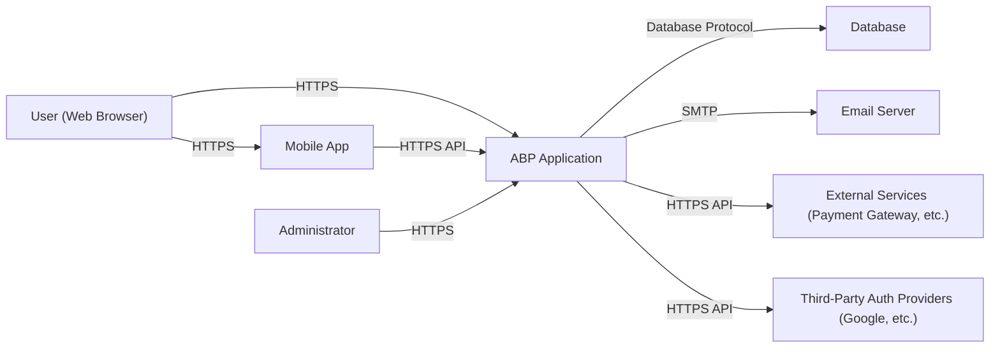
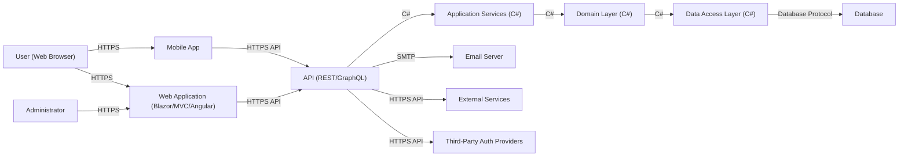
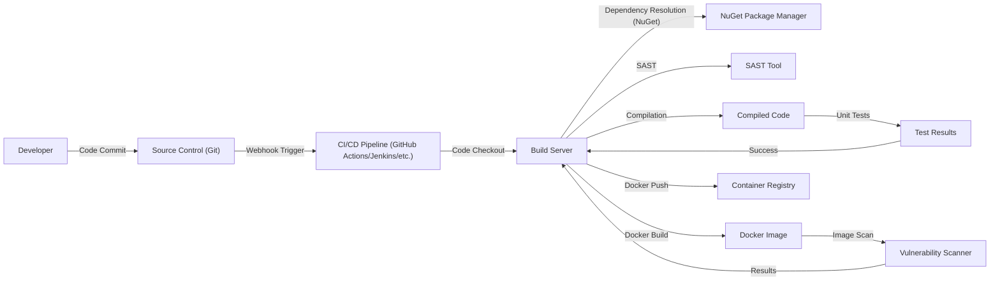

Okay, let's create a design document for the ABP Framework based on the provided GitHub repository.

# BUSINESS POSTURE

ABP Framework is a mature, open-source web application framework. It targets businesses of various sizes, from startups to enterprises, aiming to accelerate development and promote best practices.  The primary business goal is to provide a robust, feature-rich, and well-documented foundation for building modern web applications, reducing development time and cost.  It also aims to foster a strong community and ecosystem around the framework.

Business Priorities:

*   Reduce time-to-market for web application development.
*   Provide a stable and reliable platform for building business-critical applications.
*   Minimize development costs by providing pre-built modules and infrastructure.
*   Ensure maintainability and scalability of applications built with the framework.
*   Promote developer productivity and best practices.
*   Maintain a positive reputation and strong community engagement.

Business Risks:

*   Security vulnerabilities in the framework could compromise applications built upon it, leading to data breaches, financial losses, and reputational damage.
*   Lack of adoption or a decline in community engagement could hinder the framework's long-term viability.
*   Inability to keep up with evolving web technologies and security threats could render the framework obsolete.
*   Complexity of the framework could create a steep learning curve, hindering adoption by new developers.
*   Performance bottlenecks in the framework could impact the scalability and responsiveness of applications.
*   Inadequate documentation or support could lead to developer frustration and project delays.

# SECURITY POSTURE

Existing Security Controls:

*   security control: Authentication and Authorization: The framework provides built-in modules for user authentication and authorization, including role-based access control (RBAC) and claims-based authorization. (Described in documentation and implemented in modules).
*   security control: Data Validation: The framework encourages and provides mechanisms for input validation to prevent common vulnerabilities like cross-site scripting (XSS) and SQL injection. (Described in documentation and implemented in modules).
*   security control: Cross-Site Scripting (XSS) Protection: The framework includes built-in features and encourages practices to mitigate XSS vulnerabilities. (Described in documentation and implemented in modules).
*   security control: Cross-Site Request Forgery (CSRF) Protection: The framework automatically implements anti-CSRF tokens to protect against CSRF attacks. (Described in documentation and implemented in modules).
*   security control: Security Auditing: The framework provides logging and auditing capabilities to track security-related events. (Described in documentation and implemented in modules).
*   security control: Dependency Management: The framework uses a well-defined dependency management system (NuGet) to manage external libraries and ensure timely updates. (Implemented in project structure).
*   security control: Regular Security Updates: The ABP Framework team regularly releases updates and patches to address security vulnerabilities. (Visible in GitHub repository and release history).
*   security control: Secure Communication: The framework supports HTTPS and encourages its use for secure communication. (Described in documentation).
*   security control: OpenIddict integration: Provides a versatile and secure solution for implementing OpenID Connect and OAuth 2.0 flows.

Accepted Risks:

*   accepted risk: The framework relies on third-party libraries, which may have their own vulnerabilities. While the ABP team strives to use well-maintained libraries, there's an inherent risk associated with external dependencies.
*   accepted risk: The framework's complexity might introduce configuration errors by developers, leading to security vulnerabilities.
*   accepted risk: While the framework provides security features, the ultimate security of an application depends on how developers implement and configure those features. Misuse or misconfiguration can lead to vulnerabilities.

Recommended Security Controls:

*   security control: Implement a robust Content Security Policy (CSP) to mitigate the impact of XSS vulnerabilities.
*   security control: Integrate static application security testing (SAST) and dynamic application security testing (DAST) tools into the CI/CD pipeline.
*   security control: Conduct regular penetration testing and vulnerability assessments on applications built with the framework.
*   security control: Implement a strong password policy and multi-factor authentication (MFA).
*   security control: Provide security training to developers on secure coding practices and common vulnerabilities.

Security Requirements:

*   Authentication:
    *   Support for multiple authentication providers (e.g., local accounts, social logins, OpenID Connect).
    *   Secure storage of user credentials (e.g., using strong hashing algorithms).
    *   Protection against brute-force attacks.
    *   Session management with secure session identifiers and timeouts.
    *   Account lockout mechanisms.

*   Authorization:
    *   Fine-grained access control based on roles and permissions.
    *   Support for attribute-based access control (ABAC).
    *   Centralized authorization management.
    *   Auditing of authorization decisions.

*   Input Validation:
    *   Validation of all user inputs against a strict whitelist of allowed characters and formats.
    *   Context-aware validation based on data type and expected usage.
    *   Protection against common injection attacks (e.g., SQL injection, command injection).
    *   Sanitization of user inputs to prevent XSS.

*   Cryptography:
    *   Use of strong, industry-standard cryptographic algorithms.
    *   Secure key management practices.
    *   Protection of sensitive data at rest and in transit.
    *   Regular review and update of cryptographic libraries.

# DESIGN

## C4 CONTEXT



Element Descriptions:

*   Element:
    *   Name: User
    *   Type: Person
    *   Description: A user interacting with the ABP application through a web browser.
    *   Responsibilities: Accessing application features, providing input, viewing data.
    *   Security controls: Browser-based security controls (e.g., same-origin policy, cookie security).

*   Element:
    *   Name: Mobile App
    *   Type: Mobile Application
    *   Description: A mobile application interacting with the ABP application.
    *   Responsibilities: Accessing application features, providing input, viewing data.
    *   Security controls: HTTPS, API Authentication, Secure storage.

*   Element:
    *   Name: ABP Application
    *   Type: Software System
    *   Description: The web application built using the ABP Framework.
    *   Responsibilities: Handling user requests, processing data, interacting with other systems.
    *   Security controls: Authentication, Authorization, Input Validation, CSRF Protection, XSS Protection, Auditing, Secure Communication.

*   Element:
    *   Name: Database
    *   Type: Database
    *   Description: The database used to store application data.
    *   Responsibilities: Storing and retrieving data.
    *   Security controls: Database access controls, encryption at rest, auditing.

*   Element:
    *   Name: Email Server
    *   Type: Software System
    *   Description: The email server used for sending emails.
    *   Responsibilities: Sending transactional and notification emails.
    *   Security controls: Secure SMTP configuration, sender authentication.

*   Element:
    *   Name: External Services
    *   Type: Software System
    *   Description: External services used by the application (e.g., payment gateways).
    *   Responsibilities: Providing specific functionalities (e.g., payment processing).
    *   Security controls: Secure API communication, authentication, authorization.

*   Element:
    *   Name: Third-Party Auth Providers
    *   Type: Software System
    *   Description: Third-party authentication providers (e.g., Google, Facebook).
    *   Responsibilities: Authenticating users.
    *   Security controls: OAuth 2.0, OpenID Connect.

*   Element:
    *   Name: Administrator
    *   Type: Person
    *   Description: An administrator managing the ABP application.
    *   Responsibilities: Configuring the application, managing users, monitoring performance.
    *   Security controls: Strong authentication, role-based access control.

## C4 CONTAINER



Element Descriptions:

*   Element:
    *   Name: User
    *   Type: Person
    *   Description: A user interacting with the ABP application.
    *   Responsibilities: Accessing application features, providing input, viewing data.
    *   Security controls: Browser-based security controls.

*   Element:
    *   Name: Mobile App
    *   Type: Mobile Application
    *   Description: A mobile application interacting with the ABP application.
    *   Responsibilities: Accessing application features, providing input, viewing data.
    *   Security controls: HTTPS, API Authentication, Secure storage.

*   Element:
    *   Name: Web Application
    *   Type: Web Application (Blazor/MVC/Angular)
    *   Description: The user interface of the application.
    *   Responsibilities: Rendering UI, handling user interactions, communicating with the API.
    *   Security controls: XSS protection, CSRF protection, input validation.

*   Element:
    *   Name: API
    *   Type: API (REST/GraphQL)
    *   Description: The application programming interface.
    *   Responsibilities: Exposing application functionality to clients.
    *   Security controls: Authentication, authorization, input validation, rate limiting.

*   Element:
    *   Name: Application Services
    *   Type: C# Code
    *   Description: The application logic layer.
    *   Responsibilities: Implementing business logic, orchestrating domain operations.
    *   Security controls: Authorization checks, input validation.

*   Element:
    *   Name: Domain Layer
    *   Type: C# Code
    *   Description: The core business logic and entities.
    *   Responsibilities: Defining business rules and data models.
    *   Security controls: Domain-level validation and constraints.

*   Element:
    *   Name: Data Access Layer
    *   Type: C# Code
    *   Description: The layer responsible for interacting with the database.
    *   Responsibilities: Retrieving and storing data.
    *   Security controls: Parameterized queries, ORM security features.

*   Element:
    *   Name: Database
    *   Type: Database
    *   Description: The database used to store application data.
    *   Responsibilities: Storing and retrieving data.
    *   Security controls: Database access controls, encryption at rest, auditing.

*   Element:
    *   Name: Email Server
    *   Type: Software System
    *   Description: The email server.
    *   Responsibilities: Sending emails.
    *   Security controls: Secure SMTP configuration.

*   Element:
    *   Name: External Services
    *   Type: Software System
    *   Description: External services.
    *   Responsibilities: Providing specific functionalities.
    *   Security controls: Secure API communication.

*   Element:
    *   Name: Third-Party Auth Providers
    *   Type: Software System
    *   Description: Third-party authentication providers.
    *   Responsibilities: Authenticating users.
    *   Security controls: OAuth 2.0, OpenID Connect.

*   Element:
    *   Name: Administrator
    *   Type: Person
    *   Description: An administrator managing the ABP application.
    *   Responsibilities: Configuring the application, managing users, monitoring performance.
    *   Security controls: Strong authentication, role-based access control.

## DEPLOYMENT

Possible Deployment Solutions:

1.  **Cloud-Based (Azure/AWS/GCP):** Deploying to a cloud platform using services like Azure App Service, AWS Elastic Beanstalk, or Google App Engine. This offers scalability, managed infrastructure, and integration with other cloud services.
2.  **Containerized (Docker/Kubernetes):** Containerizing the application using Docker and deploying it to a Kubernetes cluster. This provides portability, scalability, and efficient resource utilization.
3.  **Virtual Machines (On-Premise/Cloud):** Deploying the application to virtual machines, either on-premise or in the cloud. This offers more control over the environment but requires more manual configuration and management.
4.  **Traditional Server (IIS/Apache/Nginx):** Deploying the application directly to a web server like IIS, Apache, or Nginx. This is a traditional approach suitable for simpler deployments.

Chosen Solution: Containerized (Docker/Kubernetes)

```mermaid
graph LR
    DevMachine["Developer Machine"] --> "Docker Build" --> DockerImage["Docker Image"]
    DockerImage -- "Docker Push" --> ContainerRegistry["Container Registry (Docker Hub/ACR/ECR)"]
    ContainerRegistry -- "kubectl apply" --> KubernetesCluster["Kubernetes Cluster"]
    KubernetesCluster -- "Ingress" --> Service["Service (Load Balancer)"]
    Service -- "Pod" --> AppContainer["Application Container"]
    AppContainer -- "Database Connection" --> DatabaseInstance["Database Instance (Managed/Self-Hosted)"]

```

Element Descriptions:

*   Element:
    *   Name: Developer Machine
    *   Type: Workstation
    *   Description: The developer's local machine used for development and building the application.
    *   Responsibilities: Code development, building Docker images.
    *   Security controls: Local security measures, secure coding practices.

*   Element:
    *   Name: Docker Image
    *   Type: Container Image
    *   Description: The packaged application and its dependencies.
    *   Responsibilities: Providing a consistent and portable runtime environment.
    *   Security controls: Image scanning for vulnerabilities, minimal base image.

*   Element:
    *   Name: Container Registry
    *   Type: Container Registry (Docker Hub/ACR/ECR)
    *   Description: A repository for storing and managing Docker images.
    *   Responsibilities: Storing and distributing Docker images.
    *   Security controls: Access controls, image signing, vulnerability scanning.

*   Element:
    *   Name: Kubernetes Cluster
    *   Type: Kubernetes Cluster
    *   Description: A cluster of nodes for running containerized applications.
    *   Responsibilities: Orchestrating containers, managing resources, providing scalability and high availability.
    *   Security controls: Network policies, RBAC, pod security policies, secrets management.

*   Element:
    *   Name: Service
    *   Type: Kubernetes Service (Load Balancer)
    *   Description: A Kubernetes service that exposes the application to external traffic.
    *   Responsibilities: Load balancing traffic across multiple pods.
    *   Security controls: TLS termination, network policies.

*   Element:
    *   Name: AppContainer
    *   Type: Container
    *   Description: The running instance of the application container.
    *   Responsibilities: Executing the application code.
    *   Security controls: Container security context, resource limits.

*   Element:
    *   Name: Database Instance
    *   Type: Database Instance (Managed/Self-Hosted)
    *   Description: The database instance used by the application.
    *   Responsibilities: Storing and retrieving data.
    *   Security controls: Database access controls, encryption at rest, auditing.

## BUILD


Build Process Description:

1.  **Code Commit:** Developers commit code changes to a source control repository (e.g., Git).
2.  **Webhook Trigger:** A webhook triggers the CI/CD pipeline (e.g., GitHub Actions, Jenkins) upon code commit.
3.  **Code Checkout:** The CI/CD pipeline checks out the latest code from the source control repository.
4.  **Dependency Resolution:** The build server uses NuGet to resolve and download project dependencies.
5.  **SAST:** A Static Application Security Testing (SAST) tool analyzes the source code for potential security vulnerabilities.
6.  **Compilation:** The code is compiled into executable binaries.
7.  **Unit Tests:** Unit tests are executed to verify the functionality of individual components.
8.  **Docker Build:** A Docker image is built, packaging the compiled code and its dependencies.
9.  **Image Scan:** The Docker image is scanned for known vulnerabilities using a vulnerability scanner.
10. **Docker Push:** The Docker image is pushed to a container registry (e.g., Docker Hub, Azure Container Registry).

Security Controls in Build Process:

*   security control: **Source Control Security:** Access controls and branch protection rules in the source control repository.
*   security control: **Dependency Management:** Using a trusted package manager (NuGet) and regularly updating dependencies.
*   security control: **SAST:** Static Application Security Testing to identify vulnerabilities in the source code.
*   security control: **Unit Tests:** Automated tests to ensure code quality and prevent regressions.
*   security control: **Image Scanning:** Scanning Docker images for known vulnerabilities.
*   security control: **Build Automation:** Automating the build process to ensure consistency and reduce manual errors.
*   security control: **Secure Build Environment:** Using a secure build server and protecting build artifacts.

# RISK ASSESSMENT

Critical Business Processes:

*   User authentication and authorization.
*   Data management and persistence.
*   Core business logic execution (specific to applications built with ABP).
*   Communication with external services (if applicable).
*   User session management.

Data Sensitivity:

*   **User Data:** Usernames, passwords (hashed), email addresses, personal information (depending on the application), roles, permissions. (Sensitivity: High)
*   **Application Data:** Data specific to the application built using ABP (e.g., financial transactions, customer data, product information). (Sensitivity: Variable, depends on the application)
*   **Configuration Data:** Application settings, API keys, database connection strings. (Sensitivity: High)
*   **Logs:** Audit logs, error logs, application logs. (Sensitivity: Medium to High)

# QUESTIONS & ASSUMPTIONS

Questions:

*   What specific types of applications are most commonly built using the ABP Framework (e.g., e-commerce, SaaS, internal tools)? This helps prioritize security controls for common use cases.
*   What are the most common deployment environments used by ABP Framework users (e.g., Azure, AWS, on-premise)? This helps tailor the deployment section.
*   What level of security expertise is expected from developers using the ABP Framework? This informs the recommendations for security training and best practices.
*   Are there any specific compliance requirements (e.g., GDPR, HIPAA) that ABP Framework users typically need to meet?
*   What is the process for reporting and addressing security vulnerabilities discovered in the ABP Framework?

Assumptions:

*   BUSINESS POSTURE: Assumes that ABP Framework users prioritize rapid development and application stability.
*   SECURITY POSTURE: Assumes that ABP Framework users have a basic understanding of web application security concepts. Assumes that the ABP Framework team actively maintains the framework and addresses security vulnerabilities promptly.
*   DESIGN: Assumes that applications built with ABP Framework will typically follow a layered architecture. Assumes that a relational database is the most common data storage choice. Assumes that containerization (Docker/Kubernetes) is a common deployment strategy.