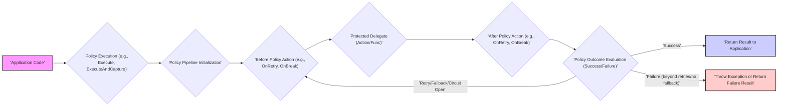

# Project Design Document: Polly - Resilience and Transient-Fault Handling Library

**Version:** 1.1
**Date:** October 26, 2023
**Author:** AI Software Architect

## 1. Introduction

This document provides a detailed design overview of the Polly library, a .NET resilience and transient-fault handling library. This document is specifically tailored to facilitate effective threat modeling by clearly articulating the architecture, components, and data flow within Polly. It serves as a foundation for identifying potential security vulnerabilities and designing appropriate mitigations.

## 2. Goals and Objectives

The primary goals of the Polly library are:

*   To empower developers with a fluent and thread-safe mechanism for expressing resilience policies, including Retry, Circuit Breaker, Timeout, Bulkhead Isolation, and Fallback.
*   To simplify the implementation of robust transient-fault handling logic within .NET applications.
*   To enhance code clarity and maintainability by decoupling resilience concerns from core business logic.
*   To offer an extensible architecture that allows developers to create and integrate custom resilience strategies.
*   To provide seamless integration with diverse .NET application types and frameworks.

## 3. Scope

This design document focuses on the internal architecture and functionality of the core Polly library. It details the key components, their interactions, and the data flow within the library during the execution of resilience policies. This document explicitly excludes:

*   Specific applications that integrate and utilize the Polly library.
*   The underlying infrastructure where applications leveraging Polly are deployed.
*   The intricate implementation details of individual resilience policies (e.g., the precise algorithms governing exponential backoff in the Retry policy).
*   User interfaces or tooling designed for configuring Polly policies, as configuration is primarily code-based.

## 4. Architecture and Components

Polly's architecture revolves around the concept of policies acting as wrappers that govern the execution of delegates (actions or functions). Key components include:

*   **Policies:** The fundamental building blocks of Polly, each implementing a distinct resilience strategy. Examples include:
    *   **Retry Policy:**  Attempts to re-execute an operation a defined number of times, potentially introducing delays between attempts.
    *   **Circuit Breaker Policy:**  Temporarily halts the execution of an operation if it experiences repeated failures, allowing the failing dependency time to recover.
    *   **Timeout Policy:**  Cancels an operation if its execution exceeds a specified duration.
    *   **Bulkhead Isolation Policy:**  Limits the degree of concurrency for an operation, preventing resource exhaustion under heavy load.
    *   **Fallback Policy:**  Executes an alternative action when the primary operation fails.
    *   **Cache Policy:**  Stores the results of an operation for a specified duration to avoid redundant executions.
    *   **Wrap Policy:**  Enables the composition of multiple policies into a sequential pipeline of resilience strategies.
*   **Policy Registry:** A central repository for storing and retrieving pre-configured policies. This facilitates centralized management and promotes policy reuse across the application.
*   **Execution Pipeline:**  When a policy is invoked, an execution pipeline is created. This pipeline orchestrates the invocation of the protected delegate and the application of the policy's specific logic. The pipeline manages the flow of execution, intercepting and potentially modifying the outcome of the protected delegate.
*   **Context:** A dictionary-like object that flows through the execution pipeline. It allows for the sharing of data between different policies within a pipeline and with the protected delegate. This can include information about the operation being executed, retry counts, timestamps, and other relevant metadata.
*   **Delegates (Actions and Funcs):** The units of code (methods or functions) that are protected by the Polly policies. These typically represent calls to external services, database interactions, or other potentially unreliable operations. Polly policies wrap around the invocation of these delegates.
*   **Exception Predicates and Result Predicates:**  Mechanisms for defining the conditions under which a policy should be triggered.
    *   **Exception Predicates:** Specify the types of exceptions that should be handled by the policy (e.g., `HttpRequestException`).
    *   **Result Predicates:** Define specific return values that should trigger the policy (e.g., a specific error code returned by an API).
*   **Async and Sync Execution Support:** Polly provides support for both synchronous and asynchronous execution of policies, catering to different application needs and programming paradigms.
*   **Custom Policy Creation:** Polly offers extensibility points allowing developers to create their own custom resilience policies by implementing specific interfaces and logic.

## 5. Data Flow

The typical data flow when using Polly involves the following sequence of actions:

Detailed breakdown of the data flow:

*   The application code initiates the execution of a policy by calling methods like `Execute`, `ExecuteAndCapture`, or their asynchronous counterparts, providing the delegate to be protected.
*   Polly initializes the policy execution pipeline based on the configured policies. This involves setting up the chain of responsibility for the applied policies.
*   Before the protected delegate is invoked, certain policies might execute pre-actions. For example:
    *   A Retry policy might log a retry attempt.
    *   A Circuit Breaker policy might check its current state.
    *   Custom policies might perform initialization steps.
*   The protected delegate (the actual operation being guarded) is executed. Polly manages the invocation and potential interception of this delegate.
*   After the delegate execution completes (either successfully or with an exception), policies might execute post-actions. For example:
    *   A Retry policy might increment the retry counter.
    *   A Circuit Breaker policy might record the success or failure of the operation.
    *   Custom policies might perform cleanup or logging.
*   Polly evaluates the outcome of the delegate execution based on the configured exception predicates or result predicates. This determines if the operation was considered successful or if a resilience action needs to be taken.
*   Based on the outcome and the configured policies:
    *   If a Retry policy is in place and the outcome indicates a transient fault, the pipeline might loop back to the "Before Policy Action" step to attempt another execution.
    *   If a Fallback policy is configured and the operation failed, the fallback delegate will be executed.
    *   If a Circuit Breaker policy detects a failure, it might transition to an open state, preventing further executions for a defined duration.
    *   If the operation is successful according to the policy's predicates, the result is returned to the calling application code.
    *   If the operation fails after all retries are exhausted or without a fallback defined, an exception might be propagated back to the application, or a failure result might be returned (depending on the `Execute` method used).

## 6. Security Considerations

While Polly primarily focuses on resilience, its configuration and usage introduce several security considerations:

*   **Configuration Vulnerabilities:**
    *   **Exposure of Sensitive Information:** Policy configurations, such as API keys, database connection strings used within fallback actions, or credentials for external services, could be inadvertently exposed if stored insecurely (e.g., in plain text configuration files, hardcoded values).
        *   **Mitigation:** Utilize secure configuration management practices, such as environment variables, dedicated secrets management solutions (e.g., Azure Key Vault, HashiCorp Vault), and avoid storing sensitive information directly in code.
    *   **Overly Permissive Policies:** Incorrectly configured policies can create security risks.
        *   **Excessive Retry Counts/Timeouts:**  Aggressive retry policies against a vulnerable or overloaded service could amplify denial-of-service attacks. Extremely long timeouts could tie up resources.
            *   **Mitigation:** Carefully tune retry strategies and timeouts based on the characteristics of the protected operation and the downstream service. Implement circuit breakers to prevent repeated calls to failing services.
        *   **Insecure Fallback Actions:** Fallback actions might involve calling alternative services or accessing resources. If these alternatives are not properly secured, they could introduce new vulnerabilities.
            *   **Mitigation:** Ensure fallback actions are subject to the same security scrutiny as the primary operation. Avoid fallback actions that bypass security controls.
*   **Denial of Service (DoS):**
    *   **Resource Exhaustion through Aggressive Retries:** As mentioned above, misconfigured retry policies can exacerbate DoS conditions on downstream services.
        *   **Mitigation:** Implement circuit breakers to halt requests to failing services. Use exponential backoff with jitter in retry policies to avoid thundering herd problems.
    *   **Bulkhead Misconfiguration Leading to Starvation:**  If bulkhead policies are configured too restrictively, they might inadvertently prevent legitimate requests from being processed, leading to a localized denial of service.
        *   **Mitigation:** Carefully analyze the expected load and resource requirements when configuring bulkhead policies. Monitor bulkhead usage to identify potential bottlenecks.
*   **Information Disclosure:**
    *   **Logging Sensitive Data:** Logging within policy actions (e.g., `OnRetry`, `OnBreak`, fallback actions) might unintentionally log sensitive information from requests, responses, or internal state.
        *   **Mitigation:** Implement secure logging practices. Sanitize or redact sensitive data before logging. Avoid logging highly detailed error messages in production environments.
    *   **Error Handling in Fallback Revealing Internal Details:** Fallback actions might inadvertently expose detailed error messages or internal system information to users or external systems.
        *   **Mitigation:** Ensure fallback actions return generic error messages or user-friendly alternatives. Avoid propagating raw exception details.
*   **Dependency Vulnerabilities:**
    *   Polly relies on other NuGet packages. Vulnerabilities in these dependencies could potentially affect applications using Polly.
        *   **Mitigation:** Regularly update Polly and its dependencies to the latest stable versions to patch known vulnerabilities. Employ dependency scanning tools to identify potential risks.
*   **Injection Attacks (Indirect):**
    *   While Polly doesn't directly handle user input, if fallback actions or logging mechanisms within policies interact with external systems based on potentially malicious input (e.g., data from the `Context`), they could be susceptible to injection attacks (e.g., SQL injection if a fallback action logs to a database without proper sanitization).
        *   **Mitigation:**  Treat data within the Polly `Context` with caution, especially if it originates from external sources. Implement proper input validation and sanitization in fallback actions and logging mechanisms.
*   **Telemetry and Monitoring Security:**
    *   Telemetry data generated by Polly (e.g., retry counts, circuit breaker state, execution times) might reveal information about the application's internal workings, performance bottlenecks, and potential vulnerabilities if not secured properly.
        *   **Mitigation:** Secure access to telemetry and monitoring systems. Ensure that sensitive information is not inadvertently exposed through telemetry data.

## 7. Deployment Considerations

Deploying applications that utilize Polly involves considerations related to:

*   **Dependency Management:** Ensuring the correct version of the Polly NuGet package is included in the application's deployment package.
*   **Configuration Management:**  Managing the configuration of Polly policies across different environments (development, staging, production). This can be done through code, configuration files (e.g., `appsettings.json`), or external configuration providers (e.g., Azure App Configuration). Securely managing and deploying these configurations is crucial.
*   **Monitoring and Telemetry Integration:**  Integrating Polly with application performance monitoring (APM) and logging systems to track the effectiveness of resilience policies, identify potential issues, and gain insights into application behavior under different conditions.
*   **Secure Credential Management:** When policies require access to secured resources (e.g., through fallback actions), ensure that credentials are managed securely using appropriate mechanisms (e.g., environment variables, secrets management).

## 8. Future Considerations

Potential future enhancements to Polly could include:

*   **More advanced policy composition and orchestration capabilities.**
*   **Deeper integration with distributed tracing and observability platforms.**
*   **A wider range of built-in policies tailored for specific scenarios (e.g., rate limiting, adaptive concurrency).**
*   **Enhanced telemetry and metrics reporting with more granular insights.**
*   **Improved support for reactive programming paradigms.**

This enhanced design document provides a more detailed and security-focused overview of the Polly library's architecture and functionality. It aims to equip security professionals and developers with the necessary information to conduct thorough threat modeling and implement appropriate security measures when using Polly in their applications.