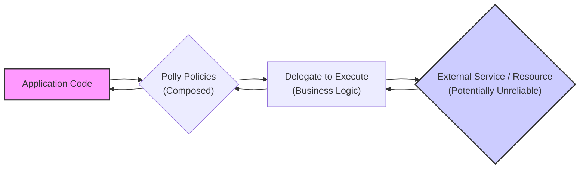
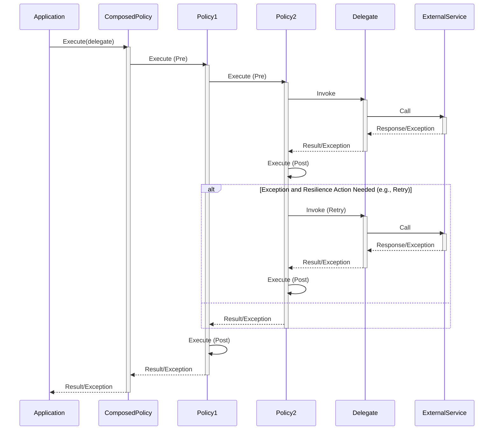

# Project Design Document: Polly - Resilience and Transient-Fault Handling Library

**Version:** 1.1
**Date:** October 26, 2023
**Author:** AI Software Architect

## 1. Introduction

This document provides an enhanced design overview of the Polly library, a .NET library offering comprehensive resilience and transient-fault handling capabilities. This document serves as a foundational resource for understanding the library's architecture, components, and data flow, which is critical for conducting thorough threat modeling.

Polly empowers developers to implement resilience strategies like Retry, Circuit Breaker, Timeout, Bulkhead Isolation, and Fallback using a fluent and thread-safe API. It is specifically designed for scenarios involving interactions with potentially unreliable services or resources, aiming to improve application stability and enhance user experience. This document is tailored to facilitate subsequent threat modeling activities.

## 2. Goals

The core objectives of the Polly library are:

* **Simplify Resilience Implementation:** Offer an intuitive and expressive API for implementing various resilience patterns.
* **Enhance Application Stability:** Bolster the robustness of applications by managing transient faults effectively.
* **Promote Code Clarity:** Enable developers to decouple resilience logic from core business logic, improving maintainability.
* **Support Diverse Execution Contexts:** Be applicable to both synchronous and asynchronous operations.
* **Offer Extensibility and Customization:** Allow for tailoring and integration with other libraries and systems through custom policies and delegates.

## 3. Scope

This design document encompasses the fundamental architectural components and functionalities of the Polly library, focusing on the internal mechanics and interactions of its key elements. This document is specifically intended to serve as the basis for future threat modeling exercises.

The following aspects are within the scope of this document:

* Core resilience strategies: Retry, Circuit Breaker, Timeout, Bulkhead, and Fallback.
* The policy execution pipeline and its constituent parts.
* Policy configuration mechanisms and management.
* Key interfaces, abstractions, and extension points.
* Data flow during policy execution, including error handling paths.

The following aspects are explicitly excluded from the scope of this document:

* Specific examples of library usage and implementation details in client applications.
* Performance metrics, benchmarking results, and optimization strategies.
* Integration specifics with particular logging, monitoring, or telemetry frameworks.
* Low-level implementation details of individual resilience strategies (e.g., the precise algorithms used for calculating retry backoff).

## 4. High-Level Architecture

Polly's architecture revolves around the concept of **Policies** that act as wrappers around the execution of **Delegates** (the code to be protected). These policies are designed to be composable, allowing developers to combine multiple resilience strategies to create sophisticated fault-handling mechanisms.

* **Application Code:** The part of the application requiring resilience. This code invokes Polly policies to safeguard the execution of specific operations.
* **Polly Policies (Composed):** Represents one or more configured resilience strategies combined together. Policies intercept the execution flow of the delegate.
* **Delegate to Execute (Business Logic):** The actual code representing the operation to be performed, often an interaction with an external system.
* **External Service / Resource (Potentially Unreliable):** The external dependency that might exhibit transient faults or unavailability.

## 5. Detailed Design

### 5.1 Core Concepts

* **Policy:** The fundamental unit of resilience in Polly. A policy embodies a specific strategy for handling failures or latency. Polly provides a range of built-in policy types and allows for custom policy creation.
* **Delegate:** The unit of work being protected by a policy. This is typically a method or function call that interacts with a potentially unreliable dependency.
* **Context:** An object providing contextual information throughout the policy execution. This includes details like an operation key for identification, a `CancellationToken` for cancellation support, and a `Dictionary<string, object>` for user-defined data. The context is immutable within a single policy execution.
* **Result:** The outcome of executing the delegate. Policies can inspect the result to determine success or failure based on pre-defined criteria.
* **Exception:** Exceptions thrown by the delegate are central to how policies determine the need for resilience actions. Policies can be configured to handle specific exception types.

### 5.2 Key Components

* **Resilience Strategies:**
    * **Retry Policy:**  Re-executes the delegate a specified number of times or until a successful outcome is achieved.
        * Configuration options: Maximum retry attempts, backoff strategy (fixed, exponential, etc.), predicates for which exceptions or results to retry.
    * **Circuit Breaker Policy:** Prevents an application from repeatedly attempting an operation that is likely to fail, protecting the failing service and the calling application. It transitions between `Closed`, `Open`, and `Half-Open` states.
        * Configuration options: Threshold for breaking the circuit (number of consecutive failures or a failure rate), minimum throughput (minimum number of calls within a period before considering the threshold), duration of the `Open` state before transitioning to `Half-Open`.
    * **Timeout Policy:** Limits the maximum duration for the execution of a delegate.
        * Configuration options: Timeout duration, timeout strategy (`Optimistic` which cancels the operation, or `Pessimistic` which simply lets the operation run but doesn't wait for it).
    * **Bulkhead Isolation Policy:** Restricts the number of concurrent executions of a delegate, isolating failures within a subset of the application and preventing resource exhaustion.
        * Configuration options: Maximum concurrent executions, maximum queued executions (if a queuing mechanism is used).
    * **Fallback Policy:** Provides an alternative action to execute when the primary operation fails.
        * Configuration options: The fallback action (a delegate to execute), predicates for which exceptions or results to trigger the fallback.
* **Policy Registry:** A mechanism for storing and retrieving pre-configured policies. This allows for centralized management and reuse of resilience strategies across the application.
* **Policy Execution Pipeline:** The ordered sequence of steps executed when a policy wraps a delegate. This pipeline allows for the composition of multiple policies, with each policy contributing its resilience logic.
    * **Interception:** The policy intercepts the call to the delegate.
    * **Pre-Execution Logic:** Actions performed by the policy before the delegate is invoked (e.g., checking the circuit breaker state, acquiring a semaphore for a bulkhead).
    * **Delegate Invocation:** The actual execution of the protected delegate.
    * **Post-Execution Logic:** Actions performed by the policy after the delegate execution (e.g., updating the circuit breaker state based on success or failure, handling exceptions).
    * **Result/Exception Handling:** Evaluation of the outcome of the delegate execution to determine if a resilience action (like retry or fallback) is necessary.
* **PolicyBuilder:** A fluent API for configuring and creating policies. It facilitates the composition of multiple policies into a single, combined policy.

### 5.3 Data Flow

The following describes the typical flow of execution when a delegate is invoked through a Polly policy:

1. **Application initiates an operation by invoking a Polly policy, passing the delegate to be executed.**
2. **The outermost policy in the composition begins its execution.**
3. **The policy executes its pre-execution logic.** This might involve checking the state of a Circuit Breaker or acquiring a slot in a Bulkhead.
4. **If the pre-execution logic allows, the execution proceeds to the next policy in the composition (if any), or to the delegate itself.**
5. **The delegate is executed.**
6. **The delegate returns a result or throws an exception.**
7. **The innermost policy in the composition receives the result or exception.**
8. **The policy executes its post-execution logic.**
    * **If the delegate was successful:** The policy might log the success or perform other post-execution actions. The result is then passed to the next policy in the composition (outwards).
    * **If the delegate threw an exception:**
        * The policy evaluates the exception against its configured predicates.
        * **Retry Policy:** If the exception matches a retry predicate and the retry limit has not been reached, a delay is introduced (if configured), and the execution returns to step 3 for the retry attempt.
        * **Circuit Breaker Policy:** If the exception matches a configured failure predicate, the circuit breaker's failure counter is incremented. If the threshold is met, the circuit transitions to the `Open` state, and subsequent calls will be short-circuited.
        * **Timeout Policy:** If the delegate execution exceeds the configured timeout, a `TimeoutRejectedException` is typically thrown by the timeout policy.
        * **Fallback Policy:** If the exception matches a fallback predicate, the fallback delegate is executed, and its result is returned.
9. **The result or exception propagates outwards through the policy composition.**
10. **The outermost policy returns the final result or exception to the application.**

## 6. Security Considerations (Pre-Threat Modeling)

This section outlines potential security considerations based on the design of Polly. This serves as a preliminary step before a more in-depth threat modeling exercise.

* **Configuration Vulnerabilities:**
    * **Risk:**  Malicious or improperly configured policies could lead to unintended consequences, such as excessive retries causing a self-inflicted denial-of-service on the target service, or overly permissive circuit breakers remaining open indefinitely, hindering legitimate operations.
    * **Mitigation:** Implement robust validation of policy configurations. Ensure configurations are sourced from trusted locations and are protected from unauthorized modification. Employ principle of least privilege for configuration access.
* **Denial of Service (DoS):**
    * **Risk:** While Polly aims to prevent cascading failures, misconfigured retry or bulkhead policies could inadvertently contribute to DoS conditions if not carefully tuned. For example, an extremely high retry count with a short delay could overwhelm a failing service.
    * **Mitigation:**  Carefully configure retry counts, backoff strategies, and bulkhead limits. Implement monitoring and alerting to detect and respond to unusual policy behavior. Consider using adaptive retry strategies.
* **Information Disclosure through Exception Handling:**
    * **Risk:** Exception handling logic within policies might inadvertently log or expose sensitive information present in exception details or contextual data.
    * **Mitigation:**  Review exception handling logic to ensure sensitive data is not logged or propagated unnecessarily. Sanitize or redact sensitive information before logging or reporting.
* **Dependency Vulnerabilities:**
    * **Risk:** Polly relies on other .NET libraries. Vulnerabilities in these dependencies could potentially be exploited through Polly.
    * **Mitigation:** Keep Polly and its dependencies up-to-date with the latest security patches. Regularly scan dependencies for known vulnerabilities.
* **Policy Injection:**
    * **Risk:** If policy configurations are dynamically loaded or sourced from untrusted input, it could be possible for an attacker to inject malicious policy configurations, altering the application's resilience behavior.
    * **Mitigation:** Ensure policy configurations are sourced from trusted and authenticated sources. Implement strong input validation and sanitization for any dynamic configuration. Consider using digitally signed configurations.
* **Metrics and Monitoring Exposure:**
    * **Risk:** If metrics and monitoring data exposed by Polly (e.g., circuit breaker state, retry counts) are not properly secured, they could reveal sensitive information about the application's internal state or dependencies, potentially aiding attackers.
    * **Mitigation:** Secure access to metrics and monitoring endpoints. Implement authentication and authorization. Avoid exposing overly detailed or sensitive information in metrics.

## 7. Deployment Considerations

Polly is typically deployed as a library integrated directly into the application code that requires resilience. It does not necessitate a separate deployment infrastructure. Policy configurations can be managed through code, configuration files (e.g., `appsettings.json`), or external configuration providers. The choice of configuration method can impact security, with externally managed configurations potentially introducing risks if not properly secured.

## 8. Assumptions and Constraints

* It is assumed that the underlying network and infrastructure are fundamentally secure, and the primary focus of Polly is handling transient faults arising from otherwise reliable systems.
* Policy configurations are assumed to be managed and deployed using secure practices.
* The application has appropriate logging and monitoring infrastructure in place to observe and analyze policy behavior.
* Developers using Polly understand the implications of different resilience strategies and configure them appropriately for their specific use cases.

## 9. Glossary

* **Delegate:** A type that represents references to methods with a particular parameter list and return type.
* **Transient Fault:** A temporary error condition that is expected to resolve itself after a short period, without manual intervention.
* **Resilience:** The ability of a system to withstand failures and continue functioning, maintaining an acceptable level of service.
* **Predicate:** A function that evaluates a condition and returns a boolean value (true or false), often used to determine if a specific action should be taken based on an exception or result.

This enhanced design document provides a more detailed and refined overview of the Polly library, specifically tailored to support effective threat modeling. The expanded descriptions of components, data flow, and security considerations offer a solid foundation for identifying potential vulnerabilities and assessing the security posture of applications utilizing Polly.