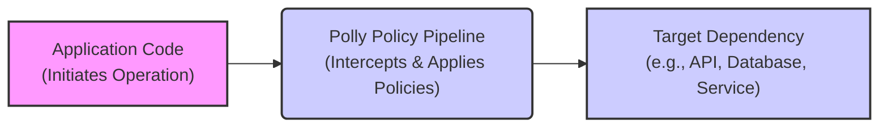

# Project Design Document: Polly - Resilience and Fault Handling Library

**Version:** 1.1
**Date:** October 26, 2023
**Author:** AI Software Architect

## 1. Introduction

This document provides an enhanced and detailed design overview of the Polly project, a .NET resilience and fault-handling library. This document is specifically crafted to serve as a foundational resource for subsequent threat modeling activities. It meticulously outlines the key components, architecture, data flow, and security considerations inherent in Polly's design and usage. The aim is to provide a clear understanding of the system's inner workings to facilitate the identification of potential vulnerabilities and security risks.

## 2. Goals

*   Present a comprehensive and easily understandable architectural overview of the Polly library.
*   Clearly identify the core components of Polly and meticulously describe their interactions.
*   Detail the flow of execution and data within the library, highlighting decision points and potential failure scenarios.
*   Thoroughly highlight potential security considerations and attack vectors relevant for effective threat modeling.
*   Serve as a definitive reference point for security assessments, penetration testing, and secure development practices related to Polly.

## 3. Scope

This document encompasses the core functionalities and architectural design of the Polly library as represented in the provided GitHub repository. It focuses on the resilience policies, their configuration, and their execution within a consuming application. The scope includes the various policy types and the mechanisms by which they intercept and manage the execution of delegated operations. It does not delve into the implementation details of specific policy strategies or external integrations beyond illustrating their interaction points with Polly's core.

## 4. High-Level Architecture

Polly is designed as an in-process library that empowers developers to define and apply resilience and transient-fault-handling policies declaratively around potentially failing operations. It operates directly within the application's runtime environment.



**Key Architectural Characteristics:**

*   **In-Process Operation:** Polly executes entirely within the application's process, incurring minimal overhead.
*   **Fluent Policy Definition:** Policies are defined using a fluent, code-based API, offering flexibility and readability.
*   **Aspect-Oriented Nature:** Policies act as aspects, intercepting and augmenting the execution of target operations.
*   **No External Dependencies (Core):** The core Polly library has minimal external dependencies, simplifying integration.
*   **Extensibility:** Polly provides extension points for creating custom policies and integrating with other systems.

## 5. Component Details

This section provides a detailed breakdown of the key components within the Polly library and their roles in the resilience process.

*   **Policies (Individual Resilience Strategies):** The fundamental units of resilience in Polly. Each policy implements a specific fault-handling strategy.
    *   **Retry Policy:**  Mechanism to automatically re-execute an operation upon encountering transient failures. Configuration includes the number of retries, backoff strategies (e.g., exponential backoff), and which exceptions to retry.
    *   **Circuit Breaker Policy:** Prevents an application from repeatedly attempting to execute an operation that is likely to fail. It transitions between Closed, Open, and Half-Open states based on the success/failure rate of recent operations.
    *   **Timeout Policy:** Enforces a maximum duration for an operation's execution. If the operation exceeds the timeout, it's considered a failure.
    *   **Fallback Policy:** Defines an alternative action to be taken when an operation fails. This could involve returning a default value, executing a different code path, or logging the error.
    *   **Bulkhead Isolation Policy:** Limits the number of concurrent calls to a protected resource, preventing resource exhaustion and cascading failures.
    *   **Cache Policy:** Caches the results of expensive or frequently accessed operations to improve performance and reduce load on dependencies. Configuration includes cache duration and eviction strategies.
    *   **Rate Limiter Policy:** Controls the rate at which operations are allowed to execute, preventing overwhelming downstream services.
*   **PolicyRegistry (Centralized Policy Management):** A container for registering and retrieving reusable policies. This promotes consistency and simplifies policy management across an application.
*   **PolicyWrap (Combining Policies):** Enables the composition of multiple policies to create more sophisticated and layered resilience strategies. Policies within a wrap execute in a defined order (inner to outer).
*   **Context (Passing Data Through the Pipeline):** A mechanism to pass contextual information through the policy execution pipeline. This allows policies to make decisions based on the specific operation being executed.
*   **Execution Delegates and Lambda Expressions (Defining Protected Operations):**  Used to define the code blocks that are to be protected by Polly policies. These are typically delegates or lambda expressions representing the call to the target dependency.
*   **Async Support (Non-Blocking Operations):** Polly provides asynchronous counterparts for its policies, enabling non-blocking execution and improved responsiveness in asynchronous applications.
*   **Interceptors (Integration Points):**  In specific integration scenarios (e.g., with `HttpClientFactory`), Polly utilizes interceptors (like DelegatingHandlers) to seamlessly apply policies to outgoing requests.

## 6. Data Flow

The data flow within Polly involves the interception of an operation and the sequential application of configured policies. Understanding this flow is crucial for identifying potential points of failure or manipulation.

```mermaid
sequenceDiagram
    participant Application Code
    participant Polly Policy Pipeline
    participant Individual Policy
    participant Target Dependency

    Application Code->>Polly Policy Pipeline: Execute Operation (via delegate)
    activate Polly Policy Pipeline
    loop For Each Policy in Pipeline
        Polly Policy Pipeline->>Individual Policy: Execute Policy Logic (Before Action)
        alt Policy Logic Determines Action
            Individual Policy -->>Polly Policy Pipeline: Proceed with Operation
        else Policy Logic Intervenes
            Individual Policy -->>Polly Policy Pipeline: Handle Failure/Alternative Action
            Polly Policy Pipeline -->>Application Code: Return Result (e.g., Fallback)
            deactivate Polly Policy Pipeline
            stop
        end
    end
    Polly Policy Pipeline->>Target Dependency: Execute Target Operation
    activate Target Dependency
    Target Dependency-->>Polly Policy Pipeline: Operation Result (Success or Failure)
    deactivate Target Dependency
    loop For Each Policy in Pipeline (Reverse Order)
        Polly Policy Pipeline->>Individual Policy: Execute Policy Logic (After Action)
        alt Policy Logic Reacts to Result
            Individual Policy -->>Polly Policy Pipeline: Update State/Metrics
        end
    end
    Polly Policy Pipeline-->>Application Code: Return Final Result
    deactivate Polly Policy Pipeline
```

**Detailed Data Flow Description:**

1. The application code initiates an operation by invoking a delegate that is wrapped by a Polly policy or a `PolicyWrap`.
2. The **Polly Policy Pipeline** intercepts the execution.
3. Each **Individual Policy** in the pipeline is executed in order (outer to inner for actions before the delegate, inner to outer for actions after).
4. **Before the Target Operation:** Policies like Retry, Circuit Breaker, Timeout, and Bulkhead make decisions based on their configuration and current state.
    *   **Retry Policy:** Checks if a retry is necessary and allowed based on previous failures and the retry strategy.
    *   **Circuit Breaker Policy:** Checks if the circuit is open. If so, it short-circuits the call and throws a `BrokenCircuitException`.
    *   **Timeout Policy:** Starts a timer to track the operation's duration.
    *   **Bulkhead Isolation Policy:** Checks for available slots in the bulkhead.
5. If all preceding policies allow, the **Target Dependency** is invoked.
6. The **Target Dependency** executes the requested operation and returns a result (success or failure).
7. **After the Target Operation:** Policies react to the outcome.
    *   **Retry Policy:** If the operation failed and retries are configured, it may initiate a retry attempt.
    *   **Circuit Breaker Policy:** Updates its state (success/failure counts) based on the operation's outcome.
    *   **Fallback Policy:** If the operation failed and no other policy handled it, the fallback action is executed.
    *   **Cache Policy:** If the operation was successful and caching is enabled, the result may be stored in the cache.
8. The **Polly Policy Pipeline** returns the final result (either the successful result from the dependency or the result of a fallback action) to the **Application Code**.

## 7. Security Considerations

While Polly's primary function is resilience, its configuration and usage introduce several security considerations that are crucial for threat modeling.

*   **Misconfigured Policies Leading to Exploitable Behavior:**
    *   **Unbounded Retry Policies:**  Can be exploited to amplify DoS attacks against vulnerable dependencies by repeatedly sending requests, potentially overwhelming them. Consider the retry count, backoff strategy, and which exceptions trigger retries.
    *   **Overly Permissive Circuit Breaker Thresholds:**  May fail to protect the application from cascading failures if the thresholds for opening the circuit are too high or the duration of the open state is too short.
    *   **Insecure Fallback Implementations:** Fallback logic might inadvertently expose sensitive information (e.g., detailed error messages), perform unauthorized actions, or introduce new vulnerabilities. Ensure fallback actions are secure and well-tested.
    *   **Weak Timeout Configurations:**  Extremely long timeouts can tie up resources, while very short timeouts might lead to unnecessary failures and retries.
    *   **Large Bulkhead Sizes:**  While intended to prevent resource exhaustion, an excessively large bulkhead might still allow enough concurrent requests to overwhelm a vulnerable dependency.
    *   **Insecure Cache Implementations:** If the Cache Policy is used, vulnerabilities in the underlying caching mechanism could be exploited. Ensure proper access controls and consider encrypting sensitive cached data. Improper cache invalidation can lead to serving stale or incorrect data.
    *   **Rate Limiting Bypass:**  Ensure that rate limiting policies are correctly applied and cannot be easily bypassed by malicious actors. Consider the granularity of the rate limiting (e.g., per user, per IP).
*   **Dependency Chain Vulnerabilities:** Polly often interacts with external dependencies. If these dependencies have known vulnerabilities, Polly's retry mechanisms could inadvertently increase the attack surface by repeatedly interacting with the vulnerable component.
*   **Information Disclosure through Logging and Telemetry:**  Detailed logging or telemetry data generated by Polly (e.g., retry attempts, circuit breaker state changes, error messages) might inadvertently expose sensitive information if not properly secured and managed.
*   **Denial of Service through Policy Manipulation:** In scenarios where policy configurations are dynamically loaded or influenced by external sources, vulnerabilities in these mechanisms could allow attackers to manipulate policies (e.g., setting extremely high retry counts or disabling circuit breakers) to cause DoS.
*   **Bypass of Security Controls:**  Incorrectly applied Polly policies might inadvertently bypass existing security controls. For example, a poorly configured retry policy might repeatedly send requests to an endpoint that should be blocked after a certain number of failed authentication attempts.
*   **Injection Attacks in Fallback Actions:** If fallback actions involve processing user-provided input, they are susceptible to injection attacks (e.g., SQL injection, command injection) if proper sanitization is not performed.
*   **Lack of Input Validation in Policy Configuration:** If policy configurations are derived from external sources, ensure proper validation to prevent malicious actors from injecting harmful configurations.
*   **Telemetry Exploitation:** If telemetry data includes sensitive information or reveals internal system details, attackers might exploit this information for reconnaissance or further attacks.

## 8. Deployment Considerations

Polly is deployed as a NuGet package that is integrated directly into the application's codebase. Policy configurations are typically defined within the application's code or configuration files.

**Key Deployment Aspects:**

*   **Library Integration:** Polly is a library, so its "deployment" involves including the NuGet package in the application.
*   **Configuration Management:** Policy configurations (retry counts, timeouts, etc.) need to be managed and potentially updated. Consider using configuration files, environment variables, or a centralized configuration service.
*   **No Separate Infrastructure:** Polly does not require any dedicated infrastructure or services.
*   **Integration with DI Containers:** Polly integrates well with Dependency Injection (DI) containers for managing policy instances.

## 9. Future Considerations (Contextual Information)

*   **Advanced Policy Orchestration:** Exploring more sophisticated patterns for combining and coordinating policies.
*   **Enhanced Observability Features:** Deeper integration with observability platforms for monitoring policy effectiveness and identifying potential issues.
*   **Declarative Policy Configuration:**  Moving towards more declarative approaches for defining policies, potentially using external configuration formats.

## 10. Conclusion

This enhanced design document provides a comprehensive and detailed overview of the Polly library, with a strong emphasis on security considerations relevant for threat modeling. By understanding the architecture, data flow, and potential vulnerabilities associated with Polly's configuration and usage, development and security teams can proactively identify and mitigate risks, ensuring the development of more resilient and secure applications. This document serves as a critical resource for security assessments and promotes a security-conscious approach to utilizing the Polly library.