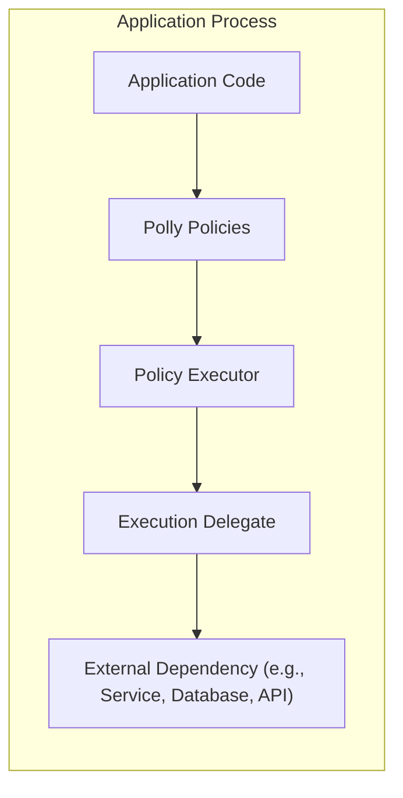
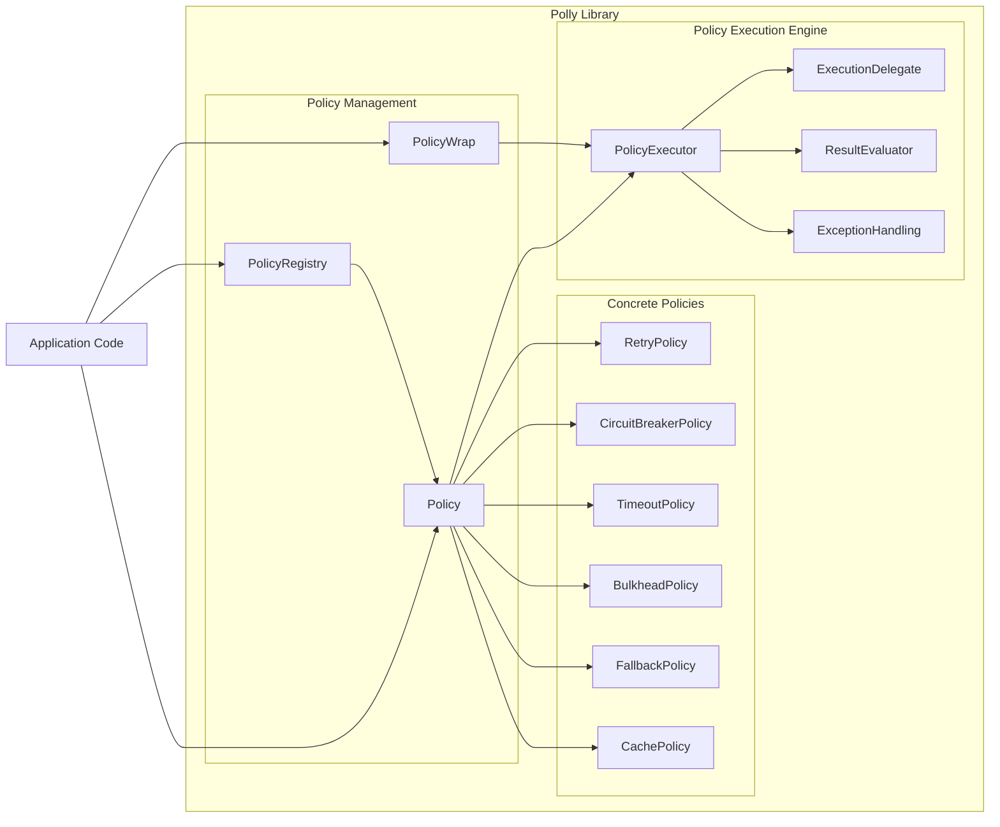
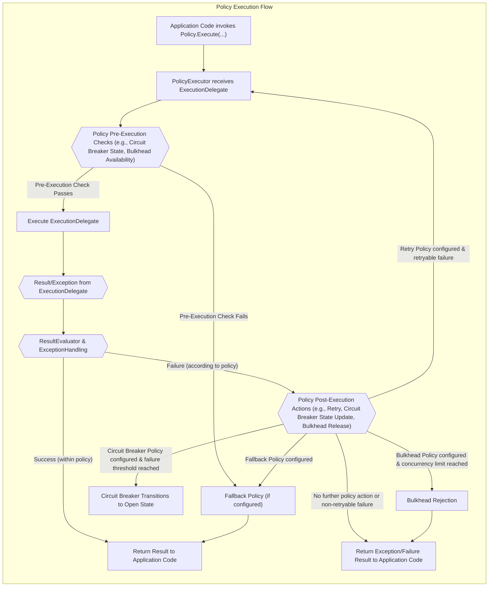

# Project Design Document: Polly - Resilience and Transient-Fault-Handling Library

**Version:** 1.1
**Date:** October 26, 2023
**Author:** AI Cloud & Security Architect

## 1. Introduction

This document provides a detailed design overview of the Polly project, a .NET resilience and transient-fault-handling library. It is intended to serve as a foundation for subsequent threat modeling activities, ensuring a comprehensive understanding of Polly's architecture, components, and data flow from a security perspective. This document outlines the key aspects of Polly relevant to security considerations, potential vulnerabilities, and informs security assessments.

## 2. Project Overview

Polly is a .NET library designed to empower developers with robust resilience and transient-fault-handling capabilities. It enables the implementation of policies such as Retry, Circuit Breaker, Timeout, Bulkhead Isolation, and Fallback in a fluent, thread-safe, and composable manner. By integrating Polly, applications can gracefully manage failures, enhance stability, and deliver improved user experiences, particularly in distributed and inherently unreliable environments. Polly policies are versatile and can be applied to any synchronous or asynchronous .NET code execution.

**Project Repository:** [https://github.com/app-vnext/polly](https://github.com/app-vnext/polly)

## 3. Goals and Objectives

The primary goals of Polly are to:

* **Simplify Resilience Implementation:** Offer an intuitive and expressive API to implement complex resilience patterns in .NET applications, reducing development complexity.
* **Enhance Application Stability and Availability:** Improve application robustness by automating the handling of transient faults, preventing cascading failures, and promoting self-healing capabilities.
* **Promote Resilience Engineering Best Practices:** Encourage the adoption of industry-standard resilience patterns like Retry, Circuit Breaker, Timeout, Bulkhead Isolation, and Fallback, fostering resilient application design.
* **Boost Developer Productivity:** Minimize boilerplate code associated with resilience implementation, allowing developers to concentrate on core business logic and accelerate development cycles.
* **Ensure Maintainability and Extensibility:** Provide a well-architected and extensible framework that is easy to understand, maintain, adapt to evolving requirements, and extend with custom policies.

## 4. Target Audience

This design document is intended for a diverse audience involved in the development, security, and operation of applications utilizing Polly:

* **Security Architects and Engineers:** To gain a deep understanding of Polly's architecture for effective threat modeling, vulnerability assessments, and security control implementation.
* **Software Architects and Developers:** To acquire comprehensive knowledge of Polly's design principles, component interactions, and integration patterns within applications for informed design and development decisions.
* **Operations and DevOps Teams:** To understand the operational behavior of applications employing Polly, anticipate potential failure scenarios, and establish appropriate monitoring and alerting strategies.
* **Quality Assurance and Testing Teams:** To design effective test strategies that validate the resilience mechanisms implemented using Polly and ensure proper fault handling under various conditions.

## 5. System Architecture

Polly is architected as a lightweight, in-process library that seamlessly integrates into .NET applications. It does not function as a standalone service or external component. The core architectural concepts revolve around **Policies** and **Execution Delegates**.

### 5.1. High-Level Architecture

**Description:**

* **"Application Code"**: Represents the application's codebase that initiates operations, potentially interacting with external systems or performing tasks susceptible to transient faults.
* **"Polly Policies"**: The central component of Polly. Policies are configured to define specific resilience strategies (e.g., Retry, Circuit Breaker, Timeout, Fallback). Multiple policies can be combined using "PolicyWrap" for sophisticated resilience orchestration.
* **"Policy Executor"**:  The engine within Polly that orchestrates the execution of policies and the "Execution Delegate". It manages pre-execution checks, policy logic application, and post-execution actions.
* **"Execution Delegate"**: A code block (delegate or lambda expression) encapsulating the operation that Polly policies will protect and enhance with resilience. This is the actual code that interacts with the "External Dependency" or performs the target task.
* **"External Dependency (e.g., Service, Database, API)"**: Represents external systems, resources, or APIs that the application relies upon and which may exhibit unreliability or transient faults. Examples include databases, web services, message queues, and third-party APIs.

**Key Architectural Principles:**

* **In-Process Library Design:** Polly operates directly within the application's process space, eliminating network latency and overhead associated with external resilience services, leading to faster response times and reduced complexity.
* **Policy-Centric Approach:** Resilience logic is modularized and encapsulated within reusable and configurable policies, promoting a clear separation of concerns between application logic and resilience mechanisms.
* **Fluent and Intuitive API:** Polly offers a fluent API for policy definition and composition, enabling developers to easily configure and combine policies in a readable and maintainable manner.
* **Extensibility and Customization:** Polly is designed to be highly extensible, allowing developers to create custom policies tailored to specific application needs and integrate with other libraries or frameworks.
* **Thread Safety:** Polly is inherently thread-safe, ensuring safe and reliable operation in concurrent and multi-threaded application environments.

### 5.2. Component-Level Architecture

The following diagram provides a more granular view of Polly's internal components and their interactions:

**Component Descriptions:**

* **"PolicyRegistry"**: (Optional but recommended for larger applications) A centralized repository for storing and managing named Polly policies. It facilitates policy reuse, simplifies configuration management, and enables dynamic policy updates.
* **"Policy"**: An abstract base class serving as the foundation for all Polly policies. It defines the core interface and common functionalities for policy execution and configuration.
* **"PolicyWrap"**: A composite policy that enables the sequential application of multiple policies. It allows for the creation of sophisticated resilience strategies by combining different policy types (e.g., Retry wrapped with a Circuit Breaker).
* **"RetryPolicy"**: Implements the Retry pattern, automatically re-executing operations upon encountering transient faults. It supports various retry strategies, including fixed intervals, exponential backoff, and jitter.
* **"CircuitBreakerPolicy"**: Implements the Circuit Breaker pattern, preventing an application from repeatedly attempting to execute operations that are likely to fail due to a persistent fault. It transitions between "Closed", "Open", and "Half-Open" states based on failure thresholds and recovery attempts.
* **"TimeoutPolicy"**: Implements the Timeout pattern, enforcing a maximum execution duration for operations. It prevents indefinite delays and resource exhaustion caused by slow or unresponsive dependencies.
* **"BulkheadPolicy"**: Implements the Bulkhead Isolation pattern, isolating parts of an application from each other to limit the impact of failures. It restricts the number of concurrent executions for a specific operation, preventing resource contention and cascading failures.
* **"FallbackPolicy"**: Implements the Fallback pattern, defining an alternative action to be taken when an operation fails. This can involve returning a default value, executing alternative logic, or gracefully handling errors to maintain application functionality.
* **"CachePolicy"**: Implements result caching for executed delegates, improving performance by reducing redundant operations and dependency load. It supports various caching providers and cache invalidation strategies.
* **"PolicyExecutor"**: The core execution engine responsible for intercepting and executing the "ExecutionDelegate". It orchestrates policy logic, including pre-execution checks, delegate invocation, result evaluation, exception handling, and post-execution actions based on the configured policy.
* **"ExecutionDelegate"**: The delegate representing the application code to be executed and protected by the Polly policy. It encapsulates the operation that requires resilience.
* **"ResultEvaluator"**: Determines whether the outcome of an operation (result or exception) should be considered a failure according to the policy's criteria. It allows customization of failure detection based on specific application requirements.
* **"ExceptionHandling"**: Manages exceptions thrown during policy execution. It determines if exceptions should trigger policy actions (e.g., retry, circuit breaker state change) based on configured exception filters.

## 6. Data Flow

The data flow within Polly centers around the execution of the "ExecutionDelegate" and the application of policy logic based on the operation's outcome.

**Data Flow Description:**

1. **Application Code Invocation:** The application initiates policy execution by calling methods like `Policy.Execute(...)` or `Policy.ExecuteAsync(...)`, providing the "ExecutionDelegate" that represents the operation to be protected.
2. **Policy Executor Receives Delegate:** The "PolicyExecutor" receives the "ExecutionDelegate" and begins the policy execution orchestration.
3. **Policy Pre-Execution Checks:** Before invoking the "ExecutionDelegate", the "PolicyExecutor" performs pre-execution checks based on the configured policies. This may include:
    * **Circuit Breaker State Check:** For "CircuitBreakerPolicy", it checks if the circuit is currently open. If open, execution is short-circuited.
    * **Bulkhead Availability Check:** For "BulkheadPolicy", it verifies if there are available slots within the bulkhead's concurrency limit. If no slots are available, execution is rejected.
4. **Execute Execution Delegate:** If pre-execution checks pass (or no pre-execution checks are applicable), the "PolicyExecutor" invokes the "ExecutionDelegate". This is where the actual operation, such as calling an external service or accessing a database, takes place.
5. **Result/Exception:** The "ExecutionDelegate" executes and returns either a successful result or throws an exception if an error occurs.
6. **Result Evaluation and Exception Handling:** The "ResultEvaluator" and "ExceptionHandling" components analyze the outcome (result or exception) to determine if it constitutes a failure according to the policy's definition of failure. This evaluation can be based on exception types, return values, or custom criteria.
7. **Success Path:** If the operation is deemed successful (according to the policy's success criteria), the result is returned to the application code that initiated the policy execution.
8. **Failure Path:** If the operation is considered a failure:
    * **Policy Post-Execution Actions:** The "PolicyExecutor" triggers post-execution actions based on the configured policies.
    * **Retry (RetryPolicy):** If a "RetryPolicy" is configured and the failure is deemed retryable, the execution flow loops back to step 2, and the operation is retried.
    * **Circuit Breaker State Update (CircuitBreakerPolicy):** If a "CircuitBreakerPolicy" is configured and the failure count reaches the configured threshold, the circuit breaker transitions to the "Open" state, preventing further executions for a specified duration.
    * **Bulkhead Release (BulkheadPolicy):** If a "BulkheadPolicy" was in effect, the allocated concurrency slot is released, making it available for subsequent executions.
    * **Fallback Policy Execution (FallbackPolicy):** If a "FallbackPolicy" is configured, its defined fallback action is executed.
    * **No Further Action or Non-Retryable Failure:** If no further policy action is defined for the failure, or if the failure is deemed non-retryable, the exception or failure result is returned to the application code.
9. **Fallback Execution (if configured):** If a "FallbackPolicy" is configured and triggered, its defined fallback action is executed. The result of the fallback action is then returned to the application code.
10. **Return to Application Code:** Finally, the result (either a successful operation result, a fallback result, or an exception/failure result) is returned to the application code that initiated the policy execution.

## 7. Technology Stack

* **Programming Language:** C# (.NET Standard, .NET Framework, .NET) - Polly is designed to be compatible with a wide range of .NET platforms.
* **Distribution:** NuGet Packages ([https://www.nuget.org/packages/Polly/](https://www.nuget.org/packages/Polly/)) - Polly is distributed as NuGet packages for easy integration into .NET projects.
* **Dependencies:** Polly has minimal external dependencies, primarily relying on core .NET libraries. This minimizes potential dependency conflicts and simplifies deployment.

## 8. Deployment Model

Polly is deployed as a NuGet package that is integrated directly into .NET applications during the development process. There is no separate deployment process for Polly itself. Applications utilizing Polly are deployed according to the application's specific deployment model, which could include:

* **Web Applications:** Deployed to web servers like IIS (Internet Information Services) or cloud platforms such as Azure App Service, AWS Elastic Beanstalk, or Google App Engine.
* **Microservices:** Deployed to container orchestration platforms like Kubernetes or serverless environments like AWS Lambda or Azure Functions.
* **Desktop Applications:** Deployed as standalone executables or installed applications on user desktops.
* **Mobile Applications:** Integrated into mobile applications developed using Xamarin or .NET MAUI.
* **Console Applications and Background Services:** Deployed as executable applications or services running on servers or in the background.

The deployment of Polly is transparent to the application deployment process, as it becomes an integral part of the application's compiled code.

## 9. Security Considerations (Detailed)

While Polly itself is a library and not a standalone service, its configuration and usage within applications have important security implications that need careful consideration during threat modeling and security assessments:

* **Configuration Vulnerabilities and Denial of Service (DoS):**
    * **Excessive Retry Intervals/Counts:** Misconfiguring Retry policies with excessively long retry intervals or unlimited retry counts can lead to DoS conditions. If an external dependency is genuinely unavailable or experiencing persistent failures, aggressive retries can overload the failing system and potentially other dependent systems, exacerbating the outage.
    * **Circuit Breaker Thresholds:** Incorrectly configured Circuit Breaker thresholds (e.g., too high failure thresholds or excessively long reset timeouts) might delay circuit breaking in genuine failure scenarios, prolonging application downtime and potentially masking underlying issues. Conversely, overly sensitive thresholds could lead to premature circuit breaking, impacting application availability unnecessarily.
    * **Timeout Values:** Inappropriately long Timeout policies can lead to resource exhaustion (threads, connections) if operations frequently time out but resources are not released promptly. Extremely short timeouts might cause operations to fail prematurely even under normal transient latency variations.
    * **Bulkhead Limits:** Incorrectly sized Bulkheads (too small) can unnecessarily restrict concurrency and reduce application throughput. Overly large bulkheads might fail to provide effective isolation and resource protection.

* **Exception Handling and Information Disclosure:**
    * **Verbose Exception Logging:** Improper exception handling within Polly policies or "ExecutionDelegates" could inadvertently log sensitive information (e.g., connection strings, API keys, user data) in error messages or logs. This information disclosure can be exploited by attackers if logs are not properly secured.
    * **Generic Error Responses:** Fallback policies that return overly generic error messages might not provide sufficient information for debugging or user support. However, overly detailed error messages in fallback responses could also expose internal system details to end-users or attackers.

* **Policy Registry Security (if used):**
    * **Unauthorized Policy Modification:** If using a "PolicyRegistry" and policies are dynamically configurable or externally managed, inadequate access control to the registry could allow unauthorized modification of policies. Malicious actors could alter policies to disable resilience mechanisms, introduce DoS vulnerabilities, or manipulate application behavior.
    * **Policy Injection Attacks:** If policy configurations are loaded from external sources (e.g., configuration files, databases) without proper validation and sanitization, applications might be vulnerable to policy injection attacks. Attackers could inject malicious policy configurations to disrupt application behavior or gain unauthorized access.

* **Dependency on External Systems and Amplification Attacks:**
    * **Retry Amplification:**  If Polly is used to retry requests to an already overloaded or compromised external system, aggressive retries can unintentionally amplify the attack or overload the failing system further, contributing to a distributed denial-of-service (DDoS) effect.
    * **Masking Persistent Errors:** Over-reliance on retry policies without proper error analysis can mask persistent underlying issues (e.g., database corruption, service outages). This can delay problem detection and resolution, potentially leading to more severe security incidents or data integrity issues.

* **Cache Policy Security (if used):**
    * **Cache Poisoning:** If "CachePolicy" is used without proper cache invalidation mechanisms or integrity checks, attackers might be able to poison the cache with malicious or stale data. This could lead to applications serving incorrect or compromised data to users.
    * **Sensitive Data Caching:** Caching sensitive data without appropriate encryption or access controls can create security vulnerabilities. If the cache is compromised, sensitive information could be exposed.
    * **Cache Side-Channel Attacks:** In certain scenarios, caching mechanisms might be vulnerable to side-channel attacks, where attackers can infer information about cached data or application behavior by observing cache access patterns or timing differences.

**Recommendations for Security:**

* **Principle of Least Privilege for Policy Configuration:** Restrict access to policy configuration settings to authorized personnel only.
* **Input Validation and Sanitization:** If policy configurations are loaded from external sources, rigorously validate and sanitize input to prevent policy injection attacks.
* **Secure Logging Practices:** Implement secure logging practices to avoid logging sensitive information in error messages or logs. Sanitize or redact sensitive data before logging.
* **Error Response Design:** Design fallback policies and error responses to be informative for debugging but avoid exposing overly detailed internal system information to end-users.
* **Regular Security Audits:** Conduct regular security audits of Polly policy configurations and application code that utilizes Polly to identify and remediate potential vulnerabilities.
* **Threat Modeling:** Perform thorough threat modeling exercises that specifically consider Polly's role in the application architecture and identify potential threats related to its configuration and usage.
* **Cache Security Measures:** If using "CachePolicy", implement appropriate cache security measures, including encryption for sensitive data, proper cache invalidation strategies, and access controls to the cache storage.
* **Monitoring and Alerting:** Implement monitoring and alerting for Polly policy executions, circuit breaker state changes, retry attempts, and fallback executions to detect and respond to potential issues or anomalies proactively.

## 10. Assumptions and Constraints

* **Trusted Application Environment:** It is assumed that Polly is deployed and used within a reasonably trusted application environment where basic security controls are in place. Polly itself is not designed to operate in completely untrusted environments without additional security measures at the application and infrastructure level.
* **Developer Security Awareness:** It is assumed that developers using Polly have a basic understanding of security principles and are aware of potential security implications related to resilience implementation.
* **.NET Runtime Security:** Polly relies on the underlying security of the .NET runtime environment. Any vulnerabilities in the .NET runtime could potentially affect Polly and applications using it.
* **No Built-in Authentication or Authorization:** Polly does not provide built-in authentication or authorization mechanisms. Security controls must be implemented at the application level to protect access to sensitive operations and data.

## 11. Future Considerations

* **Enhanced Metrics and Observability:** Further enhance built-in metrics and observability features to provide richer insights into policy execution, resilience effectiveness, and potential performance bottlenecks. This could include integration with popular monitoring and tracing platforms.
* **Distributed Policy Management:** Explore options for more centralized and distributed policy management, enabling consistent policy enforcement across distributed application environments and microservices architectures.
* **Dynamic Policy Configuration and Updates:** Investigate mechanisms for dynamic policy configuration and updates without requiring application restarts, allowing for more agile and responsive resilience management.
* **Advanced Policy Types and Patterns:** Consider adding support for more advanced resilience policy types and patterns, such as adaptive retry strategies, rate limiting, and load shedding, to address evolving resilience challenges in complex distributed systems.
* **Security Policy Templates and Best Practices:** Develop and provide security-focused policy templates and best practice guidelines to help developers configure Polly policies securely and mitigate common security risks.

## 12. Conclusion

This enhanced design document provides a comprehensive and security-focused overview of the Polly project. It details Polly's architecture, components, data flow, and critically, its security considerations. This document serves as a valuable resource for security architects, developers, and operations teams to understand Polly's design, conduct thorough threat modeling, and implement secure and resilient applications leveraging the Polly library. Continuous review and updates to this document will be essential as Polly evolves and new security challenges emerge in the landscape of distributed systems and cloud computing.