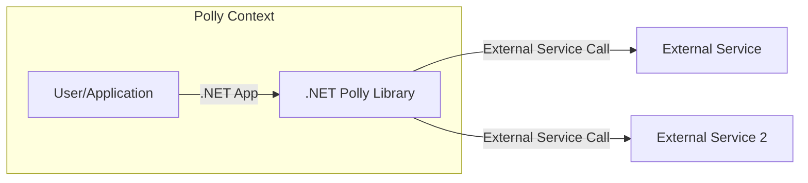
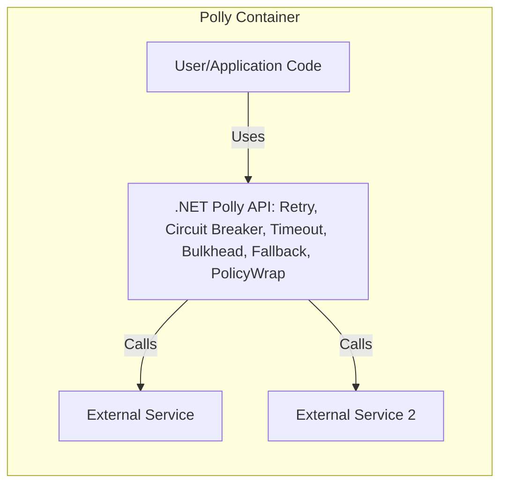
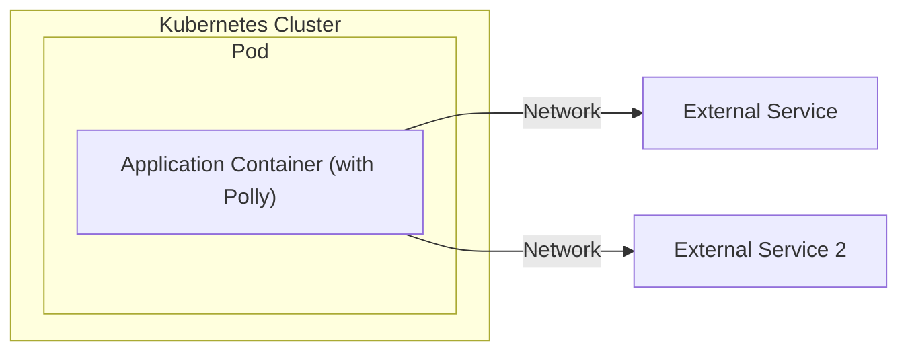
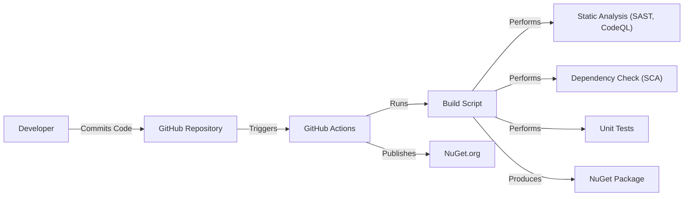

# Project Design Document: Polly

## BUSINESS POSTURE

Polly is a .NET resilience and transient-fault-handling library that allows developers to express policies such as Retry, Circuit Breaker, Timeout, Bulkhead Isolation, and Fallback in a fluent and thread-safe manner. From a business perspective, Polly aims to:

*   Improve application resilience: By providing easy-to-use mechanisms for handling transient faults, Polly helps applications recover from temporary network glitches, service unavailability, and other common issues, leading to a better user experience.
*   Reduce operational costs: Automated fault handling reduces the need for manual intervention and troubleshooting, freeing up developers and operations teams to focus on other tasks.
*   Increase developer productivity: Polly's fluent syntax and well-defined policies simplify the implementation of resilience patterns, allowing developers to write more robust code faster.
*   Enhance application stability: By preventing cascading failures and providing graceful degradation, Polly contributes to the overall stability and reliability of applications.

Business priorities:

*   High availability and reliability of applications using Polly.
*   Ease of use and adoption for developers.
*   Comprehensive coverage of common resilience patterns.
*   Minimal performance overhead.
*   Active community support and maintenance.

Business risks:

*   Incorrect configuration of Polly policies could lead to unexpected behavior or even worsen application stability.
*   Over-reliance on Polly without addressing underlying infrastructure issues could mask problems and delay resolution.
*   Lack of understanding of Polly's features and limitations could lead to suboptimal implementation and reduced effectiveness.
*   Vulnerabilities in the Polly library itself could be exploited by attackers.
*   Supply chain attacks.

## SECURITY POSTURE

Existing security controls:

*   security control: The library is designed to be thread-safe, preventing race conditions and other concurrency issues. (Mentioned in the project description).
*   security control: Input validation is performed to ensure that policy parameters are within acceptable ranges. (Needs to be verified in the codebase).
*   security control: Polly is regularly updated to address any identified security vulnerabilities. (Needs to be verified by checking the project's release history and vulnerability reporting process).
*   security control: Code reviews and static analysis are used to identify and fix potential security issues. (Needs to be verified by checking the project's development process).
*   security control: Polly project uses GitHub workflow for build and test automation.

Accepted risks:

*   accepted risk: Polly relies on the underlying .NET runtime and libraries for security. Any vulnerabilities in those components could affect Polly's security.
*   accepted risk: Misuse of the library by developers.

Recommended security controls:

*   security control: Implement a comprehensive security testing strategy, including fuzzing and penetration testing, to identify and address any potential vulnerabilities in Polly.
*   security control: Provide clear and concise documentation on how to securely configure and use Polly, including examples of common pitfalls and how to avoid them.
*   security control: Establish a clear vulnerability reporting process and encourage security researchers to report any issues they find.
*   security control: Consider signing the Polly NuGet package to ensure its integrity and authenticity.
*   security control: Implement supply chain security controls, such as software composition analysis (SCA), to identify and mitigate risks associated with third-party dependencies.
*   security control: Use SLSA framework to improve security of build process.

Security Requirements:

*   Authentication: Not directly applicable to Polly, as it is a library, not a service.
*   Authorization: Not directly applicable to Polly.
*   Input Validation: Polly should validate all input parameters to ensure they are within acceptable ranges and do not contain any malicious code. This is particularly important for parameters that are used to construct external calls or execute code.
*   Cryptography: Polly does not handle any sensitive data directly, so cryptography is not a primary concern. However, if Polly is used to interact with secure services, it should support secure communication protocols such as TLS.
*   Software Composition Analysis: Polly should be scanned for known vulnerabilities in its dependencies.

## DESIGN

### C4 CONTEXT

Element Descriptions:

*   Element:
    *   Name: User/Application
    *   Type: User/System
    *   Description: Represents the user or application that utilizes the Polly library.
    *   Responsibilities: Initiates requests that may require resilience policies.
    *   Security controls: Authentication and authorization mechanisms as appropriate for the application.

*   Element:
    *   Name: .NET Polly Library
    *   Type: Library
    *   Description: The Polly library integrated into the .NET application.
    *   Responsibilities: Provides resilience and transient-fault-handling capabilities.
    *   Security controls: Input validation, thread safety.

*   Element:
    *   Name: External Service
    *   Type: External System
    *   Description: An external service that the application interacts with.
    *   Responsibilities: Provides services to the application.
    *   Security controls: Depends on the specific external service.

*   Element:
    *   Name: External Service 2
    *   Type: External System
    *   Description: An external service that the application interacts with.
    *   Responsibilities: Provides services to the application.
    *   Security controls: Depends on the specific external service.

### C4 CONTAINER

Element Descriptions:

*   Element:
    *   Name: User/Application Code
    *   Type: Code
    *   Description: The application code that utilizes the Polly library.
    *   Responsibilities: Implements business logic and integrates Polly policies.
    *   Security controls: Application-specific security controls.

*   Element:
    *   Name: .NET Polly API
    *   Type: API
    *   Description: The set of APIs provided by the Polly library. Includes components for Retry, Circuit Breaker, Timeout, Bulkhead, Fallback, and PolicyWrap.
    *   Responsibilities: Provides the functionality for defining and executing resilience policies.
    *   Security controls: Input validation, thread safety.

*   Element:
    *   Name: External Service
    *   Type: External System
    *   Description: An external service that the application interacts with.
    *   Responsibilities: Provides services to the application.
    *   Security controls: Depends on the specific external service.

*   Element:
    *   Name: External Service 2
    *   Type: External System
    *   Description: An external service that the application interacts with.
    *   Responsibilities: Provides services to the application.
    *   Security controls: Depends on the specific external service.

### DEPLOYMENT

Polly is a library, not a standalone application, so it doesn't have its own deployment process. It is deployed as part of the application that uses it. The deployment process depends on how the application is deployed.

Possible deployment solutions:

1.  Application deployed as a containerized application using Docker and Kubernetes.
2.  Application deployed as a serverless function using Azure Functions or AWS Lambda.
3.  Application deployed as a traditional web application on a virtual machine or physical server.

Chosen deployment solution (example: containerized application using Docker and Kubernetes):

Element Descriptions:

*   Element:
    *   Name: Application Container (with Polly)
    *   Type: Container
    *   Description: The Docker container that includes the application code and the Polly library.
    *   Responsibilities: Runs the application and executes Polly policies.
    *   Security controls: Container security best practices (e.g., using a minimal base image, running as a non-root user, etc.).

*   Element:
    *   Name: Pod
    *   Type: Kubernetes Pod
    *   Description: Kubernetes Pod that runs application container.
    *   Responsibilities: Runs the application container.
    *   Security controls: Kubernetes security best practices.

*   Element:
    *   Name: External Service
    *   Type: External System
    *   Description: An external service that the application interacts with.
    *   Responsibilities: Provides services to the application.
    *   Security controls: Depends on the specific external service.

*   Element:
    *   Name: External Service 2
    *   Type: External System
    *   Description: An external service that the application interacts with.
    *   Responsibilities: Provides services to the application.
    *   Security controls: Depends on the specific external service.

### BUILD

Polly uses GitHub Actions for its build and release process.

Element Descriptions:

*   Developer: Commits code to the GitHub repository.
*   GitHub Repository: Stores the Polly source code.
*   GitHub Actions: Automates the build and release process.
*   Build Script: Executes the build process, including compilation, testing, and packaging.
*   Static Analysis (SAST, CodeQL): Analyzes the source code for potential security vulnerabilities.
*   Dependency Check (SCA): Checks for known vulnerabilities in project dependencies.
*   Unit Tests: Verifies the functionality of individual components.
*   NuGet Package: The final output of the build process, ready to be published.
*   NuGet.org: The public repository for NuGet packages.

Security Controls in Build Process:

*   security control: Static analysis (SAST) is used to identify potential security vulnerabilities in the code.
*   security control: Dependency checking (SCA) is used to identify known vulnerabilities in third-party libraries.
*   security control: Unit tests are used to ensure that the code functions as expected and to prevent regressions.
*   security control: GitHub Actions provides a secure and automated build environment.

## RISK ASSESSMENT

Critical Business Processes:

*   The primary business process is ensuring the resilience and reliability of applications that depend on Polly. Any failure in Polly could directly impact the availability and performance of these applications.

Data Protection:

*   Polly itself does not handle sensitive data directly. However, it is used to make calls to external services, which may handle sensitive data. The sensitivity of the data depends on the specific application and the external services it interacts with.
*   Data Sensitivity: Varies depending on the application using Polly. Polly itself does not store or process sensitive data.

## QUESTIONS & ASSUMPTIONS

Questions:

*   What is the specific process for reporting security vulnerabilities in Polly?
*   Are there any specific security certifications or compliance requirements that Polly needs to meet?
*   What is the frequency of security audits and penetration testing for Polly?
*   What are the performance benchmarks for Polly, and how are they measured?
*   How is backward compatibility maintained, and what is the process for deprecating features?

Assumptions:

*   BUSINESS POSTURE: It is assumed that the primary goal is to provide a reliable and easy-to-use resilience library for .NET developers.
*   SECURITY POSTURE: It is assumed that the Polly project follows secure coding practices and addresses security vulnerabilities promptly.
*   DESIGN: It is assumed that the design of Polly is modular and extensible, allowing for future enhancements and additions.
*   It is assumed that Polly project uses GitHub workflow for build and test automation.